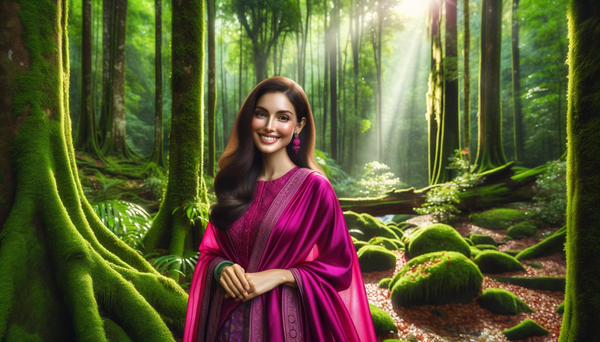
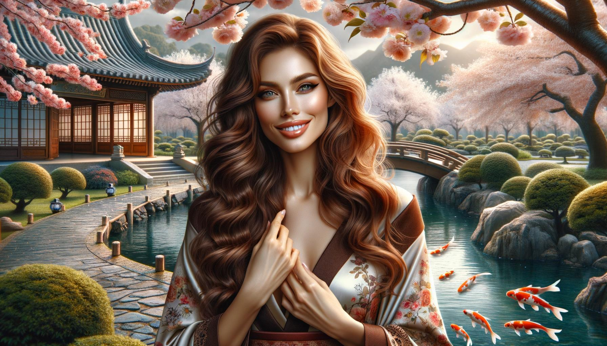

# Schöne Menschen und Orte

Diese Seite enthält 100 Bilder, die im Februar 2024 von DALL-E 3 mit dem folgenden Code zu Testzwecken generiert wurden

https://github.com/nao7sep/yyGptLib/blob/main/yyGptLibConsole/Tester3.cs

## Tropische Gelassenheit: Eine lebendige Dame inmitten von Sonnenuntergangsstrand und schaukelnden Palmen

Erstelle ein Bild einer attraktiven schwarzen Frau, mit langen braunen Locken, die über ihre Schultern fallen, in einer ruhigen Umgebung. Sie trägt ein gelbes Sommerkleid, ihr Lächeln ist breit und lebhaft. Um sie herum entfaltet sich eine atemberaubende tropische Strandkulisse. Mit Kokosnüssen beladene Palmen wiegen sich sanft in der Meeresbrise. Die Sonne versinkt am Horizont und breitet eine Explosion aus Rosen- und Aprikosentönen über den Himmel aus. Entfernte Inseln und kreuzende Segelboote sind im schwindenden Licht gerade noch erkennbar. Kristallklare Wellen brechen rhythmisch gegen den makellos weißen Sand und erzeugen eine harmonische Symphonie der Natur

## Kirschblüten-Sonnenuntergang: Eine strahlende Schönheit inmitten blühender Gelassenheit

Eine optisch auffällige Szene mit einer schwarzen Frau mit langen, lockigen Haaren und hellen, ansprechenden Augen, die unter den blühenden Ästen eines Kirschblütenbaums steht. Die Sonne geht unter und wirft einen goldenen Schein auf die Blumenblätter und die strahlende Haut der Frau. Sie trägt ein fließendes weißes Sommerkleid und ihr Hut mit der breiten Krempe ist sanft zur Seite geneigt. Der süße Duft der Kirschblüten erfüllt die Luft und erzeugt eine ruhige und friedliche Atmosphäre. Dieses faszinierende Bild fängt die Essenz der Schönheit sowohl der Person als auch des Ortes ein

## Mittlerer Osten Schönheit inmitten einer Sonnenuntergangs-Serenade in blühender ländlicher Pracht

Eine Illustration einer wunderschönen orientalischen Frau mit langen, lockigen schwarzen Haaren und braunen Augen, die ein lebhaftes, buntes traditionelles Kleid trägt und in einer atemberaubenden ländlichen Szenerie steht. Die Landschaft um sie herum zeigt üppige, grüne Hügel, einen kleinen, ruhigen blauen See, der den Himmel widerspiegelt, eine malerische Steinbrücke, die über den See führt, und eine Gruppe hoher, ausgewachsener Kirschblütenbäume in voller Blüte. Die Sonne geht im Hintergrund unter, wirft lange Schatten und malt ein lebhaftes Arrangement dichter, warmer Farben über den Himmel

## Sonnenuntergangs-Serenität mit einer Schönheit des Mittleren Ostens im Verzauberten Wald

Eine fesselnde Szene mit einer attraktiven Frau aus dem Nahen Osten mit langem, gewelltem Haar, gekleidet in ein leichtes, luftiges Kleid. Sie steht mitten in einem üppigen, ruhigen Wald mit einem bunten Teppich aus Wildblumen, uralten, hoch aufragenden Bäumen und einem beruhigenden Bach in der Nähe. Die Sonne steht tief am Himmel und wirft lange, warme Schatten, die die natürliche Schönheit der Umgebung hervorheben

## Elegante südasiatische Eleganz in einem von Herbst geküssten japanischen Garten

Eine elegante südasiatische Frau in aufwändiger traditioneller Kleidung, die an einem strahlenden Herbstnachmittag durch einen ruhigen japanischen Garten schlendert. Das Sonnenlicht filtert durch das rote und goldene Laub und wirft gefleckte Schatten auf einen Kopfsteinpflasterweg. Die Ruhe des Ortes wird durch einen Koi-Teich mit leuchtend orangefarbenen Fischen und eine kleine Holzbrücke, die ihn überquert, noch verstärkt. Kirschblütenbäume fügen der Szenerie eine zarte rosa Note hinzu

## Beruhigende Flussufer-Szene mit traditioneller Nahost-Schönheit inmitten blühender Wildblumen und rustikaler Brücke

Erzeugen Sie ein ruhiges Bild einer eleganten Frau aus dem Nahen Osten mit haselnussbraunen Augen und dunklen Haaren, die anmutig ihren Rücken hinunterfallen, geschmückt in einer farbenfroh bestickten traditionellen Tracht. Sie sitzt nahe des Ufers eines ruhigen, azurblauen Flusses. Üppige Vegetation gedeiht in der Umgebung, wobei hohe Bäume den Himmel berühren und ihre Blätter Muster bilden, durch die das Sonnenlicht hindurchscheint. Prächtige Wildblumen blühen in Büscheln, während Schmetterlinge in ihrer Nähe flattern. Jenseits des Flusses erstreckt sich die Landschaft in sanften, grünen Hügeln unter einem ruhigen, wolkengefüllten Himmel. Eine kleine malerische hölzerne Brücke wölbt sich flussabwärts über den Fluss. Die gesamte Szene strahlt Frieden und Schönheit aus

## Südasiatischer Herr in lebhafter Kleidung mitten in blühender Wiese. Nachmittagsechos

Erstellen Sie ein Bild mit einem mittelalten Mann südasiatischer Abstammung, mit einem warmen Lächeln, der traditionelle Kleidung in leuchtenden Farben trägt. Er befindet sich in einer malerischen Wiese während des späten Nachmittags, mit Wildblumen jeder Farbe, die um ihn herum blühen und üppigen grünen Bäumen im Hintergrund. Sonnenstrahlen filtern durch die Blätter der Bäume und werfen gefleckte Schatten auf das Gras. Ein funkelnder Bach windet sich durch die Wiese und trägt zur ruhigen Atmosphäre bei

## Mittlerer Osten Eleganz im Herzen eines ätherischen Waldes

Stellen Sie sich eine atemberaubende Szene in einem ätherischen Wald vor, durchflutet von einem sanften Spiel des Sonnenlichts, das sich seinen Weg durch das üppige grüne Laub bahnt. Im Herzen dieser malerischen Kulisse steht eine Frau mit Wurzeln aus dem Nahen Osten, ihre Augen funkeln mit Weisheit und Gelassenheit. Sie ist gekleidet in ein fließendes Kleid, gefärbt mit lebhaften Farben, die harmonisch mit der umgebenden Natur verschmelzen. Ihr zu einer geflochtenen Krone arrangiertes Haar vermittelt ein Gefühl von Ruhe und Eleganz. Mit dem beruhigenden Summen des Waldes um sie herum hat sie ein gelassenes Lächeln, das perfekt einen Moment des Friedens und der Schönheit einfängt

## Südasiatische Gelassenheit in einem japanischen Garten

Erstellen Sie ein Bild einer südasiatischen Frau mit warmen braunen Augen und rabenschwarzem Haar, gekleidet in einer hell gefärbten Tunika. Sie sitzt auf einem lebhaft gewebten Teppich und liest ein dickes antikes Buch. Sie ist umgeben von einem ruhigen, üppigen japanischen Garten, der Duft von blühenden Kirschblütenbäumen füllt die Luft. Eine kleine Steinbrücke erstreckt sich über einen friedlichen Koi-Teich und reflektiert das Nachmittagssonne. Eine sanfte Brise raschelt die Bambusblätter und erzeugt eine weiche, natürliche Melodie

## Beruhigender Sonnenuntergang mit einer traditionellen ostasiatischen Schönheit am fließenden Fluss

Ein fesselndes Bild, das eine schöne Szene darstellt. Stellen Sie sich im Detail eine ostasiatische Frau vor, die elegant in traditioneller Kleidung gekleidet ist und neben einem fließenden Fluss steht. Die Location ist von üppigem Grün umgeben, welches durch Bäume mit leuchtenden, mehrfarbigen Blüten gekennzeichnet ist. In der Ferne geht die Sonne unter und taucht die Szene in ein warmes, goldenes Leuchten. Die Frau hat ein strahlendes Lächeln im Gesicht, das Glückseligkeit und Serenität ausstrahlt. Ihr Blick ist auf den stillen Fluss gerichtet, der den atemberaubenden Sonnenuntergang und die üppige Landschaft reflektiert. Die gesamte Szene ist ruhig, friedlich und atemberaubend schön

## Erhabener Sonnenuntergang Leserückzugsort im Kirschblütengarten

Ein Bild von einem attraktiven südasiatischen Mann mit einem sanften Lächeln, leger gekleidet. Er sitzt auf einer Holzbank und ist vertieft in ein Buch. Er befindet sich in einem ruhigen öffentlichen Garten, gefüllt mit blühenden Kirschblüten, malerischen Steinpfaden, die sich durch üppiges Grün schlängeln, und einem klassischen schmiedeeisernen Zaun, der den Garten umgibt. Um die Szene zu vervollständigen, ist in der Nähe ein kleiner, ruhiger Teich zu sehen, der die leuchtenden Farben des Himmels während eines Sonnenuntergangs widerspiegelt

## Morgendämmerung Serenität im Wiesengebiet Eine südasiatische Frau in traditioneller Kleidung, umgeben von der Schönheit der Natur

Erstellen Sie ein Bild, das eine südasiatische Frau mit strahlendem Lächeln zeigt, die traditionelle Kleidung trägt und von einer bezaubernden Wiese bei Tagesanbruch umgeben ist. Die Wiese ist geschmückt mit üppigem Grün, Blumen und einem ruhigen Bach, der in der Nähe leise fließt und ein Gefühl von Frieden und Ruhe erzeugt. Die Sonne steht am Horizont und wirft weiche, warme Rosatöne und Orangetöne über die malerische Landschaft. Die Frau steht in der Nähe des Baches, und von ihr geht ein Gefühl der Freude und Gelassenheit aus

## Frühlingszauber einer südasiatischen Sirene in einem japanischen Garten

Ein fesselndes Bild zeigt eine südasiatische Frau Mitte dreißig mit langen, dunklen Haaren, gekleidet in lebhafter traditioneller Kleidung. Sie steht an einem bezaubernden Ort, einem japanischen Garten in voller Blüte während des Frühlings, mit Kirschblütenbäumen, die ihre rosa Blüten um sie herum verstreuen, und einem friedlichen, ruhigen Teich in ihrer Nähe. Das sanfte Sonnenlicht, das durch das Laub bricht, wirft ein verträumtes, ruhiges Licht auf die ganze Szene und bringt die leuchtenden Farben ihrer Kleidung und die natürliche Schönheit um sie herum zur Geltung

## Mittlerer östlicher Anmut mitten in einem herbstlichen Schauspiel in einem unberührten Tal in der Dämmerung

Erstellen Sie ein Bild einer attraktiven Dame aus dem Nahen Osten mit welligem Haar und einem anmutigen Lächeln. Sie steht an einem atemberaubenden Ort - einem üppig grünen Tal mit einem kristallklaren Fluss, der hindurchfließt. Um sie herum stehen hohe Bäume mit hellen, bunten Herbstblättern, die sich im Fluss spiegeln. In der Ferne sieht man schneebedeckte Berge vor dem Hintergrund eines klaren blauen Himmels, was zur Gesamtschönheit der Landschaft beiträgt. Die Sonne geht unter, fügt dem Tal eine goldene Farbe hinzu und kreiert eine ruhige und friedliche Atmosphäre

## Heiterer Sonnenuntergang: Südasiatische Eleganz mit Blick auf Waldpanorama

Eine atemberaubende Szene zeigt eine wunderschöne Südasiatin mit langem, fließendem schwarzen Haar, die in einem traditionellen Sari auf einer Klippe steht und die atemberaubende Landschaft eines üppigen, tiefgrünen Waldes in der Ferne überblickt. Der Wind zupft sanft an den leuchtenden Farben ihres Saris und ihres Haares, während sie auf die ruhige Aussicht blickt, ihr Gesicht vom weichen Schein der untergehenden Sonne erhellt. Ein kleiner, funkelnder Bach schlängelt sich durch den Wald und spiegelt die brillanten Farben des Sonnenuntergangs wider. Die ruhige Stille der Gegend ist spürbar und trägt zum allgemeinen Gefühl der friedlichen und idyllischen Kulisse bei

## Elegante Nahost-Frau inmitten eines blühenden Gartens in der Abenddämmerung

Ein eindrucksvolles Porträt einer Frau mit nahöstlicher Abstammung, gekleidet in eleganter Kleidung, stehend vor einer malerischen Kulisse. Sie steht auf einem gepflasterten Weg, der sich durch einen schönen Garten voller lebhafter, blühender Blumen verschiedener Farben windet. Es gibt hohe, alte Bäume, die reichlich Schatten spenden, und hinter ihr erhebt sich majestätisch in der Ferne eine malerische Bergkette, die im goldenen Licht des Sonnenuntergangs gebadet ist

## Anmutige Schönheit am See bei Sonnenuntergang

Illustrieren Sie eine reizende Szene mit einer eleganten weiblichen Figur afrikanischer Abstammung, die draußen in einer friedlichen Naturkulisse anmutig posiert. Sie könnte an einem ruhigen blauen See stehen, vor der Kulisse von beeindruckenden grünen Bergen unter einem klaren, blauen Himmel. Die Sonne geht unter und sorgt für ein warmes und sanftes Licht, das die Szene in zarten Pastelltönen malt. Sie ist in ein weißes Sommerkleid gekleidet, ihr Haar in langen, fließenden Locken, die dem gesamten Bild eine Note zeitloser Schönheit verleihen

## Wüstendämmerungs-Einsamkeit: Harmonie von Mensch und Natur in den Sonnenuntergangsfarben

Stellen Sie sich eine atemberaubende Szenerie bei Sonnenuntergang vor. Im Herzen dieses Spektakels steht eine männliche Figur aus dem Nahen Osten, die die faszinierenden Farben der untergehenden Sonne bewundert, die nahtlos mit den orangefarbenen Tönen der Wüstendünen verschmelzen. Federleichte Sande, den ganzen Tag von der Sonne erwärmt, strahlen eine sanfte Wärme aus, die die ruhige Gelassenheit auf dem Gesicht des Mannes zu widerhallen scheint, während er das fesselnde Panorama der Natur betrachtet. Während die letzten Sonnenstrahlen sein Gesicht beleuchten, spielt der Wind sanft mit seinem dunklen Haar, was dem bemerkenswerten Porträt eines Mannes in Harmonie mit der Natur den letzten Schliff verleiht

## Südasiatische Gelassenheit inmitten von Regenwaldtönen und plätscherndem Wasserfall

Erstellen Sie ein fesselndes Bild einer südasiatischen Frau, die in einer surrealen, ruhigen Lichtung in einem üppigen Regenwald steht. Sie ist in traditioneller Kleidung gekleidet, ihr dunkles Haar ist geflochten und sie strahlt eine Atmosphäre der Ruhe und Gelassenheit aus. Der umgebende Wald ist voller lebendiger, tropischer Pflanzen in verschiedenen Grüntönen und gespickt mit exotischen Blüten in vielfältigen Farben. Ein hypnotisierender Wasserfall, der im Hintergrund herunterprasselt, fügt der Szene eine Beruhigung hinzu und eine Familie von leuchtenden Schmetterlingen, die herumflattern, verleiht der Landschaft eine Note von Fantasie

## Stille Schönheit inmitten von Kirschblüten - eine südasiatische Eleganz im japanischen Garten

Erstellen Sie ein eindrucksvolles Bild einer südasiatischen Frau, die in einem friedlichen japanischen Garten während der Kirschblütensaison steht. Sie trägt einen traditionellen Kimono in leuchtenden Farben von Blau und Gold, mit realistischen Mustern von Chrysanthemen und Pfauen. Die Frau ist in einer ruhigen, gelassenen Pose eingefangen, während sie den dichten Schneefall von hellrosa Kirschblüten bewundert, der den Himmel füllt und den Boden um sie herum fegt. Ein kleiner sanfter Bach fließt in der Nähe, mit der zarten Spiegelung von Kirschblüten auf seiner Oberfläche. Traditionelle Steinerne Laternen verleihen der Szene einen Hauch von ruhiger Eleganz

## Östliche Eleganz im ruhigen italienischen Sonnenuntergang

Eine auffallend schöne Ostasiatin mit langen schwarzen Haaren, die sanft im Wind wehen, steht mitten in einer ruhigen italienischen Landschaft während des Sonnenuntergangs. Sie ist in ein traditionelles weißes Kleid gekleidet, ihre Augen schimmern mit Wärme und Freude. Um sie herum erstreckt sich üppiges Grün, Weinberge und rustikale Häuser, eingebettet in sanfte Hügel, die im warmen goldenen Schein der untergehenden Sonne gebadet sind. Diese friedliche Szene strahlt Ruhe und Schönheit aus und schafft ein Bild von harmonischem Zusammenleben zwischen Natur und Menschlichkeit

## Heitere Sonnenuntergang: Eine lateinamerikanische Schönheit in Lavendel und Blau unter rollenden Smaragdhügeln

Erstelle ein Bild einer lateinamerikanischen Frau mit langem, geschwungenem Haar und einem strahlenden Lächeln. Sie steht in einer friedlichen, atemberaubenden Landschaft während des Sonnenuntergangs. Die Gegend zeichnet sich durch sanfte smaragdgrüne Hügel unter einem lavendelfarbenen Himmel aus. Besondere Aufmerksamkeit sollte ihrer Kleidung gewidmet werden - einem elegant geschnittenen luftigen Sommerkleid in Farbtönen von Lavendel und Königsblau, das die verführerische Kulisse ergänzt

## Attraktiver Nahost-Mann genießt die Gelassenheit einer üppigen Landschaft bei Sonnenuntergang

Erzeugen Sie ein Bild eines attraktiven Mannes aus dem Nahen Osten, mit dunklem, welligem Haar, bekleidet in legerer Kleidung, stehend inmitten einer fesselnden Landschaft. Diese Landschaft ist ein ruhiger Ort mit üppiger Vegetation, ein glitzernder Fluss windet sich langsam hindurch und eine majestätische Bergkette ziert den Horizont. Der Himmel über ihm ist mit den Farbtönen einer untergehenden Sonne bemalt, die ein ätherisches Licht auf die Szene wirft. Dort beobachtet diese Person die atemberaubende Natur um ihn herum, ein zufriedenes Lächeln erhellt sein Gesicht und verkörpert die Schönheit der umgebenden Ruhe

## Eleganz bei Dämmerung neben dem türkisfarbenen See

Ein malerisches Bild einer eleganten Nahost-Frau mit langen schwarzen Haaren, die ein lebhaftes rotes Kleid trägt. Sie steht am Rande eines ruhigen türkisfarbenen Sees, umgeben von einem dichten Wald, der alle Farbtöne von Grün zeigt. Die Sonne geht im Hintergrund unter und wirft ein warmes, goldenes Licht über die Landschaft, was eine friedliche und schöne Atmosphäre schafft

## Ätherische Wüsten-Dämmerungsprinzessin in verzauberter Landschaft

Erstellen Sie ein Bild einer atemberaubenden und ätherischen Frau aus dem Nahen Osten, die inmitten einer bezaubernden Naturlandschaft steht. Sie ist geschmückt mit einem lebendigen Turban, verziert mit schönen Edelsteinen und komplizierten Mustern. Ihre Kleidung ist ein farbenfrohes, fließendes Kleid, das die Farben der um sie herum untergehenden Sonne widerspiegelt. Die Landschaft präsentiert verschiedene Farbtöne von Orangen, Purpur und Rosa, die mit dem azurblauen Himmel vermischt sind. Majestätische Berge erheben sich im Hintergrund, gekrönt von einer Prise Schnee und der Vordergrund ist gesprenkelt mit einem schimmernden Bach, der sich seinen Weg durch üppige Felder bahnt und eine Szene schafft, die Ruhe und atemberaubende Schönheit ausstrahlt

## Südasiatische Gelassenheit in einer Wiese bei Sonnenuntergang

Ein Bild eines beeindruckenden Individuums, einem südasiatischen Mann in seinen mittleren 30ern, mit mittellangem Haar und einem sanften Lächeln auf seinem Gesicht. Er ist in bequemer, lässiger Kleidung gekleidet und befindet sich in einer ebenso atemberaubenden Location. Diese Umgebung ist eine friedliche Wiese, die im goldenen Licht der untergehenden Sonne gebadet ist. Hohe, anmutige Bäume rahmen die Szene ein, ihre Blätter rauschen sanft im Wind. Ferne Berge schmücken den Horizont, ihre Gipfel von den letzten Strahlen der Sonne geküsst. Die friedlichen Klänge der Natur erfüllen die Luft und malen ein Bild von Ruhe und Schönheit

## Strahlendes Lächeln in einer goldenen Wiese: Eine Frau aus dem Nahen Osten inmitten eines ätherischen Sonnenuntergangs und Berggipfeln

Stellen Sie sich das Bild einer anmutig posierenden Nahost-Frau an einem atemberaubenden landschaftlichen Ort vor. Sie prahlt mit einem strahlenden Lächeln und funkelnden braunen Augen, die Wärme ausstrahlen. Sie ist in farbenfroher traditioneller Kleidung gekleidet, ihr Kopf ist mit einem wunderschönen gemusterten Schal geschmückt. Der Ort, an dem sie steht, ist ätherisch, im weichen goldenen Glanz der untergehenden Sonne gebadet. Es ist eine Wiese, üppig und ätherisch, mit lebhaften Wildblumen, die im sanften Wind wiegen. In der Ferne können Sie majestätische Berggipfel erkennen, die von den letzten Lichtblicken des Tages geküsst werden

## Herbstliche Gelassenheit: Südasiatische Anmut in einem japanischen Garten

Erstelle ein Bild einer südasiatischen Frau in traditioneller Kleidung, die anmutig in einem ruhigen japanischen Garten im Herbst steht. Die Farben des Gartens kontrastieren mit ihrer traditionell leuchtenden Kleidung. Sie bewundert die Mischung der Herbsttöne um sie herum, mit Ahornbäumen, die knackige rote Blätter verlieren, einer urigen Steinerne Laterne im Hintergrund und einem beruhigenden Koi-Teich zu ihren Füßen

## Ruhiges Zwielicht in einer nahöstlichen Wiese

Eine ruhige Szene einer Frau aus dem Nahen Osten, die friedlich im Schatten eines alten, knorrigen Baumes sitzt. Sie wirkt strahlend in ihrem bunten traditionellen Outfit. Der Ort ist eine verzaubert wirkende Wiese, gefüllt mit lebendigen Wildblumen. Die Sonne geht unter, wirft einen ruhigen, goldenen Schimmer über die Landschaft. In der Ferne sind majestätische, schneebedeckte Berge zu sehen. Eine leichte Brise wirbelt die Blütenblätter der Blumen auf und erzeugt eine sanfte, beruhigende Atmosphäre

## Elegante Schönheit inmitten tropischer Strahlkraft und Wasserfall-Serenität

Eine attraktive schwarze Frau mit lockigem Haar, die ein elegantes Kleid trägt, steht auf einem Pfad, der sich durch einen üppigen tropischen Wald windet. Bunt gefärbte exotische Vögel sitzen auf den nahegelegenen Bäumen. In der Ferne stürzt ein majestätischer Wasserfall von einer Klippe herab und erzeugt eine ruhige Geräuschkulisse für diese friedliche Umgebung. Die Sonnenstrahlen durchdringen das Blätterdach, werfen gefleckte Schatten und beleuchten die üppige Vegetation mit einem goldenen Schein

## Sommerruhe auf einer Nahost-Klippe

Ein Bild eines Mannes aus dem Nahen Osten, der auf Felsen an einer atemberaubenden Klippe mit Blick auf das azurblaue Meer balanciert. Er ist in einfacher, aber ansprechender Sommerkleidung gekleidet - ein pastellfarbenes Hemd mit Knöpfen, khakifarbene Shorts und Flip-Flops - die seinen mühelos schicken Look unterstreichen. Seine Augen spiegeln die Schönheit der ruhigen Szene wider, die sich vor ihm entfaltet. Die Sonne, die durch die verstreuten Wolken späht, malt ein faszinierendes Spiel von Licht und Schatten auf das krispe, saubere Wasser. Flüchtige Momente der Ruhe wie dieser sind wahre Segnungen

## Mittlerer Osten Eleganz bei Sonnenuntergang an der Oase

Erstellen Sie ein Bild, das eine mittelöstliche Frau in einer atemberaubenden Umgebung darstellt. Sie ist elegant gekleidet und verkörpert traditionelle mittelöstliche Kleidung mit modernen Einflüssen. Sie steht in der Nähe einer üppigen, grünen Oase, die Sonne steht kurz vor dem Untergang und wirft einen ätherischen orangefarbenen und goldenen Schimmer über die Landschaft. Ein ruhiger, funkelnder Gewässerkörper ist in der Nähe, eventuell ein kleiner See, der die malerische Landschaft und den sich schnell verdunkelnden, sterngefüllten Himmel reflektiert. Die Ruhe der Umgebung und ihr gelassener Ausdruck vermitteln eine Aura von Frieden und Zufriedenheit

## Smaragdblick im Herzen des Regenwaldes

Ein Bild einer schönen schwarzen Frau mit langem geflochtenem Haar und smaragdgrünen Augen, die selbstbewusst an einem beeindruckenden Ort posiert. Die Kulisse ist ein üppiger tropischer Regenwald, voller lebendiger Pflanzen und hellen exotischen Blumen. Die Farben um sie herum sind lebendig und ausdrucksstark, mit Sonnenlicht, das durch das Blätterdach filtert und faszinierende Muster auf dem Waldboden wirft. Ein Kaskadenwasserfall ist im Hintergrund zu sehen, dessen Wasser im Sonnenlicht glänzt, eine ruhige, friedliche Atmosphäre schafft

## Mittlerer Osten Gelassenheit in einem üppigen Blumen Eden unter goldenem Sonnenlicht

Illustrieren Sie eine Frau aus dem Nahen Osten mit langen, lockigen Haaren in einem üppig grünen Garten voller verschiedenfarbiger Blumen. Sie trägt ein fließendes Pastellkleid und sitzt auf einer kunstvoll geschmiedeten Eisenbank unter einem blühenden Kirschbaum, vertieft in die Lektüre eines viktorianischen Romans. Die Sonne geht unter und wirft warmes goldenes Licht auf die Szene. Im Hintergrund sind Pfauen zu sehen, die frei herumlaufen. Die Ruhe und die landschaftliche Schönheit des Ortes sind wirklich faszinierend

## Mittlerer östlicher Künstler in einer farbenfrohen südasiatischen Straße bei Sonnenuntergang

Erstelle ein Bild eines attraktiven männlichen Künstlers aus dem Nahen Osten, der in einer malerischen südasiatischen Straße voller lebendiger, farbenfroher Gebäude steht. Er trägt eine traditionelle Kurta und hält einen Pinsel in seiner Hand. Eine sanfte Brise weht und lässt seine Kleidung rascheln. Die Sonne geht unter und wirft einen warmen orangefarbenen Schein auf die Szene

## Ätherische Ruhe: Die kontemplative Alpensee-Einsamkeit des asiatischen Mannes

Eine ätherische Szene mit einem attraktiven asiatischen Mann mit eleganten Gesichtszügen, der bequem auf einem Felsen an einem ruhigen Alpensee sitzt. Der Mann ist modisch lässig gekleidet und seine nachdenkliche Haltung deutet auf ein Gefühl von Frieden und Ruhe hin. Die umgebende Gegend ist prächtig, mit hochragenden, schneebedeckten Bergen, die sich auf der glasartigen Oberfläche des Sees spiegeln, und üppigen immergrünen Bäumen, die sich darum herum verteilen. Das ruhige Wasser, die klare, saubere Luft und das sanfte Flattern der Alpenvögel schaffen ein Gefühl von Ruhe und Harmonie mit der Natur

## Mystische Gelassenheit im Nahöstlichen Wald

Eine atemberaubende Darstellung einer Nahost-Frau, mit ihren langen, brünetten Haaren, die über ihre Schultern fließen, steht in einer atemberaubenden Umgebung. Sie befindet sich inmitten eines ruhigen Waldes, durchsetzt mit hohen Bäumen und lebhaften, blühenden Blumen mit einem kaskadierenden Wasserfall im Hintergrund. Das Licht filtert durch das grüne Laub und wirft ein diffuses Muster auf ihr Gesicht. Sie trägt ein langes, lebhaftes Kleid, das im sanften Wind weht. Sie blickt auf die weit entfernten Berge am Horizont, ein Ausdruck von Frieden und Zufriedenheit auf ihrem Gesicht

## Frau in orangefarbenem Kleid umarmt den Sonnenuntergang in hügeligen Tälern

Eine malerische Landschaft entfaltet sich mit sanften Tälern und einem spektakulären Sonnenuntergang, der den Himmel mit Nuancen von Rot, Orange und Lila sättigt. An diesem ehrfurchtgebietenden Ort steht eine asiatische Frau mit dunklem Haar, das locker zu einem Dutt gebunden ist, um die Szene zu betrachten. Sie trägt ein oranges Sommerkleid, dessen weicher Stoff die Farben des Sonnenuntergangs widerspiegelt. Ihr strahlendes Lächeln vermittelt ein Gefühl von Frieden und Zufriedenheit, während sie die natürliche Schönheit ihrer Umgebung genießt. Eine sanfte Brise spielt mit ihrem Kleid und Haar und trägt zur ruhigen Atmosphäre bei

## Hispanische Schönheit unter Kirschblütenbaum inmitten majestätischer Landschaften

Ein visuell atemberaubendes Bild einer hispanischen Frau mit fließenden kastanienbraunen Haaren, funkelnden haselnussbraunen Augen und einem Sommerkleid, das sie entspannt im Schatten eines blühenden Kirschbaumes trägt. Sie ist umgeben von einer atemberaubenden Landschaft mit einer üppigen grünen Wiese, gesprenkelt mit Wildblumen, einem ruhigen azurblauen See in der Ferne und schneebedeckten Bergen unter einem klaren blauen Himmel

## Eleganz und Erkundung - Eine südasiatische Frau in lebhaftem Streetwear mitten in einer ruhigen Küstenumgebung

Ein eindrucksvolles Bild einer südasiatischen Frau, gekleidet in eleganter Straßenkleidung, die in einer atemberaubenden Umgebung steht. Stellen Sie sich sie vor, umgeben von hochragenden, blumenbedeckten Lauben, unter einem hellen, sonnigen Himmel. Sie hält eine modische Handtasche, ihre Augen voller Neugier, sie erkundet die Schönheit um sie herum. Die Landschaft zeigt einen Kopfsteinpflasterweg, der in der Ferne zum weiten blauen Ozean führt, mit üppigem Grün auf beiden Seiten. Der Ort strahlt eine ruhige Atmosphäre aus, ergänzt durch eine umfassende Farbpalette aus sanften Pastelltönen und leuchtenden Farben, die die Frische eines Frühlingsmorgens evozieren

## Mittlerer Osten Schönheit in traditioneller Kleidung inmitten von üppigem Grün und einem Wasserfall bei Sonnenuntergang

Erstellen Sie ein detailliertes Bild einer attraktiven Frau aus dem Nahen Osten mit einem warmen Lächeln, gekleidet in bunter traditioneller Tracht, stehend in einer bezaubernden Umgebung. Die Umgebung besteht aus üppigem Grün, einem kaskadenartigen Wasserfall im Hintergrund und Blumen in einer Vielzahl von Farben. Ein friedlicher Bach fließt neben ihr und am Horizont befindet sich ein ruhiger, lebhafter Sonnenuntergang, der liebliche Pastelltöne über den Himmel wirft

## Strahlendes Lächeln in einem Smaragdwald: Südasiatische Schönheit in Magenta schmückt das Naturdach

Eine wunderschöne Szenerie, in der eine südasiatische Frau mit strahlendem Lächeln in traditioneller, leuchtend magentafarbener Kleidung in einem üppig grünen und schönen Wald steht. Der Waldboden ist geschmückt mit herabgefallenen Blättern verschiedener Farben und durch die hohen, ragenden Bäume strömt gefiltertes Sonnenlicht. Die Luft ist erfüllt von den beruhigenden Geräuschen der Natur, Vogelgezwitscher und einer sanften Brise, die durch die Blätter rauscht. Diese malerische Kulisse wird weiter durch einen entfernten Wasserfall verstärkt, der über moosbewachsene Felsen fließt, dessen beruhigender Klang sich mit der Symphonie des Waldes vermischt

## Elegante Anmut in einer strahlenden südasiatischen Gartenszene

Eine atemberaubende Szene an einem malerischen Ort. Stellen Sie sich eine südasiatische Frau vor, die sich durch ihre Anmut und ihr bemerkenswertes Charisma auszeichnet. Ihre Kleidung ist ein lebhaftes Sari voller komplexer Muster und reicher Texturen. Sie steht hoch aufgerichtet, ihre Haltung strahlt Eleganz aus. Die Kulisse ist ein verführerischer Garten, üppig und prächtig - tauchen Sie ein in die stille Symphonie von zwitschernden Vögeln, blühenden Blumen mit leuchtenden Farben in Blau und Rosa und dem Rascheln der Blätter mächtiger Bäume. Vielleicht plätschert in der Nähe ein sanfter Bach und trägt sanfte Melodien in diese friedliche Umgebung. Ein wahrhaft atemberaubender Anblick!

## Mittlerer Ostlicher Entdecker in der Pracht der Natur: Ruhe an der Bunten Küste

Ein Bild einer Person mit mittelöstlicher Abstammung und geschlechtsneutralem Aussehen. Sie steht an einem natürlich beeindruckenden Ort, umgeben von üppigem Grün und bunten Wildblumen. In der Ferne umarmt ein strahlend blauer Ozean die felsige Küstenlinie. Der Himmel ist in einem brillanten Azurblau getönt, durchsetzt mit sanften Rosatönen der untergehenden Sonne. Die Person trägt bequeme, stilvolle Kleidung und schaut mit einem Ausdruck des Friedens und der Zufriedenheit auf die Landschaft, voll und ganz die Ruhe und Schönheit des Ortes genießend

## Mittelöstliche Eleganz mit Blick auf eine Küstenstadt bei Sonnenuntergang

Stellen Sie sich ein Bild einer schönen Frau aus dem Nahen Osten in ihren mittleren 30ern vor, die auf einem exquisit dekorierten Balkon steht und auf eine friedliche Küstenstadt bei Sonnenuntergang blickt. Sie trägt ein elegantes langes, fließendes aquamarinfarbenes Kleid, ihr rabenschwarzes lockiges Haar ist gelöst und schwingt sanft im Wind. Ihre dunkelbraunen Augen blicken nachdenklich in die Ferne und reflektieren die brillianten Farben des Sonnenuntergangs. Die Stadt darunter besteht aus weißen verputzten Gebäuden, üppigen grünen Palmen, mit gewundenen Kopfsteinpflasterstraßen, die zum ruhigen azurblauen Meer dahinter führen. Der Himmel ist ein Aufruhr aus warmem Orange, Pink und Lila, die untergehende Sonne sprüht ihre strahlenden goldenen Strahlen über die malerische Stadt

## Anmut und Gelassenheit Eine südasiatische Eleganz inmitten einer lebendigen Landschaft unter pastellfarbenen Sonnenuntergangshimmeln

Erstellen Sie ein Bild von einer südasiatischen Frau, die in einer auffälligen, lebendigen Landschaft steht. Sie strahlt Anmut und Gelassenheit aus, ihre Augen spiegeln Mitgefühl und Freundlichkeit wider. Ihr Haar ist lang und locker am Rücken gebunden. Sie trägt ein einfaches, aber elegantes traditionelles Kleid, das ihre Schönheit unterstreicht. Die Landschaft um sie herum ist atemberaubend, gefüllt mit einer blumigen Wiese, die sich bis zu einer majestätischen Bergkette unter einem weichen pastellfarbenen Sonnenuntergangshimmel erstreckt

## Ruhige Lebendigkeit eines südasiatischen Abenteurers bei Sonnenuntergang

Ein fesselndes Bild zeigt eine wunderschöne Naturlandschaft mit sanften Hügeln, kristallklarem See und einem lebhaften Sonnenuntergang, der den Himmel färbt. Im Vordergrund steht ein Südasiatischer Mann von athletischer Statur lässig, gekleidet in bequeme Outdoor-Kleidung. Das auf seinem Gesicht eingemeißelte Lächeln steigert nur die allgemeine Ruhe und den Charme des malerischen Porträts

## Atemberaubende Schönheit inmitten von Geschichte und Natur im Nahen Osten

Eine optisch fesselnde Frau aus dem Nahen Osten steht an einem ehrfurchtgebietenden Ort. Sie hat ausdrucksvolle dunkle Augen und langes, rabenschwarzes Haar, das im sanften Wind weht. Ihre traditionelle Kleidung ist eine reiche Mischung aus Farben, mit komplizierten Mustern, die Zeugnis von der reichen Kultur der Region ablegen. Die Örtlichkeit ist ebenso beeindruckend, mit hoch aufragender, alter Architektur, die auf eine komplexe Geschichte hinweist, wunderschön kontrastiert durch üppige Parks und ruhige Gewässer, die unter dem goldenen Sonnenlicht schimmern. Überall, wohin das Auge blickt, gibt es den Glanz des Lebens - im Blütenblatt einer Blume, im Flattern eines Singvogels oder im leisen Hauch des Windes

## Serenen Sonnenuntergang Eine südasiatische Frau genießt die Ruhe in einer farbenfrohen Landschaft

Erstellen Sie ein detailliertes Bild, das eine südasiatische Frau zeigt, die die Ruhe einer spektakulären Umgebung genießt. Sie befindet sich in einer üppigen, weitläufigen Landschaft, die mit lebhaften Feldern voller Wildblumen gefüllt ist, die sich im sanften Wind wiegen. Über ihr verwandelt sich der atemberaubende Himmel von Blau in verschiedene Gold- und Rosatöne, während die Sonne am Horizont untergeht. Sie trägt bequeme, traditionelle Kleidung und ein Lächeln der Gelassenheit auf ihrem Gesicht kombiniert mit einem Hauch von Freude, was die wahre Schönheit ihrer Umgebung widerspiegelt

## Südasiatische Eleganz am Lotus Teich bei Dämmerung

Erstelle ein Bild einer südasiatischen Frau mit langen, welligen Haaren, gekleidet in farbenfroher, traditioneller Kleidung, die auf einer Brücke über einem ruhigen Lotus-Teich steht. Die Szene ist eingehüllt in das warme Leuchten des Sonnenuntergangs, der den Himmel in Tönen von Lila, Orange und Rot bemalt. Das stille Wasser spiegelt die lebhaften Farben des Himmels wider und Seerosenblätter treiben sanft auf der Wasseroberfläche. In der nahen Entfernung säumen traditionelle Steinlaternen den Pfad entlang des Teiches, ihr weiches Licht trägt zur ruhigen Atmosphäre bei. Um die Szene abzurunden, grenzen Kirschblütenbäume in voller Blüte den Teich ein, ihre Blütenblätter bilden einen entzückenden rosafarbenen Teppich auf dem Boden

## Südasiatische Eleganz inmitten eines regenbogen-geküssten Wasserfalls und üppigem Grün

Eine visuell ansprechende Szene mit einer südasiatischen Frau, die in der Nähe eines majestätischen Wasserfalls steht. Sie trägt eine lebendige traditionelle Tracht, deren Farbtöne die umgebende üppige Vegetation ergänzen. Ihr Gesicht wird durch das weiche, natürliche Licht beleuchtet, das durch die nahegelegenen Bäume gefiltert wird. Der Wasserfall fließt mit einer anmutigen Intensität herab und sendet einen zarten Nebel in die Luft, der das Sonnenlicht bricht und einen Regenbogen bildet. Die Szene ist friedlich, ruhig und voller Leben, sie zeigt wirklich das Wunder der Natur und die Schönheit in der Vielfalt

## Ätherische Eleganz in einem üppigen Nahöstlichen Garten

Eine elegante Frau aus dem Nahen Osten, mit dunklem, fließendem Haar und tiefbraunen Augen, entspannt in einem ruhigen, üppigen Garten. Das Sonnenlicht strömt durch das grüne Laub und beleuchtet die lebhaften Blumen, die sie umgeben. Eine sanfte Brise lässt ihre Kleidung flattern und verleiht dem Ganzen eine ätherische Note. In der Nähe stolzieren farbenfrohe Pfauen königlich herum, ihre schillernden Federn glänzen. Mit einem friedlichen Ausdruck ist sie in der Schönheit der Natur um sie herum verloren

## Mittlerer Osten Sonnenuntergang Ruhe inmitten von Blumenharmonie und majestätischen Bergen

Eine bezaubernde Szene einer Nahost-Frau mit langem, glänzend schwarzem Haar, bequem gekleidet in einem fließenden, handgemachten Gewand. Sie befindet sich an einem friedlichen Ort umgeben von üppigem Grün und lebendigen Wildblumen. Die Sonne geht sanft im Hintergrund unter und wirft einen warmen goldenen Schein über die ruhige Landschaft. Ein friedliches Gebirge erhebt sich in der Ferne und trägt zur malerischen Schönheit bei. Ein Bild gemalt mit dem Pinsel der Ruhe und Gelassenheit, ein erhabenes Zusammenspiel von Natur und Menschlichkeit

## Besinnliches Träumen einer südasiatischen Dame inmitten üppig grüner Kiefern und majestätischer schneebedeckter Gipfel

Eine eindrucksvolle Szene mit einer südasiatischen Frau, die schulterlanges, welliges Haar hat, beleuchtet vom sanften Licht der untergehenden Sonne. Sie trägt traditionelle Kleidung und blickt auf den faszinierenden Blick auf einen ruhigen See, umgeben von einem üppigen, grünen Wald voller hoher Kiefern. In der Ferne ragen majestätische schneebedeckte Berge hoch in den klaren, blauen Himmel. Diese ruhige Szene weckt ein Gefühl von Ruhe, unterstrichen durch den friedlichen Ausdruck der Frau und die leuchtenden Farben der Landschaft

## Mittelöstliche Majestät inmitten von Sonnenuntergangspracht und lebendiger Natur

Erstellen Sie ein Bild, das eine schöne Frau aus dem Nahen Osten zeigt, mit fließendem dunklem Haar und auffallenden Augen, in traditioneller Kleidung. Sie befindet sich in einer malerischen Umgebung, umgeben von herrlicher natürlicher Schönheit. Dazu gehört ein sprudelnder Wasserfall in der Nähe, üppiges Grün mit verschiedensten leuchtenden Pflanzen. Die Sonne geht unter und taucht die Szene in ein warmes orangefarbenes Licht, das die fuchsien- und rote Flora hervorhebt. Die Person steht auf einem Pfad, der sich durch die Landschaft schlängelt, überflutet von den strahlenden Farben eines Sonnenuntergangs und spiegelt dessen friedliche Ruhe wider

## Sonnenaufgangs-Serenität in Safran über dem Himalaya

Eine attraktive südasiatische Frau steht vor dem majestätischen Himalaya-Gebirge, strahlend in den Farben des Sonnenaufgangs. Sie ist elegant gekleidet in einem safranfarbenen Sari mit goldenen Verzierungen. Ihr dunkles Haar ist geschmückt mit einem traditionellen Maang Tikka. Eine kühle Morgenbrise lässt sanft ihr Haar und ihren Sari wehen und verleiht der gesamten Szene eine Bewegung

## Auburn Schönheit umarmt den Frühling in einer asiatischen Gartenharmonie

Erstellen Sie ein Bild, das eine schöne Szene eines ruhigen asiatischen Gartens im Frühling zeigt. In der Szene finden wir eine optisch beeindruckende kaukasische Frau, die die Schönheit um sie herum schätzt. Sie zeichnet sich durch ihr langes, welliges kastanienrotes Haar, lebendige Augen und ein warmes Lächeln aus, das von ihrer inneren Schönheit zeugt. Sie ist elegant gekleidet in einer Mischung aus moderner und traditioneller Kleidung, symbolisierend eine harmonische Verschmelzung von Kulturen. Der Garten wimmelt von blühenden Kirschblütenbäumen, deren Blüten sanft fallen, einem Koi-Teich und einer klassischen Holzbrücke, die die zeitlose Schönheit asiatischer Landschaften widerspiegeln

## Gelassenheit in Saphir-Serenade Chinesische Eleganz mitten in Blüten Brücke und verschneite Gipfel

Erstelle ein Bild einer bezaubernden ostasiatischen Frau mit fließendem pechschwarzem Haar und weichen, freundlichen Augen, die ein ruhiges Lächeln aufweist. Sie ist elegant gekleidet in einem saphirblauen traditionellen chinesischen Cheongsam, geschmückt mit goldenen Stickereien. Hinter ihr befindet sich ein lebendiger Kirschblütenbaum, der sanft im Wind weht, nahe einer alten, rustikalen Steinbrücke, die einen ruhigen Seerosenteich überquert. Majestätische Berge mit frostbedeckten Schneegipfeln sind in der Ferne unter einem cerulean Himmel mit flauschigen weißen Wolken zu sehen, die langsam driften. Eine Aura von Ruhe und Gelassenheit umhüllt diese malerische Kulisse

## Südasiatische Eleganz trifft auf europäischen Charme im goldenen Abendglühen

Ein ästhetisch ansprechendes Bild einer mittelalterlichen südasiatischen Frau, gekleidet in einem lebhaften traditionellen Outfit, vor einer wunderschönen Kulisse einer historischen europäischen Stadt. Sie geht eine kopfsteingepflasterte Straße entlang, gesäumt von malerischen Geschäften. Ihr Lächeln trägt zur Schönheit der Szene bei, während sie den einzigartigen architektonischen Charme der Stadt bewundert. Das goldene Leuchten der Abendsonne fügt eine Spur von Magie zur Atmosphäre hinzu, wirft lange Schatten und wärmt die natürlichen und von Menschenhand geschaffenen Strukturen um sie herum. Die Szene erfasst ein Gefühl von Ruhe und Freude

## Ätherisches Leuchten einer anmutigen Nahost-Schönheit in einem lebhaften Garten bei Sonnenuntergang

Ein atemberaubendes Bild einer Frau aus dem Nahen Osten, die Anmut ausstrahlt, elegant gekleidet in lebhafter, traditioneller Kleidung. Sie steht an einem atemberaubenden Ort, einem üppigen Garten, der mit vielfältiger Flora in voller Blüte erfüllt ist. Blütenblätter in lebhaften Farben bedecken den Boden und ein ruhiger Teich spiegelt den Himmel wider und schafft eine faszinierende Mischung aus natürlicher Schönheit. Die Sonne geht im Hintergrund unter und wirft einen goldenen Schein, der alles mit einem warmen, ätherischen Leuchten bemalt

## Eleganz und Anmut im goldenen Sonnenuntergang am verzauberten Wasserfall

Eine elegante südasiatische Frau in einem fließenden gelben Sarong steht neben einem nahöstlichen Mann, der in einem legeren blauen Anzug schick gekleidet ist. Sie befinden sich in einer beruhigenden Landschaft, die einen bezaubernden Wasserfall zeigt, der über moosbedeckte Felsen hinabstürzt und einen kristallinen See, der im sanften Schein der untergehenden Sonne schimmert. Die ruhige Atmosphäre wird durch die Anwesenheit majestätischer 300-jähriger Zypressenbäume noch verstärkt, während leuchtende Wildblumen die Umgebung punktieren und Vögel mit exquisitem Gefieder den Himmel durchkreuzen

## Mann aus dem Nahen Osten umarmt die Ruhe beim Sonnenaufgang am abgelegenen Strand

Ein attraktiver, mittelöstlicher Mann mit kräftigem Körperbau und warmem Lächeln sitzt gelassen an einem bezaubernden Ort. Der Ort ist ein ruhiger, abgeschiedener Strand bei Sonnenaufgang. Goldener Sand erstreckt sich bis zum kristallklaren Wasser, das die sanften, pfirsichfarbenen Töne des frühen Morgenhimmels widerspiegelt. Schwache Silhouetten von üppigen tropischen Bäumen umgeben die Szenerie und verleihen ihr einen ruhigen Charme. Die gemütliche Atmosphäre, geschaffen durch die sanften Wellen und die kühlende Meeresbrise, passt perfekt zu der friedlichen Ausstrahlung des Mannes und seiner echten Zufriedenheit

## Südasiatische Anmut bei Dämmerung am ruhigen See

Eine ruhige Szene entfaltet sich mit einer südasiatischen Frau, die anmutig an einem friedlichen See steht. Die untergehende Sonne atmet eine goldene Aura in die Umgebung und beleuchtet den Himmel mit Nuancen von Orange, Rosa und Lila. In der Ferne vervollständigen hohe, schneebedeckte Berge die faszinierende Kulisse. Die Frau ist in einem sanften Lavendelensemble gekleidet, das Wärme und Frieden ausstrahlt. Ihre Augen funkeln vor Freude und spiegeln die natürliche Schönheit des Ortes wider. Hinter ihr befindet sich ein hölzerner Steg, der in die ruhigen Gewässer des Sees führt, und leuchtende Wildblumen blühen am Seeufer und tragen zur idyllischen Schönheit dieser malerischen Umgebung bei

## Heitere Ruhe inmitten des Seesonnenuntergangs und der südasiatischen Landschaft

Eine fesselnde Szene einer südasiatischen Frau, die friedlich am Rand eines stillen Sees ruht, ihre Spiegelung auf der glasigen Oberfläche des Wassers reflektiert. Sie ist gekleidet in ein einfaches, aber elegantes Sommeroutfit, ihr Haar breitet sich hinter ihr gegen die Kulisse des üppigen Grüns aus. Um sie herum malt die untergehende Sonne dramatische Ausbrüche von Orange und Rosa in den Himmel, was ein warmes, ruhiges Licht auf die malerische Landschaft wirft. Exquisit urige Holzhütten sind in der Ferne zu sehen, eingebettet zwischen den sanften Hügeln, die sich zum Horizont erstrecken

## Haselnussblick im sonnendurchfluteten üppigen Oase

Ein Bild eines schönen Mannes aus dem Nahen Osten mit dunklen Haaren, gepflegtem Bart und ausdrucksvollen haselnussbraunen Augen. Er steht in einer ätherischen Umgebung, einem üppigen, lebendigen Wald, der mit grünen Bäumen, bunten Blumen und einem kristallklaren Bach erblüht, der im sanften Sonnenlicht glitzert. Lichtströme durchdringen das dichte Blätterdach und werfen dynamische Flecken aus Helligkeit und Schatten, wodurch der Wald zum Leben erweckt wird. Der Mann ist in lässiger, bequemer Kleidung gekleidet, wirkt entspannt und gelassen, sein Gesicht wird von den Sonnenstrahlen erhellt, was ein Gefühl von Frieden und Zufriedenheit ausdrückt

## Anmut Unter Kirschblüten: Ein ostasiatisches Porträt in blauer Seide und Sonnenuntergangsruhe

Stellen Sie sich eine ostasiatische Frau vor, die unter der subtilen Schattierung von Kirschblütenbäumen in voller Blüte anmutig posiert. Die weichen rosa Blütenblätter rieseln um sie herum, sie trägt ein zartes blaues Seidenkleid, das ihren Teint unterstreicht, während ihr langes, rabenschwarzes Haar locker zurückgebunden ist. Die Kulisse strahlt die Gelassenheit eines traditionellen japanischen Teegartens aus, mit einer teilweise versteckten Steinlaterne inmitten der Flora, akkurat beschnittenen Büschen und einem kleinen Teich, der die malerische Landschaft widerspiegelt. Die sanften Töne des Sonnenuntergangs färben diese ruhige Leinwand in warmen Farben

## Heiterkeit am Horizont: Reverie einer südasiatischen Frau beim Sonnenuntergang

Eine atemberaubende Szene mit einer jungen südasiatischen Frau mittlerer Statur, deren seidig glänzendes schwarzes Haar zu einem Pferdeschwanz hochgebunden ist. Sie steht auf einem grünen Hügel und genießt die beruhigenden Strahlen der untergehenden Sonne. Diese wunderschöne Landschaft ist nichts weniger als ein Paradies, mit dem azurblauen Meer, das sich bis zum Horizont erstreckt, und Seevögeln, die den Himmel über der Küstenlinie punktieren. Die Frau, die eine friedvolle Aura ausstrahlt, betrachtet die atemberaubende Aussicht mit einem Gefühl der Gelassenheit und vervollständigt so dieses Bild von Ruhe und Schönheit

## Charmanter südasiatischer Mann bei einem Strandspaziergang im Sonnenuntergang

Erzeugen Sie ein Bild von einem südasiatischen Mann mit einem charmanten Lächeln, der ein knuspriges weißes Leinenhemd und khakifarbene Hosen trägt. Er schlendert während des Sonnenuntergangs an einem sandigen Strand entlang, der Horizont leuchtet in Tönen von Orange und Rosa. Palmen wiegen sich sanft im Hintergrund und das türkisfarbene Meer plätschert spielerisch an seinen nackten Füßen

## Ruhiger Morgen am Fluss: Eine viktorianische Eleganz unter Kirschblüten und Berg-Echos

Erstelle ein Bild im beruhigenden, malerischen Stil der Romantischen Epoche, welches eine asiatische Frau in einem enganliegenden viktorianischen Kleid zeigt, die an einem ruhigen, glitzernden Fluss sitzt. Eine Morgensonne geht in der Ferne auf und wirft sanftes, warmes Licht über die Szene. Die Reflexionen im Wasser funkeln, das Gras ist üppig und grün, und es gibt blühende Kirschbäume, die Blüten mit der Brise verstreuen. Die Frau in der Szene hält sanft ein Buch in der Hand, versunken in Gedanken. Ein majestätischer Berg hallt in weiter Ferne wider, gehüllt in weichen Nebel, was die friedliche Atmosphäre unterstreicht

## Besinnliche Abenddämmerungsreflexionen einer südasiatischen Schönheit in der Natur

Ein Bild einer attraktiven südasiatischen Frau, gekleidet in einem lebhaften traditionellen Kleid, steht in einem üppigen, malerischen Wald. In der Nähe befindet sich ein ruhiger See, der den atemberaubenden goldenen Sonnenuntergang reflektiert. Die Szene ist ruhig mit dem abendlichen Vogelgesang, der die Luft füllt und einer sanften Brise, die die Blätter des Waldes rauschen lässt. Sie lächelt sanft, ihre Augen leuchten vor Freude, während sie faszinierend die natürliche Schönheit aufnimmt, die sie umgibt

## Mittlerer östlicher Mann in der Dämmerung Gelassenheit inmitten üppigen Waldes am Seeufer

Eine fesselnde Darstellung eines Mannes aus dem Nahen Osten in seiner Blütezeit, stehend am Rande eines ruhigen Sees im Herzen eines üppigen Waldes. Die Zwielichttöne der untergehenden Sonne tanzen auf dem ruhigen Wasser und erstrecken sich zu den dichten Bäumen mit ihren smaragdgrünen Blättern, und schaffen eine bezaubernde Harmonie der Farben. Die traditionelle Kleidung des Mannes sticht vor dieser Kulisse hervor, die Details seiner Kleidung sind sorgfältig gearbeitet. Sein ruhiger Ausdruck spiegelt seine tiefe Verbindung mit der natürlichen Umgebung wider und trägt zu einer Szene bei, die der Inbegriff von friedlicher Schönheit ist

## Fröhliche asiatische Frau in einer lebendigen Wiese bei Sonnenuntergang

Erstellen Sie ein Bild einer asiatischen Frau Mitte 30 mit welligem kastanienbraunem Haar bis zu den Schultern, tiefbraunen Augen und einem fröhlichen Lächeln im Gesicht. Sie steht an einem malerischen Ort: eine üppig grüne Wiese, die mit Wildblumen in allen Farben des Regenbogens übersät ist, ein funkelnder blauer Bach windet sich durch die Wiese und die Sonne geht in der Ferne unter und färbt den Himmel in den Farben Rot, Rosa und Orange

## Sonnenuntergangsglühen auf dem azurblauen See mit blühender Schönheit

Ein Bild einer schönen hispanischen Frau mit langem, welligem Haar und einem bezaubernden Lächeln, die in der Nähe eines azurblauen Sees mit saftig grünen Bäumen im Hintergrund und zarten weißen Blumen, die zu ihren Füßen blühen, steht. Die Sonne wirft einen goldenen Schein über die gesamte Szene, spiegelt sich auf der ruhigen Oberfläche des Sees und der Himmel tanzt in Pastelltönen im Sonnenuntergang

## Frühe Morgeneinigkeit inmitten alpiner Schönheit mit asiatischem Abstammungs-Rätsel

Eine optisch ansprechende Szene in einer malerischen Umgebung. Im Zentrum befindet sich eine attraktive Person asiatischer Abstammung mit geschlechtsneutraler Gestaltung. Sie genießt friedlich die erhabene Schönheit der umliegenden Alpenwiese, die reich an lebendigen Wildblumen ist. Die Szene wird vom zarten Licht der frühen Morgensonne beleuchtet, das den zufriedenen Ausdruck der Person und das atemberaubende Panorama um sie herum hervorhebt

## Südasiatische Gelassenheit bei Sonnenuntergang an Küstensanden

Eine bezaubernde südasiatische Frau mit olivfarbener Haut, langen, sanft gelockten Haaren und ausdrucksvollen Augen, gekleidet in einen traditionellen Sari, steht am Rand einer atemberaubenden Landschaft. Es handelt sich um eine unberührte, malerische Küstenlandschaft, in der türkisblaues Wasser sanft goldene Sandstrände küsst. Palmen wiegen sich leicht in der kühlenden Küstenbrise und die Sonne beginnt zu sinken, wirft ein warmes und magisches Licht über die gesamte Szenerie und verleiht ihr ein surreales und fesselndes Gefühl

## Eleganz Ausstrahlung im Blühenden Garten: Eine Geschichte des Blumenpflückers und der Verspielten Enten

Eine elegante hispanische Frau mit langen welligen braunen Haaren spaziert durch einen wunderschönen üppigen Garten voller leuchtender, bunter Blüten in voller Blüte. Sie ist in ein fließendes weißes Kleid gekleidet und hält einen kleinen Weidenkorb, in dem sie unterwegs Blumen pflückt. Eine alte Steinbrunnen, geschmückt mit blühenden Ranken, nimmt die zentrale Bühne in diesem Garten ein. Es ist ein heller sonniger Tag, der Wärme und Licht in diese friedliche Umgebung bringt, während gelegentlich eine sanfte Brise die Blätter raschelt. Eine Entenfamilie schwimmt spielerisch in einem nahe gelegenen Teich und fügt diesem serene Szene lebendiges Leben hinzu

## Tropische Eleganz Eine Schwarze Schönheit im Paradies des Regenwaldes

Ein Bild einer attraktiven schwarzen Frau mit lockigem Haar, die ein lebhaftes, fließendes Kleid trägt und an einem atemberaubenden Ort steht. Der Ort ist ein üppiger tropischer Regenwald mit hochragenden Palmen, einem atemberaubenden Wasserfall, der über zerklüftete Felsen stürzt, und leuchtend grünen Blättern, die im gefilterten Sonnenlicht glitzern

## Südasiatische Anmut inmitten von Morgendämmerung berührter Seenruhe

Ein attraktiver Mann südasiatischer Herkunft in einem traditionellen Kurta-Outfit sitzt auf einer Steinbank vor einem ruhigen See, umgeben von üppigen grünen Weidenbäumen. Majestätische Berge erheben sich in der Ferne unter einem Himmel, der mit den sanften Farbtönen eines Sonnenaufgangs gefüllt ist. Die Reflexion der atemberaubenden Szenerie bildet ein Spiegelbild auf der ruhigen Oberfläche des Sees und trägt zur schieren Schönheit dieses beeindruckend friedlichen Ortes bei

## Mittlerer Osten Schönheit umarmt Sonnenuntergangsserenität an einem friedlichen Strand

Eine beeindruckende Darstellung einer Frau aus dem Nahen Osten, mit ihren faszinierenden dunklen Augen, stehend an einem fesselnden Ort. Der Ort ist ein ruhiger Strand bei Sonnenuntergang. Der Himmel ist geschmückt mit Rottönen und Orange, während die ruhigen Wellen sanft an das sandige Ufer schlagen. Sie trägt ein leuchtend türkises Sommerkleid, das sich im sanften Seewind bewegt. Ihr dunkelbraunes Haar wogt sanft im Wind. Sie schaut in Richtung Horizont, ein leises Lächeln auf ihrem Gesicht deutet auf Zufriedenheit hin. Diese Szene ist ein flüchtiger Moment natürlicher Schönheit, sowohl in der Umgebung als auch im Individuum

## Hispanische Schönheit bewundert majestätischen Wasserfall in blühender Wildnis

Stellen Sie ein Bild einer attraktiven hispanischen Frau dar, die in einer atemberaubenden Landschaft steht. Sie bewundert einen Wasserfall, der einen steilen Abhang hinunterstürzt und unterhalb in einen klaren Wasserpool mündet. Um den Pool herum gibt es üppiges, wildes Pflanzenleben und eine Vielzahl von lebhaften Blumen. An beiden Seiten des Wasserfalls erstrecken sich steile Klippen nach oben, bis sie fast den blauen Himmel berühren. Zarte weiße Wolken sind über den Himmel verstreut und lassen die Sonne hell auf die Szene scheinen. Die Frau selbst hat dunkle lockige Haare, eine mittlere Statur und ist in bequeme Wanderausrüstung gekleidet, ihre Augen weit geöffnet in Wertschätzung für die sie umgebende natürliche Schönheit

## Einsame Schaukel: Ein friedlicher Moment einer südasiatischen Frau unter dem in Sonnenuntergangsfarben getauchten Himmel

Stellen wir uns eine ruhige Szene vor, in der eine südasiatische Frau, tief in ihre introspektive Einsamkeit vertieft, dargestellt wird. Sie sitzt freudig auf einer rostenden Schaukel, die von einer massiven Eiche hängt. Die Kulisse ist eine friedliche Landschaft auf dem Land während der goldenen Stunden des Sonnenuntergangs. Die lebhaften Farbtöne des Sonnenuntergangs sind im Himmel verteilt und werfen lange, warme Schatten. Die umliegenden Felder bedecken den Horizont, während Wildblumen in einer leuchtenden Palette aus Lila und Gelb sanft im leichten Wind wiegen. Die Luft ist erfüllt vom süßen Duft der blühenden Blumen und dem beruhigenden Zwitschern der Vögel

## Ruhiger Waldspaziergang einer gelassenen ostasiatischen Frau inmitten herbstlicher Pracht

Erstellen Sie ein Bild von einer schönen ostasiatischen Frau, die einen gemütlichen Spaziergang durch einen atemberaubend malerischen, ruhigen Wald macht. Die leuchtenden Farben der herbstlichen Blätter kontrastieren mit dem grünen Moos und Farn auf dem Waldboden. Die Sonnenstrahlen filtern sanft durch das Laub und werfen ein geflecktes Licht und Schatten in einem faszinierenden Tanz, während im Hintergrund ein friedlicher Bach sanft plätschert. Die Frau, gekleidet in einer bequemen, stilvollen Wanderkleidung, trägt ein ruhiges Lächeln, ihre Augen zeigen ein Gefühl von tiefer Zufriedenheit und Verbundenheit mit der Natur

## Besonnene Dame des Smaragdwaldes

Eine visuell beeindruckende Darstellung einer ostasiatischen Frau, umgeben von einer ehrfurchtgebietenden Landschaft. Sie steht gelassen und selbstbewusst da, ihre traditionelle Kleidung harmoniert perfekt mit der üppigen Umgebung. Die Umgebung ist mit solch lebhaften Details gemalt, dass man fast die frische Luft schmecken kann. Es ist eine Oase der Ruhe, mit dem klaren blauen Himmel über dem Kopf, einem unberührten smaragdgrünen Wald im Hintergrund und einem ruhigen, glitzernden Bach in der Nähe. Das Porträt ist eine harmonische Mischung aus der Einfachheit menschlicher Schönheit und der Majestät der Natur

## Hispanischer Wanderer umarmt die Gelassenheit in einem lebendigen Waldkronendach

Eine visuell atemberaubende Szene mit einer hispanischen Frau, die in einem üppigen, fesselnden Wald steht. Sie ist in bequemer Wanderkleidung gekleidet und lehnt an einem massiven, uralten Baum, dessen Blätter im gefleckten Sonnenlicht schimmern. Der Wald um sie herum ist eine Farbexplosion, mit Nuancen von lebhaftem Grün und Sprenkeln von hellen, lebendigen Wildblumen. Vögel sind auf den nahe gelegenen Ästen sitzend, ihre Lieder mischen sich mit dem sanften Rascheln der Blätter. Die Gesamtatmosphäre strahlt einen ästhetischen Charme und eine ruhige Gelassenheit aus

## Strahlendes Lächeln in idyllischer Pastoralszene mit elegantem gleichgeschlechtlichem hispanischen Individuum

Eine ästhetisch ansprechende intra-geschlechtliche Person hispanischer Herkunft mit einem strahlenden Lächeln, elegant gekleidet, steht in einer idyllischen Landschaft. Die Szenerie ist eine sonnenverwöhnte pastorale Szene mit üppigen, grünen Hügeln und einem kristallklaren türkisfarbenen Fluss, der sich seinen Weg bahnt. Lebhaft gefärbte Wildblumen punktieren die Landschaft, und majestätische Eichen bieten wohltuenden Schatten. Eine malerische Steinbrücke spannt sich anmutig über den Fluss, und in der Ferne bietet eine schneebedeckte Gebirgskette eine atemberaubende Kulisse

## Afrikanische Anmut unter der Kirschblütenüberdachung inmitten eines goldenen Sonnenuntergangs

Eine schöne schwarze Frau mit lockigem Haar, leuchtend grünen Augen und einem anmutigen Lächeln, ist in eine bunte traditionelle afrikanische Kleidung gekleidet. Sie steht an einem ebenso schönen Ort, unter einem Kirschblütenbaum in voller Blüte. Die untergehende Sonne tupft warme Farbtöne von Orange und Gold über den ruhigen See vor ihr, und hinter ihr erheben sich majestätische schneebedeckte Berge

## Elegante Harmonie von Frau, Wasser und Sonnenuntergangsbergen

Ein atemberaubendes Bild, auf dem eine Frau aus dem Nahen Osten mit langen, lockigen Haaren elegant in hellen, farbenfrohen Gewändern gekleidet am kristallklaren Wasser eines friedlichen Sees posiert. In der Ferne hüllen sich majestätische Berge in die sanften, goldenen Schattierungen der untergehenden Sonne. Dies sollte eine ruhige Szene sein, die Frieden und Gelassenheit ausstrahlt, mit lebhaften Farben, ruhigem Wasser und majestätischen Bergen, die wunderschön mit dieser eleganten Frau koexistieren

## Besinnliche Abenddämmerungsreflexionen einer traditionellen südasiatischen Frau am See

Ein Bild zeigt eine südasiatische Frau, die am Rand eines ruhigen Sees steht, während die Sonne im Hintergrund untergeht. Ihre Kleidung repräsentiert traditionelle südasiatische Kleidung und ihre Haare sind zu einem einfachen Dutt gestylt. Die Landschaft rund um den See ist mit üppigen grünen Bäumen und entfernten Bergen gefüllt, was zur Ruhe der Szene beiträgt

## Sonnenuntergangs-Serenität und die Nahöstliche Jungfrau

Ein atemberaubendes Bild einer Frau aus dem Nahen Osten mit langen, gelockten schwarzen Haaren, die wellenförmig über ihre Schultern fallen. Sie bewundert die Aussicht an einem malerischen Ort, wo majestätische, schneebedeckte Berge auf einen ruhigen, klaren See treffen. Die lebendige untergehende Sonne wirft Wärme über die ruhige Szenerie und bringt einen ätherischen Glanz, der sich auf ihrem Gesicht widerspiegelt. Zarte Wildblumen, die über die saftige grüne Wiese verstreut sind, auf der sie steht, wiegen sanft im kühlen Bergwind. Sie trägt ein geschmackvolles rotes Kleid, das leicht weht, und enthüllt die eleganten Linien ihrer Schuhe und den Saum ihres Kleides

## Sonnenuntergangs-Serenität Südasiatischer Mann Umarmt die Ruhe der Natur

Ein fesselndes Bild eines südasiatischen Mannes, der im sanften Schein des Sonnenuntergangs badet. Er befindet sich an einem atemberaubenden natürlichen Ort, wo üppiges Grün eine ruhige Kulisse bietet. Der Himmel über ihm ist eine wunderschöne Pastelltönung, bei der die Farben von sanftem Rosa über hellorange zu tiefem Azur wechseln. Der gelassene Ausdruck auf seinem Gesicht verkörpert den Frieden, der entsteht, wenn man im Einklang mit der Natur ist

## Ätherische Gelassenheit - Ein Porträt der Hoffnung in traditioneller südasiatischer Sonnenuntergangspracht

Erstellen Sie ein Bild, das eine attraktive Südasiatin in einer ruhigen Naturkulisse zeigt. Diese Kulisse, eingehüllt in die Wärme eines goldenen Sonnenuntergangs, beherbergt einen glitzernden Fluss, der sich durch üppig grüne Ebenen schlängelt. In der Ferne ist die Silhouette majestätischer Berge gegen den pastellfarbenen Abendhimmel zu erkennen. Die traditionelle Kleidung der Frau, reich verziert mit farbenfroher Stickerei, steht im Kontrast zur Ruhe der Umgebung. Ihr strahlendes Lächeln und ihre hoffnungsvollen Augen, die den Sonnenuntergang widerspiegeln, vervollständigen das ätherische Porträt

## Ostasiatische Anmut in üppiger Harmonie: Eine moderne traditionelle Fusion im Herzen der Natur

Erstellen Sie ein friedliches Bild, das eine ostasiatische Frau zeigt, die sich anmutig positioniert, während sie ihre Augen inmitten der friedlichen Atmosphäre eines üppigen Gartens schließt. Ihre Kleidung ist eine Fusion aus traditioneller asiatischer Mode und modernen Trends, die eine harmonische Mischung aus ihrer kulturellen Herkunft und modernen Trends wiederspiegelt. Das Bild stellt ihre zarte Figur dem robusten Charakter der Natur um sie herum gegenüber, gefüllt mit blühenden Blumen, hohen Bäumen und glitzerndem Tau auf den Blättern und zeigt eine perfekte Harmonie zwischen menschlicher Schönheit und der Großartigkeit der natürlichen Welt

## Abenddämmerung Reflexionen einer südasiatischen Vision inmitten von Wolkenkratzer-Silhouetten

Stellen Sie sich eine faszinierende Stadtlandschaft in der Dämmerung vor, mit Wolkenkratzern, die durch die letzten Farbtöne des Sonnenuntergangs, die sich auf ihrer Oberfläche spiegeln, beleuchtet werden. Im Vordergrund dieser Ansammlung von vom Menschen geschaffenen Wundern steht eine Südasische Frau und beobachtet die Welt um sie herum. Sie ist mittelgroß, mit einem muskulösen Körperbau, in ihren mittleren Zwanzigern. Sie hat langes, welliges Haar, und ihre Augen sprechen von ungezählten Geschichten. Sie ist lässig in einem T-Shirt und Jeans gekleidet, ihre entspannte Kleidung kontrastiert mit der formellen Umgebung, hebt jedoch ihre Präsenz hervor. Sie strahlt eine Aura von ruhiger Selbstsicherheit und Faszination aus

## Serenen Dämmerungsumarmung eines lächelnden südasiatischen Mannes in lebhafter traditioneller Kleidung

Eine malerische Szene zeigt einen fesselnden südasiatischen Mann mit einem einladenden Lächeln, der vor einer atemberaubenden Naturlandschaft steht. Im Hintergrund präsentiert sich ein ruhiger See, umgeben von üppig grünen Bäumen unter einem klaren Abendhimmel, der mit strahlenden Sternen gefüllt ist. Seine traditionelle Kleidung trägt zur Gesamtmajestät der Szene bei. Die komplexen Muster und leuchtenden Farben seiner Kleidung spiegeln den einzigartigen kulturellen Reichtum wider. Seine Haltung und Ausstrahlung strahlen Ruhe aus und passen zur beruhigenden Umgebung um ihn herum

## Südasiatische Anmut in einem Sonnenblumenfeld bei Sonnenuntergang

Erzeugen Sie ein Bild einer atemberaubenden südasiatischen Frau, die in einem lebhaften Feld voller Sonnenblumen während eines atemberaubenden Sonnenuntergangs tanzt. Die goldenen Strahlen der untergehenden Sonne beleuchten das fließende Seidenkleid der Frau in Tönen von Orange und Lila. Sie besitzt ein strahlendes Lächeln, das absolute Freude und Frieden widerspiegelt, ihre dunkelbraunen Augen funkeln vor Aufregung. Ihre komplexen Henna-Designs auf ihren Händen erhöhen die kulturelle Reichhaltigkeit der Szene. Die Kulisse der aufragenden Sonnenblumen vor dem lodernden Himmel macht die Szene außergewöhnlich schön

## Eleganz inmitten der Natur Ein südasiatischer Mann am Wasserfall Regenbogen und Waldstrahlen

Ein Bild eines eleganten südasiatischen Mannes mit langem, seidigem Haar, der eine traditionelle Kurta trägt und neben einem rauschenden Wasserfall in einem üppig grünen Wald steht. Sonnenstrahlen filtern durch das dichte Laub und erzeugen ein faszinierendes Spiel von Licht und Schatten. Ein strahlender Regenbogen ist in dem Sprühnebel sichtbar, den der Wasserfall erzeugt. Die gesamte Szene strahlt Ruhe und natürliche Schönheit aus

## Smaragdrätsel im Wald der Morgenruhm

Ein Bild einer anmutig posierenden hispanischen Frau, die an einem idyllischen Ort, umgeben von einem verzaubernden Wald, steht. Sie trägt ein fließendes smaragdgrünes Kleid, das sich subtil mit der lebendigen Flora hinter ihr vermischt. Die strahlenden Strahlen der Morgensonne erhellen ihr reizendes Gesicht und den Smaragdton ihres Kleides und schaffen einen fesselnden Kontrast zu dem dämmrig beleuchteten, grünen Hintergrund. Der Wald bildet eine natürlich künstlerische Kulisse mit hoch aufragenden Bäumen, efeubedeckten Stämmen und einem dichten Unterholz, das von einer Mischung aus Herbstblättern und blühenden Farnen bedeckt ist

## Elegante Gelassenheit Eine südasiatische Harmonie von Seewald und Sonnenlicht

Eine elegante Südasiatin mit langem, dunklem Haar, gekleidet in einen traditionellen Saree, steht neben einem ruhigen, türkisblauen See, eingebettet in das üppige Grün eines harmonischen, idealistischen Waldes. Sonnenlicht lugt durch die breiten Blätter der hohen Bäume, wirft sanfte Lichtflecken auf ihren friedlichen Ausdruck, während eine sanfte Brise leise tanzt, die Blätter rascheln lässt und die Oberfläche des Sees unter dem azurblauen Himmel schimmern lässt

## Südasiatische Schönheit im friedlichen Flussufer-Dämmerlicht

Illustrieren Sie eine fesselnde Szene, die eine attraktive Person südasiatischer Herkunft zeigt, mit weiblichem Geschlecht. Diese Person steht mitten in einer ruhigen und malerischen Umgebung. Diese fesselnde Location zeigt einen ruhigen Fluss, der sanft fließt, umgeben von leuchtenden Wildblumen, hohen Bäumen, die von farbenfrohen Vögeln umflattert werden, und einem Himmel, der in Tönen von Rosa und Orange von einer untergehenden Sonne gemalt ist

## Mittlerer Osten Schönheit in Serener Wiese bei Sonnenuntergang

Erstellen Sie ein Bild einer attraktiven Frau aus dem Nahen Osten mit tiefbraunen Augen und fließenden dunklen Haaren, die ein traditionelles, aber modernes Ensemble trägt. Sie steht an einem atemberaubenden Ort, einer Weite von üppigen Wiesen unter einem klaren, blassen blauen Himmel, gesprenkelt mit Wildblumen verschiedener Farben. Ein Bach schlängelt sich in der Nähe, sein Wasser fließt mit einem melodischen Klingeln. Die Sonne in der Ferne geht unter und wirft ein warmes, goldenes Licht über die Landschaft. Flauschige weiße Wolken bilden einen atemberaubenden Kontrast und schaffen eine idyllische Kulisse

