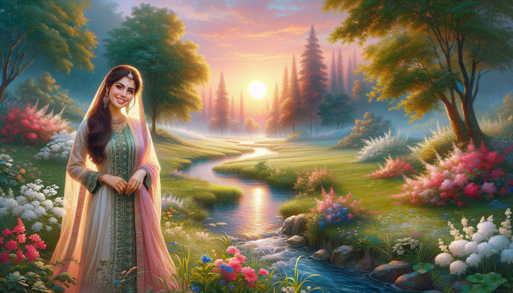
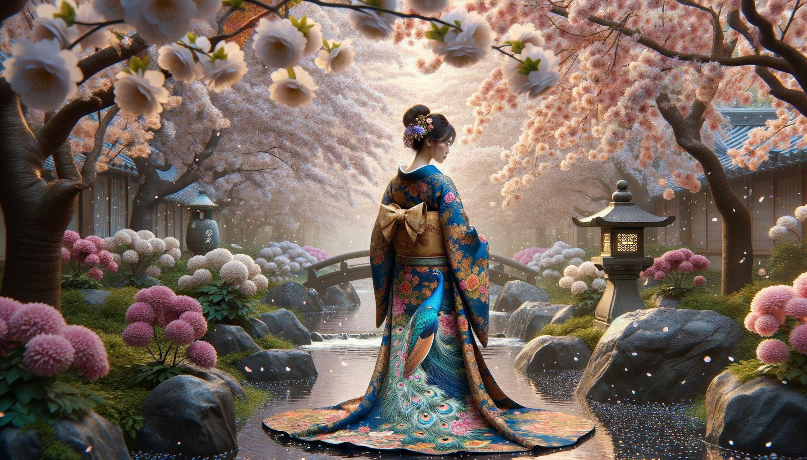
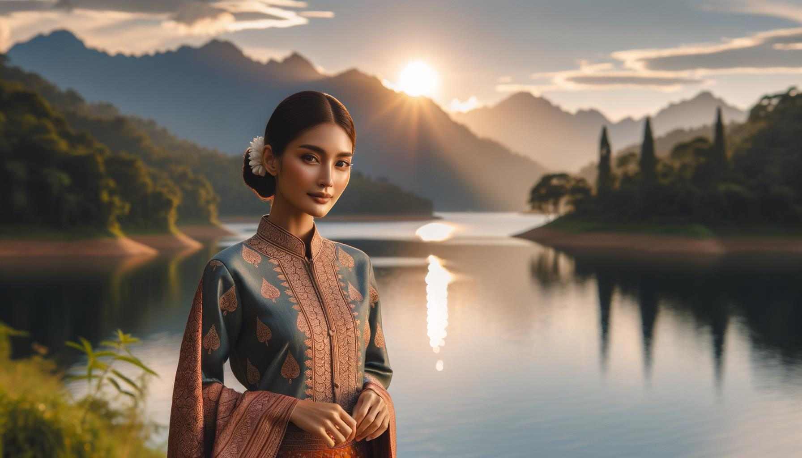

# Personas y Lugares Hermosos

Esta página contiene 100 imágenes generadas por DALL-E 3 utilizando el siguiente código en febrero de 2024 con fines de prueba

https://github.com/nao7sep/yyGptLib/blob/main/yyGptLibConsole/Tester3.cs

## Serenidad Tropical: Una Dama Vibrante Entre la Playa al Atardecer y las Palmeras Ondulantes

Genera una imagen de una atractiva mujer negra, con rizos de largo cabello marrón cayendo sobre sus hombros, en un ambiente sereno. Lleva un vestido de verano amarillo, su sonrisa es amplia y vibrante. A su alrededor, el paisaje que se despliega es una impresionante playa tropical. Las palmeras cargadas de cocos se balancean suavemente con la brisa del mar. El sol se hunde en el horizonte, propagando una explosión de tonos rubor y albaricoque en el cielo. Islas distantes y veleros en crucero son apenas visibles en la decadente luz. Las olas cristalinas chocan rítmicamente contra la prístina arena blanca, creando una armoniosa sinfonía de la naturaleza

## Puesta de Sol de la Flor del Cerezo: Una Belleza Radiante Entre la Serenidad en Floración

Una escena visualmente impactante que presenta a una mujer negra con cabello largo y rizado, y ojos brillantes y atractivos, de pie debajo de las ramas florecientes de un árbol de cerezo. El sol se está poniendo, proyectando un resplandor dorado sobre los pétalos de las flores y la piel radiante de la mujer. Ella viste un vestido blanco de verano fluido, y su sombrero de ala ancha está ligeramente inclinado hacia un lado. El dulce aroma de las flores de cerezo llena el aire, proporcionando un ambiente sereno y tranquilizador. Esta imagen cautivadora captura la esencia de la belleza tanto en la persona como en la ubicación

## Belleza de Medio Oriente en medio de una serenata al atardecer en esplendor rural en floración

Una ilustración de una hermosa mujer de Medio Oriente con largo cabello negro rizado y ojos marrones, vistiendo un vibrante y colorido traje tradicional, parada en una impresionante escena rural. El paisaje que la rodea presenta verdes colinas exuberantes, un pequeño lago azul sereno que refleja el cielo, un pintoresco puente de piedra que cruza sobre el lago, y un bosque de altos y maduros árboles de cerezo en plena floración. El sol se está poniendo en el fondo, proyectando largas sombras y pintando una vibrante gama de colores cálidos densos a través del cielo

## Serenidad al Atardecer con una Belleza del Medio Oriente en el Bosque Encantado

Una escena cautivadora que presenta a una atractiva mujer de Medio Oriente con el cabello largo y ondulado, vestida con un vestido ligero y aireado. Ella se encuentra en medio de un bosque exuberante y tranquilo con una vibrante alfombra de flores silvestres, árboles antiguos y majestuosos, y un arroyo tranquilizante que fluye cerca. El sol cuelga bajo en el cielo, proyectando largas y cálidas sombras y realzando la belleza natural del entorno

## Elegancia Elegante del Sur de Asia en un Jardín Japonés Besado por el Otoño

Una elegante mujer del sur de Asia en atuendo tradicional elaborado, paseando por un sereno jardín japonés durante una radiante tarde de otoño. La luz del sol se filtra a través del follaje rojo y dorado, proyectando sombras moteadas en un camino empedrado. La tranquilidad del lugar se acentúa aún más con un estanque de koi con peces naranjas vibrantes, y un pequeño puente de madera que lo cruza. Los árboles de cerezo añaden un toque de rosa delicado al paisaje

## Escena Serena de la Ribera del Río con Belleza Tradicional de Medio Oriente entre Flores Silvestres en Flor y Puente Rústico

Genere una imagen serena de una elegante mujer de Medio Oriente con ojos color avellana y cabello oscuro que cae grácilmente por su espalda, adornada con un atuendo tradicional ricamente bordado. Está sentada cerca de la orilla de un tranquilo río azul. La exuberante vegetación prospera en los alrededores, con altos árboles que tocan el cielo y sus hojas formando patrones con la luz del sol que se filtra a través de ellos. Hermosas flores silvestres florecen en grupos, mientras las mariposas revolotean cerca de ellas. Más allá del río, el paisaje se extiende en colinas verdes onduladas bajo un cielo sereno, lleno de nubes. Un pequeño puente de madera pintoresco se arquea sobre el río aguas abajo. Toda la escena emite paz y belleza

## Caballero del Sur de Asia en Atuendo Vibrante en Medio de Prado en Flor en los Ecos de la Tarde

Cree una imagen que muestre a un hombre de mediana edad de ascendencia surasiática, con una sonrisa cálida, vistiendo ropa tradicional en colores vibrantes. Está situado en un prado pintoresco durante la tarde, con flores silvestres de todos los tonos floreciendo a su alrededor y frondosos árboles verdes en el fondo. Los rayos del sol se filtran a través de las hojas de los árboles, proyectando sombras moteadas en el césped. Un arroyo brillante serpentea por el prado, añadiendo al ambiente sereno

## Elegancia de Medio Oriente en el Corazón de un Bosque Etéreo

Imagina una impresionante escena en un bosque etéreo, bañado con un suave juego de luz del sol que se filtra a través de las frondosas hojas verdes. En el corazón de este pintoresco escenario se encuentra una mujer de ascendencia de Medio Oriente, sus ojos brillan con sabiduría y tranquilidad. Está vestida con un vestido fluyente teñido con colores vibrantes, que se mezclan armoniosamente con la naturaleza circundante. Su cabello, arreglado en una corona trenzada, evoca una sensación de serenidad y elegancia. Con el calmado zumbido del bosque a su alrededor, ella tiene una sonrisa serena, capturando perfectamente un momento de paz y belleza

## Serenidad del Sur de Asia en un Jardín Japonés

Crea una imagen de una mujer del sur de Asia con cálidos ojos marrones y cabello negro azabache, vestida con una túnica de colores brillantes. Ella está sentada en una alfombra tejida vibrante, leyendo un grueso libro antiguo. Está rodeada de un sereno y frondoso jardín japonés, el aroma de los árboles de cerezo en flor llena el aire. Un pequeño puente de piedra se extiende sobre un tranquilo estanque de koi, reflejando la luz del sol de la tarde. Una suave brisa agita las hojas de bambú, creando una suave melodía natural

## Atardecer Sereno con una Belleza Tradicional del Este Asiático junto al Río que Fluye

Una imagen cautivadora que representa una hermosa escena. En detalle, visualiza a una mujer del este de Asia, elegantemente vestida con ropa tradicional, de pie junto a un río en movimiento. La ubicación está rodeada de frondosa vegetación marcada por árboles con flores vibrantes y multicolores. El sol se pone a lo lejos, bañando la escena en un cálido resplandor dorado. La mujer tiene una sonrisa radiante en su rostro, mostrando felicidad y serenidad. Su mirada está dirigida hacia el tranquilo río, reflejando la impresionante puesta de sol y el paisaje verde. Toda la escena es tranquila, pacífica y asombrosamente hermosa

## Retiro Extraordinario para Lectores al Atardecer en el Jardín de los Cerezos en Flor

Una imagen de un atractivo hombre del sur de Asia con una sonrisa suave, vestido de manera casual. Está sentado en un banco de madera, absorto en la lectura de un libro. Se encuentra en un sereno jardín público lleno de cerezos en flor, pintorescos senderos de piedra que serpentean a través de la frondosa vegetación, y una clásica valla de hierro forjado rodeando el jardín. Para completar la escena, se puede ver cerca un pequeño estanque tranquilo que refleja los vividos colores del cielo durante un atardecer

## Amanecer de Serenidad en el Prado Una Mujer del Sur de Asia en Vestimenta Tradicional Rodeada por la Belleza de la Naturaleza

Crea una imagen que represente a una mujer del sur de Asia con una sonrisa radiante, vistiendo ropa tradicional, rodeada de un prado encantador al amanecer. El prado está decorado con una vegetación exuberante, flores y un tranquilo arroyo que fluye silenciosamente cerca, generando una sensación de paz y serenidad. El sol está en el borde del horizonte, proyectando suaves y cálidos tonos de rosa y naranja a través del paisaje escénico. La mujer está de pie cerca del arroyo con una sensación de alegría y tranquilidad que emana de ella

## Encanto Primaveral de una Sirena del Sur de Asia en un Jardín Japonés

Una imagen cautivadora que retrata a una mujer del sur de Asia en sus treinta años con cabello largo y oscuro, vestida con ropa tradicional vibrante. Ella está de pie en una ubicación fascinante, un jardín japonés en plena floración durante la primavera, con árboles de cerezo desprendiendo sus pétalos rosados a su alrededor, y un tranquilo y sosegado estanque cerca de ella. La suave luz del sol que se filtra a través del follaje proyecta una luz soñadora y serena sobre toda la escena, resaltando los colores vibrantes de su atuendo y la belleza natural que la rodea

## Gracia del Medio Oriente Entre el Espectáculo Otoñal en un Crepúsculo de Valle Prístino

Crea una imagen de una atractiva dama de Oriente Medio con cabello ondulado y una sonrisa elegante. Ella está de pie en una ubicación impresionante: un verde valle exuberante con un río de aguas cristalinas que lo atraviesa. A su alrededor hay altos árboles con hojas de otoño brillantes y coloridas, que reflejan su imagen en el río. A lo lejos, se pueden ver montañas coronadas de nieve contra el telón de fondo de un cielo azul claro, lo que contribuye a la belleza general del paisaje. El sol se está poniendo, añadiendo un tono dorado al valle y creando una atmósfera serena y tranquila

## Atardecer Sereno: Elegancia del Sur de Asia con vistas al Bosque

Una escena impresionante que presenta a una hermosa mujer del sur de Asia con largo y ondulado cabello negro, vistiendo un sari tradicional mientras se para en un acantilado con vista al impresionante paisaje de un frondoso bosque verde profundo en la distancia. El viento está tirando suavemente de los colores vibrantes de su sari y su cabello mientras ella mira hacia la vista serena, su rostro iluminado por el resplandor suave del sol poniente. Un pequeño arroyo reluciente serpentea a través del bosque, reflejando los tonos brillantes del atardecer. El silencio tranquilo del área es palpable, lo que añade al sentimiento general del entorno sereno e idílico

## Elegante mujer de Medio Oriente en medio de un jardín en flor al atardecer

Un retrato impactante de una mujer de ascendencia medio-oriental, vestida con ropa elegante, de pie en medio de un escenario pintoresco. Ella se encuentra en un sendero empedrado que serpentea a través de un hermoso jardín lleno de flores vibrantes y en plena floración de varios colores. Hay árboles antiguos y altos que proporcionan sombra abundante, y detrás de ella, una pintoresca cadena de montañas se erige majestuosamente a la distancia, bañada en la luz dorada del atardecer

## Belleza Elegante junto al Lago al Atardecer

Ilustra una hermosa escena con una elegante figura femenina de ascendencia negra, posando con gracia en un tranquilo entorno natural. Podría estar de pie junto a un tranquilo lago azul con un telón de fondo de altas montañas verdes bajo un cielo azul y despejado. El sol está poniéndose, proporcionando una luz cálida y suave, pintando la escena en delicados tonos pastel. Está vestida con un vestido blanco de verano, su cabello en largos rizos sueltos, añadiendo una nota de belleza atemporal a toda la imagen

## Soledad del Crepúsculo del Desierto: Armonía del Hombre y la Naturaleza en los Tonos del Atardecer

Imagina una escena impresionante al atardecer. En el corazón de este espectáculo se encuentra una figura masculina de Oriente Medio, apreciando los colores hipnotizantes del sol poniente que se mezclan a la perfección con los tonos naranjas de las dunas del desierto. Las arenas livianas como plumas, calentadas por el sol durante todo el día, irradian un calor suave que parece hacer eco de la serena calma en el rostro del hombre mientras observa el fascinante lienzo de la naturaleza. A medida que los últimos rayos de sol iluminan su rostro, el viento juega suavemente con su cabello oscuro, agregando el toque final a este notable retrato de un hombre y la naturaleza en armonía

## Serenidad del Sur de Asia Entre Tonos de Selva y Cascada Descendente

Crea una imagen cautivadora de una mujer del sur de Asia de pie en un claro surrealista y tranquilo en una exuberante selva tropical. Está vestida con atuendo tradicional, su cabello oscuro está trenzado y exhala una sensación de calma y paz. El bosque circundante está repleto de follaje tropical vibrante de diversos tonos de verde y salpicado de flores exóticas de múltiples colores. Una cascada hipnotizante que cae en el fondo añade serenidad a la escena y una familia de mariposas luminiscentes revoloteando alrededor añade un toque de fantasía al paisaje

## Serenidad y Belleza entre las Flores de Cerezo: Una Elegancia del Sur de Asia en el Jardín Japonés

Crea una imagen impactante de una mujer del sur de Asia de pie en un pacífico jardín japonés durante la temporada de floración de los cerezos. Ella viste un kimono tradicional en vibrantes colores de azul y oro, con patrones realistas de crisantemos y pavos reales. La mujer es captada en una pose calmada y serena, admirando la densa ráfaga de flores de cerezo de color rosa pálido que llenan el cielo y barren el suelo a su alrededor. Un pequeño arroyo suave fluye cerca, con el delicado reflejo de las flores de cerezo en su superficie. Las farolas de piedra tradicionales agregan un toque de elegancia tranquila a la escena

## Elegancia Oriental en un Tranquilo Atardecer Italiano

Una mujer oriental de belleza impactante, con el largo cabello negro fluyendo suavemente con la brisa, de pie en medio de un tranquilo paisaje campestre italiano durante el atardecer. Está adornada con un vestido blanco tradicional, sus ojos brillan con calidez y alegría. A su alrededor se extienden frondosos verdes, viñedos y casas rústicas anidadas contra colinas onduladas, bañadas en el cálido resplandor dorado del sol poniente. Esta escena serena exhala calma y belleza, creando una imagen de coexistencia armoniosa entre la naturaleza y la humanidad

## Atardecer Sereno: Una Belleza Hispana en Lavanda y Azul entre Colinas Esmeralda Ondulantes

Crea una imagen de una mujer hispana con cabello largo y ondulado y una sonrisa resplandeciente. Ella está de pie en un paisaje sereno y impresionante durante el atardecer. La localidad se caracteriza por colinas esmeralda ondulantes bajo un cielo lavanda. Se debe prestar atención excepcional a su ropa: un vestido de verano elegantemente cortado en tonos de lavanda y azul real que complementa el cautivador telón de fondo

## Apuesto hombre de Medio Oriente abraza la serenidad de un exuberante paisaje al atardecer

Genera una imagen de un atractivo hombre de Medio Oriente, con cabello oscuro y ondulado, vestido con ropa casual, de pie en medio de un cautivador paisaje. Este paisaje es un lugar sereno con abundante vegetación, un río brillante serpentear lentamente a través de él, y una majestuosa cadena montañosa se extiende en el horizonte. El cielo sobre él está pintado con tonos de un sol poniente, proyectando una luz etérea sobre la escena. Allí, este individuo está observando la impresionante naturaleza a su alrededor, una sonrisa contenta iluminando su rostro, encarnando la belleza de la paz circundante

## Elegancia al Atardecer al Lado del Lago Turquesa

Una imagen pintoresca de una elegante mujer de Oriente Medio con largo cabello negro, vistiendo un vibrante vestido rojo. Ella está de pie al borde de un sereno lago turquesa, rodeada de un denso bosque que muestra todos los matices de verde. El sol se está poniendo en el fondo, proyectando una cálida luz dorada a través del paisaje, creando una atmósfera serena y hermosa

## Princesa del Crepúsculo Etéreo en Paisaje Encantado

Crea una imagen de una impresionante y etérea mujer de Oriente Medio de pie en medio de un paisaje natural encantador. Está adornada con un turbante vibrante detallado con hermosas gemas y patrones intrincados. Su atuendo es una túnica colorida y fluyente que refleja los tonos del sol poniente a su alrededor. El paisaje presenta varios tonos de naranjas, morados y rosas mezclados con el cielo azul cerúleo. Majestuosas montañas se elevan al fondo, cubiertas con un toque de nieve y el primer plano está salpicado de un arroyo brillante que serpentea a través de los exuberantes campos, creando una escena que exuda tranquilidad y una belleza impresionante

## Serenidad del Sur de Asia en un Prado al Atardecer

Una imagen de un impresionante individuo, un hombre del sur de Asia en sus mediados de los 30, con cabello de longitud media y una sonrisa suave en su rostro. Está vestido con ropa casual y cómoda y se encuentra en un lugar igualmente impresionante. Este entorno es una pradera pacífica bañada en la luz dorada del sol poniente. Altos y gráciles árboles enmarcan la escena, sus hojas susurran suavemente con la brisa. Montañas distantes adornan el horizonte, sus cimas besadas por los últimos rayos del sol. Los serenos sonidos de la naturaleza llenan el aire, pintando una escena de tranquilidad y belleza

## Sonrisa Radiante en un Prado Dorado: Una Mujer de Oriente Medio Entre un Atardecer Etéreo y Picos de Montañas

Imagina la imagen de una mujer de Medio Oriente elegantemente equilibrada en un lugar de paisajes impresionantes. Ella presume una sonrisa radiante y ojos marrones brillantes que desprenden calidez. Está vestida con un atuendo tradicional colorido, su cabeza adornada con un hermoso pañuelo estampado. El lugar donde se encuentra es etéreo, bañado en el suave tono dorado del sol poniente. Es un prado, exuberante y etéreo, con flores silvestres vibrantes balanceándose en la suave brisa. A lo lejos, puedes divisar picos de montañas majestuosas tocadas por las últimas llamaradas de luz del día

## Serenidad Otoñal: Una Gracia del Sur de Asia en un Jardín Japonés

Genera una imagen de una mujer del sur de Asia con atuendo tradicional, de pie con gracia en un sereno jardín japonés durante el otoño. Los colores del jardín contrastan con su brillante atuendo tradicional. Se la ve admirando la mezcla de tonos otoñales a su alrededor, con árboles de arce que dejan caer hojas rojas crujientes, una pintoresca linterna de piedra en el fondo y un relajante estanque de koi a sus pies

## Crepúsculo Tranquilo en un Prado de Medio Oriente

Una escena tranquila de una mujer de Oriente Medio, sentada pacíficamente bajo la sombra de un viejo árbol retorcido. Aparece radiante con su colorido traje tradicional. La ubicación es un prado encantador, lleno de flores silvestres vibrantes. El sol se pone, lanzando un tono dorado sereno a través del paisaje. A la distancia se ven majestuosas montañas nevadas. Una ligera brisa agita los pétalos de las flores, creando un ambiente suave y calmante

## Elegancia y Belleza Entre la Radiancia Tropical y la Serenidad de la Cascada

Una atractiva mujer negra con cabello rizado, vistiendo un elegante vestido, se encuentra en un camino que serpentea a través de un exuberante bosque tropical. Pájaros exóticos de colores brillantes están posados en los árboles cercanos. En la distancia, una majestuosa cascada cae por un acantilado, produciendo un sereno sonido de fondo para este tranquilo escenario. Los rayos del sol penetran en el dosel, proyectando sombras moteadas e iluminando la abundante vegetación con un resplandor dorado

## Serenidad de Verano en un Acantilado del Medio Oriente

Una imagen de un hombre de Oriente Medio tambaleándose en las rocas junto a un impresionante acantilado con vistas al mar azul. Está vestido con una indumentaria de verano sencilla pero atractiva: una camisa de botones en tonos pastel, pantalones cortos color caqui y chanclas, realzando su look chic sin esfuerzo. Sus ojos reflejan la belleza de la escena serena que se despliega frente a él. El sol asomándose a través de las nubes dispersas dibuja un juego hipnotizante de luces y sombras en las aguas frescas y limpias. Momentos fugaces de tranquilidad como este son verdaderas bendiciones

## Elegancia de Medio Oriente al Atardecer junto al Oasis

Crea una imagen que represente a una mujer de Oriente Medio en un entorno impresionante. Está elegantemente vestida, encapsulando el atuendo tradicional de Oriente Medio con influencias modernas. Está de pie cerca de un exuberante oasis verde, el sol está a punto de ponerse y proyecta un tono etéreo de naranja y oro sobre el paisaje. Cerca hay un cuerpo de agua tranquilo y brillante, posiblemente un pequeño lago, que refleja el pintoresco paisaje y el cielo rápidamente oscurecido, lleno de estrellas. La tranquilidad del entorno y su serena expresión emanan un aura de paz y satisfacción

## Mirada Esmeralda en el Corazón de la Selva Tropical

Una imagen de una hermosa mujer negra con el cabello largo y trenzado y ojos verdes esmeralda, posando con confianza en una ubicación impresionante. El escenario es una exuberante selva tropical, llena de follaje vibrante y flores exóticas brillantes. Los colores a su alrededor son vibrantes y vívidos, con la luz del sol filtrándose a través del dosel, proyectando patrones hipnotizantes en el suelo del bosque. Una cascada en cascada se puede ver en el fondo, su agua brillando bajo la luz del sol, creando un ambiente sereno y tranquilo

## Serenidad de Oriente Medio en un Edén Floral Lujoso bajo la Luz del Sol Dorada

Ilustra a una mujer de Medio Oriente con cabello largo y rizado, en un frondoso jardín verde lleno de una variedad de flores multicolores. Está usando un vestido pastel fluido, y está sentada en un banco de hierro forjado ornamentado bajo un cerezo en flor, absorta en la lectura de una novela de estilo victoriano. El sol se está poniendo, proyectando una cálida luz dorada sobre la escena. Los pavos reales pueden verse en el fondo, deambulando libremente. La tranquilidad y la belleza escénica del lugar son verdaderamente cautivadoras

## Artista de Medio Oriente en una Colorida Calle del Sur de Asia al Atardecer

Crea una imagen de un atractivo artista del Medio Oriente de pie en una pintoresca calle del sur de Asia llena de vibrantes edificios coloridos. Está vistiendo una kurta tradicional, sosteniendo una brocha en su mano. Una suave brisa sopla causando que su ropa se arremoline. El sol se está poniendo, proyectando una cálida luz naranja sobre la escena

## Eterea Tranquilidad: La Solitaria Contemplación del Hombre Asiático en el Lago Alpino

Una escena etérea que presenta a un atractivo hombre asiático con rasgos elegantes, cómodamente sentado en una roca junto a un sereno lago alpino. El hombre está vestido con ropa casual de moda, y su actitud contemplativa indica una sensación de paz y tranquilidad. El área circundante es magnífica, con montañas cubiertas de nieve que se reflejan en la superficie de cristal del lago, y exuberantes coníferas dispersas alrededor. El agua serena, el aire fresco y limpio, y el suave aleteo de los pájaros alpinos crean una sensación de tranquilidad y armonía con la naturaleza

## Serenidad Mística en el Bosque de Oriente Medio

Una impresionante representación de una mujer de Medio Oriente, con su largo cabello castaño cayendo sobre sus hombros, se sitúa en un entorno impresionante. Se encuentra en medio de un bosque sereno salpicado de árboles altísimos y flores vibrantes y en flor, con una cascada vertiginosa al fondo. La luz filtra a través del follaje verde, proyectando un patrón difuso en su rostro. Lleva un vestido largo y vibrante que se balancea con la suave brisa. Está mirando a las lejanas montañas en el horizonte, una expresión de paz y satisfacción en su rostro

## Mujer en Vestido Naranja Abrazando el Atardecer en los Valles Ondulados

Un paisaje pintoresco se despliega con valles ondulantes y un espectacular atardecer que satura el cielo con tonos de rojo, naranja y morado. En este lugar que inspira asombro, una mujer asiática, con pelo oscuro recogido en un moño suelto, se detiene a contemplar la escena. Está vestida con un vestido de verano naranja, cuya tela suave hace eco a los colores del atardecer. Su radiante sonrisa proyecta una sensación de paz y satisfacción, mientras disfruta de la belleza natural de su entorno. Una suave brisa juega con su vestido y su pelo, añadiendo a la serena ambientación

## Belleza Hispana Bajo el Árbol de Cerezo Entre Majestuosos Paisajes

Una imagen visualmente deslumbrante de una mujer hispana, con cabello castaño ondulado, ojos avellana brillantes y vistiendo un vestido de verano, descansando tranquilamente bajo la sombra de un árbol de cerezo en flor. Rodeándola se encuentra un paisaje impresionante de un prado verde y frondoso salpicado de flores silvestres, un lago azul tranquilo a lo lejos y montañas cubiertas de nieve bajo un cielo azul claro

## Elegancia y Exploración: Una Mujer del Sur de Asia en Ropa de Calle Vibrante en un Sereno Escenario Costero

Una imagen impactante de una mujer del sur de Asia, vestida con elegante ropa de calle, de pie en un lugar impresionante. Imagínala entre altos enrejados cubiertos de flores, bajo un brillante cielo bañado de sol. Sostiene un bolso de mano a la moda, sus ojos llenos de curiosidad, explorando la belleza a su alrededor. El paisaje presenta un camino empedrado que conduce hacia un extenso océano azul en la distancia, con exuberante vegetación a ambos lados. El lugar exuda una atmósfera serena, complementada por una paleta de colores completa de pasteles suaves y tonos vibrantes que evocan la frescura de una mañana de primavera

## Belleza de Medio Oriente en Atuendo Tradicional entre la Verdorante Vegetación y Cascada al Atardecer

Crea una imagen detallada de una atractiva mujer de Medio Oriente con una cálida sonrisa, vestida con un colorido atuendo tradicional, de pie en un entorno encantador. El ambiente se compone de una exuberante vegetación, una cascada en el fondo, y flores en una infinidad de colores. Un tranquilo arroyo corre a su lado, y hay un sereno y vibrante atardecer en el horizonte, arrojando hermosos tonos pastel en el cielo

## Sonrisa Radiante en un Bosque Esmeralda: Belleza del Sur de Asia en Magenta Adornando el Dosel de la Naturaleza

Una hermosa escena que presenta a una mujer del sur de Asia con una sonrisa radiante, vistiendo un atuendo tradicional de color magenta brillante, de pie en un bosque hermoso y exuberantemente verde. El suelo del bosque está adornado con hojas caídas de diversos colores y la luz del sol filtrada se derrama a través de los altos y imponentes árboles. El aire está lleno de los sonidos tranquilos de la naturaleza, pájaros piando y una suave brisa que hace susurrar a las hojas. Este pintoresco entorno se ve realzado aún más por una cascada distante que cae sobre rocas musgosas, su sonido suave se funde con la sinfonía del bosque

## Elegante Gracia en una Resplandeciente Escena de Jardín del Sur de Asia

Una impresionante escena en una ubicación pintoresca. Imagina a una mujer del sur de Asia, distinguida por su gracia y carisma notable. Su atuendo es un vibrante sari lleno de patrones intrincados y ricas texturas. Se mantiene alta, su postura irradia elegancia. El escenario es un jardín seductor, frondoso y resplandeciente: sumérgete en la tranquila sinfonía de pájaros cantores, flores en plena floración con vivos colores azules y rosados y el susurro de las hojas de árboles majestuosos. Quizás haya un riachuelo que murmura suavemente cerca, proyectando melodías dulces en este entorno sereno. ¡Una visión verdaderamente impresionante!

## Explorador de Oriente Medio en la Esplendor de la Naturaleza: Tranquilidad en la Colorida Costa

Una imagen de una persona de ascendencia de Medio Oriente con una apariencia de género neutro. Están de pie en un lugar impresionantemente natural, rodeados de vegetación frondosa y flores silvestres coloridas. A lo lejos, un brillante océano azul abraza la accidentada costa. El cielo es un tono brillante de azul, salpicado con matices de rosa suave del sol poniente. La persona viste ropa cómoda y elegante, y contempla el paisaje con una expresión de paz y satisfacción, disfrutando plenamente de la serenidad y la belleza del lugar

## Elegancia de Oriente Medio con Vista a un Pueblo Costero al Atardecer

Imagina una imagen de una hermosa mujer de Medio Oriente en sus mediados de los 30, de pie en un balcón exquisitamente decorado con vistas a una tranquila ciudad costera al atardecer. Lleva un elegante vestido largo y fluido color aguamarina, su cabello raven rizado suelto, meciéndose suavemente con la brisa. Sus ojos marrones oscuros miran contemplativos a la distancia, reflejando los brillantes tonos del atardecer. La ciudad de abajo está compuesta de edificios blanqueados a la cal, exuberantes palmeras verdes, con calles adoquinadas sinuosas que conducen al tranquilo mar azul más allá. El cielo es un alboroto de naranja cálido, rosa y morado, el sol poniente arroja sus radiantes rayos dorados sobre la pintoresca ciudad

## Gracia y Serenidad Una Elegancia del Sur de Asia en Medio de un Paisaje Vibrante Bajo Cielos de Atardecer Pastel

Cree una imagen de una mujer del sur de Asia de pie en un paisaje llamativo y vibrante. Ella irradia gracia y serenidad, con sus ojos reflejando compasión y bondad. Su cabello es largo y está atado de manera suelta en la parte de atrás. Lleva un vestido tradicional simple pero elegante que realza su belleza. El paisaje a su alrededor es impresionante, lleno de un prado florido que se extiende hacia una majestuosa cadena de montañas bajo un suave cielo de atardecer pastel

## Tranquila Vitalidad de un Aventurero del Sur de Asia al Atardecer

Una imagen cautivadora que muestra un hermoso paisaje natural con colinas onduladas, un lago cristalino y un atardecer vibrante que colorea el cielo. En primer plano, un hombre del sur de Asia de complexión atlética se encuentra de manera informal, vestido con ropa cómoda para exteriores. La sonrisa grabada en su rostro solo eleva la tranquilidad y el encanto generales del retrato escénico

## Impresionante Belleza Entre Historia y Naturaleza en el Medio Oriente

Una mujer de Medio Oriente visualmente cautivadora se encuentra en una ubicación impresionante. Tiene expresivos ojos oscuros y largo cabello negro azabache que es barrido suavemente por la brisa. Su atuendo tradicional es una rica mezcla de colores, con intrincados patrones que son testimonio de la rica cultura de la región. El lugar es igualmente magnífico, con altísima arquitectura antigua que insinúa una historia compleja, bellamente contrastada por parques frondosos y tranquilos cuerpos de agua brillando bajo el sol dorado. Dondequiera que la vista se pierda, hay un destello de vida: en el pétalo de una flor, el aleteo de un pájaro cantor o el silencioso murmullo del viento

## Sereno Atardecer: Una Mujer del Sur de Asia Saboreando la Tranquilidad en un Colorido Campo

Crea una imagen detallada que muestre a una mujer del sur de Asia saboreando la tranquilidad de un entorno espectacular. Está posicionada en un exuberante y vasto campo, lleno de vibrantes campos de flores silvestres que ondulan con la brisa suave. Encima, un cielo impresionante se transforma de azul a tonos de oro y rosa mientras el sol se pone en el horizonte. Lleva un atuendo tradicional y cómodo, con una sonrisa de serenidad en su rostro combinada con un toque de alegría, reflejando la verdadera belleza de su entorno

## Elegancia del Sur de Asia en el Crepúsculo de la Laguna de Loto

Crea una imagen de una mujer del sur de Asia con el cabello largo y ondulado, vestida con atuendos tradicionales y coloridos, de pie en un puente sobre un sereno estanque de lotos. La escena está envuelta en el cálido resplandor del atardecer, pintando el cielo en tonos de morado, naranja y rojo. El agua tranquila refleja los vibrantes colores del cielo y las hojas de lirio flotan suavemente en la superficie del agua. A corta distancia, las tradicionales lámparas de piedra bordean el camino a lo largo del estanque, su suave luz contribuye a la atmósfera tranquila. Para completar la escena, los árboles de cerezo en plena floración bordean el estanque, sus pétalos crean una deliciosa alfombra rosa en el suelo

## Elegancia del Sur de Asia entre Cascada Besada por el Arcoíris y Verdes Vegetaciones

Una escena visualmente atractiva con una mujer del sur de Asia de pie cerca de una majestuosa cascada. Ella viste un vibrante atuendo tradicional, cuyos tonos complementan la exuberante vegetación circundante. Su rostro está iluminado por la suave luz natural que se filtra a través de los árboles cercanos. La cascada cae con una intensidad elegante, enviando una delicada neblina al aire que refracta la luz del sol y forma un arco iris. La escena es tranquila, serena y abundante en vida, mostrando verdaderamente la maravilla de la naturaleza y la belleza en la diversidad

## Elegancia Etérea en un Lujoso Jardín del Medio Oriente

Una elegante mujer de Medio Oriente, con cabello oscuro y fluido y profundos ojos marrones, descansa en un sereno y frondoso jardín. La luz del sol fluye a través del verde follaje, iluminando las vívidas flores que la rodean. Una suave brisa agita su ropa, añadiendo un toque etéreo. Cerca, pavos reales de colores caminan con majestuosidad, sus plumas iridiscentes brillando. Con una expresión pacífica, ella está perdida en la belleza de la naturaleza que la rodea

## Serenidad al Atardecer en Medio Oriente Entre la Armonía Floral y las Majestuosas Montañas

Una escena encantadora de una mujer de Oriente Medio con largo y brillante cabello negro, cómodamente vestida con una túnica hecha a mano y fluida. Se encuentra en una ubicación tranquila rodeada de exuberante vegetación y vibrantes flores silvestres. El sol se está poniendo suavemente en el fondo, lanzando un cálido resplandor dorado sobre el sereno paisaje. Una tranquila cordillera se eleva a lo lejos, añadiendo a la belleza escénica. Una imagen pintada con el pincel de la tranquilidad y serenidad, un sublime juego de la naturaleza y la humanidad

## Serena Ensoñación de una Dama del Sur de Asia entre frondosos Pinos Verdes y Majestuosas Cumbres Nevadas

Una escena impactante con una mujer del sur de Asia, con cabello ondulado hasta los hombros, iluminada por la suave luz del sol poniente. Está vistiendo ropa tradicional, mirando fijamente la vista fascinante de un lago sereno, rodeado por un frondoso bosque verde de altos pinos. A la distancia, majestuosas montañas coronadas de nieve se yerguen altas bajo el cielo azul y despejado. Esta escena tranquila evoca una sensación de calma, acentuada por la expresión pacífica de la mujer y los colores vibrantes del paisaje

## Majestuosidad de Oriente Medio Entre el Esplendor del Atardecer y la Naturaleza Vibrante

Crea una imagen que muestre a una hermosa mujer de Medio Oriente, con cabello oscuro y fluido y ojos impactantes, vistiendo atuendo tradicional. Ella está posicionada en un escenario pintoresco rodeado de una hermosa belleza natural. Esto incluye una cascada cercana, vegetación exuberante con varias plantas vibrantes. El sol se está poniendo, lanzando un cálido resplandor naranja a la escena, acentuando la flora fucsia y roja. La persona se encuentra en un camino serpenteante a través del paisaje, bañado en los colores radiantes de una puesta de sol, reflejando su tranquila tranquilidad

## Serenidad del Amanecer en Azafrán Sobre los Himalayas

Una atractiva mujer del sur de Asia de pie contra el telón de fondo de la majestuosa cordillera del Himalaya, radiante en los colores del amanecer. Está elegantemente vestida con un saree de color azafrán con adornos dorados. Su cabello oscuro está adornado con un tradicional maang tikka. Una suave brisa matutina balancea suavemente su cabello y su saree, añadiendo un sentido de movimiento a toda la escena

## La Belleza de Auburn Acoge la Primavera en Armonía con un Jardín Asiático

Crea una imagen que muestre una hermosa escena de un tranquilo jardín asiático durante la primavera. En la escena, encontramos a una impresionante mujer caucásica apreciando la belleza que la rodea. Se caracteriza por su largo y ondulado cabello castaño rojizo, ojos vibrantes y una cálida sonrisa que da fe de su belleza interior. Está elegantemente vestida con una mezcla de ropa moderna y tradicional, simbolizando una armonía de culturas. El jardín está lleno de árboles de cerezo en flor, sus pétalos cayendo suavemente, un estanque de koi y un clásico puente de madera, reflejando la belleza atemporal de los paisajes asiáticos

## Serenidad en la Serenata de Zafiro Elegancia China entre Flores Puente y Picos Nevados

Crea una imagen de una encantadora mujer asiática oriental, con el pelo negro azabache y ojos suaves y amables, luciendo una sonrisa serena. Está elegantemente vestida con un cheongsam chino tradicional de color azul zafiro, adornado con bordados dorados. Detrás de ella hay un vibrante árbol de cerezo en flor que se mece suavemente con el viento, situado cerca de un antiguo y rústico puente de piedra que cruza un tranquilo estanque de lirios. En la distancia se pueden ver majestuosas montañas coronadas con picos nevados bajo un cielo azul cerúleo con nubes blancas y esponjosas que flotan lentamente. Un aire de serenidad y tranquilidad envuelve este pintoresco escenario

## Elegancia del Sur de Asia se encuentra con el Encanto Europeo en el Resplandor Dorado de la Noche

Una imagen estéticamente agradable de una mujer sudasiática de mediana edad, vestida con un atuendo tradicional vibrante, cerca de un hermoso telón de fondo de una histórica ciudad europea. Ella está caminando por una calle empedrada llena de pintorescas tiendas. Su sonrisa aumenta la belleza de la escena mientras admira el encanto arquitectónico único de la ciudad. El resplandor dorado del sol de la tarde agrega un toque de magia al ambiente, proyectando largas sombras y calentando las estructuras naturales y hechas por el hombre alrededor. La escena captura una sensación de tranquilidad y alegría

## Etereo resplandor de una elegante belleza del Medio Oriente en un vibrante jardín al atardecer

Una impresionante imagen de una mujer de Oriente Medio que irradia gracia, vestida elegantemente con ropa tradicional de colores vibrantes. Ella se encuentra en una ubicación impresionante, un jardín frondoso lleno de flora diversa en plena floración. Los pétalos de colores vibrantes cubren el suelo y un tranquilo estanque refleja el cielo, creando una mezcla hipnotizante de belleza natural. El sol se pone en el fondo, lanzando un aura dorada que pinta todo con un resplandor cálido y etéreo

## Elegancia y Gracia en el Atardecer Dorado junto a la Cascada Encantada

Una elegante mujer del sur de Asia vestida con un sarong amarillo fluye junto a un hombre de Medio Oriente, inteligentemente vestido con un traje azul casual. Están situados en un paisaje relajante que presenta una cascada encantadora que cae sobre rocas cubiertas de musgo y un lago cristalino que brilla bajo el suave resplandor del sol poniente. El ambiente tranquilo se ve aún más realzado por la presencia de majestuosos cipreses de 300 años, mientras que flores silvestres vibrantes salpican los alrededores, y pájaros de plumaje exquisito cruzan el cielo

## Hombre de Medio Oriente Abraza la Tranquilidad al Amanecer en una Playa Solitaria

Un atractivo hombre de Medio Oriente con una complexión fuerte y una cálida sonrisa está sentado tranquilamente en un lugar encantador. El lugar es una tranquila y aislada playa al amanecer. La arena dorada se extiende hasta el agua cristalina que refleja los suaves tonos melocotón del cielo temprano en la mañana. Débiles siluetas de exuberantes árboles tropicales rodean el entorno, añadiendo un encanto sereno. El ambiente acogedor creado por las suaves olas y la brisa marina fresca se combina perfectamente con el carácter pacífico del hombre y su genuina satisfacción

## Gracia del Sur de Asia al Atardecer junto al Lago Tranquilo

Una serena escena se despliega con una mujer del sur de Asia de pie con gracia junto a un lago tranquilo. El sol poniente infunde una aura dorada en los alrededores, iluminando el cielo con tonos de naranja, rosa y morado. A la distancia, altas montañas nevadas completan el cautivador telón de fondo. La mujer está vestida con un suave conjunto de lavanda, irradiando calidez y paz. Sus ojos brillan de alegría, reflejando la belleza natural del lugar. Hay un embarcadero de madera detrás de ella, que conduce a las calmadas aguas del lago, y las vibrantes flores silvestres florecen junto al lago, añadiendo a la belleza idílica de este escenario pintoresco

## Serenidad Reposo Entre la Puesta de Sol del Lago y el Paisaje del Sur de Asia

Una escena cautivadora de una mujer del sur de Asia descansando pacíficamente en el borde de un lago tranquilo, su reflejo se espejea en la superficie vidriosa del agua. Está vestida con un atuendo de verano sencillo pero elegante, con su cabello esparcido detrás de ella contra el telón de fondo de una vegetación exuberante. A su alrededor, el sol poniente pinta explosiones dramáticas de naranja y rosa en el cielo, proyectando una luz cálida y serena sobre el pintoresco paisaje. En la distancia, se pueden ver exquisitamente pintorescas cabañas de madera, anidadas entre las colinas ondulantes que se extienden hacia el horizonte

## Mirada Avellana en el Oasis Verde Iluminado por el Sol

Una imagen de un hermoso hombre de Medio Oriente, con cabello oscuro, barba arreglada y expresivos ojos color avellana. Está de pie en un entorno etéreo, un bosque frondoso y vívido floreciendo con árboles verdes, flores coloridas y un arroyo de agua cristalina que brilla bajo la suave luz del sol. Rayos de luz atraviesan la espesa cubierta de árboles, proyectando dinámicas manchas de luz y sombra, haciendo que el bosque cobre vida. El hombre está vestido con ropa casual y cómoda, luciendo relajado y sereno, su rostro iluminado por los rayos del sol, expresando una sensación de paz y satisfacción

## Gracia Bajo los Cerezos Un Retrato del Este Asiático en Seda Azul y Serenidad al Atardecer

Visualiza a una mujer del este de Asia, posando con gracia mientras se encuentra bajo la sombra sutil de árboles de cerezo en plena floración. Los suaves pétalos rosa caen a su alrededor, viste un delicado vestido de seda azul que complementa su tez, mientras su largo cabello, negro como el cuervo, está recogido en un moño suelto. El fondo irradia la serenidad de un jardín de té japonés tradicional, con una linterna de piedra parcialmente oculta entre la flora, arbustos bien recortados y un pequeño estanque que refleja el pintoresco paisaje. Los suaves tonos del atardecer pintan este tranquilo lienzo con tonos cálidos

## Serenidad en el Horizonte: La Ensoñación de una Mujer del Sur de Asia al Atardecer

Una deslumbrante escena presenta a una joven mujer del sur de Asia de complexión media con su sedoso y brillante cabello negro recogido en una coleta. Ella se encuentra de pie en la cima de una colina verde, bañándose en los relajantes rayos del sol poniente. Este hermoso paisaje no es nada menos que un paraíso, con el mar azul extendiéndose hasta el horizonte, y aves marinas salpicando el cielo sobre la línea costera. La mujer, que irradia un aura de paz, mira la impresionante vista con un sentido de serenidad, completando esta imagen de tranquilidad y belleza

## Encantador hombre del sur de Asia paseando por la playa al atardecer

Genera una imagen de un hombre del sur de Asia con una sonrisa encantadora, vistiendo una camisa de lino blanca impecable y pantalones kaki. Él está paseando por una playa arenosa durante la puesta de sol, el horizonte arde en tonos de naranja y rosa. Las palmeras se mecen suavemente en el fondo, y el mar turquesa lame juguetonamente sus pies descalzos

## Amanecer Tranquilo junto al Río: Elegancia Victoriana entre Flores de Cerezo y Ecos de Montaña

Genere una imagen en un estilo suave y pictórico que recuerde a la era romántica, que presenta a una mujer asiática en un vestido victoriano ajustado, sentada junto a un río tranquilo y reluciente. Un sol mañanero está saliendo a lo lejos, proyectando una luz suave y cálida sobre la escena. Los reflejos en el agua están centelleando, la hierba es exuberante y verde, y hay cerezos en flor esparciendo pétalos con la brisa. La mujer en la escena sostiene suavemente un libro, perdida en sus pensamientos. Una montaña majestuosa hace eco en la lejanía, envuelta en una suave niebla, mejorando el ambiente sereno

## Reflexiones Serenas del Crepúsculo de una Belleza del Sur de Asia en la Naturaleza

Una imagen de una atractiva mujer del sur de Asia, vestida con un traje tradicional vibrante, de pie en un frondoso y pintoresco bosque. Hay un lago plácido cercano que refleja la impresionante puesta de sol dorada. La escena es serena con el canto de los pájaros al anochecer llenando el aire y una brisa suave que agita las hojas del bosque. Ella está sonriendo suavemente, sus ojos iluminados de alegría, mientras se sumerge fascinantemente en la belleza natural que la rodea

## Hombre del Medio Oriente al Crepúsculo Serenidad en medio de un Bosque Frondoso junto al Lago

Una cautivadora representación de un hombre de Medio Oriente en su apogeo, de pie en el borde de un lago sereno en el corazón de un frondoso bosque. Los matices crepusculares del sol poniente bailan sobre las tranquilas aguas, extendiéndose hacia los densos árboles con sus hojas esmeraldas, creando una encantadora armonía de colores. El atuendo tradicional del hombre resalta contra este telón de fondo, los detalles de su atuendo meticulosamente elaborados. Su expresión tranquila refleja su profunda conexión con el entorno natural, contribuyendo a una escena que es la epítome de la belleza pacífica

## Mujer asiática alegre en un prado vibrante al atardecer

Crea una imagen de una mujer asiática en sus mediados de los 30 años, con cabello castaño ondulado hasta los hombros, ojos marrones profundos y una sonrisa alegre en su rostro. Ella está de pie en un lugar pintoresco: un prado verde exuberante lleno de flores silvestres en todos los colores del arcoíris, un riachuelo azul centelleante serpentea a través del prado y el sol se pone a lo lejos, pintando el cielo con tonos de rojo, rosa y naranja

## Resplandor del Atardecer en el Lago Azul con Belleza en Floración

Una imagen de una hermosa mujer hispana con largo cabello ondulado y una sonrisa fascinante de pie cerca de un lago azul celeste con frondosos árboles verdes en el fondo y delicadas flores blancas floreciendo a sus pies. El sol arroja un resplandor dorado en toda la escena, reflejándose en la tranquila superficie del lago, y el cielo es un baile de pasteles al atardecer

## Armonía Matutina Temprana Entre la Belleza Alpina con Enigma de Descendencia Asiática

Una escena visualmente atractiva en un entorno pintoresco. En el centro, hay una persona atractiva de ascendencia asiática con un estilo de género neutro. Están disfrutando pacíficamente de la sublime belleza del prado alpino circundante, abundante en flores silvestres vibrantes. La escena está bañada en la delicada luz del sol de la mañana temprano, resaltando la expresión de satisfacción del individuo y el impresionante panorama a su alrededor

## Serenidad del Sur de Asia al Atardecer en las Arenas Costeras

Una encantadora mujer del sur de Asia con piel de oliva, pelo largo y suavemente rizado, y ojos expresivos, vestida con un saree tradicional, está de pie al borde de un paisaje impresionante. Es una vista costera panorámica e inmaculada, con aguas azul turquesa que besan suavemente las arenas doradas. Las palmeras se balancean ligeramente en la brisa costera fresca, y el sol está comenzando a ponerse, proyectando una luz cálida y mágica en todo el escenario, haciéndolo sentir surrealista y cautivador

## Elegancia Radiante en el Jardín en Flor: Un Cuento del Recolector de Flores y los Patos Juguetones

Una elegante mujer hispana con largo cabello ondulado y marrón está caminando en un hermoso jardín exuberante lleno de flores vibrantes y coloridas en plena floración. Vestida con un vestido blanco fluido, está sosteniendo una pequeña cesta de mimbre, recogiendo flores a lo largo del camino. Una antigua fuente de piedra, adornada con enredaderas florecientes, ocupa el centro del escenario en este jardín. Es un día soleado y brillante, que añade calidez y luz a este entorno tranquilo, con una suave brisa que ocasionalmente agita las hojas. Una familia de patos está nadando juguetonamente en un estanque cercano, añadiendo una vida vibrante a esta escena serena

## Elegancia Tropical: Una Belleza Negra en un Paraíso de Selva Tropical

Una imagen de una atractiva mujer negra con cabello rizado, vistiendo un vestido vibrante y fluido, de pie en una ubicación impresionante. La ubicación es una exuberante selva tropical con altas palmeras, una impresionante cascada cayendo sobre rocas accidentadas y hojas verdes vibrantes brillando en la luz del sol filtrada

## Gracia del Sur de Asia Entre la Serenidad del Amanecer Tocando el Lago

Un atractivo hombre de ascendencia surasiática, vistiendo un traje tradicional kurta, está sentado en un banco de piedra frente a un lago sereno rodeado de exuberantes árboles de sauce. Majestuosas montañas se alzan a lo lejos bajo un cielo lleno de suaves tonos de un amanecer. El reflejo de la impresionante escena forma una imagen espejo en la tranquila superficie del lago, añadiendo a la pura belleza de este lugar impresionantemente pacífico

## Belleza de Medio Oriente Abrazando la Serenidad del Atardecer en una Playa Tranquila

Una impresionante representación de una mujer de Medio Oriente, con sus cautivadores ojos oscuros, de pie en un lugar fascinante. El lugar es una tranquila playa al atardecer. El cielo está adornado con tonos de rojo y naranja mientras las tranquilas olas chocan suavemente en la orilla arenosa. Lleva un vibrante vestido de verano turquesa que fluye con la suave brisa marina. Su cabello castaño oscuro se revuelve suavemente al viento. Está mirando hacia el horizonte, una suave sonrisa en su rostro sugiere contento. Esta escena es un momento transitorio de belleza natural, tanto en el entorno como en el individuo

## Belleza Hispana Admirando Majestuosa Cascada en Desierto Floreciente

Representa una imagen de una atractiva mujer hispana de pie en un impresionante paisaje. Ella está admirando una cascada que se desploma por un acantilado empinado hasta una clara piscina de agua a continuación. Alrededor de la piscina hay una exuberante vida vegetal salvaje y una variedad de flores vibrantes. A ambos lados de la cascada, los acantilados empinados se extienden hacia arriba hasta que casi tocan el cielo azul. Nubes blancas y esponjosas se dispersan por el cielo, dejando que el sol brille intensamente en la escena. La mujer en sí tiene el cabello oscuro y rizado, una constitución mediana y está vestida con ropa cómoda para hacer senderismo, sus ojos están abiertos de par en par en apreciación por la belleza natural que la rodea

## Columpio Solitario: El Momento Pacífico de una Mujer del Sur de Asia bajo el Cielo Teñido de Atardecer

Visualicemos una escena serena con una mujer del sur de Asia, profundamente sumergida en su introspectiva soledad. Está sentada alegremente en un columpio oxidado que cuelga de un enorme roble. El escenario es un tranquilo paisaje rural durante las doradas horas del atardecer. Los vibrantes tonos del atardecer se difunden en el cielo, proyectando largas y cálidas sombras. Los campos circundantes cubren el horizonte mientras que las flores silvestres, coloreadas con una vibrante paleta de morados y amarillos, se balancean suavemente con la ligera brisa. El aire está lleno del dulce aroma de las flores en flor y el relajante trinar de los pájaros

## Paseo Tranquilo por el Bosque de una Serena Mujer del Este Asiático Entre la Esplendidez del Otoño

Cree una imagen de una hermosa mujer del este de Asia dando un paseo tranquilo a través de un bosque impresionantemente pintoresco y tranquilo. Los colores radiantes de las hojas otoñales contrastan con el musgo verde y los helechos a lo largo del suelo del bosque. Los rayos del sol se filtran delicadamente a través del follaje, proyectando una luz moteada y sombras en un cautivador baile, mientras un arroyo tranquilo murmura suavemente en el fondo. La mujer, vestida con ropa de senderismo cómoda y elegante, lleva una sonrisa serena, sus ojos reflejan una sensación de profunda satisfacción y conexión con la naturaleza

## Serena Dama del Bosque Esmeralda

Una representación visualmente impactante de una mujer del este asiático, rodeada de un paisaje impresionante. Se mantiene serena y confiada, su atuendo tradicional se mezcla armoniosamente con el exuberante entorno. Los alrededores están pintados con tal detalle vívido, que casi se puede saborear el aire fresco. Es un oasis de serenidad, con el cielo azul claro por encima, un prístino bosque verde esmeralda en el fondo, y un arroyo tranquilo y reluciente fluyendo cerca. El retrato es una mezcla armoniosa de la simplicidad de la belleza humana y la majestuosidad de la naturaleza

## Excursionista Hispano Abrazando la Serenidad en un Vibrante Dosel Forestal

Una escena visualmente deslumbrante que presenta a una mujer hispana de pie en un bosque frondoso y cautivador. Está vestida con ropa cómoda para caminar, apoyada en un alto y antiguo árbol con hojas que brillan con el sol moteado. El bosque a su alrededor es una explosión de color, con tonos de verde vibrante y motas de flores silvestres brillantes y vívidas. Los pájaros están posados en las ramas cercanas, sus cantos mezclándose con el suave susurro de las hojas. La atmósfera general emana un encanto estético y una tranquila serenidad

## Sonrisa Radiante en Escena Pastoral Idílica con Elegante Individuo Hispano del Mismo Género

Una persona intragénero de estética agradable de ascendencia hispana con una sonrisa radiante, vestida elegantemente, de pie en un paisaje idílico. El escenario es una escena pastoral bañada por el sol, con colinas verdes y exuberantes y un río de color turquesa cristalino que serpentea a su paso. Flores silvestres de colores vivos salpican el paisaje, y majestuosos robles brindan una sombra reconfortante. Un pintoresco puente de pie de piedra se arquea con gracia sobre el río, y a la distancia, una cordillera con cimas nevadas ofrece un telón de fondo impresionante

## Gracia Africana bajo el dosel de flor de cerezo en medio de un atardecer dorado

Una hermosa mujer negra con cabello rizado, ojos verdes brillando vibrantes y una sonrisa elegante, está vestida con un colorido atuendo africano tradicional. Ella está de pie en un lugar igualmente hermoso, bajo un árbol de cerezo en plena floración. El sol poniente salpica cálidos matices de naranja y oro a lo largo del tranquilo lago ante ella, y detrás de ella se elevan majestuosas montañas coronadas de nieve

## Armonía Elegante de Mujer, Agua y Montañas al Atardecer

Una impresionante imagen donde una mujer de Medio Oriente con largo cabello rizado, elegantemente vestida con ropas brillantes y coloridas, se encuentra junto a las aguas cristalinas de un lago sereno. A la distancia, majestuosas montañas se velan en los suaves y dorados tonos del sol poniente. Esta debería ser una escena tranquila que irradia paz y tranquilidad, con colores vibrantes, agua serena y majestuosas montañas conviviendo hermosamente con esta elegante mujer

## Reflexiones Serenas del Crepúsculo de una Mujer Tradicional del Sur de Asia junto al Lago

Una imagen que muestra a una mujer del sur de Asia, de pie cerca del borde de un lago sereno con el sol poniéndose en el fondo. Su atuendo representa la ropa tradicional del sur de Asia y su cabello está peinado en un moño sencillo. El paisaje alrededor del lago está lleno de exuberantes árboles verdes y montañas lejanas, lo que aumenta la tranquilidad de la escena

## Serenidad al Atardecer y la Doncella del Medio Oriente

Una impresionante imagen de una mujer de Oriente Medio, con largo y rizado cabello negro que cae en ondas por sus hombros. Está admirando la vista en una ubicación pintoresca, donde majestuosas montañas nevadas se encuentran con un tranquilo lago de aguas cristalinas. El vibrante sol poniente arroja calor sobre la escena serena, aportando un resplandor etéreo que se refleja en su rostro. Delicadas flores silvestres, esparcidas por el prado verde exuberante en el que se encuentra, se balancean suavemente en la fresca brisa montañosa. Lleva un elegante vestido rojo que se infla ligeramente, revelando las líneas elegantes de su calzado y el borde de su vestido

## Serenidad al Atardecer Hombre del Sur de Asia Abrazando la Tranquilidad de la Naturaleza

Una imagen cautivadora de un hombre del sur de Asia bañándose en el suave resplandor del atardecer. Se encuentra en una impresionante ubicación natural, con una vegetación frondosa que proporciona un tranquilo telón de fondo. El cielo sobre él es un hermoso lienzo en tonos pastel, con colores que cambian desde un suave rosa, naranja claro, hasta un azul intenso. La mirada serena en su rostro encarna la paz que proviene de estar en sintonía con la naturaleza

## Serenidad Eterea: Un Retrato de Esperanza en la Espléndida Puesta de Sol Tradicional del Sur de Asia

Crea una imagen que muestre a una atractiva mujer del sur de Asia en una ubicación natural serena. Esta ubicación, envuelta en la calidez de un atardecer dorado, tiene un río resplandeciente que serpentea a través de llanuras verdes y exuberantes. A lo lejos, se puede ver la silueta de montañas majestuosas contra el cielo vespertino de colores pastel. El atuendo tradicional de la mujer, ricamente decorado con bordados coloridos, contrasta con la tranquilidad del entorno. Su sonrisa radiante y sus ojos llenos de esperanza, que reflejan el atardecer, completan el retrato etéreo

## Gracia del Este Asiático en Armonía Exuberante: Una Fusión Tradicional Moderna en el Corazón de la Naturaleza

Crea una imagen serena con una mujer del este asiático, elegantemente equilibrada mientras cierra los ojos en medio del tranquilo entorno de un exuberante jardín. Su atuendo es una fusión de la moda asiática tradicional y los hilos modernos, reflejando una mezcla armoniosa de su herencia cultural y las tendencias contemporáneas. La imagen yuxtapone su figura delicada con la robusta naturaleza a su alrededor, llena de flores en flor, árboles altos y rocío brillante en las hojas, representando una perfecta armonía entre la belleza humana y la magnificencia del mundo natural

## Reflexiones del Crepúsculo de una Visión del Sur de Asia entre Siluetas de Rascacielos

Imagina un fascinante horizonte urbano al crepúsculo, con rascacielos iluminados por los últimos matices del atardecer reflejándose en su superficie. En primer plano de esta constelación de maravillas creadas por el hombre, una mujer del sur de Asia se queda parada, observando el mundo que la rodea. Es de estatura media, con un físico musculoso, y está en sus mediados de veinte años. Tiene el cabello largo y ondulado, y sus ojos hablan de historias no contadas. Vestida con una camiseta casual y jeans, su atuendo relajado contrasta con el entorno formal a su alrededor pero eleva su presencia. Irradia un aura de confianza tranquila e intriga

## Sereno Crepúsculo Abrazo de un Sonriente Hombre del Sur de Asia en Vibrante Atuendo Tradicional

Una escena pintoresca presenta a un cautivador hombre del sur de Asia con una sonrisa acogedora, de pie frente a un impresionante paisaje natural. El fondo muestra un lago sereno rodeado de frondosos árboles verdes bajo un cielo crepuscular claro lleno de estrellas radiantes. Su atuendo tradicional contribuye a la majestuosidad general de la escena. Los patrones intrincados y los colores vibrantes de su ropa reflejan la riqueza cultural única. Su postura y aura irradian tranquilidad, acorde con el ambiente calmado que le rodea

## Gracia del Sur de Asia en un Campo de Girasoles al Atardecer

Genera una imagen de una impresionante mujer del sur de Asia bailando en un vibrante campo de girasoles durante un impresionante atardecer. Los rayos dorados del sol poniente iluminan el vestido de seda fluido de la mujer en tonos de naranja y morado. Ella posee una sonrisa radiante que refleja una alegría y paz absolutas, sus ojos marrones oscuros brillan con emoción. Sus intrincados diseños de henna en sus manos realzan la riqueza cultural de la escena. El telón de fondo de los altos girasoles contra el cielo en llamas hace que la escena sea excepcionalmente hermosa

## Elegancia en Medio de la Naturaleza Un Hombre del Sur de Asia Junto a la Cascada Arcoíris y Rayos del Bosque

Una imagen de un elegante hombre del sur de Asia con cabello largo y sedoso vistiendo una kurta tradicional, de pie junto a una cascada en un bosque verde y exuberante. Los rayos de sol se filtran a través del denso follaje, creando un fascinante juego de luz y sombra. Un radiante arco iris es visible en la bruma creada por la cascada. Toda la escena emana tranquilidad y belleza natural

## Enigma Esmeralda en el Bosque de la Gloria Matutina

Una imagen de una mujer hispana elegantemente equilibrada, de pie en una ubicación idílica rodeada por un bosque encantador. Está adornada con un vestido verde esmeralda que se fusiona sutilmente con la flora vibrante detrás de ella. Los rayos radiantes del sol de la mañana iluminan su rostro encantador y el tono esmeralda de su vestido, creando un contraste cautivador contra el fondo verdoso y débilmente iluminado. El bosque forma un telón de fondo artísticamente natural con árboles altos, troncos cubiertos de hiedra y un sotobosque espeso que está tapizado por una mezcla de hojas de otoño y helechos en flor

## Elegante Serenidad: Una Armonía del Sudeste Asiático de Lago Bosque y Luz Solar

Una elegante mujer del sur de Asia con largo cabello oscuro, vestida con un saree tradicional, de pie junto a un sereno lago de color azul turquesa enclavado en medio de la exuberante vegetación de un bosque armonioso e idealista. La luz del sol se asoma entre las amplias hojas de los árboles altísimos, proyectando destellos de luz suave contra su expresión pacífica mientras una suave brisa baila delicadamente, causando que las hojas susurren y la superficie del lago brillante bajo el cielo azul

## Belleza del Sur de Asia en el Sereno Crepúsculo Ribereño

Ilustra una escena fascinante con una atractiva persona de descendencia sudasiática, siendo su género femenino. Esta persona se encuentra de pie en un lugar sereno y pintoresco. Esta fascinante ubicación muestra un río tranquilo que fluye suavemente, rodeado de vibrantes flores silvestres, altos árboles poblados de pájaros coloridos, y un cielo pintado en tonos de rosa y naranja de un sol poniente

## Belleza de Medio Oriente en Prado Sereno al Atardecer

Crea una imagen de una atractiva mujer de Medio Oriente con profundos ojos marrones y cabello oscuro y fluido, vistiendo un conjunto tradicional pero moderno. Ella está parada en un lugar impresionante, una extensión de prados exuberantes bajo un cielo azul pálido claro, salpicado de flores silvestres de varios colores. Un arroyo serpentea cerca, sus aguas fluyen con un sonido tintineante melodioso. El sol, lejos en la distancia, se está poniendo, lanzando una luz dorada cálida a través del paisaje. Las nubes blancas y esponjosas construyen un contraste impresionante, creando un escenario idílico

