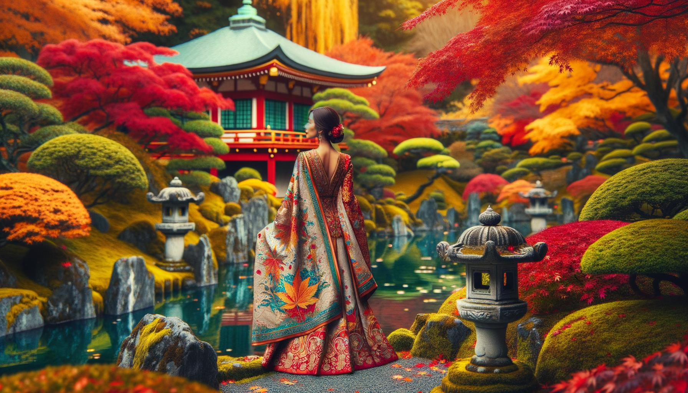

# Belles Personnes et Lieux

Cette page contient 100 images générées par DALL-E 3 en utilisant le code suivant en février 2024 à des fins de test

https://github.com/nao7sep/yyGpt/blob/main/yyGptLibConsole/Tester3.cs

## Sérénité Tropicale: Une Dame Vibrante au Milieu de la Plage au Coucher du Soleil et des Palmiers Ondulants

Générez une image d'une belle femme noire, avec des boucles de longs cheveux bruns tombant sur ses épaules, dans un environnement serein. Elle porte une robe d'été jaune, son sourire est large et vibrant. Autour d'elle, le paysage qui se déroule est une plage tropicale à couper le souffle. Des palmiers chargés de noix de coco se balancent doucement dans la brise marine. Le soleil se couche à l'horizon, diffusant une explosion de teintes rose et abricot à travers le ciel. Des îles lointaines et des voiliers en croisière sont à peine visibles dans la lumière déclinante. Les vagues d'une clarté cristalline se brisent rythmiquement contre le sable blanc immaculé, créant une symphonie harmonieuse de la nature

## Coucher de Soleil Cerisier: Une Beauté Radieuse Au Milieu de la Sérénité Épanouie

Une scène visuellement frappante mettant en vedette une femme noire aux longs cheveux bouclés et aux yeux vifs et engageants, debout sous les branches florissantes d'un cerisier en fleurs. Le soleil se couche, projetant une lueur dorée sur les pétales des fleurs et sur la peau radieuse de la femme. Elle porte une robe d'été blanche fluide, et son chapeau à large bord est légèrement incliné sur un côté. Le parfum sucré des cerisiers en fleurs emplit l'air, créant une atmosphère sereine et tranquille. Cette image captivante capture l'essence de la beauté à la fois de la personne et du lieu

## Beauté du Moyen-Orient au milieu d'une sérénade au coucher du soleil dans une splendeur rurale en fleurs

Une illustration d'une belle femme du Moyen-Orient aux longs cheveux noirs bouclés et aux yeux marrons, portant une robe traditionnelle vibrante et colorée, debout dans un paysage rural à couper le souffle. Le paysage autour d'elle présente des collines verdoyantes, un petit lac bleu serein reflétant le ciel, un charmant pont de pierre traversant le lac, et un bosquet de grands cerisiers en fleurs. Le soleil se couche en arrière-plan, projetant de longues ombres et peignant une gamme vibrante de couleurs chaudes et denses à travers le ciel

## Sérénité au coucher du soleil avec une beauté du Moyen-Orient dans la forêt enchantée

Une scène captivante mettant en vedette une séduisante femme du Moyen-Orient aux longs cheveux ondulés, vêtue d'une robe légère et aérée. Elle se tient au milieu d'une forêt luxuriante et tranquille avec un tapis vibrant de fleurs sauvages, d'arbres anciens et imposants, et un ruisseau apaisant qui coule à proximité. Le soleil est bas dans le ciel, projetant de longues ombres chaleureuses et rehaussant la beauté naturelle du cadre

## Élégance Sud-Asiatique Élégante dans un Jardin Japonais Embrassé par l'Automne

Une élégante femme sud-asiatique en tenue traditionnelle élaborée, se promenant dans un serein jardin japonais pendant un radieux après-midi d'automne. La lumière du soleil filtre à travers le feuillage rouge et or, projetant des ombres mouchetées sur un chemin pavé. La tranquillité du lieu est encore accentuée par un bassin à carpes koi aux poissons orange vifs, et un petit pont en bois le traversant. Les cerisiers en fleurs ajoutent une touche de rose délicat au paysage

## Scène Sereine de la Rive d'une Rivière avec Beauté Traditionnelle du Moyen-Orient Parmi les Fleurs Sauvages en Floraison et le Pont Rustique

Générez une image sereine d'une élégante femme du Moyen-Orient aux yeux noisette et aux cheveux foncés qui descendent gracieusement dans son dos, parée d'une tenue traditionnelle brodée de couleurs. Elle est assise près de la rive d'une rivière azur tranquille. La végétation luxuriante prospère dans les environs, avec de grands arbres touchant le ciel et leurs feuilles formant des motifs avec la lumière du soleil qui filtre à travers. De magnifiques fleurs sauvages fleurissent en grappes, alors que les papillons voltigent près d’elles. Au-delà de la rivière, le paysage s'étend en collines vertes ondulantes sous un ciel serein et rempli de nuages. Un petit pont en bois pittoresque enjambe la rivière en aval. Toute la scène dégage une atmosphère de paix et de beauté

## Monsieur Sud-Asiatique en Tenue Vibrante au Milieu d'une Prairie en Fleurs aux Échos de l'Après-Midi

Créez une image représentant un homme d'âge moyen d'origine sud-asiatique, avec un sourire chaleureux, portant des vêtements traditionnels aux couleurs vibrantes. Il est situé dans une prairie pittoresque en fin d'après-midi, avec des fleurs sauvages de toutes les teintes qui fleurissent autour de lui et des arbres verts luxuriants en arrière-plan. Les rayons du soleil filtrent à travers les feuilles des arbres, projetant des ombres mouchetées sur l'herbe. Un ruisseau pétillant serpente à travers la prairie, ajoutant à l'ambiance sereine

## Élégance du Moyen-Orient au Cœur d'une Forêt Éthérée

Imaginez une scène époustouflante dans une forêt éthérée, baignée par un doux jeu de lumière filtrant à travers les feuilles vertes luxuriantes. Au cœur de ce cadre pittoresque se trouve une femme d'origine moyen-orientale, les yeux pétillants de sagesse et de tranquillité. Elle est vêtue d'une robe fluide teinte de couleurs vives, se fondant harmonieusement avec la nature environnante. Ses cheveux arrangés en une couronne tressée, évoquent un sentiment de sérénité et d'élégance. Avec le bourdonnement apaisant de la forêt autour d'elle, elle a un sourire serein, capturant parfaitement un moment de paix et de beauté

## Sérénité sud-asiatique dans un jardin japonais

Créez une image d'une femme sud-asiatique aux yeux marron chaleureux et aux cheveux noirs corbeau, vêtue d'une tunique aux couleurs vives. Elle est assise sur un tapis tissé vibrant, lisant un épais livre ancien. Elle est entourée d'un jardin japonais serein et luxuriant, le parfum des cerisiers en fleurs emplissant l'air. Un petit pont de pierre s'étend sur un étang à carpes koi paisible, reflétant la lumière du soleil de l'après-midi. Une brise douce fait bruisser les feuilles de bambou, créant une douce mélodie naturelle

## Coucher de soleil serein avec une beauté traditionnelle est-asiatique au bord de la rivière qui coule

Une image captivante représentant une scène magnifique. En détail, visualisez une femme d'Asie de l'Est élégamment vêtue de vêtements traditionnels, debout au bord d'une rivière qui coule. L'endroit est entouré d'une végétation luxuriante marquée par des arbres aux fleurs vibrantes et multicolores. Le soleil se couche au loin, immergeant la scène dans une chaleureuse lueur dorée. La femme a un sourire radieux sur son visage, démontrant le bonheur et la sérénité. Son regard est dirigé vers la rivière calme, reflétant le coucher de soleil à couper le souffle et le paysage verdoyant. L'ensemble de la scène est calme, tranquille et d'une beauté époustouflante

## Retraite de lecture sublime au coucher du soleil dans le jardin des cerisiers en fleurs

Une image d'un bel homme sud-asiatique au sourire doux, habillé de manière décontractée. Il est assis sur un banc en bois, absorbé par la lecture d'un livre. Il se trouve dans un jardin public serein rempli de cerisiers en fleurs, de charmants sentiers de pierre serpentant à travers une verdure luxuriante et une clôture classique en fer forgé entourant le jardin. Pour compléter la scène, un petit étang tranquille reflétant les couleurs vives du ciel pendant un coucher de soleil peut être vu à proximité

## Sérénité à l'aube dans la prairie Une femme sud-asiatique en tenue traditionnelle entourée par la beauté de la nature

Créez une image représentant une femme sud-asiatique au sourire radieux, vêtue de vêtements traditionnels, entourée d'une prairie enchantée à l'aube. La prairie est décorée de verdure luxuriante, de fleurs et d'un ruisseau tranquille qui coule paisiblement à proximité, suscitant un sentiment de paix et de sérénité. Le soleil est à la limite de l'horizon, projetant des teintes douces et chaudes de rose et d'orange sur le paysage pittoresque. La femme se tient près du ruisseau, une sensation de joie et de tranquillité émanant d'elle

## Enchantement printanier d'une sirène sud-asiatique dans un jardin japonais

Une image captivante dépeignant une femme sud-asiatique dans la trentaine avec de longs cheveux sombres, vêtue de vêtements traditionnels vibrants. Elle se tient dans un endroit fascinant, un jardin japonais en pleine floraison au printemps, avec des cerisiers en fleurs qui perdent leurs pétales roses autour d'elle, et un étang paisible et calme près d'elle. La douce lumière du soleil qui perce le feuillage jette une lumière rêveuse et sereine sur toute la scène, mettant en valeur les couleurs vives de sa tenue et la beauté naturelle qui l'entoure

## Grâce du Moyen-Orient au milieu d'un spectacle automnal dans un crépuscule de vallée immaculé

Créez une image d'une séduisante dame du Moyen-Orient aux cheveux ondulés et au sourire gracieux. Elle se tient dans un endroit à couper le souffle - une vallée verdoyante avec une rivière d'eau cristalline qui la traverse. Autour d'elle, de grands arbres aux feuilles d'automne vives et colorées, reflétant leur image sur la rivière. Au loin, on peut voir des montagnes enneigées sur fond de ciel bleu clair, ajoutant à la beauté globale du paysage. Le soleil se couche, ajoutant une teinte dorée à la vallée et créant une atmosphère sereine et tranquille

## Coucher de Soleil Serein: Élégance sud-asiatique surplombant la Vue sur la Forêt

Une scène étonnante mettant en vedette une belle femme sud-asiatique aux longs cheveux noirs et soyeux, portant un sari traditionnel et se tenant sur une falaise surplombant le paysage à couper le souffle d'une luxuriante forêt profondément verte au loin. Le vent tire doucement sur les couleurs vibrantes de son sari et ses cheveux pendant qu'elle regarde vers la sérénité du panorama, son visage éclairé par la douce lueur du soleil couchant. Un petit ruisseau scintillant serpente à travers la forêt, reflétant les teintes brillantes du crépuscule. Le silence tranquille de la région est palpable, ajoutant à la sensation générale du cadre serein et idyllique

## Femme élégante du Moyen-Orient au milieu d'un jardin en fleurs à la tombée de la nuit

Une représentation saisissante d'une femme d'origine moyen-orientale, habillée élégamment, se tenant au milieu d'un décor pittoresque. Elle se tient sur un chemin pavé qui serpente à travers un magnifique jardin regorgeant de fleurs éclatantes et en pleine floraison de diverses couleurs. Il y a des arbres anciens et imposants qui fournissent un ombrage suffisant, et derrière elle, une chaîne de montagnes pittoresque se dresse majestueusement au loin, baignée dans la lumière dorée du coucher du soleil

## Beauté Gracieuse au Bord du Lac au Coucher du Soleil

Illustrez une scène charmante mettant en vedette une femme élégante d'origine noire, posant avec grâce à l'extérieur dans un cadre naturel serein. Elle pourrait se tenir près d'un lac bleu calme avec en toile de fond d'imposantes montagnes vertes sous un ciel bleu et clair. Le soleil se couche, fournissant une lumière chaude et douce, peignant la scène dans des teintes pastel délicates. Elle est vêtue d'une robe d'été blanche, ses cheveux en longues boucles fluides, ajoutant une note d'une beauté intemporelle à l'ensemble de l'image

## Solitude au Crépuscule du Désert : Harmonie de l'Homme et de la Nature dans les Teintes du Coucher de Soleil

Imaginez une scène à couper le souffle au coucher du soleil. Au cœur de ce spectacle se tient une figure masculine du Moyen-Orient, appréciant les couleurs envoûtantes du soleil couchant qui se fondent harmonieusement avec les teintes orangées des dunes du désert. Les sables légers comme une plume, réchauffés par le soleil tout au long de la journée, dégagent une douce chaleur qui semble faire écho à la sérénité calme sur le visage de l'homme alors qu'il observe la toile captivante de la nature. Alors que les derniers rayons du soleil illuminent son visage, le vent joue doucement avec ses cheveux noirs, ajoutant la touche finale à ce remarquable portrait d'un homme et de la nature en harmonie

## Sérénité Sud-Asiatique Parmi les Teintes de la Forêt Tropicale et la Cascade Déferlante

Créez une image captivante d'une femme sud-asiatique debout dans une clairière sereine et surréaliste dans une forêt tropicale luxuriante. Elle est vêtue de vêtements traditionnels, ses cheveux sont tressés et elle dégage un sentiment de calme et de tranquillité. La forêt environnante déborde de feuillage tropical vibrant, de diverses nuances de vert et saupoudrée de fleurs exotiques de multiples couleurs. Une cascade envoûtante qui dégringole en arrière-plan ajoute de la sérénité à la scène et une famille de papillons luminescents qui virevoltent autour ajoute une touche de fantaisie au paysage

## Sérénité et Beauté Parmi les Fleurs de Cerisier: Une Élégance Sud-Asiatique dans un Jardin Japonais

Créez une image frappante d'une femme sud-asiatique se tenant dans un paisible jardin japonais pendant la saison des cerisiers en fleurs. Elle porte un kimono traditionnel aux couleurs vives de bleu et d'or, avec des motifs réalistes de chrysanthèmes et de paons. La femme est capturée dans une pose calme et sereine, admirant la dense bourrasque de cerisiers en fleurs roses pâles qui remplissent le ciel et balayent le sol autour d'elle. Un petit ruisseau doux coule à proximité, avec le délicat reflet des cerisiers en fleurs à sa surface. Des lanternes en pierre traditionnelles ajoutent une touche d'élégance tranquille à la scène

## Élégance Orientale dans un Paisible Coucher de Soleil Italien

Une femme asiatique orientale d'une beauté frappante, aux longs cheveux noirs doucement balayés par la brise, se tient au milieu d'un paysage tranquille de la campagne italienne au coucher du soleil. Elle est vêtue d'une robe blanche traditionnelle, ses yeux scintillent de chaleur et de joie. Autour d'elle s'étend une végétation luxuriante, des vignobles et des maisons rustiques nichées contre des collines ondulantes, baignées dans la lueur dorée et chaleureuse du soleil couchant. Cette scène sereine dégage une sensation de calme et de beauté, créant une image d'une coexistence harmonieuse entre la nature et l'humanité

## Coucher de Soleil Serein : Une Beauté Hispanique en Lavande et Bleu Parmi les Collines Émeraudes Ondulantes

Créez une image d'une femme hispanique aux cheveux longs et voluptueux et au sourire éclatant. Elle se tient dans un paysage serein et à couper le souffle pendant le coucher du soleil. Le lieu est caractérisé par des collines verdoyantes sous un ciel lavande. Une attention exceptionnelle doit être accordée à ses vêtements - une robe d'été légère élégamment coupée dans des teintes de lavande et de bleu royal qui complète le décor séduisant

## Un bel homme du Moyen-Orient embrasse la sérénité d'un paysage luxuriant au coucher du soleil

Générez une image d'un bel homme du Moyen-Orient, aux cheveux ondulés foncés, habillé en tenue décontractée, debout au milieu d'un paysage captivant. Ce paysage est un endroit serein avec une végétation luxuriante, une rivière scintillante serpentant lentement et une majestueuse chaîne de montagnes qui gracie l'horizon. Le ciel au-dessus de lui est peint avec des nuances d'un soleil couchant, projetant une lumière éthérée sur la scène. Là, cet individu observe la nature à couper le souffle autour de lui, un sourire content éclairant son visage, incarnant la beauté de la paix environnante

## Élégance au Crépuscule à côté du Lac Turquoise

Une image pittoresque d'une élégante femme du Moyen-Orient aux longs cheveux noirs, portant une robe rouge vibrante. Elle est debout au bord d'un lac turquoise serein, entourée d'une forêt dense présentant toutes les nuances de vert. Le soleil se couche en arrière-plan, projetant une lumière dorée et chaleureuse sur le paysage, créant une atmosphère sereine et belle

## Princesse Crépuscule Éthérée du Désert dans un Paysage Enchanté

Créez une image d'une femme moyen-orientale impressionnante et éthérée se tenant au milieu d'un paysage naturel enchanteur. Elle est ornée d'un turban vibrant détaillé avec de belles gemmes et des motifs complexes. Sa tenue est une robe fluide et colorée reflétant les nuances du soleil couchant autour d'elle. Le paysage présente diverses teintes d'oranges, de pourpres et de roses mélangées avec le ciel céruléen. Des montagnes majestueuses se dressent en arrière-plan, couronnées d'une touche de neige et le premier plan est parsemé d'un ruisseau scintillant serpentant à travers des champs luxuriants, créant une scène qui respire la tranquillité et une beauté à couper le souffle

## Sérénité sud-asiatique dans une prairie au coucher du soleil

Une image d'un individu éblouissant, un homme sud-asiatique dans la trentaine, avec des cheveux de longueur moyenne et un doux sourire sur le visage. Il est habillé de manière confortable et décontractée et se trouve dans un endroit tout aussi stupéfiant. Cet environnement est une prairie paisible baignée par la lumière dorée du soleil couchant. De grands arbres gracieux encadrent la scène, leurs feuilles bruissant doucement dans la brise. Les montagnes lointaines ornent l'horizon, leurs sommets embrassés par les derniers rayons du soleil. Les sons sereins de la nature remplissent l'air, peignant une scène de tranquillité et de beauté

## Sourire radieux dans une prairie dorée : une femme du Moyen-Orient parmi un coucher de soleil éthéré et des sommets de montagne

Imaginez l'image d'une femme du Moyen-Orient gracieusement posée dans un endroit pittoresque à couper le souffle. Elle arbore un sourire radieux et des yeux marrons pétillants qui respirent la chaleur. Elle est vêtue d'une tenue traditionnelle colorée, sa tête est ornée d'un beau foulard à motifs. L'endroit où elle se tient est éthéré, baigné dans la douce teinte dorée du soleil couchant. C'est une prairie, luxuriante et éthérée, avec des fleurs sauvages vibrantes se balançant dans la brise douce. Au loin, vous pouvez apercevoir des sommets de montagnes majestueux embrassés par les dernières lueurs de la lumière du jour

## Sérénité d'Automne: Une Grâce Sud-Asiatique dans un Jardin Japonais

Générez une image d'une femme sud-asiatique en tenue traditionnelle se tenant gracieusement dans un jardin japonais serein pendant l'automne. Les couleurs du jardin contrastent avec sa tenue traditionnelle lumineuse. On la voit admirer le mélange de teintes automnales qui l'entourent, avec des érables qui perdent leurs feuilles rouges croustillantes, une charmante lanterne de pierre à l'arrière-plan, et un apaisant bassin à carpes koi à ses pieds

## Crépuscule Tranquille dans une Prairie du Moyen-Orient

Une scène tranquille d'une femme du Moyen-Orient, assise paisiblement à l'ombre d'un vieil arbre noueux. Elle semble rayonnante dans sa tenue traditionnelle colorée. L'endroit est une prairie enchantée, remplie de fleurs sauvages vibrantes. Le soleil se couche, projetant une teinte dorée sereine sur le paysage. Au loin se trouvent des montagnes majestueuses, couronnées de neige. Une légère brise agite les pétales des fleurs, créant une ambiance douce et apaisante

## Élégance et Beauté au Milieu de la Radiance Tropicale et de la Sérénité de la Cascade

Une femme Noire séduisante aux cheveux bouclés, vêtue d'une robe élégante, se tient sur un chemin qui serpente à travers une forêt tropicale luxuriante. Des oiseaux exotiques aux couleurs vives sont perchés sur les arbres à proximité. Au loin, une majestueuse cascade dévale une falaise, produisant une bande sonore sereine pour ce cadre tranquille. Les rayons du soleil pénètrent la canopée, projetant des ombres mouchetées et illuminant la végétation abondante d'une lueur dorée

## Sérénité estivale sur une falaise du Moyen-Orient

Une photo d'un homme du Moyen-Orient vacillant sur des rochers près d'une stupéfiante falaise surplombant la mer azur. Il est habillé d'une tenue d'été simple mais séduisante - une chemise boutonnée pastel, un short en khaki et des tongs - qui met en valeur son allure chic sans effort. Ses yeux reflètent la beauté de la scène sereine qui se déroule devant lui. Le soleil perçant à travers les nuages dispersés donne naissance à un jeu de lumières et d'ombres envoutant sur les eaux cristallines et propres. Des moments fugitifs de tranquillité comme celui-ci sont de véritables bénédictions

## Élégance du Moyen-Orient au coucher du soleil près de l'oasis

Créez une image représentant une femme du Moyen-Orient dans un cadre époustouflant. Elle est élégamment vêtue, encapsulant une tenue traditionnelle du Moyen-Orient avec des influences modernes. Elle se trouve près d'une oasis verdoyante et luxuriante, le soleil est sur le point de se coucher et projette une teinte orange et dorée éthérée sur le paysage. Un corps d'eau calme et scintillant est à proximité, peut-être un petit lac, reflétant le paysage pittoresque et le ciel qui s'assombrit rapidement, rempli d'étoiles. La tranquillité de l'environnement et son expression sereine émanent une aura de paix et de contentement

## Regard Émeraude au Cœur de la Forêt Tropicale

Une image d'une belle femme noire aux longs cheveux tressés et aux yeux verts émeraude, posant avec assurance dans un lieu impressionnant. Le décor est une luxuriante forêt tropicale, remplie de feuillage vibrant et de fleurs exotiques éclatantes. Les couleurs autour d'elle sont vibrantes et vives, avec la lumière du soleil filtrant à travers la canopée, projetant des motifs hypnotisants sur le sol de la forêt. Une cascade dégringolante peut être aperçue en arrière-plan, son eau scintillant sous le soleil, créant une atmosphère sereine et tranquille

## Sérénité du Moyen-Orient dans un Éden Floral Luxuriant sous une Lumière Solaire Dorée

Illustrez une femme du Moyen-Orient avec de longs cheveux bouclés, dans un jardin verdoyant rempli de diverses fleurs multicolores. Elle porte une robe pastel fluide et est assise sur un banc en fer forgé orné sous un cerisier en fleurs, absorbée par la lecture d'un roman de style victorien. Le soleil se couche, projetant une lumière dorée chaleureuse sur la scène. Des paons peuvent être vus en arrière-plan, se promenant librement. La tranquillité et la beauté pittoresque du lieu sont vraiment captivantes

## Artiste du Moyen-Orient dans une rue sud-asiatique colorée au coucher du soleil

Créez une image d'un bel artiste masculin du Moyen-Orient debout dans une rue pittoresque du sud de l'Asie remplie de bâtiments colorés et vibrants. Il porte une kurta traditionnelle, tenant un pinceau à la main. Une douce brise souffle, faisant bruisser ses vêtements. Le soleil se couche, projetant une chaude lueur orange sur la scène

## Tranquillité Éthérée : La Solitude Contemplative de l'Homme Asiatique au Lac Alpin

Une scène éthérée mettant en vedette un bel homme asiatique aux traits élégants, confortablement assis sur un rocher au bord d'un lac alpin serein. L'homme est habillé de vêtements décontractés à la mode, et son air contemplatif indique un sentiment de paix et de tranquillité. La zone environnante est magnifique, avec des montagnes enneigées culminantes se reflétant sur la surface vitreuse du lac, et des conifères luxuriants dispersés autour. L'eau sereine, l'air pur et frais, et le doux battement des oiseaux alpins créent un sentiment de tranquillité et d'harmonie avec la nature

## Sérénité Mystique dans la Forêt du Moyen-Orient

Une représentation saisissante d'une femme du Moyen-Orient, avec ses longs cheveux bruns dégringolant sur ses épaules, debout dans un cadre à couper le souffle. Elle est au milieu d'une forêt sereine parsemée d'arbres imposants et de fleurs vibrantes et en fleurs, avec une cascade en cascade à l'arrière-plan. La lumière filtre à travers le feuillage vert, projetant un motif diffus sur son visage. Elle porte une longue robe vibrante qui ondule avec la douce brise. Elle regarde les montagnes lointaines à l'horizon, un regard de paix et de contentement sur son visage

## Femme en robe orange embrassant le coucher de soleil dans les vallons ondulants

Un paysage pittoresque se déroule avec des vallons ondulants et un coucher de soleil spectaculaire qui sature le ciel de nuances de rouge, d'orange et de violet. Dans cet endroit impressionnant, une femme asiatique, aux cheveux foncés coiffés en chignon lâche, se tient debout pour observer la scène. Elle est vêtue d'une robe d'été orange, le tissu doux faisant écho aux couleurs du coucher de soleil. Son sourire radieux dégage une sensation de paix et de contentement, alors qu'elle apprécie la beauté naturelle de son environnement. Une douce brise joue avec sa robe et ses cheveux, ajoutant à l'ambiance sereine

## Beauté Hispanique Sous un Cerisier en Fleurs au Milieu de Paysages Majestueux

Une image visuellement époustouflante d'une femme hispanique, aux cheveux châtains ondulés, aux yeux noisette pétillants et portant une robe d'été, se repose tranquillement à l'ombre d'un arbre de cerisier en fleurs. Autour d'elle se trouve un paysage à couper le souffle d'une prairie verdoyante parsemée de fleurs sauvages, un lac azur tranquille au loin et des montagnes enneigées sous un ciel bleu clair

## Élégance et Exploration Une Femme Sud-Asiatique en Tenue de Rue Vibrante au Milieu d'un Cadre Côtier Serein

Une image frappante d'une femme d'Asie du Sud, vêtue d'une élégante tenue de rue, debout au milieu d'un lieu époustouflant. Imaginez-la au milieu de treillis couverts de fleurs, sous un ciel baigné de soleil. Elle tient un sac à main à la mode, les yeux emplis de curiosité, explorant la beauté qui l'entoure. Le paysage présente un chemin pavé menant vers un vaste océan bleu au loin, avec une végétation luxuriante de chaque côté. L'endroit dégage une atmosphère sereine, complétée par une palette de couleurs complète de pastels doux et de nuances vibrantes évoquant la fraîcheur d'un matin de printemps

## Beauté du Moyen-Orient en Tenue Traditionnelle Parmi la Verdure Luxuriante et la Cascade au Coucher du Soleil

Créez une image détaillée d'une femme du Moyen-Orient séduisante avec un sourire chaleureux, vêtue d'une tenue traditionnelle colorée, se tenant dans un cadre enchanteur. L'environnement se compose d'une verdure luxuriante, une cascade déferlante en arrière-plan, et des fleurs dans une myriade de couleurs. Un ruisseau paisible coule à côté d'elle, et il y a un coucher de soleil serein et vibrant à l'horizon, projetant de jolies teintes pastel à travers le ciel

## Sourire Radieux dans une Forêt Émeraude: Beauté Sud-Asiatique en Magenta Ornant la Canopée de la Nature

Une scène magnifique mettant en vedette une femme sud-asiatique avec un sourire radieux, portant une tenue traditionnelle magenta éclatante, debout dans une forêt luxuriante et magnifique. Le sol de la forêt est orné de feuilles tombées de différentes couleurs, et la lumière du soleil filtrée se répand à travers les arbres hauts et imposants. L'air est rempli des sons tranquilles de la nature, des oiseaux qui gazouillent et d'une brise douce qui fait frissonner les feuilles. Ce cadre pittoresque est encore rehaussé par une cascade lointaine qui dévale des rochers moussus, son bruit apaisant se mêlant à la symphonie de la forêt

## Grâce Élégante dans une Scène de Jardin Sud-Asiatique Resplendissante

Une scène époustouflante dans un endroit pittoresque. Imaginez une femme d'Asie du Sud, distinguée par son élégance et son charisme notable. Sa tenue est un sari vibrant, plein de motifs intricats et de textures riches. Elle se tient droite, sa posture rayonnante d'élégance. Le cadre est un jardin séduisant, luxuriant et resplendissant - plongez-vous dans la symphonie tranquille des oiseaux qui gazouillent, des fleurs en fleurs aux couleurs vives de bleus et de roses et des feuilles bruissantes des arbres majestueux. Peut-être y a-t-il un ruisseau qui gazouille doucement à proximité, lançant des mélodies charmantes dans cet environnement serein. Une vision vraiment à couper le souffle!

## Explorateur du Moyen-Orient dans la Splendeur de la Nature : Tranquillité sur le Littoral Coloré

Une image d'une personne d'origine moyen-orientale à l'apparence neutre en termes de genre. Elle se tient dans un endroit naturellement magnifique, entourée de verdure luxuriante et de fleurs sauvages colorées. Au loin, un océan bleu vif borde la côte rocheuse. Le ciel est d'un bleu azur éclatant, éclaboussé de teintes de rose doux venant du soleil couchant. La personne porte des vêtements confortables et élégants, et regarde le paysage avec un regard de paix et de satisfaction, appréciant pleinement la sérénité et la beauté de l'endroit

## Élégance du Moyen-Orient Surplombant une Ville Côtière au Coucher du Soleil

Imaginez une image d'une belle femme du Moyen-Orient dans la trentaine, debout sur un balcon exquisément décoré surplombant une paisible ville côtière au coucher du soleil. Elle porte une robe longue et fluide de couleur aquamarine, ses cheveux de corbeau bouclés sont relâchés, se balançant doucement dans la brise. Ses yeux brun foncé regardent contemplativement au loin, reflétant les teintes brillantes du coucher de soleil. La ville en dessous est composée de bâtiments recouverts de plâtre blanc, de luxueux palmiers verts, avec des rues pavées sinueuses menant à la mer azur tranquille au-delà. Le ciel est un tumulte de orange chaud, de rose et de violet, le soleil couchant pulvérisant ses rayons dorés radieux sur la ville pittoresque

## Grâce et Sérénité Une Élégance Sud-Asiatique Au Milieu d'un Paysage Vibrant Sous Un Ciel de Coucher de Soleil Pastel

Créez une image d'une femme sud-asiatique debout dans un paysage frappant et vibrant. Elle dégage une grâce et une sérénité, ses yeux reflétant la compassion et la gentillesse. Ses cheveux sont longs et noués lâchement à l'arrière. Elle porte une robe traditionnelle simple mais élégante qui rehausse sa beauté. Le paysage autour d'elle est à couper le souffle, rempli d'une prairie fleurie qui s'étend vers une chaîne de montagnes majestueuse sous un ciel de coucher de soleil doux et pastel

## Tranquille Vibrance d'un Aventurier Sud-Asiatique au Coucher du Soleil

Une image captivante mettant en scène un magnifique paysage naturel avec des collines ondulantes, un lac d'une clarté cristalline et un coucher de soleil vibrant colorant le ciel. Au premier plan, un homme sud-asiatique à la carrure athlétique se tient décontracté, vêtu d'une tenue de plein air confortable. Le sourire gravé sur son visage ne fait qu'élever la tranquillité et le charme du portrait pittoresque

## Beauté à couper le souffle au milieu de l'histoire et de la nature au Moyen-Orient

Une femme du Moyen-Orient visuellement captivante se tient dans un lieu qui inspire l'émerveillement. Elle a des yeux sombres expressifs et de longs cheveux noirs corbeau balayés par la douce brise. Sa tenue traditionnelle est un riche mélange de couleurs, présentant des motifs complexes qui témoignent de la riche culture de la région. Le lieu est tout aussi magnifique, avec une architecture ancienne imposante qui fait allusion à une histoire complexe, magnifiquement compensée par des parcs verdoyants et des étendues d'eau tranquilles scintillant sous le soleil doré. Partout où l'œil se promène, il y a l'étincelle de la vie - dans le pétale d'une fleur, le battement d'un oiseau chanteur, ou le silence apaisant du vent

## Coucher de soleil serein Une femme sud-asiatique savourant la tranquillité dans une campagne colorée

Créez une image détaillée mettant en scène une femme sud-asiatique savourant la tranquillité d'un cadre spectaculaire. Elle est positionnée dans une campagne luxuriante et étendue, remplie de champs vibrants de fleurs sauvages qui ondulent dans la brise légère. Au-dessus, un ciel étonnant se transforme du bleu aux nuances d'or et de rose alors que le soleil se couche à l'horizon. Elle porte une tenue traditionnelle confortable, avec un sourire de sérénité sur son visage combiné à un soupçon de joie, reflétant la véritable beauté de son environnement

## Élégance Sud-Asiatique au Crépuscule du Bassin de Lotus

Créez une image d'une femme sud-asiatique aux longs cheveux ondulés, vêtue d'une tenue traditionnelle colorée, debout sur un pont au-dessus d'un étang de lotus serein. La scène est enveloppée dans la chaude lueur du coucher de soleil, peignant le ciel de teintes de violet, d'orange et de rouge. L'eau calme reflète les couleurs vibrantes du ciel et des nénuphars flottent doucement à la surface de l'eau. Au loin, des lanternes en pierre traditionnelles jalonnent le chemin le long de l'étang, leur douce lumière contribuant à l'atmosphère tranquille. Pour compléter la scène, des arbres de cerisiers en pleine floraison bordent l'étang, leurs pétales créant un ravissant tapis rose sur le sol

## Élégance sud-asiatique parmi une cascade embrassée par l'arc-en-ciel et des verts luxuriants

Une scène visuellement attrayante avec une femme sud-asiatique debout près d'une cascade majestueuse. Elle porte une tenue traditionnelle vibrante, dont les nuances complètent la verdure luxuriante environnante. Son visage est éclairé par la lumière naturelle douce filtrée à travers les arbres à proximité. La cascade descend avec une intensité gracieuse, envoyant un délicat brouillard dans l'air qui réfracte la lumière du soleil et forme un arc-en-ciel. La scène est paisible, sereine, et pleine de vie, montrant vraiment la merveille de la nature et la beauté dans la diversité

## Élégance Éthérée dans un Jardin Moyen-Oriental Luxuriant

Une élégante femme du Moyen-Orient, aux cheveux noirs et soyeux et aux profonds yeux marron, se prélasse dans un jardin serein et luxuriant. Le soleil filtre à travers le feuillage vert, illuminant les fleurs vives qui l'entourent. Une douce brise fait frissonner ses vêtements, ajoutant une touche éthérée. À proximité, des paons colorés se pavanent fièrement, leurs plumes iridescentes scintillant. Avec une expression paisible, elle est perdue dans la beauté de la nature qui l'entoure

## Sérénité du Couché de Soleil au Moyen-Orient Parmi l'Harmonie Florale et les Montagnes Majestueuses

Une scène envoûtante d'une femme du Moyen-Orient aux longs cheveux noirs et brillants, confortablement vêtue d'une robe fluide et faite à la main. Elle se trouve dans un endroit paisible entouré de verdure luxuriante et de fleurs sauvages vibrantes. Le soleil se couche doucement en arrière-plan, projetant une chaude lueur dorée sur le paysage serein. Une chaîne de montagnes sereine se dresse au loin, ajoutant à la beauté pittoresque. Une image peinte avec le pinceau de la tranquillité et de la sérénité, un sublime jeu entre nature et humanité

## Sérénité Rêveuse d'une Dame Sud-Asiatique Parmi les Pins Verdoyants et les Pics Enneigés Majestueux

Une scène frappante mettant en vedette une femme sud-asiatique, aux cheveux ondulés jusqu'aux épaules, illuminée par la douce lumière du soleil couchant. Elle porte des vêtements traditionnels et contemple la vue fascinante d'un lac serein, entouré d'une forêt verdoyante de grands pins. Au loin, de majestueuses montagnes aux sommets enneigés se dressent sous le ciel bleu et clair. Cette scène tranquille évoque un sentiment de calme, accentué par l'expression paisible de la femme et les couleurs vibrantes du paysage

## Majesté du Moyen-Orient Parmi la Splendeur du Coucher de Soleil et la Nature Vibrante

Créez une image mettant en vedette une belle femme du Moyen-Orient, avec des cheveux noirs ondulés et des yeux frappants, portant une tenue traditionnelle. Elle est positionnée dans un cadre pittoresque entouré d'une beauté naturelle magnifique. Cela comprend une cascade jaillissante à proximité, une verdure luxuriante avec diverses plantes vibrantes. Le soleil se couche, jetant une lueur orange chaude sur la scène, accentuant la flore fuchsia et rouge. La personne se tient sur un chemin serpentant à travers le paysage, baigné dans les couleurs radieuses d'un coucher de soleil, reflétant sa tranquillité paisible

## Sérénité de l'Aube en Safran Sur les Himalayas

Une séduisante femme sud-asiatique se tenant devant le décor majestueux de la chaîne de montagnes de l'Himalaya, resplendissant dans les couleurs de l'aube. Elle est élégamment vêtue d'un saree couleur safran avec des ornements dorés. Ses cheveux sombres sont ornés d'un maang tikka traditionnel. Une brise matinale fraîche fait doucement osciller ses cheveux et son saree, ajoutant un sens de mouvement à toute la scène

## La Beauté Auburn Embrasse le Printemps dans une Harmonie de Jardin Asiatique

Créez une image mettant en scène un magnifique jardin asiatique paisible au printemps. Dans la scène, nous trouvons une femme caucasienne visuellement époustouflante qui apprécie la beauté qui l'entoure. Elle se caractérise par ses longs cheveux auburn ondulés, ses yeux vibrants, et un sourire chaleureux qui témoigne de sa beauté intérieure. Elle est élégamment vêtue d'un mélange de tenues modernes et traditionnelles, symbolisant un mélange harmonieux de cultures. Le jardin foisonne d'arbres de cerisiers en fleurs, dont les pétales tombent doucement, un étang à carpes koi, et un pont en bois classique, reflétant la beauté intemporelle des paysages asiatiques

## Sérénité dans la Sérénade de Saphir Élégance Chinoise Parmi les Blossoms Pont et Pics Enneigés

Créez une image d'une charmante femme d'Asie de l'Est, aux cheveux noirs comme le jais et aux yeux doux et bienveillants, arborant un sourire serein. Elle est élégamment vêtue d'un cheongsam chinois traditionnel en bleu saphir, orné de broderies dorées. Derrière elle se trouve un cerisier en fleurs vibrant, doucement bercé par le vent, situé près d'un vieux pont en pierre rustique qui traverse un étang calme rempli de nénuphars. On peut voir au loin des montagnes majestueuses surmontées de sommets enneigés sous un ciel céruleum avec des nuages blancs et moelleux qui dérivent lentement. Une atmosphère de sérénité et de tranquillité enveloppe ce cadre pittoresque

## L'élégance sud-asiatique rencontre le charme européen dans la douce lueur du soir doré

Une image esthétiquement agréable d'une femme sud-asiatique d'âge moyen, vêtue d'une tenue traditionnelle vibrante, près d'un magnifique décor d'une ville européenne historique. Elle se promène dans une rue pavée bordée de boutiques pittoresques. Son sourire ajoute à la beauté de la scène alors qu'elle admire le charme architectural unique de la ville. La lueur dorée du soleil du soir ajoute une touche de magie à l'atmosphère, projetant de longues ombres et réchauffant les structures naturelles et artificielles environnantes. La scène capture un sentiment de tranquillité et de joie

## Lueur éthérée d’une gracieuse belle de l'Orient moyen dans un jardin vibrant au coucher du soleil

Une image saisissante d'une femme du Moyen-Orient dégageant une grâce, habillée avec élégance dans une tenue traditionnelle vibrante. Elle se tient dans un endroit à couper le souffle, un jardin luxuriant regorgeant de flore diverse en pleine floraison. Des pétales de couleurs vives recouvrent le sol et un étang serein reflète le ciel, créant un mélange hypnotisant de beauté naturelle. Le soleil se couche à l'arrière-plan, projetant une aura dorée qui peint tout d'une lueur chaude et éthérée

## Élégance et Grâce dans le Coucher de Soleil Doré près de la Cascade Enchantée

Une élégante femme sud-asiatique vêtue d'un sarong jaune fluide se tient à côté d'un homme du Moyen-Orient, habillé élégamment dans un costume bleu décontracté. Ils se situent dans un paysage apaisant qui présente une cascade enchantée se déversant sur des rochers couverts de mousse et un lac cristallin scintillant sous la douce lueur du soleil couchant. L'ambiance sereine est encore accentuée par la présence de majestueux cyprès de 300 ans, tandis que des fleurs sauvages vibrantes parsèment les environs, et des oiseaux d'un plumage exquis traversent le ciel

## Homme du Moyen-Orient embrassant la tranquillité au lever du soleil sur une plage isolée

Un homme séduisant, d'origine moyen-orientale, au physique robuste et au sourire chaleureux, est assis calmement dans un endroit enchanteur. L'endroit est une plage tranquille et isolée au lever du soleil. Le sable doré s'étend jusqu'à l'eau cristalline qui reflète les teintes douces et pêche du ciel matinal. De faibles silhouettes d'arbres tropicaux luxuriants entourent le décor, ajoutant un charme serein. L'ambiance douillette créée par les vagues douces et la brise marine rafraîchissante se marie parfaitement avec le comportement paisible de l'homme et son contentement sincère

## Grâce sud-asiatique au crépuscule près du lac tranquille

Une scène sereine se déroule avec une femme d'Asie du Sud se tenant gracieusement au bord d'un lac tranquille. Le soleil couchant insuffle une aura dorée aux environs, illuminant le ciel de nuances d'orange, de rose et de violet. Au loin, de hautes montagnes aux sommets enneigés complètent le décor envoûtant. La femme est vêtue d'une tenue douce de couleur lavande, dégageant chaleur et paix. Ses yeux pétillent de joie, reflétant la beauté naturelle du lieu. Il y a un ponton en bois derrière elle, menant dans les eaux calmes du lac, et des fleurs sauvages vibrantes fleurissent au bord du lac, ajoutant à la beauté idyllique de ce cadre pittoresque

## Sérénité reposante au milieu du coucher de soleil au bord du lac et du paysage sud-asiatique

Une scène captivante d'une femme sud-asiatique se reposant paisiblement au bord d'un lac tranquille, son reflet se mirant sur la surface vitrée de l'eau. Elle est vêtue d'une tenue d'été simple mais élégante, ses cheveux éparpillés derrière elle sur le fond de la verdure luxuriante. Autour d'elle, le soleil couchant peint des éclats dramatiques d'orange et de rose dans le ciel, projetant une lumière chaude et sereine sur le paysage pittoresque. D'exquis chalets en bois peuvent être aperçus au loin, nichés parmi les collines ondulantes qui s'étendent vers l'horizon

## Regard de noisette dans l'oasis verdoyante baignée de soleil

Une image d'un bel homme du Moyen-Orient, aux cheveux foncés, à la barbe bien entretenue et aux yeux noisettes expressifs. Il se tient dans un environnement éthéré, une forêt luxuriante et vivante, regorgeant d'arbres verdoyants, de fleurs colorées et d'un ruisseau d'une clarté cristalline scintillant sous la douce lumière du soleil. Des jets de lumière traversent la canopée dense, projetant des patches dynamiques de lumière et d'ombre, faisant prendre vie à la forêt. L'homme est habillé de vêtements décontractés et confortable, il a l'air détendu et serein, son visage est illuminé par les rayons du soleil, exprimant un sentiment de paix et de satisfaction

## Grâce Sous les Cerisiers Un Portrait d'Asie de l'Est en Soie Bleue et Sérénité au Coucher du Soleil

Visualisez une femme d'Asie de l'Est, d'une grâce posée alors qu'elle se tient sous l'ombre subtile de cerisiers en pleine floraison. Les doux pétales roses tombant autour d'elle, elle porte une délicate robe en soie bleue qui complète sa carnation, tandis que ses longs cheveux noirs de corbeau sont attachés en un chignon lâche. L'arrière-plan dégage la sérénité d'un jardin de thé japonais traditionnel, avec une lanterne en pierre partiellement cachée parmi la flore, des buissons soigneusement taillés et un petit étang reflétant le paysage pittoresque. Les teintes douces du coucher de soleil peignent cette toile tranquille avec des tons chaleureux

## Sérénité à l'horizon: Rêverie d'une femme sud-asiatique au coucher du soleil

Une scène stupéfiante mettant en vedette une jeune femme d'Asie du Sud de stature moyenne avec ses cheveux noirs brillants et soyeux attachés en queue de cheval. Elle se tient au sommet d'une colline verdoyante, se prélassant dans les rayons apaisants du soleil couchant. Ce paysage magnifique est rien de moins qu'un paradis, avec la mer azurée s'étendant jusqu'à l'horizon, et des oiseaux de mer parsèment le ciel au-dessus de la ligne côtière. La femme, dégageant une aura paisible, contemple la vue à couper le souffle avec un sentiment de sérénité, complétant ce tableau de tranquillité et de beauté

## Charmant homme sud-asiatique se promenant sur une plage au coucher du soleil

Générez une image d'un homme sud-asiatique avec un sourire charmant, portant une chemise en lin blanc impeccable et un pantalon kaki. Il se promène sur une plage de sable au coucher du soleil, l'horizon enflammé de teintes orange et rose. Des palmiers se balancent doucement en arrière-plan, et la mer turquoise clapote joyeusement à ses pieds nus

## Aube Tranquille au Bord de la Rivière : Une Élégance Victorienne parmi les Fleurs de Cerisier et les Échos de la Montagne

Générez une image dans un style apaisant et pictural, rappelant l'époque romantique, présentant une femme asiatique en robe victorienne ajustée, assise au bord d'une rivière tranquille scintillante. Un soleil matinal se lève au loin, projetant une lumière douce et chaude sur la scène. Les reflets dans l'eau scintillent, l'herbe est luxuriante et verte, et il y a des cerisiers en fleurs qui dispersent leurs pétales avec la brise. La femme dans la scène tient doucement un livre, perdue dans ses pensées. Une montagne majestueuse se fait l'écho au loin, enveloppée dans une douce brume, renforçant l'ambiance sereine

## Reflets sereins du crépuscule d'une beauté sud-asiatique dans la nature

Une image d'une belle femme sud-asiatique, vêtue d'une robe traditionnelle vibrante, debout dans une forêt luxuriante et pittoresque. Il y a un lac paisible à proximité qui reflète le magnifique coucher de soleil doré. La scène est sereine avec le chant des oiseaux du soir remplissant l'air et une douce brise faisant bruire les feuilles de la forêt. Elle sourit doucement, ses yeux illuminés de joie, alors qu'elle s'imprègne envoûtante de la beauté naturelle qui l'entoure

## Homme du Moyen-Orient au Crépuscule Sérénité au milieu de la Forêt Luxuriante au Bord du Lac

Une représentation captivante d'un homme du Moyen-Orient dans la fleur de l'âge, debout au bord d'un lac serein au cœur d'une forêt luxuriante. Les teintes crépusculaires du soleil couchant dansent sur l'eau calme, s'étendant vers les arbres denses avec leurs feuilles émeraude, créant une harmonie enchantée de couleurs. La tenue traditionnelle de l'homme ressort sur ce fond, les détails de sa tenue minutieusement travaillés. Son expression tranquille reflète sa profonde connexion avec les environs naturels, contribuant à une scène qui est l'incarnation de la beauté paisible

## Femme asiatique joyeuse dans une prairie vibrante au coucher du soleil

Créez une image d'une femme asiatique dans la trentaine, avec des cheveux châtain clair ondulés jusqu'aux épaules, des yeux marron profond et un sourire joyeux sur son visage. Elle se tient dans un endroit pittoresque : une prairie verdoyante foisonnante de fleurs sauvages de toutes les couleurs de l'arc-en-ciel, un ruisseau bleu scintillant serpente à travers la prairie et le soleil se couche au loin, peignant le ciel avec des nuances de rouge, rose et orange

## Lueur de Coucher de Soleil sur le Lac Azur avec la Beauté en Fleurs

Une image d'une belle femme hispanique aux longs cheveux ondulés et au sourire envoûtant, debout près d'un lac bleu azur avec des arbres verts luxuriants en arrière-plan et de délicates fleurs blanches en fleurs à ses pieds. Le soleil diffuse une lumière dorée à travers la scène, se reflétant sur la surface calme du lac, et le ciel est une danse de pastels au coucher du soleil

## Harmonie Matinale au Milieu de la Beauté Alpine avec Énigme d'Origine Asiatique

Une scène visuellement attrayante dans un environnement pittoresque. Au centre, il y a une personne séduisante d'origine asiatique avec un style neutre en termes de genre. Ils profitent paisiblement de la beauté sublime de la prairie alpine environnante abondante de fleurs sauvages vibrantes. La scène est baignée dans la lumière délicate du soleil du matin mettant en valeur l'expression contente de l'individu et le panorama à couper le souffle autour d'eux

## Sérénité sud-asiatique au coucher du soleil sur les sables côtiers

Une femme sud-asiatique envoûtante à la peau d'olive, aux longs cheveux bouclés doucement et aux yeux expressifs, habillée d'un saree traditionnel, se tient au bord d'un paysage à couper le souffle. C'est une vue côtière pittoresque et préservée avec des eaux turquoise qui baisent doucement les sables dorés. Les palmiers se balancent légèrement dans la brise côtière rafraîchissante, et le soleil commence à se coucher, projetant une lumière chaude et magique sur l'ensemble du tableau, le rendant surréel et captivant

## Élégance Rayonnante dans le Jardin en Fleur: Un Conte du Cueilleur de Fleurs et des Canards Espiègles

Une élégante femme hispanique aux longs cheveux bruns ondulés se promène dans un magnifique jardin luxuriant rempli de fleurs vibrantes et colorées en pleine floraison. Vêtue d'une robe blanche fluide, elle tient un petit panier en osier, cueillant des fleurs au passage. Une vieille fontaine en pierre, ornée de vignes fleuries, occupe le centre de ce jardin. C'est une journée ensoleillée et lumineuse, ajoutant chaleur et lumière à ce cadre paisible, avec une douce brise qui fait parfois frémir les feuilles. Une famille de canards nage joyeusement dans un étang à proximité, ajoutant une vie vibrante à cette scène sereine

## Élégance Tropicale Une Beauté Noire dans un Paradis de Forêt Tropicale

Une image d'une séduisante femme Noire aux cheveux bouclés, portant une robe vibrante et fluide, debout dans un endroit à couper le souffle. L'endroit est une luxuriante forêt tropicale avec des palmiers imposants, une magnifique cascade dégringolant sur des rochers accidentés, et des feuilles vertes vibrantes scintillant sous la lumière du soleil filtrée

## Grâce sud-asiatique au milieu de la sérénité au bord du lac touchée par l'aube

Un homme séduisant d'origine sud-asiatique, vêtu d'une tenue traditionnelle kurta, est assis sur un banc en pierre devant un lac serein entouré de saules verdoyants. De majestueuses montagnes se profilent au loin sous un ciel rempli de douces teintes d'un lever de soleil. La réflexion de la scène impressionnante forme une image miroir sur la surface tranquille du lac, ajoutant à la beauté pure de cet endroit étonnamment paisible

## Beauté du Moyen-Orient embrassant la sérénité du coucher de soleil sur une plage tranquille

Une représentation étonnante d'une femme du Moyen-Orient, avec ses yeux sombres captivants, debout dans un endroit captivant. L'endroit est une plage sereine au coucher du soleil. Le ciel est orné de nuances de rouge et d'orange tandis que les vagues tranquilles s'écrasent doucement sur le rivage sablonneux. Elle porte une robe d'été turquoise vibrante qui flotte avec la douce brise marine. Ses cheveux brun foncé se déplacent doucement dans le vent. Elle regarde vers l'horizon, un doux sourire sur son visage suggère une satisfaction. Cette scène est un moment éphémère de beauté naturelle à la fois dans l'environnement et l'individu

## Beauté Hispanique Admirant une Cascade Majestueuse dans une Nature Florissante

Représentez une image d'une séduisante femme hispanique debout dans un paysage étonnant. Elle admire une cascade qui dévale une falaise abrupte et se jette dans une eau claire en contrebas. Autour de la piscine, une végétation luxuriante et sauvage et une variété de fleurs vibrantes. De chaque côté de la cascade, des falaises abruptes s'élèvent jusqu'à presque toucher le ciel bleu. Des nuages blancs et vaporeux sont éparpillés dans le ciel, laissant le soleil briller intensément sur la scène. La femme elle-même a les cheveux bouclés foncés, une carrure moyenne, et est vêtue d'un équipement de randonnée confortable, ses yeux grands ouverts en appréciant la beauté naturelle qui l'entoure

## Balancelle de Solitude : Un Moment Paisible d'une Femme Sud-Asiatique Sous le Ciel Teinté de Coucher de Soleil

Visualisons une scène sereine mettant en vedette une femme d'Asie du Sud, profondément immergée dans sa solitude introspective. Elle est assise joyeusement sur une balançoire rouillée suspendue à un énorme chêne. Le cadre est un paysage paisible de campagne pendant les heures dorées du coucher de soleil. Les teintes vibrantes du coucher de soleil se diffusent dans le ciel, projetant de longues ombres chaleureuses. Les champs environnants recouvrent l'horizon alors que les fleurs sauvages, colorées dans une palette vibrante de pourpres et de jaunes, se balancent doucement dans la légère brise. L'air est rempli du doux parfum des fleurs en fleur et du gazouillis apaisant des oiseaux

## Promenade Tranquille en Forêt d'une Femme Sereine d'Asie de l'Est parmi la Splendeur de l'Automne

Créez une image d'une belle femme d'Asie de l'Est se promenant tranquillement dans une forêt d'une beauté à couper le souffle. Les couleurs éclatantes des feuilles automnales contrastent avec la mousse verte et les fougères le long du sol forestier. Les rayons du soleil filtrent délicatement à travers le feuillage, projetant une lumière mouchetée et des ombres dans une danse captivante, tandis qu'un ruisseau paisible gazouille doucement en arrière-plan. La femme, vêtue d'une tenue de randonnée confortable et élégante, porte un sourire serein, ses yeux dégagent un sentiment de profonde satisfaction et de connexion avec la nature

## Dame Sereine de la Forêt d'Émeraude

Une représentation visuellement frappante d'une femme d'Asie de l'Est, entourée d'un paysage impressionnant. Elle se tient sereine et confiante, son costume traditionnel se mélangeant harmonieusement avec le cadre luxuriant. Les environs sont peints avec un tel souci du détail que l'on peut presque goûter à l'air frais. C'est un oasis de sérénité, avec le ciel bleu clair au-dessus, une forêt émeraude immaculée en arrière-plan, et un ruisseau calme et scintillant qui coule à proximité. Le portrait est un mélange harmonieux de la simplicité de la beauté humaine et de la majesté de la nature

## Randonneur Hispanique Embrassant la Sérénité dans une Canopée de Forêt Vibrante

Une scène visuellement époustouflante mettant en vedette une femme hispanique debout dans une forêt luxuriante et captivante. Elle est vêtue d'une tenue de randonnée confortable, s'appuyant contre un arbre ancien et imposant dont les feuilles scintillent dans la lumière tamisée du soleil. La forêt qui l'entoure est une explosion de couleurs, avec des nuances de vert vibrant et des taches de fleurs sauvages vives et lumineuses. Des oiseaux sont perchés sur les branches à proximité, leurs chants se mêlant au doux bruissement des feuilles. L'atmosphère générale dégage un charme esthétique et une sérénité tranquille

## Sourire Rayonnant dans un Scène Pastorale Idyllique avec un Individu Hispanique Élégant du Même Sexe

Une personne intra-genre d'origine hispanique au sourire radieux, élégamment vêtue, se tenant dans un paysage idyllique. Le décor est une scène pastorale baignée de soleil, avec des collines verdoyantes et une rivière turquoise cristalline qui serpente. Des fleurs sauvages aux couleurs vives parsèment le paysage, et de majestueux chênes offrent une ombre réconfortante. Un pittoresque pont de pierre s'arc-boute gracieusement au-dessus de la rivière, et au loin, une chaîne de montagnes aux sommets enneigés offre un arrière-plan à couper le souffle

## Grâce Africaine sous la Canopée de Cerisiers lors d'un Coucher de Soleil Doré

Une belle femme noire aux cheveux bouclés, aux yeux verts éclatants et au sourire gracieux, est vêtue d'une tenue africaine traditionnelle colorée. Elle se tient dans un endroit tout aussi magnifique, sous un cerisier en pleine floraison. Le soleil couchant parseme de chaudes nuances d'orange et d'or le lac tranquille devant elle, et derrière elle se dressent d'imposantes montagnes aux sommets enneigés

## Harmonie Élégante de Femme, d'Eau et de Montagnes au Coucher du Soleil

Une image à couper le souffle où une femme du Moyen-Orient aux longs cheveux bouclés, élégamment vêtue de tenues vives et colorées, est posée près des eaux cristallines d'un lac serein. Au loin, des montagnes majestueuses se voilent dans les douces teintes dorées du soleil couchant. Ceci devrait être une scène tranquille dégageant paix et tranquillité, avec des couleurs vibrantes, une eau sereine et des montagnes majestueuses coexistant magnifiquement avec cette femme élégante

## Réflexions sereines du crépuscule d'une femme sud-asiatique traditionnelle près du lac

Une image présentant une femme sud-asiatique, debout près du bord d'un lac serein avec le soleil se couchant en arrière-plan. Sa tenue représente les vêtements traditionnels sud-asiatiques et ses cheveux sont coiffés en un chignon simple. Le paysage autour du lac est rempli d'arbres verdoyants et de montagnes lointaines, ajoutant à la tranquillité de la scène

## Sérénité au Coucher du Soleil et la Jeune Fille du Moyen-Orient

Une image saisissante d'une femme du Moyen-Orient, avec de longs cheveux noirs bouclés qui descendent en ondulations sur ses épaules. Elle admire la vue dans un endroit pittoresque, où d'imposantes montagnes enneigées rencontrent un lac tranquille et clair. Le soleil couchant vibrant jette de la chaleur sur la scène sereine, apportant une lueur éthérée qui se reflète sur son visage. De délicates fleurs sauvages, éparpillées à travers la luxuriante prairie verdoyante sur laquelle elle se tient, oscillent doucement dans la fraîche brise montagnarde. Elle porte une robe rouge de bon goût qui flotte légèrement, révélant les lignes élégantes de ses chaussures et l'ourlet de sa robe

## Sérénité au Couchant Homme Sud-Asiatique Embrassant la Tranquillité de la Nature

Une image captivante d'un homme d'Asie du Sud se baignant dans la douce lueur du coucher de soleil. Il se trouve dans un endroit naturel magnifique, avec une végétation luxuriante fournissant une toile de fond tranquille. Le ciel au-dessus est une belle toile pastel, avec des couleurs passant du rose doux, orange clair, au bleu profond. L'expression sereine sur son visage incarne la paix qui découle de l'harmonie avec la nature

## Sérénité Éthérée, Un Portrait d'Espérance dans la Splendeur Traditionnelle du Coucher de Soleil Sud-Asiatique

Créez une image mettant en valeur une séduisante femme sud-asiatique dans un endroit naturel serein. Cet endroit, enveloppé dans la chaleur d'un coucher de soleil doré, a une rivière scintillante serpente à travers de riches plaines verdoyantes. Au loin, on peut voir la silhouette de montagnes majestueuses contre le ciel doucement coloré du soir. La tenue traditionnelle de la femme, richement décorée de broderies colorées, contraste avec la tranquillité des environs. Son sourire radieux et ses yeux pleins d'espoir, reflétant le coucher de soleil, complètent le portrait éthéré

## Grâce Orientale en Harmonie Luxuriante : Un Fusion Moderne Traditionnelle au Cœur de la Nature

Créez une image sereine mettant en scène une femme d'Asie de l'Est, gracieusement posée alors qu'elle ferme les yeux au milieu du cadre tranquille d'un jardin luxuriant. Sa tenue est une fusion de la mode asiatique traditionnelle et des fils modernes, reflétant un mélange harmonieux de son héritage culturel et des tendances contemporaines. L'image juxtapose sa silhouette délicate avec la nature robuste qui l'entoure, remplie de fleurs en épanouissement, d'arbres majestueux et de rosée scintillante sur les feuilles, dépeignant une harmonie parfaite entre la beauté humaine et la magnificence du monde naturel

## Reflets du Crépuscule d'une Vision Sud-Asiatique Parmi les Silhouettes de Gratte-ciel

Imaginez une ville envoûtante à la tombée de la nuit, avec des gratte-ciels illuminés par les dernières teintes du coucher de soleil qui se reflètent sur leur surface. Au premier plan de cette constellation de merveilles créées par l'homme, une femme sud-asiatique se tient debout, observant le monde autour d'elle. Elle est de taille moyenne, avec une carrure musclée, dans la vingtaine. Elle a de longs cheveux ondulés, et ses yeux parlent d'histoires inédites. Habillée décontractée en t-shirt et jean, son allure détendue contraste avec le cadre formel qui l'entoure mais élève sa présence. Elle dégage une aura de confiance tranquille et d'intrigue

## Étreinte Sereine du Crépuscule d'un Homme Sud-Asiatique Souriant en Tenue Traditionnelle Vibrante

Une scène pittoresque mettant en vedette un homme sud-asiatique captivant avec un sourire invitant, debout devant un paysage naturel stupéfiant. L'arrière-plan présente un lac serein entouré d'arbres verdoyants sous un ciel crépusculaire clair qui est rempli d'étoiles rayonnantes. Sa tenue traditionnelle contribue à la majesté globale de la scène. Les motifs complexes et les couleurs vibrantes de ses vêtements reflètent la richesse culturelle unique. Sa posture et son aura dégagent une tranquillité qui correspond à l'environnement calme qui l'entoure

## Grâce sud-asiatique dans un champ de tournesols au coucher du soleil

Générez une image d'une superbe femme sud-asiatique dansant dans un champ vibrant de tournesols pendant un coucher de soleil à couper le souffle. Les rayons dorés du soleil couchant illuminent la robe de soie fluide de la femme dans des teintes d'orange et de violet. Elle possède un sourire radieux reflétant une joie et une paix absolues, ses yeux bruns foncés scintillant d'excitation. Ses motifs de henné complexes sur ses mains accentuent la richesse culturelle de la scène. La toile de fond des tournesols imposants contre le ciel enflammé rend la scène exceptionnellement belle

## Élégance au Milieu de la Nature Un Homme Sud-Asiatique près de la Cascade Arc-en-ciel et Rayons de Forêt

Une image d'un élégant homme sud-asiatique aux cheveux longs et soyeux, portant une kurta traditionnelle, debout à côté d'une cascade dans une forêt luxuriante et verte. Des rayons de soleil filtrent à travers le feuillage dense, créant un jeu hypnotisant de lumière et d'ombre. Un arc-en-ciel éclatant est visible dans la brume créée par la cascade. L'ensemble de la scène respire la tranquillité et la beauté naturelle

## Énigme Émeraude dans la Forêt de la Gloire Matinale

Une image d'une femme hispanique gracieusement posée, debout dans un endroit idyllique entouré d'une forêt enchantée. Elle est parée d'une robe verte émeraude qui se fond subtilement avec la flore vibrante derrière elle. Les rayons rayonnants du soleil du matin illuminent son visage charmant et la teinte émeraude de sa robe, créant un contraste captivant contre l'arrière-plan verdoyant faiblement éclairé. La forêt forme un décor naturellement artistique avec des arbres imposants, des troncs couverts de lierre et un sous-bois épais recouvert d'un mélange de feuilles d'automne et de fougères en fleurs

## Sérénité Élégante Une Harmonie Sud-Asiatique de Forêt Lacustre et de Soleil

Une élégante femme sud-asiatique aux longs cheveux noirs, vêtue d'un sari traditionnel, se tient à côté d'un lac bleu sarcelle serein niché au milieu de la verdure luxuriante d'une forêt harmonieuse et idéalisée. La lumière du soleil filtre à travers les larges feuilles des arbres majestueux, projetant des taches de lumière douce sur son expression paisible alors qu'une brise légère danse doucement, provoquant un bruissement des feuilles et faisant scintiller la surface du lac sous le ciel azur

## Beauté Sud-Asiatique dans le Crépuscule Serein en Bord de Rivière

Illustrez une scène captivante mettant en vedette une personne attirante d'origine sud-asiatique, de sexe féminin. Cette personne se tient au milieu d'un endroit serein et pittoresque. Cet endroit captivant présente une rivière tranquille qui coule doucement, entourée de fleurs sauvages vibrantes, d'arbres imposants grouillant d'oiseaux colorés, et d'un ciel peint dans des teintes de rose et d'orange par un soleil couchant

## Beauté du Moyen-Orient dans une Prairie Sereine au Coucher du Soleil

Créez une image d'une séduisante femme du Moyen-Orient aux yeux marron profonds et aux cheveux noirs et ondulés, portant un ensemble traditionnel et pourtant moderne. Elle se tient dans un endroit à couper le souffle, une étendue de prairies luxuriantes sous un ciel bleu pâle et clair, parsemé de fleurs sauvages de diverses couleurs. Un ruisseau serpente à proximité, ses eaux coulant avec un son de tintement mélodieux. Le soleil au loin se couche, projetant une lumière dorée chaleureuse sur le paysage. Des nuages blancs et duveteux construisent un contraste saisissant, créant un cadre idyllique

