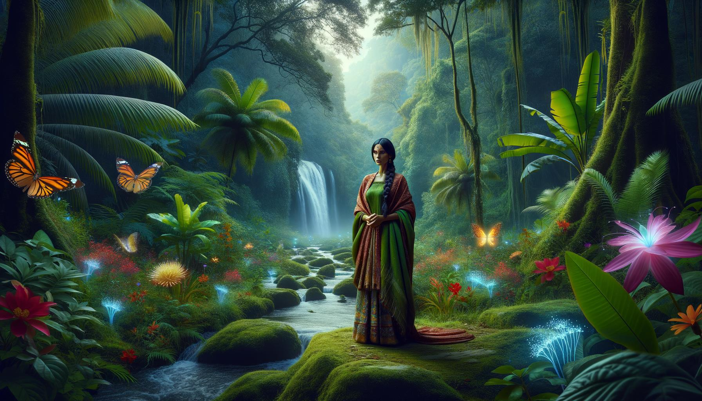
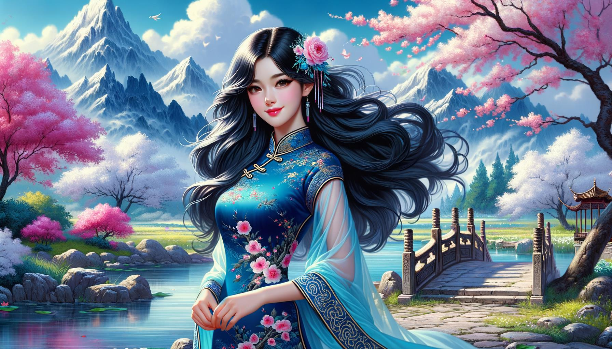
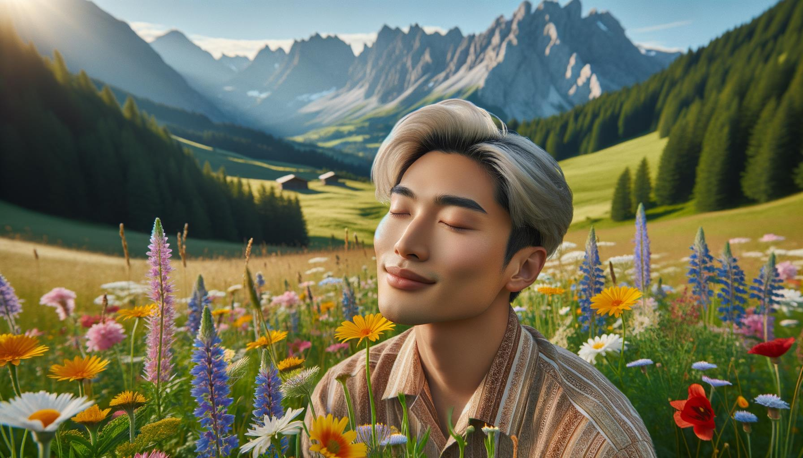
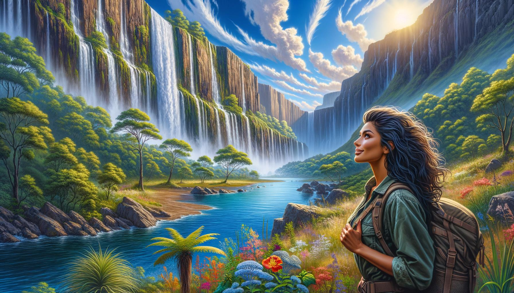

# Belle Persone e Luoghi

Questa pagina contiene 100 immagini generate da DALL-E 3 utilizzando il seguente codice nel febbraio 2024 per scopi di test

https://github.com/nao7sep/yyGptLib/blob/main/yyGptLibConsole/Tester3.cs

## Serenità Tropicale: Una Signora Vivace Tra la Spiaggia al Tramonto e le Palme Ondeggianti

Genera un'immagine di una attraente donna nera, con lunghi riccioli di capelli marroni che cadono sulle sue spalle, in un ambiente sereno. Indossa un abito da sole giallo, il suo sorriso è ampio e vibrante. Attorno a lei, il paesaggio che si svolge è una spiaggia tropicale mozzafiato. Le palme cariche di cocchi si dondolano dolcemente nella brezza marina. Il sole sta sprofondando all'orizzonte, diffondendo un'esplosione di tonalità rosate e albicocca nel cielo. Isole lontane e barche a vela in crociera sono appena visibili nella luce calante. Onde cristalline si infrangono ritmicamente contro la sabbia bianca immacolata, creando una sinfonia armoniosa della natura

## Tramonto di Fiori di Ciliegio: Una Radiosa Bellezza Nella Serenità Fiorita

Una scena visivamente sorprendente che mostra una donna nera con lunghi capelli ricci e occhi vivaci e coinvolgenti che sta sotto i rami rigogliosi di un albero di ciliegio in fiore. Il sole sta tramontando, gettando una luce dorata sui petali dei fiori e sulla pelle radiosa della donna. Indossa un fluido vestito estivo bianco e il suo cappello a tesa larga è delicatamente inclinato da un lato. Il dolce profumo dei fiori di ciliegio riempie l'aria, creando un'atmosfera serena e tranquilla. Quest'immagine affascinante cattura l'essenza della bellezza sia della persona che del luogo

## Bellezza Mediorientale tra una Serenata al Tramonto in un Splendore Rurale in Fiore

Un'illustrazione di una bellissima donna medio-orientale con lunghi capelli neri ricci e occhi marroni, che indossa un abito tradizionale vibrante e colorato, che si trova in uno scenario rurale mozzafiato. Il paesaggio intorno a lei presenta verdi colline rigogliose, un piccolo, sereno lago blu che riflette il cielo, un pittoresco ponte di pietra che attraversa il lago e un boschetto di alti, mature alberi di ciliegio in piena fioritura. Il sole sta tramontando sullo sfondo, proiettando lunghe ombre e dipingendo una vibrante gamma di densi colori caldi attraverso il cielo

## Serenità al Tramonto con una Bellezza Mediorientale nella Foresta Incantata

Una scena affascinante con una bellissima donna mediorientale dai capelli lunghi e mossi, vestita con un abito leggero e arioso. Si trova in mezzo a una foresta rigogliosa e tranquilla con un tappeto vivace di fiori selvatici, alberi antichi e maestosi, e un rilassante ruscello che scorre nelle vicinanze. Il sole è basso nel cielo, proietta ombre lunghe e calde, esaltando la bellezza naturale del paesaggio

## Elegante Eleganza Sud Asiatica in un Giardino Giapponese Baciato dall'Autunno

Una elegante donna sud-asiatica in abiti tradizionali elaborati, passeggiando in un sereno giardino giapponese durante un radioso pomeriggio autunnale. La luce del sole filtra attraverso il fogliame rosso e oro, proiettando ombre chiazzate su un sentiero di ciottoli. La tranquillità del luogo è ulteriormente accentuata da un laghetto di carpe koi con vivaci pesci arancioni, e un piccolo ponte di legno che lo attraversa. Gli alberi di ciliegio aggiungono un tocco di rosa delicato al paesaggio

## Scena Serena di una Riva del Fiume con Bellezza Tradizionale del Medio Oriente tra Fiori Selvatici in Fiore e Ponte Rustico

Genera un'immagine serena di una elegante donna del Medio Oriente con occhi nocciola e capelli scuri che scendono graziosamente lungo la sua schiena, adornata da un abito tradizionale ricamato a colori. È seduta vicino alla riva di un tranquillo fiume azzurro. Rigogliosa vegetazione prospera nei dintorni, con alberi alti che toccano il cielo e le loro foglie formano pattern con la luce del sole che filtra attraverso. Splendidi fiori selvatici sbocciano in gruppi, mentre farfalle svolazzano vicino ad essi. Oltre il fiume, il paesaggio si estende in verdeggianti colline sotto un cielo sereno e pieno di nuvole. Un piccolo pittoresco ponte di legno si curva sopra il fiume più a valle. L'intera scena emana pace e bellezza

## Signore del Sud Asia in Abbigliamento Vivace in Mezzo a un Prato in Fiore, Echi del Pomeriggio

Crea un'immagine che raffigura un uomo di mezza età di origine sudasiatica, con un sorriso caloroso, vestito con abiti tradizionali dai colori vivaci. È situato in un prato pittoresco durante il tardo pomeriggio, con fiori selvatici di ogni tonalità in fiore attorno a lui e rigogliosi alberi verdi sullo sfondo. I raggi del sole filtrano attraverso le foglie degli alberi, proiettando ombre chiazzate sull'erba. Un ruscello scintillante serpeggia attraverso il prato, contribuendo all'ambiente sereno

## Eleganza Mediorientale nel Cuore di un Etereo Bosco

Immagina una scena mozzafiato in una foresta eterea, bagnata da un delicato gioco di luce che si fa strada attraverso le lussureggianti foglie verdi. Al centro di questo scenario pittoresco si trova una donna di discendenza medio-orientale, i suoi occhi brillano di saggezza e tranquillità. È vestita con un abito fluente tinto con colori vivaci, che si fondono in armonia con la natura circostante. I suoi capelli, sistemati in una corona di trecce, evocano un senso di serenità ed eleganza. Con il rilassante ronzio della foresta attorno a lei, ha un sorriso sereno, che cattura perfettamente un momento di pace e bellezza

## Serenità del Sud Asia in un Giardino Giapponese

Crea un'immagine di una donna sudasiatica con caldi occhi marroni e capelli neri come il getto, vestita con una tunica dai colori vivaci. È seduta su un tappeto intrecciato vibrante, leggendo un grosso libro antico. È circondata da un sereno e rigoglioso giardino giapponese, il profumo degli alberi di ciliegio in fiore riempie l'aria. Un piccolo ponte di pietra si estende su uno stagno di carpe koi, riflettendo la luce del sole del pomeriggio. Una leggera brezza fa frusciare le foglie di bambù, creando una morbida melodia naturale

## Tramonto Sereno con una Tradizionale Bellezza dell'Est Asiatico sul Fiume Scorrevole

Un'immagine affascinante che raffigura una scena bellissima. In dettaglio, visualizza una donna dell'Est asiatico elegantemente vestita in abiti tradizionali che si trova accanto a un fiume che scorre. La location è circondata da una vegetazione rigogliosa segnata da alberi con fiori vivaci e multicolori. Il sole tramonta in lontananza, inondando la scena con un caldo bagliore dorato. La donna ha un sorriso radioso sul volto, che mostra beatitudine e serenità. Il suo sguardo è diretto verso il fiume silenzioso, che riflette il tramonto mozzafiato e il paesaggio verdissimo. L'intera scena è calma, tranquilla e straordinariamente bella

## Ritiro Sublime per Lettori al Tramonto nel Giardino dei Fiori di Ciliegio

Un'immagine di un affascinante uomo sudasiatico con un sorriso gentile, vestito in modo casual. È seduto su una panchina di legno, assorto nella lettura di un libro. Si trova in un tranquillo giardino pubblico pieno di fiori di ciliegio in fiore, pittoreschi sentieri di pietra che si snodano attraverso una lussureggiante vegetazione, e una classica recinzione in ferro battuto che circonda il giardino. Per completare la scena, nelle vicinanze si può vedere un piccolo stagno tranquillo che riflette i vivaci colori del cielo durante un tramonto

## Alba Serena nel Prato Una Donna del Sud Asia in Abito Tradizionale Circondata dalla Bellezza della Natura

Creare un'immagine che raffigura una donna del sud asiatico con un sorriso radioso, vestita con abiti tradizionali, circondata da un prato incantevole all'alba. Il prato è decorato con una rigogliosa vegetazione, fiori e un tranquillo ruscello che scorre silenziosamente nelle vicinanze, suscitando un senso di pace e serenità. Il sole è sul punto dell'orizzonte, proiettando tonalità morbide e calde di rosa e arancione attraverso il paesaggio panoramico. La donna si trova vicino al ruscello con un senso di gioia e tranquillità che emana da lei

## Incanto Primaverile di una Sirena del Sud Asiatico in un Giardino Giapponese

Un'immagine affascinante che ritrae una donna del Sud Asia sulla trentina con lunghi capelli scuri, vestita con abiti tradizionali vibranti. Si trova in una location incantevole, un giardino giapponese in piena fioritura durante la primavera, con alberi di ciliegio che perdono i loro petali rosa intorno a lei, e un tranquillo e sereno stagno vicino. La morbida luce del sole che filtra attraverso il fogliame getta una luce sognante e serena su tutta la scena, mettendo in risalto i colori vivaci del suo abbigliamento e la bellezza naturale che la circonda

## Grazia Medio Orientale tra Spettacolo Autunnale in un Immacolato Crepuscolo di Valle

Crea un'immagine di una affascinante signora del Medio Oriente con capelli ondulati e un sorriso grazioso. Lei si trova in una località mozzafiato - una rigogliosa valle verde con un fiume di acqua cristallina che scorre attraverso. Attorno a lei ci sono alberi alti con foglie autunnali luminose e colorate, che riflettono sul fiume. In lontananza, si possono vedere montagne coperte di neve su uno sfondo di un cielo blu chiaro, che contribuiscono alla bellezza complessiva del paesaggio. Il sole sta tramontando, aggiungendo una tonalità dorata alla valle e creando un'atmosfera serena e tranquilla

## Tramonto Sereno: Eleganza Sud Asiatica con Vista sulla Foresta

Una scena sbalorditiva che presenta una bellissima donna del Sud Asia con lunghi capelli neri fluenti, vestita di un sari tradizionale, in piedi su una scogliera che domina il panorama mozzafiato di una lussureggiante foresta verde in lontananza. Il vento tira delicatamente i colori vibranti del suo sari e i suoi capelli mentre guarda verso la vista serena, il suo viso illuminato dal bagliore soffuso del sole al tramonto. Un piccolo ruscello scintillante si snoda attraverso la foresta, riflettendo le brillanti tonalità del tramonto. Il silenzio tranquillo dell'area è palpabile, contribuendo alla sensazione generale dell'ambientazione serena e idilliaca

## Elegante donna del Medio Oriente in mezzo a un giardino in fiore al crepuscolo

Un ritratto sorprendente di una donna di origine medio-orientale, vestita con abiti eleganti, in piedi in mezzo a un paesaggio scenografico. Si trova su un sentiero acciottolato che si snoda attraverso un bellissimo giardino pieno di fiori vivaci e in fiore di vari colori. Ci sono alberi antichi e maestosi che forniscono un'ombra abbondante e, dietro di lei, una pittoresca catena montuosa si erge maestosamente in lontananza, bagnata dalla luce dorata del tramonto

## Graziosa Bellezza sul Lago al Tramonto

Illustrate una deliziosa scena con una figura femminile elegante di discendenza nera, che posa graziosamente all'aperto in un tranquillo ambiente naturale. Potrebbe stare in piedi accanto a un lago blu calmo con lo sfondo di imponenti montagne verdi sotto un cielo azzurro e limpido. Il sole sta tramontando, fornendo una luce calda e delicata, dipingendo la scena in delicate tonalità pastello. È vestita con un vestito estivo bianco, i suoi capelli in lunghi ricci fluenti, aggiungendo una nota di bellezza senza tempo a tutta l'immagine

## Solitudine al Crepuscolo nel Deserto: Armonia tra Uomo e Natura nelle Sfumature del Tramonto

Immagina una scena mozzafiato al tramonto. Al centro di questo spettacolo si erge una figura maschile mediorientale, che apprezza i colori ipnotizzanti del sole che tramonta e si fondono perfettamente con le sfumature arancioni delle dune del deserto. Le sabbie leggere come piume, riscaldate dal sole durante tutto il giorno, emanano un calore delicato che sembra fare eco alla serenità calma sul volto dell'uomo mentre osserva la tela affascinante della natura. Mentre gli ultimi raggi del sole illuminano il suo volto, il vento gioca delicatamente con i suoi capelli scuri, aggiungendo il tocco finale a questo notevole ritratto di un uomo e della natura in armonia

## Serenità del Sud Asia Tra le Sfumature della Foresta Pluviale e la Cascata Scrosciante

Crea un'immagine affascinante di una donna sudasiatica in piedi in una radura surreale e tranquilla in una lussureggiante foresta pluviale. È vestita con abiti tradizionali, i suoi capelli scuri sono intrecciati e sprigiona un senso di calma e pacatezza. La foresta circostante è piena di vegetazione tropicale vibrante di varie sfumature di verde e spolverata di fiori esotici dai mille colori. Una cascata ipnotizzante che cade sullo sfondo aggiunge serenità alla scena e una famiglia di farfalle luminescenti che volteggiano intorno aggiunge un tocco di fantasia al paesaggio

## Serenità e Bellezza Tra i Fiori di Ciliegio: un'Eleganza Sud Asiatica nel Giardino Giapponese

Crea un'immagine accattivante di una donna del sud asiatico che si trova in un tranquillo giardino giapponese durante la stagione dei fiori di ciliegio. Indossa un kimono tradizionale nei vividi colori del blu e oro, con realistici motivi di crisantemi e pavoni. La donna è colta in una posa calma, serena, ammirando la densa nevicata di pallidi fiori di ciliegio che riempiono il cielo e spazzano il terreno attorno a lei. Un piccolo ruscello scorre nelle vicinanze, con il delicato riflesso dei fiori di ciliegio sulla sua superficie. Le tradizionali lanterne di pietra aggiungono un tocco di tranquilla eleganza alla scena

## Eleganza Orientale nel Tranquillo Tramonto Italiano

Una donna asiatica orientale di straordinaria bellezza, con lunghi capelli neri che ondeggiano dolcemente al vento, si erge in mezzo a un tranquillo paesaggio di campagna italiana al tramonto. Porta un tradizionale vestito bianco, i suoi occhi risplendono di calore e gioia. La circondano verde rigoglioso, vigneti e case rustiche nascoste tra le colline, bagnate nella calda luce dorata del sole al tramonto. Questa scena serena trasmette calma e bellezza, creando un'immagine di armoniosa coesistenza tra natura e umanità

## Tramonto Sereno: Una Bellezza Ispanica in Lavanda e Blu tra Colline Smeraldo Ondulate

Crea un'immagine di una donna ispanica con lunghi capelli sinuosi e un sorriso radioso. Lei è in piedi in un paesaggio sereno e mozzafiato durante il tramonto. Il luogo è caratterizzato da dolci colline di smeraldo sotto un cielo color lavanda. Un'attenzione eccezionale dovrebbe essere prestata al suo abbigliamento - un elegante abito estivo fluttuante in tonalità di lavanda e blu reale che complementa l'affascinante scenario

## Bel uomo mediorientale abbraccia la serenità di un lussureggiante paesaggio al tramonto

Genera un'immagine di un affascinante uomo medio-orientale, con capelli scuri e mossi, vestito con abiti casual, che si trova in mezzo a un paesaggio affascinante. Questo paesaggio è un luogo sereno con una vegetazione rigogliosa, un fiume luccicante che si snoda lentamente e una maestosa catena montuosa adorna l'orizzonte. Il cielo sopra di lui è dipinto con le sfumature di un tramonto, che getta una luce eterea sulla scena. Lì, questo individuo sta osservando la natura mozzafiato che lo circonda, un sorriso contento illumina il suo volto, incarnando la bellezza della pace circostante

## Eleganza al Crepuscolo Accanto al Lago Turchese

Un'immagine pittoresca di una elegante donna mediorientale con lunghi capelli neri, che indossa un vivace abito rosso. Si trova ai margini di un sereno lago turchese, circondata da una fitta foresta che mostra tutte le sfumature del verde. Il sole sta tramontando sullo sfondo, proiettando una calda luce dorata su tutto il paesaggio, creando un'atmosfera serena e bellissima

## Principessa Crepuscolare Eterea nel Deserto in un Paesaggio Incantato

Crea un'immagine di una donna medio-orientale affascinante ed eterea che si erge in mezzo a un incantevole paesaggio naturale. È adornata con un turbante vibrante dettagliato con bellissime gemme e intricati modelli. Il suo abbigliamento è un abito fluente e colorato che riflette le tonalità del sole che tramonta attorno a lei. Il paesaggio presenta varie tonalità di arancioni, viola e rosa mescolati con il cielo ceruleo. Montagne maestose si ergono sullo sfondo, coperte da un pizzico di neve e il primo piano è punteggiato da un ruscello luccicante che serpeggia attraverso campi rigogliosi, creando una scena che esprime tranquillità e una bellezza mozzafiato

## Serenità del Sud Asia in un Prato al Tramonto

Un'immagine di un individuo affascinante, un uomo sudasiatico sulla trentina, con capelli di media lunghezza e un dolce sorriso sul volto. È vestito in abiti casual e comodi ed è situato in un luogo altrettanto affascinante. Questo ambiente è un tranquillo prato bagnato dalla luce dorata del sole al tramonto. Alberi alti e graziosi incorniciano la scena, le loro foglie sussurrano dolcemente al vento. Montagne lontane adornano l'orizzonte, le loro cime baciati dagli ultimi raggi del sole. I suoni sereni della natura riempiono l'aria, dipingendo una scena di tranquillità e bellezza

## Sorriso Radioso in un Prato Dorato: Una Donna del Medio Oriente Tra un Tramonto Etereo e Vette Montuose

Immagina l'immagine di una donna medio-orientale graziosamente composta in un luogo panoramico mozzafiato. Sfoggia un sorriso radioso e occhi marroni scintillanti che emanano calore. È vestita con abiti tradizionali colorati, la testa adornata con una bella sciarpa a motivo. Il luogo in cui si trova è etereo, immerso nella morbida tonalità dorata del sole al tramonto. È un prato, lussureggiante ed etereo, con fiori selvatici vibranti che ondeggiano nella brezza leggera. In lontananza, si possono scorgere maestose cime montuose baciati dagli ultimi barlumi di luce del giorno

## Serenità Autunnale: un'Eleganza dell'Asia Meridionale in un Giardino Giapponese

Genera un'immagine di una donna sudasiatica in abiti tradizionali che si trova con grazia in un sereno giardino giapponese durante l'autunno. I colori del giardino contrastano con il suo abbigliamento tradizionale brillante. La si vede ammirare la fusione di tonalità autunnali intorno a lei, con aceri che perdono foglie rosse croccanti, una graziosa lanterna di pietra sullo sfondo e un tranquillo stagno di carpe ai suoi piedi

## Crepuscolo Tranquillo in un Prato del Medio Oriente

Una scena tranquilla di una donna del Medio Oriente, che siede pacificamente all'ombra di un vecchio albero nodoso. Appare radiosa nel suo colorato abito tradizionale. La location è un prato incantato, riempito di fiori selvatici vibranti. Il sole tramonta, gettando una serena tonalità dorata sul paesaggio. In lontananza ci sono maestose montagne innevate. Una leggera brezza agita i petali dei fiori, creando un'atmosfera dolce e calmante

## Elegante Bellezza Tra Radiosità Tropicale e Serenità della Cascata

Una affascinante donna di colore con i capelli ricci, indossa un abito elegante, si trova su un sentiero che si snoda attraverso una lussureggiante foresta tropicale. Uccelli esotici dai colori vivaci sono posati sugli alberi vicini. In lontananza, una maestosa cascata scende da una rupe, producendo una colonna sonora serena per questo tranquillo scenario. I raggi del sole penetrano la chioma degli alberi, proiettando ombre chiazzate e illuminando l'abbondante vegetazione con un bagliore dorato

## Serenità Estiva su un Costone del Medio Oriente

Una foto di un uomo mediorientale che barcolla sugli scogli di una splendida scogliera che domina il mare azzurro. È vestito con un abbigliamento estivo semplice ma accattivante - una camicia pastello con bottoni, pantaloncini kaki e infradito - che esalta il suo aspetto chic senza sforzo. I suoi occhi riflettono la bellezza della scena serena che si svolge davanti a lui. Il sole che fa capolino attraverso le nuvole sparse dipinge un incantevole gioco di luci e ombre sulle acque limpide e pulite. Momenti fugaci di tranquillità come questo sono vere benedizioni

## Eleganza Mediorientale al Tramonto presso l'Oasi

Crea un'immagine che raffigura una donna mediorientale in un ambiente spettacolare. È vestita con eleganza, che racchiude il tradizionale abbigliamento mediorientale con influenze moderne. Si trova vicino a un lussureggiante oasi verde, il sole sta per tramontare e proietta una sovrannaturale tonalità arancione e dorata sul paesaggio. Nelle vicinanze si trova un corpo d'acqua scintillante e tranquillo, possibilmente un piccolo lago, che riflette lo scenario pittoresco e il cielo che si sta rapidamente oscurando, pieno di stelle. La tranquillità dell'ambiente e la sua espressione serena emanano un'aura di pace e soddisfazione

## Sguardo di Smeraldo nel Cuore della Foresta Pluviale

Un'immagine di una bellissima donna nera con lunghi capelli intrecciati e occhi verdi smeraldo, che posa con sicurezza in una location impressionante. L'ambientazione è una lussureggiante foresta pluviale tropicale, piena di fogliame vibrante e fiori esotici brillanti. I colori attorno a lei sono vibranti e vividi, con la luce del sole che filtra attraverso la chioma degli alberi, proiettando affascinanti modelli sul pavimento della foresta. Si può vedere una cascata a cascata sullo sfondo, la sua acqua luccica sotto la luce del sole, creando un'atmosfera serena e tranquilla

## Serenità mediorientale in un lussureggiante Eden floreale sotto la luce dorata del sole

Ritrai una donna mediorientale con lunghi capelli ricci, in un rigoglioso giardino verde pieno di fiori multicolori. Indossa un abito pastello fluttuante ed è seduta su una panca di ferro battuto ornamentata sotto un ciliegio in fiore, assorta nella lettura di un romanzo in stile vittoriano. Il sole sta tramontando, gettando una calda luce dorata sulla scena. Si possono vedere pavoni nello sfondo, che si muovono liberamente. La tranquillità e la bellezza panoramica del luogo sono veramente affascinanti

## Artista mediorientale in una colorata strada del Sud Asia al tramonto

Crea un'immagine di un affascinante artista maschio del Medio Oriente in piedi in una pittoresca strada del Sud dell'Asia piena di edifici colorati e vibranti. Indossa una tradizionale kurta, tiene un pennello in mano. Una leggera brezza soffia, facendo frusciare i suoi vestiti. Il sole sta tramontando, gettando una calda luce arancione sulla scena

## Eterea Tranquillità: La Solitudine Contemplativa dell'Uomo Asiatico presso il Lago Alpino

Una scena eterea che presenta un attraente uomo asiatico con tratti eleganti, comodamente seduto su una roccia vicino a un sereno lago alpino. L'uomo è vestito con abiti casual alla moda, e il suo contegno contemplativo indica un senso di pace e tranquillità. L'area circostante è magnifica, con imponenti montagne innevate che si riflettono sulla superficie vetrata del lago, e rigogliosi sempreverdi sparsi intorno. L'acqua serena, l'aria fresca e pulita, e il lieve svolazzare degli uccelli alpini creano un senso di tranquillità e armonia con la natura

## Serenità Mistica nella Foresta del Medio Oriente

Una splendida rappresentazione di una donna mediorientale, con i suoi lunghi capelli castani che le cadono riccadamente sulle spalle, si trova in un ambiente mozzafiato. È in mezzo a una foresta serena interspersa da alberi maestosi e fiori vivaci e in fiore, con una cascata fluttuante sullo sfondo. La luce filtra attraverso il fogliame verde gettando un pattern diffuso sul suo viso. Indossa un vestito lungo e vivace che ondeggia con la brezza leggera. Guarda le lontane montagne all'orizzonte, con un'espressione di pace e soddisfazione sul volto

## Donna in abito arancione che abbraccia il tramonto nelle colline ondulate

Un pittoresco paesaggio si svolge con dolci valli e un tramonto spettacolare che satura il cielo con sfumature di rosso, arancione e viola. In questo luogo pieno di meraviglia, una donna asiatica con capelli scuri raccolti in un morbido chignon, si sofferma ad osservare la scena. È vestita con un abito estivo arancione, il tessuto morbido risuona i colori del tramonto. Il suo sorriso radioso trasmette un senso di pace e soddisfazione, mentre gode della bellezza naturale che la circonda. Una leggera brezza gioca con il suo abito e i capelli, contribuendo a creare un'atmosfera serena

## Bellezza Ispanica Sotto un Albero di Ciliegio tra Paesaggi Maestosi

Un'immagine visivamente stupefacente di una donna ispanica, con capelli castani fluenti, occhi nocciola scintillanti e indossando un vestito estivo che riposa con nonchalance all'ombra di un albero di ciliegio in fiore. La circonda un paesaggio mozzafiato di un prato verde rigoglioso punteggiato di fiori selvatici, un tranquillo lago azzurro in lontananza e montagne con cime innevate sotto un cielo azzurro cristallino

## Eleganza ed Esplorazione Una Donna del Sud Asia in Abbigliamento Streetwear Vivace in un Sereno Contesto Costiero

Un'immagine sorprendente di una donna del sud dell'Asia, vestita in eleganti abiti da strada, in piedi in un luogo stupendo. Immaginatela in mezzo a pergolati fioriti che si innalzano, sotto un cielo luminoso e soleggiato. Tiene in mano una borsa alla moda, gli occhi colmi di curiosità, esplorando la bellezza intorno a lei. Il paesaggio presenta un sentiero di ciottoli che conduce verso un vasto oceano blu in lontananza, con una lussureggiante vegetazione su entrambi i lati. Il luogo emana un'atmosfera serena, completata da una tavolozza di colori completa di pastelli delicati e toni vibranti che evocano la freschezza di una mattina di primavera

## Bellezza Mediorientale in Abiti Tradizionali tra Verdeggianti Verdi e Cascata al Tramonto

Crea un'immagine dettagliata di una affascinante donna mediorientale con un sorriso caloroso, vestita con abiti tradizionali colorati, in un ambiente incantevole. L'ambiente è costituito da una vegetazione lussureggiante, una cascata scrosciante sullo sfondo e fiori in una miriade di colori. Un tranquillo ruscello scorre accanto a lei, e c'è un sereno e vibrante tramonto all'orizzonte, che proietta deliziosi toni pastello attraverso il cielo

## Sorriso Radioso in una Foresta Smeraldo: Bellezza del Sud Asiatico in Magenta che Adorna la Volta della Natura

Una bellissima scena che mette in evidenza una donna del Sud Asia con un sorriso radioso, che indossa un tradizionale abito magenta brillante, in piedi in una foresta lussureggiante e bellissima. Il suolo della foresta è adornato da foglie cadute di vari colori, e la luce del sole filtrata si riversa attraverso gli alti alberi maestosi. L'aria è piena dei suoni tranquilli della natura, uccelli che cinguettano, e una brezza leggera che fruscia tra le foglie. Questa ambientazione pittoresca è ulteriormente valorizzata da una cascata distante che si riversa su rocce muschiose, il cui suono calmante si fonde con la sinfonia della foresta

## Elegante Grazia in una Splendida Scena di Giardino del Sud Asia

Una scena affascinante in una location pittoresca. Immagina una donna del Sud Asia, distintiva per la sua grazia e il notevole carisma. Il suo abbigliamento è un vibrante sari pieno di modelli intricati e texture ricche. Lei si erge alta, la sua postura risplende di eleganza. L'ambientazione è un giardino allettante, lussureggiante e splendente - immergiti nella tranquilla sinfonia di uccelli che cinguettano, fiori in fiore con vividi colori di blu e rosa e le foglie fruscianti di alberi maestosi. Forse c'è un ruscello che gorgoglia dolcemente nelle vicinanze, che proietta melodie flautate in questo ambiente sereno. Una visione davvero mozzafiato!

## Esploratore del Medio Oriente nella Splendida Natura: Tranquillità sulla Colorata Costa

Un'immagine di una persona di origine medio-orientale con un aspetto di genere neutro. Si trova in una posizione naturalmente stupenda, circondata da una vegetazione lussureggiante e fiori selvatici colorati. In lontananza, un oceano blu brillante abbraccia la costa rocciosa. Il cielo è di un brillante tono di azzurro, spruzzato con sfumature di rosa tenue dal sole al tramonto. La persona indossa abiti comodi e alla moda, e sta guardando il panorama con un'espressione di pace e contentezza, godendo appieno della serenità e della bellezza del luogo

## Eleganza Mediorientale con Vista su una Città Costiera al Tramonto

Immagina un'immagine di una bellissima donna medio-orientale sui suoi trent'anni, in piedi su un balcone squisitamente decorato che si affaccia su una tranquilla città costiera al tramonto. Indossa un elegante abito azzurro lungo e fluttuante, i suoi capelli corvini e ricci sono sciolti, dondolano dolcemente nella brezza. I suoi occhi marroni scuri guardano contemplativi in lontananza, riflettendo le brillanti sfumature del tramonto. La città sottostante è composta da edifici intonacati di bianco, rigogliose palme verdi, con strade acciottolate che si snodano verso il tranquillo mare azzurro oltre. Il cielo è una sommossa di arancio caldo, rosa e viola, il sole al tramonto spruzza i suoi radiosi raggi dorati sulla pittoresca città

## Grazia e Serenità Un'Eleganza Sudasiatica In Mezzo a un Paesaggio Vibrante Sotto Cielo al Tramonto Pastello

Crea un'immagine di una donna del sud asiatico in piedi in un paesaggio vivace e suggestivo. Esprime grazia e serenità, con i suoi occhi che riflettono compassione e gentilezza. I suoi capelli sono lunghi e legati liberamente sul retro. Indossa un vestito tradizionale semplice ma elegante che esalta la sua bellezza. Il paesaggio intorno a lei è mozzafiato, riempito di un prato fiorito che si estende verso una maestosa catena montuosa sotto un soffice cielo al tramonto pastello

## Tranquilla vivacità di un avventuriero del Sud dell'Asia al tramonto

Un'immagine affascinante che mostra un bellissimo paesaggio naturale con colline ondulate, un lago cristallino e un tramonto vibrante che colora il cielo. In primo piano, un uomo sudasiatico di corporatura atletica si trova tranquillamente, vestito con abiti da esterno confortevoli. Il sorriso inciso sul suo viso eleva solo la tranquillità e il fascino complessivi del ritratto scenico

## Bellezza mozzafiato tra storia e natura nel Medio Oriente

Una donna del Medio Oriente visivamente affascinante, che si trova in una posizione che suscita stupore. Ha occhi scuri espressivi e lunghi capelli nero corvino che ondeggiano nella brezza leggera. Il suo abbigliamento tradizionale è un ricco mix di colori, con intricati disegni che testimoniano l'abbondante cultura della regione. Il luogo è altrettanto magnifico, con altissime architetture antiche che suggeriscono una storia complessa, meravigliosamente contrastate da parchi rigogliosi e tranquille distese d'acqua che luccicano sotto la luce dorata del sole. Ovunque lo sguardo si smarrisca, c'è il luccichio della vita - nel petalo di un fiore, nel battito di un uccellino, o nel silenzioso sussurro del vento

## Tramonto Sereno: Una Donna del Sud Asia che Gusta la Tranquillità in una Campagna Colorata

Crea un'immagine dettagliata che mostra una donna sudasiatica che assapora la tranquillità di un ambiente spettacolare. È posizionata in una campagna rigogliosa e vasta, riempita di campi vibranti di fiori selvatici che ondeggiano nella brezza leggera. Sopra di lei, un cielo stupendo si trasforma dal blu a sfumature di oro e rosa mentre il sole tramonta sull'orizzonte. Indossa un abbigliamento tradizionale confortevole, con un sorriso di serenità sul suo volto unito a un pizzico di gioia, riflettendo la vera bellezza del suo ambiente circostante

## Eleganza del Sud Asiatico al Crepuscolo del Loto Pond

Crea un'immagine di una donna del sud dell'Asia con lunghi capelli ondulati, vestita con un abbigliamento tradizionale colorato, in piedi su un ponte che sovrasta uno sereno stagno di loto. La scena è avvolta nella calda luce del tramonto, che dipinge il cielo in sfumature di viola, arancione e rosso. L'acqua calma riflette i colori vibranti del cielo e le ninfee galleggiano dolcemente sulla superficie dell'acqua. A breve distanza, delle tradizionali lanterne di pietra segnano il percorso lungo lo stagno, la loro luce soffusa contribuisce all'atmosfera tranquilla. A completare la scena, alberi di ciliegio in piena fioritura delimitano lo stagno, i loro petali creano un delizioso tappeto rosa a terra

## Eleganza Sud Asiatica Tra Cascate Baciati dall'Arcobaleno e Verdi Rigogliosi

Una scena visivamente accattivante con una donna sudasiatica che si trova vicino a una cascata maestosa. Indossa un abito tradizionale vibrante, i cui colori completano la lussureggiante vegetazione circostante. Il suo volto è illuminato dalla morbida luce naturale filtrata attraverso gli alberi vicini. La cascata scende con un'intensità graziosa, inviando una delicata nebbia nell'aria che rifrange la luce del sole e forma un arcobaleno. La scena è pacifica, serena e rigogliosa di vita, mostrando davvero la meraviglia della natura e la bellezza della diversità

## Eleganza Eterea in un Lussureggiante Giardino del Medio Oriente

Una elegante donna del Medio Oriente, con capelli scuri e fluenti e profondi occhi marroni, si rilassa in un sereno e lussureggiante giardino. La luce del sole filtra attraverso il verde fogliame, illuminando i vivaci fiori che la circondano. Una leggera brezza scompiglia i suoi vestiti, aggiungendo un tocco etereo. Nelle vicinanze, pavoni colorati camminano regalmente, le loro piume cangianti luccicano. Con un'espressione pacifica, si perde nella bellezza della natura che la circonda

## Serenità del Tramonto Mediorientale tra Armonia Floreale e Maestose Montagne

Un'affascinante scena di una donna mediorientale con lunghi capelli neri lucenti, comodamente vestita con una veste fluttuante e fatta a mano. Si trova in una posizione tranquilla, circondata da lussureggiante vegetazione e vivaci fiori selvatici. Il sole sta delicatamente tramontando sullo sfondo, proiettando una calda luce dorata sul sereno paesaggio. Una tranquilla catena montuosa si erge in lontananza, aggiungendo alla bellezza scenica. Un'immagine dipinta con il pennello della tranquillità e serenità, un sublime interscambio tra natura e umanità

## Serena Rêverie di una Signora del Sud Asiatico Fra Pini Lussureggianti e Maestose Cime Nevose

Una scena suggestiva che presenta una donna del Sud Asia, con capelli mossi alla spalle, illuminata dalla luce soffusa del sole al tramonto. Indossa abiti tradizionali, osservando l'affascinante vista di un lago sereno, circondato da una lussureggiante foresta verde di alti pini. In lontananza, maestose montagne cime di neve si ergono alte sotto il cielo blu limpido. Questa scena tranquilla evoca un senso di calma, accentuato dall'espressione pacifica della donna e dai colori vibranti del paesaggio

## Maestosità del Medio Oriente tra lo Splendore del Tramonto e la Natura Vibrante

Crea un'immagine che metta in risalto una bellissima donna del Medio Oriente, con lunghi capelli scuri e occhi penetranti, vestita con abiti tradizionali. È posizionata in un ambiente panoramico circondato da una stupenda bellezza naturale. Questo include una cascata scrosciante nelle vicinanze, una vegetazione rigogliosa con varie piante vivaci. Il sole sta tramontando, proiettando un caldo bagliore arancione sulla scena, accentuando la flora fucsia e rossa. La persona si trova su un sentiero che serpeggia attraverso il paesaggio, inondato dai colori radiosi di un tramonto, rispecchiando la sua tranquillità pacifica

## Serenità dell'Alba in Zafferano Sopra l'Himalaya

Una affascinante donna del Sud Asia in piedi sullo sfondo del maestoso range montuoso dell'Himalaya, radiosa nei colori dell'alba. È elegantemente vestita con un sari color zafferano con ornamenti dorati. I suoi capelli scuri sono adornati con un tradizionale maang tikka. Una fresca brezza mattutina fa oscillare dolcemente i suoi capelli e il sari, aggiungendo un senso di movimento all'intera scena

## La Bellezza di Auburn Accoglie la Primavera in un Armonioso Giardino Asiatico

Crea un'immagine che mette in mostra una bellissima scena di un tranquillo giardino asiatico durante la primavera. Nella scena, troviamo una donna caucasica visualmente sorprendente che apprezza la bellezza che la circonda. È caratterizzata dai suoi lunghi capelli ramati mossi, occhi vibranti e un caloroso sorriso che testimonia la sua bellezza interiore. È elegantemente vestita con un mix di abiti moderni e tradizionali, simboleggiando un'armoniosa fusione di culture. Il giardino pullula di alberi di ciliegio in fiore, i cui petali cadono delicatamente, uno stagno di carpe koi e un classico ponte di legno, riflettendo la bellezza senza tempo dei paesaggi asiatici

## Serenità nella Serenata di Zaffiro Eleganza Cinese Tra i Fiori Ponte e Cime Nevose

Crea un'immagine di una affascinante donna dell'Est asiatico, con fluenti capelli nero corvino e dolci occhi gentili, che sfoggia un sorriso sereno. È elegantemente vestita in un tradizionale cheongsam cinese di colore blu zaffiro, adornato con ricami dorati. Dietro di lei c'è un vivace albero di ciliegio in fiore che soffia dolcemente nel vento, situato vicino a un vecchio ponte rustico in pietra che attraversa uno stagno calmo di gigli. Montagne maestose con cime innevate possono essere viste in lontananza sotto un cielo ceruleo con nuvole bianche e soffici che si muovono lentamente. Un'atmosfera di serenità e tranquillità avvolge questo scenario pittoresco

## L'eleganza del Sud Asiatico incontra il fascino europeo nel brillante bagliore della sera dorata

Un'immagine esteticamente piacevole di una donna sudasiatica di mezza età, vestita con un abito tradizionale vibrante, vicino a uno splendido sfondo di una storica città europea. Sta camminando lungo una strada acciottolata fiancheggiata da negozi pittoreschi. Il suo sorriso aggiunge alla bellezza della scena mentre ammira il fascino architettonico unico della città. Il dorato bagliore del sole serale aggiunge un tocco di magia all'atmosfera, proiettando lunghe ombre e riscaldando le strutture naturali e artificiali intorno. La scena cattura un senso di tranquillità e gioia

## Bagliore Etereo di una Graziosa Bellezza Mediorientale in un Giardino Vivace al Tramonto

Una straordinaria immagine di una donna del Medio Oriente che esprime grazia, elegantemente vestita con un abbigliamento tradizionale vibrante. Si trova in una location mozzafiato, un rigoglioso giardino pieno di flora diversificata in piena fioritura. Petali di colori vibranti ricoprono il suolo, e uno stagno sereno riflette il cielo, creando un incantevole mix di bellezza naturale. Il sole sta tramontando sullo sfondo, proiettando un'aura dorata che colora tutto con una luce calda e eterea

## Eleganza e Grazia nel Tramonto Dorato presso la Cascata Incantata

Una elegante donna del Sud Asia in un fluido sarong giallo si trova accanto a un uomo del Medio Oriente, vestito elegantemente in un casual abito blu. Sono situati in un paesaggio rilassante caratterizzato da una incantevole cascata che si riversa su rocce ricoperte di muschio e un lago cristallino che brilla nella soffusa luce del tramonto. L'atmosfera calma è ulteriormente intensificata dalla presenza di maestosi cipressi vecchi di 300 anni, mentre fiori selvatici vibranti punteggiano i dintorni, e uccelli dal piumaggio squisito svolazzano nel cielo

## Uomo del Medio Oriente Abbraccia la Tranquillità all'Alba in una Spiaggia Solitaria

Un affascinante uomo medio-orientale dal fisico robusto e dal sorriso caloroso è seduto con calma in una location incantevole. Il posto è una spiaggia tranquilla e appartata all'alba. La sabbia dorata si estende fino all'acqua cristallina che riflette i toni soffici e pesca del cielo del primo mattino. Deboli silhouette di alberi tropicali rigogliosi circondano la scena, aggiungendo un fascino sereno. L'atmosfera accogliente creata dalle onde gentili e dalla fresca brezza marina si abbina perfettamente al comportamento pacifico dell'uomo e alla sua autentica contentezza

## Grazia del Sud Asia al Crepuscolo sul Lago Tranquillo

Una scena serena si sviluppa con una donna del sud asiatico in piedi graziosamente accanto a un lago tranquillo. Il sole al tramonto infonde un'aura dorata nell'ambiente, illuminando il cielo con sfumature di arancione, rosa e viola. In lontananza, alte montagne innevate completano lo sfondo affascinante. La donna è vestita con un abito morbido color lavanda, che irradia calore e pace. I suoi occhi brillano di gioia, riflettendo la bellezza naturale della location. C'è un pontile di legno dietro di lei, che si addentra nelle acque calme del lago, e fiori selvaggi vibranti fioriscono sulle rive del lago, aggiungendo alla bellezza idilliaca di questa pittoresca ambientazione

## Sereno Riposo tra il Tramonto del Lago e il Paesaggio del Sud dell'Asia

Una affascinante scena di una donna del sud asiatico che riposa pacificamente sul bordo di un tranquillo lago, il suo riflesso si specchia sulla superficie vetrata dell'acqua. È vestita con un abito estivo semplice ma elegante, con i capelli sparsi dietro di lei contro lo sfondo di una rigogliosa vegetazione. Intorno a lei, il sole al tramonto dipinge esplosioni drammatiche di arancione e rosa nel cielo, proiettando una luce calda e serena sul pittoresco paesaggio. Ad una certa distanza, si possono vedere deliziose casette di legno, incastonate tra le colline ondulate che si estendono verso l'orizzonte

## Sguardo Nocciola nell'Oasi Verdeggiante Illuminata dal Sole

Un'immagine di un bell'uomo medio-orientale, con capelli scuri, una barba ben curata e occhi nocciola espressivi. Sta in piedi in un ambiente etereo, una foresta lussureggiante e vivida che fiorisce con alberi verdi, fiori colorati e un ruscello cristallino che brilla nella luce solare morbida. Dei raggi di luce penetrano attraverso la fitta chioma, proiettando dinamiche chiazze di luce e ombra, dando vita alla foresta. L'uomo è vestito con abiti casual e comodi, sembra rilassato e sereno, il suo volto illuminato dai raggi del sole, esprime un senso di pace e appagamento

## Grazia Sotto i Fiori di Ciliegio Un Ritratto Est Asiatico in Seta Blu e Serenità al Tramonto

Visualizza una donna dell'Est asiatico, posata con grazia mentre si trova sotto l'ombra tenue degli alberi di ciliegio in piena fioritura. I morbidi petali rosa cadono intorno a lei, indossa un delicato vestito di seta blu che complementa il suo incarnato, mentre i suoi lunghi capelli nero corvino sono legati indietro in un chignon lento. Lo sfondo esude la serenità di un tradizionale giardino del tè giapponese, con una lanterna di pietra parzialmente nascosta tra la flora, cespugli ben rifilati e un piccolo stagno che rispecchia lo scenario pittoresco. Le dolci tonalità del tramonto dipingono questo tranquillo quadro con toni caldi

## Serenità all'Orizzonte: Il Sogno di una Donna Sud Asiatica al Tramonto

Una scena mozzafiato con una giovane donna del sud asiatico di corporatura media con i suoi capelli neri lucidi e setosi raccolti in una coda di cavallo. Si trova in cima a una collina verde, godendo dei rassicuranti raggi del sole al tramonto. Questo bellissimo paesaggio non è altro che un paradiso, con il mare azzurro che si estende fino all'orizzonte e gli uccelli marini che punteggiano il cielo sopra la linea costiera. La donna, che irradia un'aura di pace, guarda la vista mozzafiato con un senso di serenità, completando questo quadro di tranquillità e bellezza

## Affascinante uomo sudasiatico in una passeggiata al tramonto sulla spiaggia

Genera un'immagine di un uomo del sud asiatico con un sorriso affascinante, che indossa una camicia di lino bianco candido e pantaloni kaki. Sta passeggiando su una spiaggia sabbiosa al tramonto, l'orizzonte infuocato da sfumature di arancione e rosa. Le palme ondeggiano dolcemente sullo sfondo e il mare turchese lambisce giocoso i suoi piedi nudi

## Alba Tranquilla sul Fiume: Un'Eleganza Vittoriana tra Fiori di Ciliegio ed Echi di Montagna

Genera un'immagine in uno stile rilassante e pittorico che ricorda l'era romantica, con una donna asiatica in un abito vittoriano aderente, seduta accanto a un tranquillo fiume scintillante. Un sole mattutino sta sorgendo in lontananza, proiettando una luce morbida e calda sulla scena. I riflessi nell'acqua sono scintillanti, l'erba è lussureggiante e verde, e ci sono ciliegi in fiore che spargono petali con la brezza. La donna nella scena sta delicatamente tenendo un libro, persa nei suoi pensieri. Una maestosa montagna fa eco in lontananza, avvolta nella morbida nebbia, migliorando l'atmosfera serena

## Riflessioni Serene al Crepuscolo di una Bellezza del Sud Asiatico nella Natura

Un'immagine di una affascinante donna del sud asiatico, vestita con un abito tradizionale vibrante, in piedi in una foresta lussureggiante e pittoresca. C'è un lago placido nelle vicinanze che riflette l'incredibile tramonto dorato. La scena è serena con il canto degli uccelli serali che riempie l'aria e una brezza leggera che agita le foglie della foresta. Lei sta sorridendo dolcemente, i suoi occhi illuminati di gioia, mentre rimane affascinata dalla bellezza naturale che la circonda

## Uomo Mediorientale al Crepuscolo Serenità in mezzo a un Lussureggiante Bosco a Lago

Una affascinante rappresentazione di un uomo del Medio Oriente nel pieno della sua forza, in piedi sul bordo di un lago sereno al centro di una foresta rigogliosa. Le tonalità crepuscolari del sole al tramonto danzano sull'acqua calma, estendendosi verso gli alberi densi con le loro foglie smeraldo, creando un'armonia incantevole di colori. L'abito tradizionale dell'uomo risalta su questo sfondo, i dettagli del suo abito sono meticolosamente realizzati. La sua espressione tranquilla riflette la sua profonda connessione con l'ambiente naturale, contribuendo a una scena che è l'epitome della bellezza pacifica

## Donna asiatica allegra in un prato vivace al tramonto

Crea un'immagine di una donna asiatica sulla trentina, con i capelli castani ondulati fino alle spalle, occhi marroni profondi e un sorriso allegro sul viso. Lei è in piedi in un luogo pittoresco: un prato verde rigoglioso pieno di fiori selvatici di tutti i colori dell'arcobaleno, un ruscello blu scintillante serpeggia attraverso il prato e il sole sta tramontando in lontananza, dipingendo il cielo con sfumature di rosso, rosa e arancione

## Bagliore del Tramonto sul Lago Azzurro con Bellezza Fiorita

Un'immagine di una bellissima donna ispanica con lunghi capelli ondulati e un sorriso affascinante in piedi vicino a un lago blu azzurro con alberi verdi rigogliosi sullo sfondo e delicate fiori bianchi in fiore ai suoi piedi. Il sole proietta un bagliore dorato in tutta la scena, riflettendosi sulla superficie tranquilla del lago, e il cielo è una danza di pastelli al tramonto

## Armonia del Primo Mattino tra la Bellezza Alpina con Enigma di Discendenza Asiatica

Una scena visivamente accattivante in un ambiente pittoresco. Al centro, c'è un individuo attraente di discendenza asiatica con un look di genere neutro. Stanno godendo pacificamente della sublime bellezza del prato alpino circostante, abbondante di fiori selvatici vibranti. La scena è bagnata dalla delicata luce del sole del mattino presto che mette in risalto l'espressione di contentezza dell'individuo e il panorama mozzafiato intorno a loro

## Serenità sudasiatica al tramonto sulle sabbie costiere

Una affascinante donna del Sud Asia con la pelle olivastra, capelli lunghi e leggermente ricci, e occhi espressivi, vestita con un tradizionale saree, si trova sul bordo di un paesaggio mozzafiato. È una vista costiera panoramica e incontaminata, con acque azzurre che baciando dolcemente le sabbie dorate. Le palme si muovono dolcemente nella fresca brezza costiera e il sole sta iniziando a tramontare, gettando una luce calda e magica su tutto il scenario, rendendolo surreale e affascinante

## Eleganza che Irradia nel Giardino in Fiore: Una Storia del Collettore di Fiori e le Anatre Giocose

Una elegante donna ispanica con lunghi capelli castani ondulati sta camminando in un bellissimo giardino lussureggiante pieno di fiori vibranti e colorati in piena fioritura. Vestita con un abito bianco fluttuante, tiene in mano un piccolo cestino di vimini, raccogliendo fiori lungo il percorso. Una vecchia fontana di pietra, adornata di rampicanti fioriti, occupa il centro di questo giardino. È una giornata di sole luminoso, che aggiunge calore e luce a questo ambiente tranquillo, con una leggera brezza che di tanto in tanto scompiglia le foglie. Una famiglia di anatre nuota giocosamente in uno stagno nelle vicinanze, aggiungendo vita vibrante a questa scena serena

## Eleganza Tropicale: Una Bellezza Nera in un Paradiso di Foresta Pluviale

Un'immagine di una attraente donna nera con capelli ricci, che indossa un abito vibrante e fluttuante, in piedi in una location mozzafiato. La location è una lussureggiante foresta pluviale tropicale con altissime palme, una magnifica cascata che scende su rocce scogliose, e vibranti foglie verdi che brillano nella luce filtrata dal sole

## Grazia del Sud Asia tra l'alba accarezzata dalla tranquillità del lago

Un attraente uomo di origine sudasiatica indossando un tradizionale abito kurta, è seduto su una panchina di pietra di fronte a un lago sereno circondato da lussureggianti alberi di salice. Maestose montagne si ergono in lontananza sotto un cielo riempito dalle soffici sfumature di un'alba. Il riflesso della splendida scena forma un'immagine speculare sulla superficie tranquilla del lago, aggiungendo alla pura bellezza di questo luogo straordinariamente pacifico

## Bellezza Mediorientale che Abbraccia la Serenità del Tramonto su una Spiaggia Tranquilla

Una stupefacente rappresentazione di una donna del Medio Oriente, con i suoi occhi scuri affascinanti, in piedi in una location affascinante. La location è una spiaggia serena al tramonto. Il cielo è adornato di toni di rosso e arancione mentre le tranquille onde si infrangono dolcemente sulla riva sabbiosa. Indossa un vivace vestito estivo turchese che fluttua con la dolce brezza marina. I suoi capelli castani scuri si agitano dolcemente nel vento. Guarda verso l'orizzonte, un dolce sorriso sul suo volto suggerisce contentezza. Questa scena è un momento transitorio di bellezza naturale sia nell'ambiente che nell'individuo

## Bellezza ispanica che ammira una maestosa cascata nella selvaggia fioritura

Rappresenta un'immagine di una affascinante donna ispanica che si trova in un paesaggio mozzafiato. Sta ammirando una cascata che scende da un ripido precipizio in una limpida pozza d'acqua sottostante. Attorno alla pozza ci sono rigogliose piante selvatiche e una varietà di fiori vibranti. Ai lati della cascata, ripidi dirupi si estendono verso l'alto fino a sfiorare quasi il cielo blu. Soffici nuvole bianche sono sparse nel cielo, lasciando il sole splendere vivacemente sulla scena. La donna ha i capelli scuri e ricci, un fisico medio e indossa comodi abiti da trekking, i suoi occhi sono spalancati in ammirazione per la bellezza naturale che la circonda

## Altalena della Solitudine: Un Momento Pacifico di una Donna del Sud Asia Sotto il Cielo Tinto di Tramonto

Immaginiamo una scena serena che ritrae una donna del sud dell'Asia, profondamente immersa nella sua solitudine introspectiva. È seduta gioiosamente su un'altalena arrugginita appesa a una massiccia quercia. L'ambientazione è un tranquillo paesaggio di campagna durante le ore dorate del tramonto. Le tonalità vibranti del tramonto si diffondono nel cielo, proiettando lunghe, calde ombre. I campi circostanti coprono l'orizzonte mentre i fiori selvatici, colorati con una vibrante tavolozza di viola e giallo, ondeggiare delicatamente nella leggera brezza. L'aria è piena del dolce profumo dei fiori in fiore e del rassicurante cinguettio degli uccelli

## Passeggiata Tranquilla nel Bosco di una Serena Donna Est Asiatica in Mezzo allo Splendore Autunnale

Crea un'immagine di una bellissima donna dell'Est asiatico che passeggia con calma attraverso una foresta mozzafiato e tranquilla. I colori radiosi delle foglie autunnali contrastano con il muschio verde e le felci lungo il suolo della foresta. I raggi del sole filtrano delicatamente attraverso il fogliame, proiettando luce e ombre maculate in una danza affascinante, mentre un ruscello pacifico scorre dolcemente sullo sfondo. La donna, vestita con un abbigliamento da trekking comodo e alla moda, indossa un sorriso sereno, i suoi occhi trasmettono un senso di profonda soddisfazione e connessione con la natura

## Signora Serena della Foresta di Smeraldo

Una rappresentazione visivamente sorprendente di una donna dell'Est Asiatico, circondata da un paesaggio che incute rispetto. Stà in piedi, serena e sicura, il suo abito tradizionale si fonde armoniosamente con l'abbondante ambientazione. I dintorni sono dipinti con un dettaglio così vivido, quasi si può assaporare l'aria fresca. È un'oasi di serenità, con il cielo blu chiaro sopra, una foresta verde smeraldo incontaminata sullo sfondo, e un ruscello calmo e scintillante che scorre nelle vicinanze. Il ritratto è un connubio armonioso di semplicità della bellezza umana e della maestosità della natura

## Escursionista Ispanico Abbraccia la Serenità in una Lussureggiante Chioma Forestale

Una scena visivamente stupefacente che mette in risalto una donna ispanica in piedi in una foresta rigogliosa e affascinante. È vestita con abiti comodi per l'escursionismo, appoggiata a un albero antico e maestoso le cui foglie brillano nella luce solare macchiata. La foresta intorno a lei è un'esplosione di colore, con tonalità di verde vibrante e macchie di fiori selvatici luminosi e vivaci. Gli uccelli sono posati sui rami nelle vicinanze, i loro canti si mescolano con il fruscio soave delle foglie. L'atmosfera generale emana un fascino estetico e una tranquillità serena

## Sorriso Radioso in Scena Pastorale Idilliaca con Elegante Individuo Ispanico dello Stesso Sesso

Una persona intragenere dal fascino estetico di discendenza ispanica con un sorriso radioso, vestita elegantemente, che si trova in un paesaggio idilliaco. L'ambientazione è una scena pastorale baciata dal sole, con colline verdi e rigogliose e un fiume di un turchese cristallino che vi serpeggia attraverso. Vivaci fiori selvatici punteggiano il paesaggio e maestose querce forniscono un'ombra confortevole. Un pittoresco ponticello di pietra si arca graziosamente sopra il fiume, e in lontananza, una catena montuosa cappellata di neve fornisce un affascinante sfondo

## Grazia Africana sotto il Canopy di Fiori di Ciliegio in mezzo a un Tramonto Dorato

Una bellissima donna nera con capelli ricci, occhi verdi brillanti e un sorriso grazioso, è vestita con un colorato abito tradizionale africano. Si trova in un luogo altrettanto bello, sotto un albero di ciliegio in piena fioritura. Il sole al tramonto diffonde calde tonalità di arancione e oro sul tranquillo lago di fronte a lei, e alle sue spalle sorgono maestose montagne innevate

## Armonia Elegante di Donna, Acqua e Montagne al Tramonto

Un'immagine mozzafiato in cui una donna del Medio Oriente con lunghi capelli ricci, elegantemente vestita con abiti vivaci e colorati, si posa vicino alle acque cristalline di un lago sereno. In lontananza, maestose montagne si velano nei toni morbidi e dorati del tramonto. Questa dovrebbe essere una scena tranquilla che esprime pace e tranquillità, con colori vibranti, acqua serena e montagne maestose che convivono splendidamente con questa donna elegante

## Sereni Riflessi al Crepuscolo di una Tradizionale Donna del Sud Asia al Lago

Un'immagine che mostra una donna sudasiatica, in piedi vicino al bordo di un lago sereno con il sole che tramonta sullo sfondo. Il suo abbigliamento rappresenta il tradizionale vestiario sudasiatico e i suoi capelli sono raccolti in un semplice chignon. Il paesaggio attorno al lago è ricco di alberi verdi e lussureggianti e montagne lontane, che contribuiscono alla tranquillità della scena

## Serenità al Tramonto e la Vergine del Medio Oriente

Una stupefacente immagine di una donna del Medio Oriente, con lunghi capelli neri ricci che cascano sulle sue spalle in riccioli ondulati. Sta ammirando il panorama in una location pittoresca, dove maestose montagne innevate incontrano un tranquillo lago cristallino. L'intenso sole al tramonto irradia calore sulla scena serena, portando una luce eterea che si riflette sul suo viso. Delicati fiori selvatici, sparsi sul prato verde su cui si trova, ondeggiano delicatamente nella fresca brezza di montagna. Indossa un elegante vestito rosso che fluttua leggermente, rivelando le eleganti linee delle sue scarpe e l'orlo del suo vestito

## Serenità al Tramonto Uomo Sud Asiatico che Abbraccia la Tranquillità della Natura

Un'affascinante immagine di un uomo del sud asiatico che si bagna nella delicata luce del tramonto. Si trova in una splendida location naturale, con rigogliosa vegetazione che fornisce un tranquillo sfondo. Il cielo sopra di lui è una bellissima tela pastello, con i colori che cambiano dal rosa tenue, all'arancio chiaro, fino all'azzurro che si approfondisce. L'espressione serena sul suo volto incarna la pace che deriva dall'essere in sintonia con la natura

## Serenità Eterea: Un Ritratto di Speranza nella Splendida Alba Tradizionale del Sud Asia

Crea un'immagine che mette in risalto una attraente donna del Sud Asia in una posizione naturale serena. Questa posizione, avvolta nel calore di un tramonto dorato, ha un fiume luccicante che serpeggia attraverso verdi pianure rigogliose. Lontano in distanza, si può vedere la silhouette di montagne maestose contro il cielo serale color pastello. L'abbigliamento tradizionale della donna, riccamente decorato con ricami colorati, contrasta con la tranquillità dell'ambiente circostante. Il suo sorriso radioso e gli occhi pieni di speranza, che rispecchiano il tramonto, completano il ritratto etereo

## Grazia dell'Est Asiatico in Lussureggiante Armonia: Una Fusione Moderna Tradizionale nel Cuore della Natura

Crea un'immagine serena che ritrae una donna dell'Est asiatico, elegantemente composta mentre chiude gli occhi in mezzo all'ambientazione tranquilla di un rigoglioso giardino. Il suo abbigliamento è una fusione di moda asiatica tradizionale e fili moderni, che riflettono un armonioso mix tra il suo patrimonio culturale e le tendenze contemporanee. L'immagine contrappone la sua figura delicata con la robusta natura intorno a lei, riempita di fiori in fiore, alberi maestosi e rugiada scintillante sulle foglie, raffigurando un perfetto equilibrio tra la bellezza umana e la magnificenza del mondo naturale

## Riflessioni Crepuscolari di una Visione Sud Asiatica Tra le Sagome dei Grattacieli

Immagina un affascinante skyline di una città al crepuscolo, con i grattacieli illuminati dalle ultime sfumature del tramonto che si riflettono sulla loro superficie. In primo piano di questa costellazione di meraviglie create dall'uomo, una donna del sud dell'Asia si erge, osservando il mondo attorno a lei. È di media altezza, con un fisico muscoloso, nella sua metà ventenni. Ha lunghi capelli ondulati, e i suoi occhi parlano di storie non raccontate. Vestita con una t-shirt casual e jeans, il suo abbigliamento rilassato contrasta con l'ambientazione formale attorno a lei ma esalta la sua presenza. Emana un'aura di quieta fiducia e fascino

## Abbraccio Sereno al Crepuscolo di un Uomo Sud Asiatico Sorridente in un Vivace Abito Tradizionale

Una pittoresca scena che ritrae un affascinante uomo del Sud Asia con un sorriso accogliente, in piedi di fronte a uno stupendo paesaggio naturale. Lo sfondo mostra un tranquillo lago circondato da lussureggianti alberi verdi sotto un cielo crepuscolare limpido, che è pieno di stelle radianti. Il suo abbigliamento tradizionale contribuisce alla maestosità generale della scena. I motivi intricati e i colori vivaci dei suoi vestiti riflettono l'unicità della ricchezza culturale. La sua postura e aura emanano tranquillità, in sintonia con il calmo ambiente che lo circonda

## Grazia dell'Asia Meridionale in un Campo di Girasoli al Tramonto

Genera un'immagine di una splendida donna del Sud Asia che danza in un vivace campo di girasoli durante un tramonto mozzafiato. I raggi dorati del sole al tramonto illuminano il fluttuante vestito di seta della donna con toni di arancio e viola. Possiede un sorriso radioso che riflette assoluta gioia e pace, i suoi occhi marroni scintillanti di emozione. I suoi intricati disegni all'henné sulle mani arricchiscono la ricchezza culturale della scena. Lo sfondo dei girasoli maestosi contro il cielo infuocato rende la scena eccezionalmente bella

## Eleganza In Mezzo Alla Natura Un Uomo Del Sud Asia Vicino Alla Cascata Arcobaleno e Raggi di Foresta

Un'immagine di un elegante uomo sudasiatico con lunghi capelli setosi che indossa una tradizionale kurta, in piedi accanto a una cascata in una lussureggiante foresta verde. I raggi del sole filtrano attraverso il folto fogliame, creando un affascinante gioco di luci e ombre. Un radioso arcobaleno è visibile nella spruzzata creata dalla cascata. L'intera scena trasmette tranquillità e bellezza naturale

## Enigma di Smeraldo nella Foresta della Gloria del Mattino

Un'immagine di una donna ispanica posata con grazia, in piedi in una posizione idilliaca circondata da un incantevole bosco. È adornata con un abito verde smeraldo fluido che si fonde sottilmente con la flora vibrante dietro di lei. I raggi radianti del sole del mattino illuminano il suo viso affascinante e la tonalità smeraldo del suo abito, creando un affascinante contrasto con lo sfondo verdastro, illuminato fiocamente. Il bosco forma uno sfondo artisticamente naturale con alberi maestosi, tronchi ricoperti di edera ed un fitto sottobosco rivestito da una combinazione di foglie autunnali e felci in fiore

## Elegante Serenità, un'Armonia Sud Asiatica di Lago, Foresta e Luce del Sole

Una elegante donna del sud asiatico con lunghi capelli scuri, vestita in un tradizionale saree, si trova accanto a un tranquillo lago blu turchese immerso nel verde lussureggiante di un armonioso e idealistico bosco. La luce del sole che fa capolino attraverso le larghe foglie degli alberi maestosi, proiettando macchie di luce soffusa sul suo volto pacifico mentre una delicata brezza danza dolcemente, causando il fruscio delle foglie e la superficie del lago a luccicare sotto il cielo azzurro

## Bellezza del Sud Asia nella Serena Crepuscolo Fluviale

Illustrare una scena affascinante con un'attraente individua di origine sud-asiatica, di genere femminile. Questa persona si trova in mezzo a un luogo sereno e pittoresco. Questa location affascinante mostra un tranquillo fiume che scorre dolcemente, circondato da fiori selvatici vibranti, alberi maestosi brulicanti di uccelli colorati, e un cielo dipinto in tonalità di rosa e arancione da un sole al tramonto

## Bellezza Mediorientale in un Tranquillo Prato al Tramonto

Crea un'immagine di una affascinante donna medio-orientale con profondi occhi marroni e lunghi capelli scuri, che indossa un abbigliamento tradizionale ma moderno. Si trova in un luogo mozzafiato, un'estensione di prati lussureggianti sotto un cielo azzurro pallido e chiaro, cosparso di fiori selvatici di vari colori. Un ruscello serpeggia nelle vicinanze, le sue acque scorrono con un suono tintinnante melodico. Il sole lontano in lontananza sta tramontando, gettando una calda luce dorata sul paesaggio. Nuvole bianche e soffici costruiscono un contrasto mozzafiato, creando un ambiente idilliaco

