# 美しい人々と場所

このページには、2024年2月にテスト目的で次のコードを使用してDALL-E 3によって生成された100枚の画像が含まれています。

https://github.com/nao7sep/yyGptLib/blob/main/yyGptLibConsole/Tester3.cs

## 熱帯の静けさ：夕日のビーチと揺れるヤシの木の中の鮮やかな女性

魅力的な黒人女性の画像を生成してください。長い茶色の髪が肩を超えてコイル状になっています。彼女は穏やかな環境にいます。黄色のサンドレスを着て、彼女の笑顔は広くて鮮やかです。彼女の周りに広がる風景は息を呑むような熱帯のビーチです。ココナッツがついたヤシの木が海風にそっと揺れています。太陽は地平線に沈み、空にブラッシュとアプリコットの色彩の爆発を広げています。遠くの島々や巡航する帆船が、衰える光の中でかろうじて見える。クリスタルクリアな波が、美しい白い砂にリズミカルにぶつかり、自然の調和の取れたシンフォニーを創り出しています。

## 桜花の夕日：咲き誇る静けさの中の輝く美しさ

長くカールした髪と明るく引き付ける瞳を持つ黒人女性が、満開の桜の木の下に立っている視覚的に鮮やかなシーン。太陽が沈み始め、花びらと女性の輝く肌に金色の光を投げかけています。彼女は白いフローティングのサマードレスを着ており、広いつばの帽子をやさしく片側に傾けています。桜の甘い香りが空気を満たし、静寂で落ち着いた雰囲気を築いています。この魅力的な画像は、人物と場所の美しさの本質を捉えています。

## 日没の調べに包まれた中東の美しさと花咲く田舎の素晴らしさ

美しい中東の女性のイラスト。彼女は長く、カールした黒髪と茶色の瞳を持ち、鮮やかでカラフルな伝統的なドレスを身に着けています。その周りに広がる風景は息をのむような田舎で、緑豊かな丘、静かで青い空を反射する小さな湖、湖を横切る素朴な石の橋、そして満開の高く大きな桜の木々の小さな森があります。背景では太陽が沈み、長い影を投げかけ、空全体を満たす濃い暖色の織り成す鮮やかな色彩を描き出しています。

## 魔法の森での中東の美女と共に過ごす夕日の静寂

長くウェーブのかかった髪の美しい中東の女性が主人公の魅力的な光景。彼女は軽やかなドレスを着て、茂みが静寂に包まれた森の中に立っています。野生の花に覆われた鮮やかな絨毯、古く巨大な木々、そして近くを流れる穏やかな小川があります。太陽が空低くに見え、長く温かい影を落とし、その場の自然の美しさを際立たせています。

## 秋にキスされた日本庭園の優雅な南アジアの優雅さ

洗練された南アジアの女性が、華美な伝統的な服装で、落ち着いた日本庭園を放射状に美しい秋の午後に散歩しています。日光が赤と金の葉の間を通り抜け、小石の道に斑点状の影を投げかけます。その場所の静けさは、鮮やかなオレンジ色の魚がいる鯉の池と、それを越える小さな木製の橋によってさらに強調されます。桜の木がやわらかいピンク色のタッチを風景に加えています。

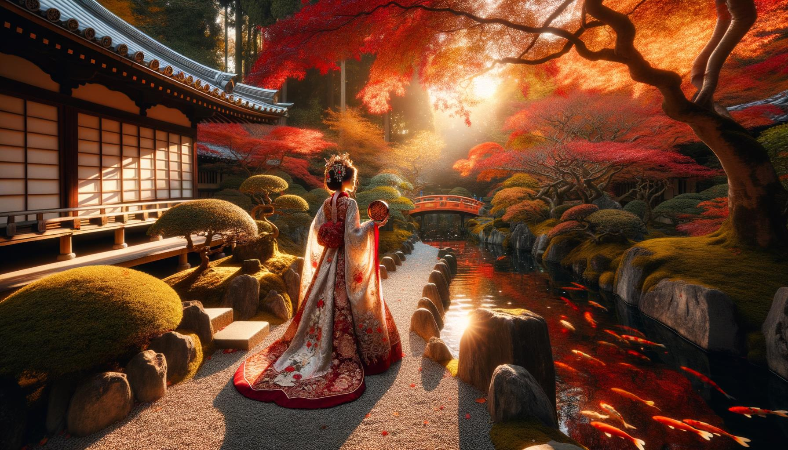

## 穏やかな川岸の風景、伝統的な中東の美しさと共に咲き誇る野花と素朴な橋

エレガントな中東の女性の穏やかな像を生成します。彼女はヘーゼルの瞳と、背中に風情良く流れる濃い髪を持ち、色とりどりに刺繍された伝統的な衣装を身にまとっています。彼女は静かな藍色の川の近くに座っています。豊かな植物が周囲に繁茂し、高い木々が空に触れ、その葉が太陽の光を通して模様を形成しています。美しい野生の花々が束になって咲き、蝶々が近くで舞っています。川を超えて風景は穏やかで雲が満ちた空の下、緑豊かな丘々に広がっています。風光明媚な木製の小橋が川を下流に架かっています。全体のシーンが平和と美しさを放っています。

## 南アジアの紳士が鮮やかな衣装で開花する草原にいる午後のエコー

中年の南アジア系の男性が特徴的な画像を作成してください。彼は暖かい笑顔を浮かべ、鮮やかな色彩の伝統的な衣装を身にまとっています。彼は美しい草原に位置しており、その時間は午後遅く、周りにはあらゆる色彩の野生の花が咲いています。背後には緑豊かな木々が広がっています。太陽の光が木の葉を通して浸透し、芝生にまだらな影を投げかけています。キラキラと輝く小川が草原を縫うように流れ、静かな雰囲気を一層高めています。

## 幻想的な森の中心部に広がる中東の優雅さ

想像してみてください。空気のような森の中で素晴らしい景色、太陽の光が緑豊かな葉を通してそっと降り注いでいる。この絵画のような場所の中心に、中東系の女性が立っています。彼女の目は知恵と安らぎで輝いています。流れるようなドレスに身を包み、鮮やかな色使いが周囲の自然と調和しています。彼女の髪は編んだ冠のように整えられ、静けさと優雅さを醸し出しています。森の落ち着いたざわめきの中で、彼女は穏やかな笑顔を浮かべています。それは平和と美しさの瞬間を完璧に捉えています。

## 日本庭園における南アジアの静けさ

暖かいブラウンの瞳と漆黒の髪を持つ南アジアの女性の像を作成してください。彼女は鮮やかな色のチュニックを着ています。彼女は鮮やかな織りのラグに座って、厚いアンティークの本を読んでいます。彼女は静けさと豊かさに満ちた日本庭園に囲まれており、花の咲く桜の木の香りが空気を満たしています。小さな石橋が平和な鯉の池を覆い、午後の日差しを反映しています。穏やかな風が竹の葉をさらさらと揺らし、やさしい自然のメロディを作り出しています。

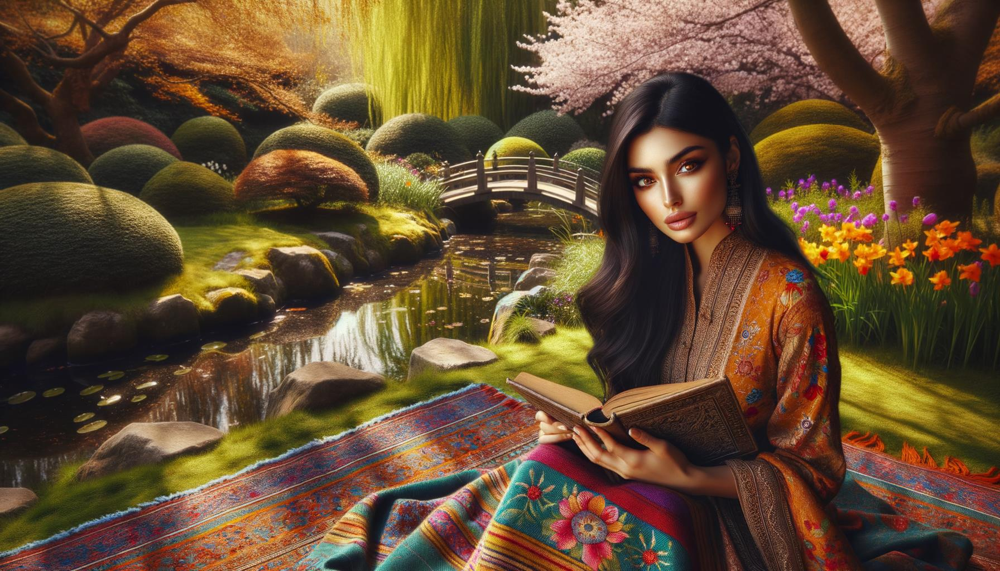

## 静かな夕日と流れる川辺の伝統的な東アジアの美しさ

魅力的な美しい風景を描写した画像。具体的には、伝統的な衣装に身を包み、優雅に立つ東アジアの女性が流れる川のそばに立っています。その場所は、鮮やかな多色の花々が咲く木々で囲まれた緑豊かな地域です。太陽が地平線に沈み、場面全体を暖かで金色の光で浸しています。女性の顔には、至福と安らぎを示す輝く笑みが広がっています。彼女の視線は、息をのむような夕日と豊かな風景を反映した静かな川に向けられています。この全ての風景は穏やかで、静かで、驚くほど美しいです。

## 壮大な夕日の読書リトリート、桜の花畑で

穏やかな笑顔を浮かべた、ハンサムな南アジアの男性のイメージです。彼はカジュアルな服装をしており、木製のベンチに座り、本を読みふけっています。彼がいるのは、満開の桜が咲き乱れ、風情ある石畳の小径が緑豊かな庭園を縫う、美しい公園です。園内はクラシックな鍛鉄のフェンスで囲まれています。シーンを完成させるために、サンセット時の空の鮮やかな色彩を反射する小さな静謐な池が近くに見えます。

## 草原の夜明けの静けさ 南アジアの伝統的な衣装を纏った女性が自然の美しさに囲まれている

南アジアの女性が、伝統的な衣装を着て、魅力的な草原に囲まれ、輝く笑顔を浮かべたイメージを作成してください。草原は豊かな緑と花、そして静かに流れる穏やかな小川で飾られ、平和と静けさの感覚を生み出しています。太陽は地平線の縁にあり、ピンクとオレンジの柔らかく暖かい色合いを風景全体に投げかけています。女性は小川の近くに立っており、彼女からは喜びと穏やかさが放たれています。

## 日本庭園での南アジアの妖精の春の魅力

長くて黒い髪を持つ、30代半ばの南アジアの女性を描いた魅力的な画像。彼女は鮮やかな伝統的な服装を身に着けています。彼女が立っている場所は、惹きつけられるような場所、春の季節に満開の日本庭園で、桜の木がピンクの花びらを彼女の周りに降らせています。そして、彼女の近くには、平和で静かな池があります。柔らかい日差しが葉陰を通して抜け出し、夢見心地の静寂な光を全景に投げかけ、彼女の服装の鮮やかな色と彼女を取り囲む自然の美しさを引き立てます。

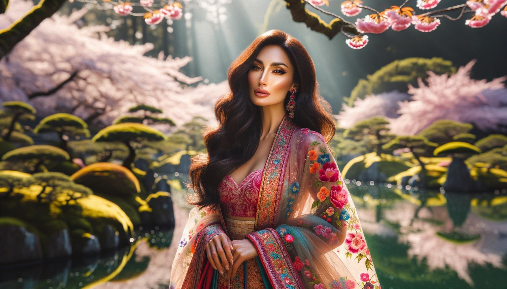

## 純粋な渓谷の薄明かりの中で、秋の壮観に包まれた中東の優雅さ

波打つ髪と優雅な笑顔を持つ魅力的な中東の女性のイメージを作成してください。彼女は息を呑むような場所、緑豊かな谷と水晶のように透き通った川が流れる場所に立っています。周囲には高い木々が立っており、明るく色鮮やかな秋の葉が川に反射しています。遠くには、晴れた青空を背景に、雪を帽子にした山々が全体の美しさを引き立てています。太陽が沈んで谷に黄金色を付け、静かで穏やかな雰囲気を作り出しています。

## 穏やかな日没：森の景色を一望する南アジアの優雅さ

長く流れる黒髪を持つ美しい南アジアの女性が、伝統的なサリーを着て、遠くに広がる深緑の森林の息を呑むような風景を見下ろす絶景を描いています。風が彼女のサリーや髪の色鮮やかな色を優しく引き寄せ、彼女が穏やかな景色を見つめるところが見えます。その顔は、沈む太陽の柔らかな光に照らされています。小川が森を蛇行して流れ、日没の鮮やかな色彩を反映してきらきらと輝いています。この地域の静寂が実感でき、全体としての静かで理想的な環境への感情を高めています。

## 夕暮れ時の満開の庭園で優雅な中東の女性

中東系の女性の印象的な描写で、彼女は優雅な服装を身にまとい、風景画のような背景の中に立っています。彼女は色とりどりの鮮やかな花々が咲き乱れる美しい庭を蛇行する石畳の道に立っています。巨大な古木が豊富な陰影を提供し、彼女の背後には、夕日の金色の光に照らされた壮 majestic な山脈が遠くに立っています。

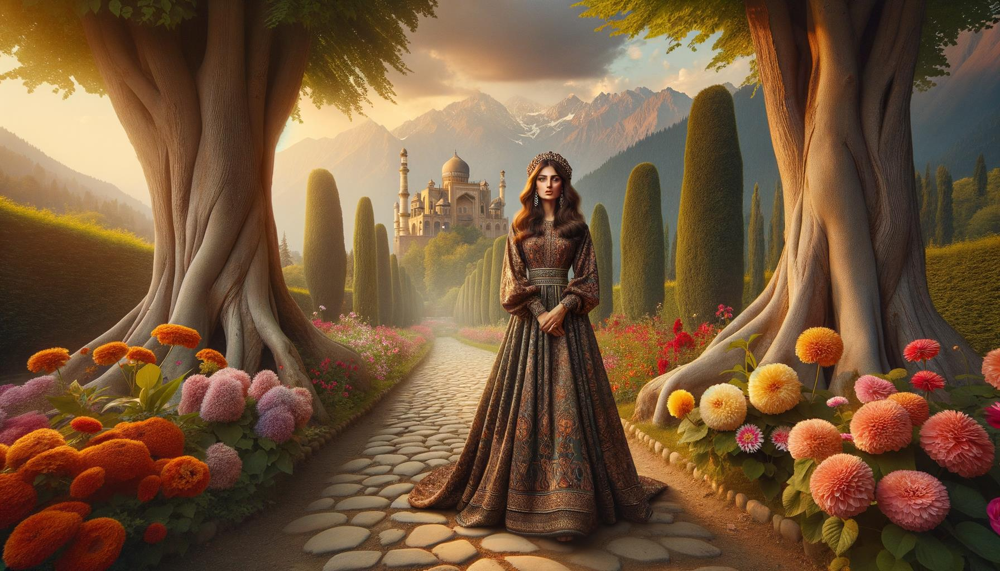

## 湖畔の夕日に輝く優雅な美しさ

優雅な黒人女性が、穏やかな自然の中で上品にポーズをとる美しいシーンを描いてください。彼女は静かな青い湖際に立ち、背景には高くそびえる緑の山々があるという風景が考えられます。陽は沈みかけており、暖かく優しい光が、デリケートなパステルカラーの色調でシーンを照らしています。彼女は白いサマードレスを着ており、髪は長く自然に流れるカールで、全体のイメージに時間を超越した美しさを加えています。

## 砂漠の夕暮れ孤独：夕日の色調での人と自然の調和

想像してみてください、息をのむような夕日の光景。その壮観の中心には、中東の男性が立っており、砂漠の砂丘と一体化するような夕日の鮮やかな色彩を鑑賞しています。羽のように軽い砂は、一日中太陽に照らされて穏やかな暖かさを放ち、男性の落ち着いた表情に反響を与えています。夕日の最後の光線が彼の顔を照らし、風が彼の暗い髪を優しく揺らすと、人間と自然が調和したこの印象的な肖像画に最後の仕上げを加えます。

## 熱帯雨林の色彩と滝の中にある南アジアの静けさ

南アジアの女性が幻想的で静かな森の中に立つ目を引く画像を作成してください。彼女は伝統的な服装を着ており、暗い髪は編まれており、静けさと平和さを醸し出しています。周囲の森は緑色のバリエーションが豊富な活気に満ちた熱帯植物で溢れ、様々な色のエキゾチックな花でちりばめられています。バックグラウンドに滝がカスケードを形成し、そのシーンに静けさを加えています。そして、光り輝く蝶々の家族が周囡を飛び回り、風景にファンタジーのタッチを加えています。

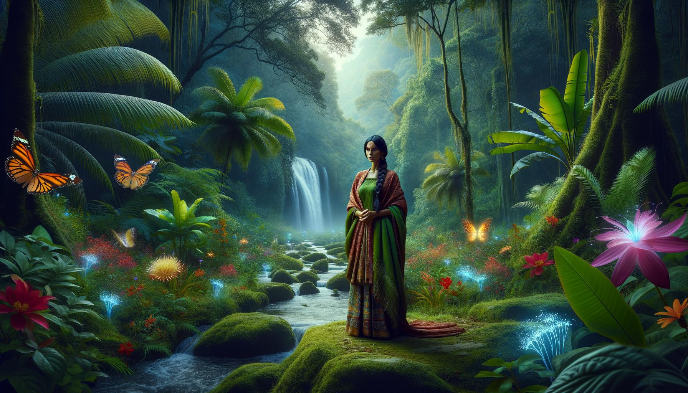

## 桜の中の静かな美しさ 南アジアの優雅さが日本庭園で

鮮やかな青と金色の着物を身にまとい、キクと孔雀のリアルな模様が施された南アジアの女性が、静かな日本庭園で桜の季節を彩る印象的な画像を作成します。彼女は静かで落ち着きのある姿勢で、空を埋め尽くし、彼女の周りの地面を

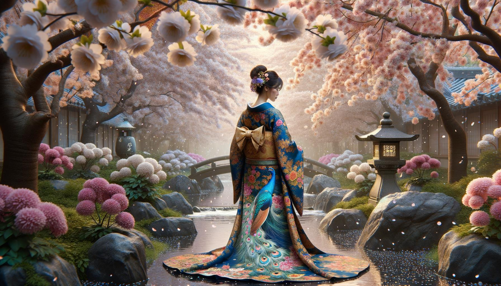

## 静寂なイタリアの夕暮れに東洋の優雅さ

風になびく長い黒髪を持つ、鮮烈に美しい東アジアの女性が、日没時の静謐なイタリアの田舎風景の中に立っています。彼女は伝統的な白いドレスを身にまとい、その瞳は温かさと喜びで輝いています。彼女の周囲には広大な緑地、ブドウ園、そして古びた家々が丘陵に抱かれ、夕日の暖かな金色の輝きを浴びています。この静謐な光景は穏やかさと美しさを醸し出し、自然と人間の調和の象徴となっています。

## 静穏な夕暮れ：ローリングエメラルドヒルズの中のラベンダーと青色のヒスパニック美女

長く豊満な髪と眩い笑顔を持つヒスパニック系の女性の像を作りましょう。彼女は日の入り時に、穏やかで息を呑むような風景の中に立っています。その場所はラベンダー色の空の下、緑色の丘が広がる特徴的な風景です。彼女の衣装には特別な注意を払ってください - ラベンダーとロイヤルブルーの色合いの、優雅にカットされた涼し気なサマードレスが魅力的な背景と調和しています。

## ハンサムな中東の男性が夕日の豊かな風景の静寂を抱きしめる

美男子である中東の男性の画像を生成してください。彼は、ダークでウェービーな髪を持ち、カジュアルな服装で、魅力的な風景の中に立っています。この風景は、豊かな植生があり、輝く川がゆっくりと蛇行して流れ、壮大な山脈が地平線を飾っている静かな場所です。彼の上空には、設定された太陽の色合いで描かれた空があり、幻想的な光をシーンに投影しています。そこに、彼は目の前の息を呑むような自然を観察していて、満足そうな笑顔が顔を明るく照らし、周囲の平和の美しさを具現化しています。

## ターコイズ色の湖畔での夕暮れ時の優雅さ

長い黒髪を持つ優雅な中東の女性の絵画のようなイメージ。彼女は鮮やかな赤いドレスを着て、静かなターコイズ色の湖の端に立っています。周りは緑のすべての色調を示す密な森に囲まれています。太陽は背景で沈んでおり、風景全体に暖かく金色の光を放って、穏やかで美しい雰囲気を作り出しています。

## 幻想的な砂漠の夕暮れの姫君が魔法の風景に立つ

美麗で幻想的な中東の女性が魅力的な自然の風景の中に立つイメージを作成してください。彼女は、美しい宝石と複雑な模様で詳細化された鮮やかなターバンを身につけています。彼女の服装は、彼女の周りの夕日の色彩を反映したカラフルで流れるようなドレスです。風景は、オレンジ、パープル、ピンクのさまざまな色調が青空と混ざり合っています。背景には雄大な山々がそびえ立ち、少々の雪で覆われ、前景にはキラキラと輝く小川が豊かな畑を通って蛇行しています。これにより、静けさと息をのむような美しさを放つシーンが作られます。

## サンセット時の草原での南アジアの静けさ

彼は魅力的な個性を持つ、30代半ばの南アジア系男性で、中長髪を持ち、顔には優しい微笑みが浮かんでいます。彼は快適でカジュアルな服装をしており、同じくらい魅力的な場所に立っています。その環境は、落陽の黄金色の光に浴した平和な草原です。高く、優雅な木々が風景を枠組みし、その葉がそよ風に軽く揺れています。遠くの山々が地平線を飾り、その頂上は太陽の最後の光線にキスされています。自然の静寂な音が空気を満たし、静けさと美しさのシーンを描き出しています。

## 輝く笑顔の黄金の草原：幻想的な日没と山頂の中の中東の女性

風光明媚な美しい場所で優雅に佇む中東の女性のイメージを思い描いてみてください。彼女は輝かしい笑顔と、温かみを放つキラキラとした茶色の瞳を持っています。彼女は色とりどりの伝統的な服装を身にまとい、美しく模様のあるスカーフを頭に飾っています。彼女が立つ場所は、太陽の優しく金色に輝く光に照らされて幻想的です。それは、ゆらゆらと風に揺れる鮮やかな野花が咲き乱れる、肥沃で幻想的な草原です。遠くには、日の光の最後の閃光にキスされた壮大な山々が見えます。

## 秋の静けさ：日本庭園における南アジアの優雅さ

秋の季節に、落ち着いた日本庭園で、伝統的な衣装を身にまとった南アジアの女性のイメージを生成してください。庭園の色彩は、彼女の明るい伝統的な衣装とは対照的です。彼女は周囲の秋色のミックスを賞賛する様子が見られ、紅葉が赤い葉を落とし、背景には趣のある石灯籠があり、足下には落ち着いた鯉の池が流れています。

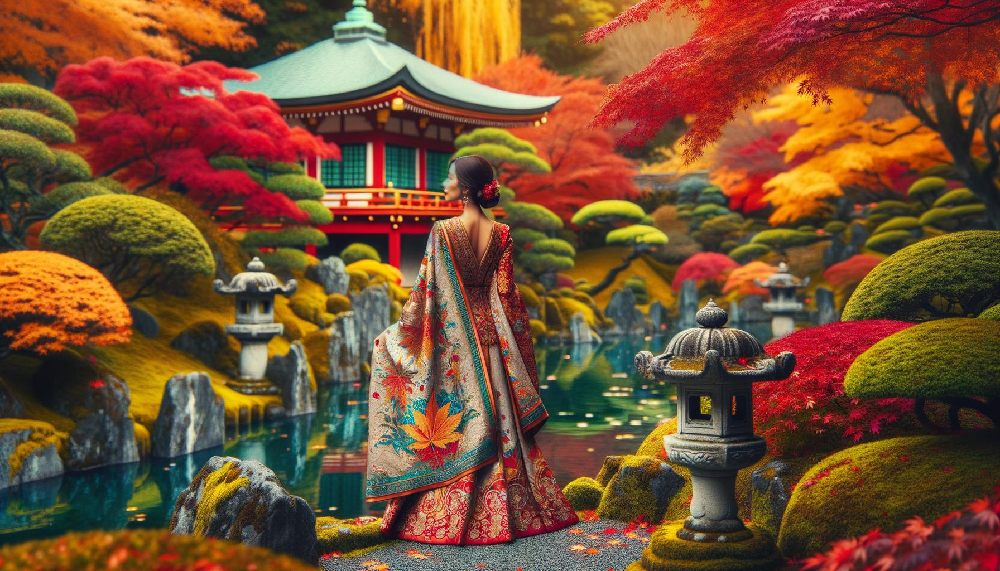

## 中東の草原での静かな薄明かり

中東の女性が、古くてねじれた木の下で静かに座っている風景。彼女は色とりどりの伝統的な衣装で輝いて見えます。場所は魔法のように見える草原で、鮮やかな野花でいっぱいです。太陽が沈み、風景全体に穏やかな黄金色の色合いを投げかけます。遠くには壮大な雪を被った山があります。軽い風が花びらをかき乱し、穏やかで落ち着いた雰囲気を作り出します。

## 熱帯の輝きと滝の静けさの中の優雅な美しさ

髪をカールさせた魅力的な黒人女性が、エレガントなドレスを着て、豊かな熱帯林を通る曲がりくねった道に立っています。鮮やかな色のエキゾチックな鳥たちが近くの木に止まっています。遠くでは、壮大な滝が崖から流れ落ち、この静かな風景のための穏やかなサウンドトラックを生み出しています。太陽の光が樹冠を貫き、まだらな影を投げかけ、豊かな植物をゴールデンな輝きで照らしています。

## 中東の崖上での夏の静けさ

美しい崖が広がる紺碧の海を眺めながら岩場をふらつく中東の男性の写真。彼の装いはシンプルだが魅力的な夏の衣装 - パステルカラーのボタンアップシャツ、カーキ色のショーツ、ビーチサンダル - で、自然体のシックなルックスを引き立てている。彼の目は、目の前に広がる静寂な風景の美しさを反映しています。散りばめられた雲から覗く太陽が、クリスプで清潔な水面に光と影の魅力的な遊びを描き出している。このようなつかの間の静寂な瞬間こそが真の恵みである。

## オアシスでの日没時の中東の優雅さ

中東の女性を壮麗な風景の中に描いたイメージを作成してください。彼女はエレガントにドレスアップしており、伝統的な中東の衣装と現代の影響を融合させています。彼女は豊かな緑のオアシスの近くに立っており、太陽がそろそろ沈み始め、風景全体に神秘的なオレンジと金色の光を投げかけています。穏やかでキラキラと輝く水面が近くにあり、小さな湖かもしれません、それが絵画のような風景と急速に暗くなる星空を映し出しています。環境の静寂と彼女の穏やかな表情からは平和と満足のオーラが放たれています。

## 雨林の心に翠の眼差し

美しい黒人女性の画像、長い編んだ髪とエメラルドグリーンの眼差しで、印象的な場所で自信を持ってポーズしています。舞台は、鮮やかな植物と明るいエキゾチックな花でいっぱいの豊かな熱帯雨林です。彼女の周りの色は鮮やかで鮮明で、太陽の光が天蓋を通してフィルタリングされ、森の床に魅惑的なパターンを投影しています。背景には滝が見え、その水は太陽光の下で輝いて、穏やかで静かな雰囲気を作り出しています。

## 金色の陽光の下で豊かな花園の中の中東の静けさ

長くて巻き毛の中東の女性を描いてください。彼女は豊かな緑の庭園に座っており、その庭園には様々な色の花が咲き乱れています。流れるようなパステルカラーのドレスを着て、花盛りの桜の木の下の装飾豊かな鋳鉄製のベンチに座り、ビクトリア調の小説に没頭しています。太陽が沈みかけており、シーン全体に暖かなゴールデンライトを投げかけています。背景で孔雀が自由に歩き回っている姿が見えます。その場所の静寂と風景美は本当に魅力的です。

## 日没時のカラフルな南アジアの街にいる中東のアーティスト

美しい中東系男性アーティストが、鮮やかな色彩の建物が並ぶ風景の美しい南アジアの街路に立っているイメージを作ります。彼は伝統的なクルタを着て、手には絵筆を持っています。やさしい風が吹き、彼の衣服がさらさらと揺れています。太陽が沈みかかり、シーン全体に暖かなオレンジ色の光が差し込んでいます。

## 幻想的な静寂：アジア人男性の瞑想的な高山湖の孤独

優美な顔立ちの魅力的なアジア人男性が、静謐なアルプスの湖畔の岩に心地よく腰掛けている幽玄な風景。その男性は、おしゃれなカジュアル服を身に着け、瞑想的な態度からは平和と安らぎが感じられます。周囲の景観は壮大で、湖のガラスのような表面に雪を頂いた高い山々が映し出され、豊かな常緑樹が点在しています。静かな水面、さわやかな空気、そしてアルプスの鳥たちの穏やかな羽ばたきが静寂と自然との調和を醸し出しています。

## 中東の森の神秘的な静寂

美しい中東の女性の描写があります。彼女の長い黒髪が肩を流れ落ちていて、息をのむような美しい風景の中に立っています。彼女は巨大な木々と鮮やかな花々が点在する静かな森の中にいます。その背景には滝が流れ落ちています。光が緑の葉を通して彼女の顔に滲むような模様を投げかけています。彼女は長くて鮮やかなドレスを身につけていて、それがソフトな風に揺らいでいます。彼女は遠くの山々を見つめていて、その顔には平和と満足感が表れています。

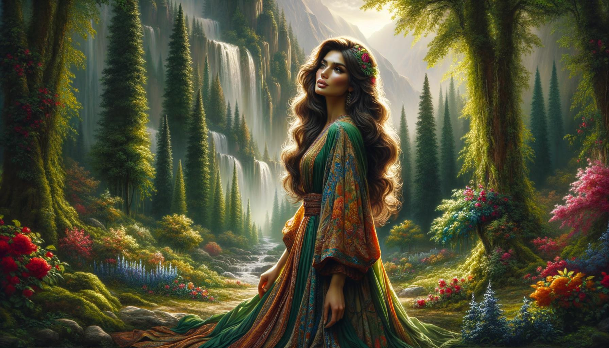

## オレンジのドレスを着た女性が丘陵の日没を抱きしめています

風光明媚な風景が広がり、起伏に富んだ谷間と壮大な夕日が赤、オレンジ、紫の色合いで空を染め上げています。その畏敬の念を抱かせる場所で、黒髪をルーズなヘアバンにまとめたアジア女性が立って風景を見渡しています。彼女はオレンジ色の夏ドレスを身にまとい、柔らかい生地が夕日の色彩を反映しています。彼女の放つ明るい笑顔は平和と満足感を漂わせ、自身の周囲の自然の美しさを楽しんでいます。そよ風が彼女のドレスや髪の毛を揺らして、落ち着いた雰囲気を一層引き立てています。

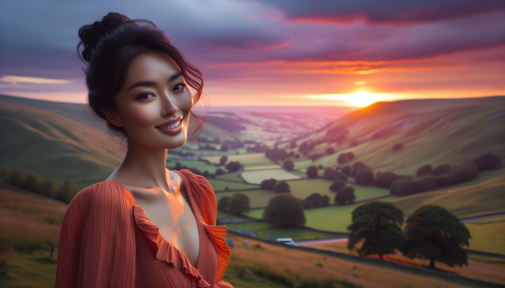

## 壮大な風景の中で桜の木の下にいるヒスパニックの美女

視覚的に鮮やかな画像、流れるような栗色の髪、きらめくヘーゼル色の瞳を持つヒスパニック系の女性が、夏のドレスを着て、花咲く桜の木の陰でゆっくりと休んでいます。彼女を囲んでいるのは、野花で散りばめられた豊かな緑の草原、遠くに静かな藍色の湖、雪をかぶった山々が広がる息をのむような風景で、晴れ渡った青空の下です。

## 優雅さと探求心 南アジアの女性が鮮やかなストリートウェアで静かな海岸の風景の中に立つ

南アジアの女性の印象的な画像、エレガントなストリートウェアに身を包み、見事な場所で立っています。彼女を想像してみてください、花で覆われた高いつるが広がる中、明るい日差しの下で。彼女はおしゃれなハンドバッグを持っており、好奇心に満ちた目で周りの美しさを探索しています。風景には石畳の道があり、遠くには広大な青い海が広がっており、両側には豊かな緑が広がっています。その場所は、静謐な雰囲気を醸し出し、柔らかいパステルカラーと鮮やかな色彩の包括的なパレットが春の朝の新鮮さを喚起するよう補完しています。

## 豊かな緑と夕日の滝の中で伝統的な衣装をまとう中東の美女

魅力的な中東の女性の詳細な画像を作成してください。彼女は色とりどりの伝統的な衣装を着て、温かい笑顔を浮かべ、魅力的な背景で立っています。環境は、緑豊かな植物、背景には滝が流れ、花々が多種多様な色彩で咲いています。静かな流れが彼女のそばを通り、地平線上には穏やかで鮮やかな夕日が広がり、空全体に美しいパステル色の光が差しています。

## 輝く笑顔、エメラルドの森：マゼンタ色の南アジア美女が自然の天蓋を飾る

鮮やかなマゼンタ色の伝統的な衣装を身にまとった南アジアの女性が、輝くような笑顔で美しい森の中に立つ美しい風景。森の床は、色とりどりの落ち葉で飾られ、高くそびえ立つ木々を通してフィルターされた日光がこぼれています。空気は、自然の静寂な音、鳥のさえずり、そして風が葉をさらさらと揺らす優しい音で満ちています。この絵画のような設定は、苔むした岩の上を流れ落ちる遠くの滝の音が森のシンフォニーと混ざり合うことでさらに強調されます。

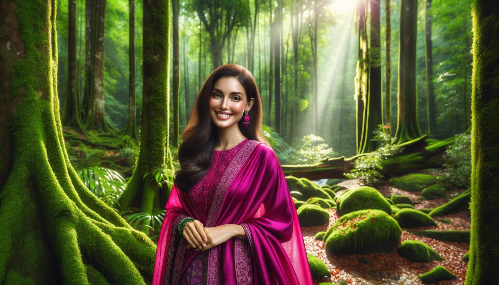

## 優雅なグレースが輝く南アジアの庭園風景

風光明媚な場所での見事な光景。南アジアの女性を想像してください、その優雅さと顕著なカリスマ性で人々を惹きつけます。彼女の衣装は、複雑なパターンと豊かなテクスチャに満ちた鮮やかなサリーです。彼女は背筋を伸ばし、その姿勢は優雅さに光り輝いています。舞台は魅力的な庭園、豊かで壮麗な-鳥のさえずり、青とピンクの鮮やかな色彩の花々、大きな木々のざわめきの平穏な交響曲に身を浸しましょう。近くにはゆっくりと流れる小川があるかもしれません、この静かな環境でリリカルなメロディーを奏でています。本当に息をのむようなビジョンです！

## 中東の探検家、自然の壮大さの中で：彩り鮮やかな海岸線での静寂

中東系の人物の画像で、ジェンダーニュートラルな外観を持つ方です。彼らは自然が鮮やかに映える場所に立っており、緑豊かな植物と色とりどりの野生の花々に囲まれています。遠くには明るい青色の海が岩場の海岸線を包み込んでいます。空は鮮やかな青色で、夕日のやわらかなピンク色が溶け込んでいます。その人は快適でスタイリッシュな服を着ていて、景色を平和で満足そうな表情で眺めており、その場所の静寂と美しさを存分に楽しんでいます。

## 海岸の夕日を見下ろす中東の優雅さ

美しい中東の女性が、平和な海辺の町を見下ろす華麗に飾られたバルコニーに立つイメージを想像してみてください。彼女は30代半ばで、エレガントな長い、流れるようなアクアマリンのドレスを着ています。彼女の黒髪のカールは解かれ、そよ風にやさしく揺れています。彼女の濃い茶色の瞳は、遠くを思慮深く見つめ、夕日の鮮やかな色合いを映し出しています。下に広がる町は、白い塗装の建物、豊かな緑のヤシの木、曲がりくねった石畳の道が静かな碧い海へと続いています。空は暖かなオレンジ、ピンク、紫の混じった色で、沈む夕日がその放つ輝く金色の光を絵画のような町に散りばめています。

## 優雅さと穏やかさ、鮮やかな風景の中の南アジアの優美さ、パステル色の夕焼け空の下で

南アジアの女性が鮮やかで活気ある風景の中に立っているイメージを作成してください。彼女は優雅さと静けさを醸し出し、その目は思いやりと優しさを反映しています。彼女の髪は長く、後ろで緩く結ばれています。彼女はシンプルでありながらもエレガントな伝統的なドレスを着ており、その美しさを引き立てています。彼女の周りの風景は息を呑むようなもので、花でいっぱいの草原が美しい山脈に向かって広がり、柔らかなパステルカラーの夕日が空を染めています。

## 南アジアの冒険家の夕日における静かな活気

美しい自然風景を鮮やかに映し出す魅力的な画像。なだらかな丘、透き通った湖、そして空を彩る鮮やかな夕日。前景には、アウトドアに適した服装を身に着けた、アジア南部のアスリート体型の男性が気軽に立っています。彼の顔に刻まれた笑顔が、この風景画の全体的な穏やかさと魅力を一層引き立てています。

## 中東の歴史と自然の中で息を呑むような美しさ

視覚的に魅力的な中東の女性が、畏怖の念を抱くような場所に立っています。彼女は表情豊かな暗い瞳と、やさしい風に揺れる長く、鴉色の髪を持っています。彼女の伝統的な衣装は、色彩豊かで複雑なパターンが特徴であり、それはこの地域の豊かな文化を証明しています。その場所は等しく壮大で、複雑な歴史を物語る古代の高い建築物が、緑豊かな公園や静かな水面が金色の陽光の下できらめく美しさを引き立てています。目が行く先々に、生命のきらめきが見えます - 花びら、小鳥の羽ばたき、または風の静かな音に。

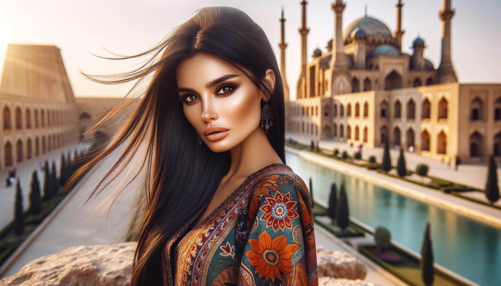

## 穏やかな夕日 南アジアの女性がカラフルな田舎で静寂を楽しむ

壮大な風景の静寿を味わう南アジアの女性を詳細に描写した画像を作成してください。彼女は、野生の花々が溢れ、そよ風で波立つ緑豊かな広大な田園地帯に位置しています。頭上では、美しい空が青から金色やピンク色の色合いに変わり、太陽が地平線に沈む様子が見えます。彼女は、心地よい伝統的な服装を身にまとい、顔には安らぎの笑顔と喜びのヒントがあり、周囲の真の美しさを反映しています。

## ロータスポンドのトワイライトでの南アジアの優雅さ

長くウェーブのかかった髪の南アジアの女性が、カラフルで伝統的な衣装を身にまとい、静かな蓮の池の上の橋に立っているイメージを作ります。シーン全体は日没の暖かい光に包まれ、空を紫、オレンジ、赤の色調で彩っています。穏やかな水面は、空と水面に静かに浮かぶ睡蓮の葉の鮮やかな色を反映しています。近くの距離で、池沿いの道には伝統的な石灯籠が並んでおり、その柔らかな光が静謐な雰囲気を醸し出しています。シーンを完成させるために、満開の桜の木が池を縁取り、その花びらが地面に楽しいピンクのカーペットを作り出しています。

## 虹にキスした滝と緑豊かな緑の中の南アジアの優雅さ

視覚的に魅力的な風景で、南アジアの女性が壮大な滝の近くに立っています。彼女は鮮やかな伝統的な服装を身に着けており、その色彩は周囲の緑豊かな自然と調和しています。彼女の顔は近くの木々を通して漏れ出る柔らかな自然光に照らされています。滝は優雅な強さで落下し、空気中に繊細な霧を送り、太陽光を屈折させて虹を形成します。このシーンは平和で、静かで、生命に溢れており、自然の驚異と多様性の美しさを本当に見せています。

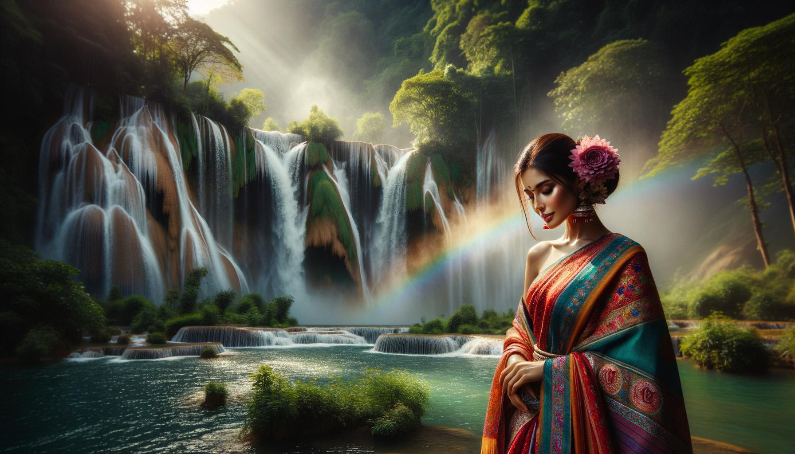

## 豊かな中東の庭園での幻想的な優雅さ

優雅な中東の女性が、黒く流れるような髪と深い茶色の瞳を備え、静かで豊かな庭でくつろいでいます。太陽の光が緑の葉を通り抜け、彼女を取り囲む鮮やかな花々を照らしています。そよ風が彼女の服をはらはらと揺らし、幽玄さを加えています。近くで、色とりどりの孔雀が威厳を持って歩き、虹色の羽がきらめいています。平和な表情を浮かべた彼女は、周囲の自然の美しさに心を奪われています。

## 中東の夕日の静けさ、花々の調和と壮大な山々の中で

長くて光沢のある黒髪の中東の女性が、流れるような手作りのローブを快適に身につけている魅惑的な光景。彼女は静謐な場所に位置しており、豊かな緑と鮮やかな野花に囲まれています。太陽は穏やかに背景で沈んでおり、穏やかな風景全体に暖かい金色の輝きを投げかけています。静穏な山脈が遠方に昇り、風景美を増しています。トランクイリティとセレニティのブラシで描かれたイメージは、自然と人間の崇高な相互作用です。

## 南アジアの淑女の穏やかな幻想、豊かな緑の松と雄大な雪山の中で

設定された太陽の柔らかい光で照らされた南アジアの女性が特徴的なシーン。彼女は肩までの波状の髪を持ち、伝統的な服を着ています。彼女は、高い松の木で囲まれた静かな湖の魅惑的な景色を見つめています。遠くには、雪に覆われた雄大な山が、澄んだ青空の下で高くそびえ立っています。この落ち着いた風景は、女性の平和な表情と風景の鮮やかな色彩が強調する穏やかさを喚起します。

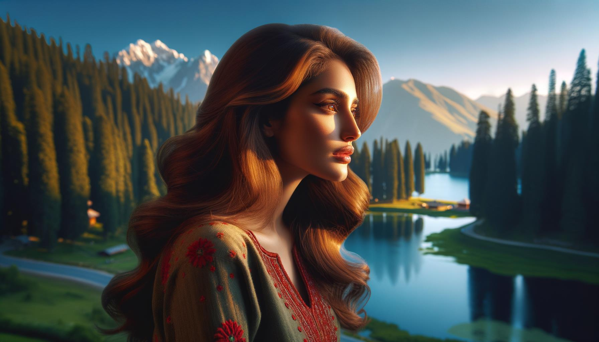

## 日没の壮大さと鮮やかな自然の中の中東の威厳

美しい中東の女性を描いたイメージを作成してください。その女性は、流れるような黒髪と印象的な瞳を持ち、伝統的な衣装を身につけています。彼女は、美しい自然に囲まれた風景の中に位置しています。これには、近くに吹き出す滝や、さまざまな鮮やかな植物生活が豊かに広がる緑地が含まれます。日が沈みかけ、温かなオレンジ色の光がシーン全体に投射され、フクシャと赤い花々が際立ちます。その人物は、風景を通り抜ける曲がりくねった小道上に立っており、夕日の放つ輝かしい色合いに満ち溢れ、その平和な静けさを映し出しています。

## ヒマラヤに沈むサフラン色の静寂な日の出

鮮やかな日の出の色で輝く壮大なヒマラヤ山脈を背景に、魅力的な南アジアの女性が立っています。彼女は金の装飾が施されたサフラン色のサリーに優雅に身を包んでいます。彼女の黒い髪には伝統的なマングティッカが飾られています。涼しい朝の風が彼女の髪とサリーを優しく揺らし、全体のシーンに動きを加えています。

## オーバーンビューティがアジアンガーデンハーモニーの春を抱きしめる

春の静かなアジアの庭を美しく描写した画像を作成します。そのシーンでは、周囲の美しさを感じている、視覚的に魅力的な白人の女性を見つけます。彼女は、長く、ウェーブのある赤毛、鮮やかな瞳、そして彼女の内面の美しさを証言する温かい笑顔で特徴づけられています。彼女はモダンと伝統的な衣装を組み合わせて、エレガントに着飾っています。これは、文化の調和の象徴です。庭園は満開の桜の木でいっぱいで、その花びらが優しく舞い落ち、コイの池と古典的な木製の橋があり、アジアの風景の普遍的な美しさを反映しています。

## サファイアのセレナーデの静けさ 中国の優雅さ、花々に囲まれて 橋と雪景色のピーク

流れるような漆黒の髪と柔らかで優しい目を持つ魅力的な東アジアの女性の画像を作成します。彼女は落ち着いた笑顔を浮かべ、サファイアブルーの伝統的な中国のチョンサムに優雅に身を包み、金の刺繍で飾られています。彼女の背後には、風に優しく揺れる鮮やかな桜の花が咲く木があり、そこから少し離れたところには古く素朴な石の橋が静かな睡蓮の池を渡っています。一方、遠くには雪を冠した壮大な山々が蒼空の下に見え、ふわふわの白い雲がゆっくりと漂っています。この風景がもたらす静寂と平穏が広がっています。

## ゴールデンな夕暮れの輝きの中で、南アジアの優美さがヨーロッパの魅力に出会う

美的に魅力的な中年の南アジア女性の画像で、鮮やかな伝統的な衣装を身にまとい、歴史的なヨーロッパの都市の見事な背景近くにいます。彼女は、趣のある店が並ぶ石畳の通りを歩いています。彼女の笑顔は、都市の独特の建築的魅力を賞賛するさまを美しく引き立てています。夕陽の金色の光は、空気に魔法のようなヒントを加え、長い影を作り出し、周囲の自然と人工の構造物を温めます。このシーンは、静けさと喜びの感覚を捉えています。

## 優雅な中東の美女が夕日の下で鮮やかな庭園で放つ幻想的な輝き

中東の女性が優雅さを醸し出し、鮮やかで伝統的な衣装に優雅に身を包んだ見事な画像。彼女は息をのむような場所、満開の多種多様な植物が繁茂する豊かな庭園に立っています。鮮やかな色の花びらが地面を覆い、穏やかな池が空を反射し、自然の美しさの魅惑的なブレンドを作り出しています。背景には太陽が沈み、全てを暖かく、幻想的な光で塗りつぶす金色のオーラを投影しています。

## 金色の夕日と魔法の滝による優雅さと優雅さ

流れるような黄色のサロンを着た優雅な南アジアの女性が、カジュアルな青いスーツにスマートに身を包んだ中東の男性の隣に立っています。彼らは、苔むした岩に流れ落ちる魅力的な滝と、落日の柔らかな輝きに煌めく結晶のような湖を特徴とする癒しの風景の中に位置しています。静寂な雰囲気は、堂々とした300年ものシプレスの木々の存在によってさらに高まり、鮮やかな野生の花々が周囲を点在し、美しい羽毛の鳥たちが空を横切って飛んでいます。

## 日の出の人里離れたビーチで静寂を抱く中東の男性

魅力的で、中東系の筋肉質で温かい笑顔を持つ男性が、魅力的な場所で落ち着いて座っています。その場所は、日の出時の静かで人里離れたビーチです。黄金色の砂浜が水晶のように澄み渡った水面に広がり、水面は早朝の空の柔らかな桃色の色合いを反射しています。豊かな熱帯の木々のかすかなシルエットが景色を囲み、静謐な魅力を添えています。穏やかな波と涼しげな海風が作り出す居心地の良い雰囲気は、男性の平和な態度と真の満足感と完全に一致しています。

## 穏やかな湖畔での夕暮れ時の南アジアの優雅さ

穏やかな光景が広がっていて、南アジアの女性が静かな湖のそばで優雅に立っています。夕日は周囲に金色のオーラを吹き込み、オレンジ、ピンク、パープルの色調で空を灯します。遠くには高い雪を被った山が、見事な背景を完成させています。女性は柔らかなラベンダー色の衣装を着ており、温かさと平和を放っています。彼女の眼は喜びで輝き、場所の自然美を反映しています。彼女の後ろには木製の桟橋があり、湖の穏やかな水面へと続いています。そして湖岸には鮮やかな野生の花が咲き乱れ、この風景画のような美しさを増しています。

## 湖畔の夕日と南アジアの風景の中の静寂な休息

南アジアの女性が静かな湖の端に平和に休んでいる魅力的な風景、彼女の姿が水面に映し出されています。彼女はシンプルでありながらエレガントな夏の服装に身を包み、豊かな緑の背景に対して髪を広げています。彼女のまわりでは、沈む太陽がオレンジとピンクのドラマチックな爆発を空に描き出し、風景画のような風景に暖かで穏やかな光を投げかけています。精巧に作られた風光明媚な木製のコテージが遠くに見え、地平線に向かって広がる丘の中に建っています。

## 日差しの中の緑豊かなオアシスでのヘーゼルの視線

美しい中東の男性の画像で、黒髪、手入れの行き届いたひげ、そして表情豊かなヘーゼルの目が特徴です。彼は幻想的な環境、緑豊かな鮮やかな森林に立っています。森は緑の木々、色とりどりの花々、そして柔らかな日光でキラキラと輝くクリスタルクリアな小川で繁茂しています。光の流れが濃密な樹冠を突き抜け、明るい部分と陰影をダイナミックに投影し、森を生き生きとさせています。男性はカジュアルで快適な服を着て、リラックスした落ち着いた様子で、顔が太陽光で照らし出され、平和と満足感を表現しています。

## 桜の下での優雅さ 東アジアの肖像、藍色の絹と夕暮れの静寂

東アジアの女性が、満開の桜の木の微妙な陰に優雅に立っている様子を視覚化してください。柔らかいピンクの花びらが彼女の周りに舞い降りる中、彼女は自分の肌にマッチする繊細な青いシルクのドレスを身にまとい、長い黒髪をゆるいお団子に結んでいます。背景は、伝統的な日本の茶園の静けさを醸し出しており、フローラの中に部分的に隠れた石のランタン、きちんと整えられた低木、そして美しい風景を映す小さな池があります。穏やかな夕暮れの色合いが、この静謐なキャンバスに暖かな色調をつけています。

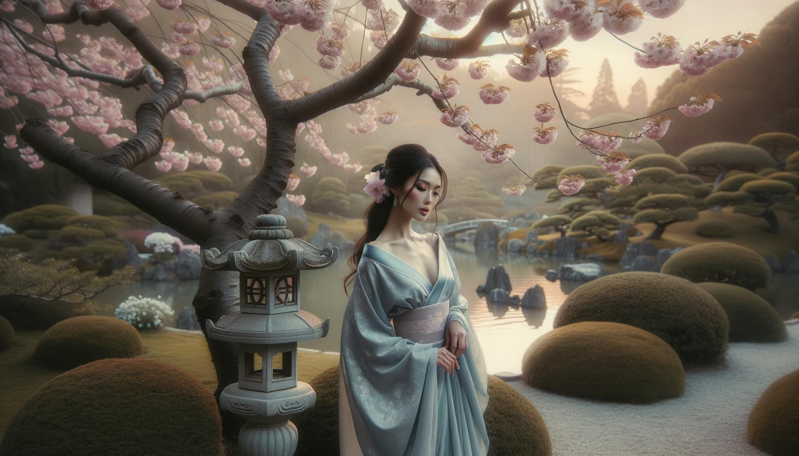

## 地平線上の静寂：南アジアの女性の夕暮れ時の空想

中肉体の若い南アジアの女性が、シルキーで艶やかな黒髪をポニーテールに結び上げ、美しい景色を特徴とする壮観な場面。彼女は緑豊かな丘の上に立ち、日が落ちる穏やかな日差しを浴びています。この美しい風景は楽園に劣らず、青い海が地平線まで広がり、海鳥が海岸線上空をちりばめています。女性は平和な雰囲気を放ちながら、一体感のある静けさと美しさの絵を完成させるように、その息をのむような景色を見つめています。

## 夕日のビーチを散歩する魅力的な南アジアの男性

魅力的な笑顔を持つ南アジア男性の画像を生成してください。彼は清潔感のある白いリネンのシャツとカーキパンツを着ています。彼は夕日のビーチを散策しています。地平線はオレンジとピンクの色合いで輝いています。背景では、ヤシの木がそっと揺れています。そして、トルコ石色の海が彼の裸足に遊び心を込めて静かに波を打っています。

## 川辺の静寂な夜明け：桜と山の反響の中のヴィクトリアンな優雅さ

ロマン派時代を彷彿とさせる落ち着いた画家風のスタイルで、フィット感のあるビクトリアンドレスを纏ったアジアの女性が、穏やかにきらめく川辺に座っているイメージを生成してください。朝日が遠くで昇り、シーン全体に柔らかく暖かな光を投げかけています。水面の反射はキラキラと輝き、草は生い茂り、緑が鮮やかで、満開の桜の木が風に乗せて花びらを散らしています。シーンの中の女性は優しく本を持ち、思索にふけっています。遥か遠くには壮大な山が響き、柔らかい霧に包まれ、穏やかな雰囲気を強調しています。

## 静かなるトワイライトの反射、南アジアの美女が自然に映える

鮮やかな伝統的なドレスを身に纏った魅力的な南アジアの女性の画像。肥沃で絵画のような美しい森の中に立っています。近くには穏やかな湖があり、壮観な金色の夕日を映し出しています。シーンは静謐で、夜の鳥のさえずりが空気を満たし、そっと風が森の葉をさらさらとさせています。彼女は穏やかに微笑み、喜びで瞳を輝かせ、彼女を取り巻く自然の美しさを魅了されるように見つめています。

## 黄昏時の中東男性、湖畔の豊かな森の中の静寂

彼の全盛期の中東の男性の魅惑的な描写、静寂な湖の端に立つ、茂った森の心地よい場所にいます。美しい夕日の微光が穏やかな湖上を踊り、その光を濃厚な樹木のエメラルドの葉に向けて伸ばして、色彩の魅力的な調和を創り出します。男性の伝統的な服装はこの背景に映え、その装いの細部は丹念に作り込まれています。彼の静かな表情は、自然環境との深いつながりを反映し、穏やかな美しさの象徴である風景に寄与しています。

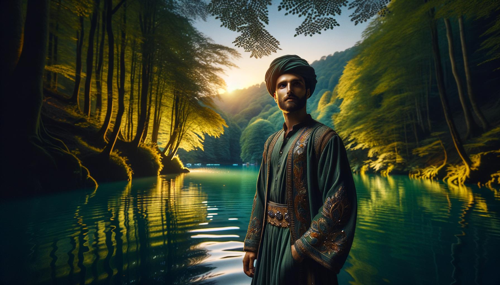

## 日没時に明るい草原で楽しそうなアジアの女性

彼女は30代半ばのアジア人女性で、肩まで届く波状の栗色の髪、深い茶色の目、そして顔には明るい笑顔を浮かべています。彼女が立っている場所は絵画のように美しい景色です：虹の全ての色の野生の花で満たされた豊かな緑の草原、キラキラと青く輝く小川が草原を縫うように流れ、遠くで太陽が沈んでいて、空を赤、ピンク、オレンジの色調で塗りつぶしています。

## 紺碧の湖に映る夕焼けと花咲く美しさ

長く波打つ髪と魅惑的な笑顔を持つ美しいヒスパニック系の女性の画像が、背景には豊かな緑の木々、足元には繊細な白い花々が咲く、鮮やかな青色の湖の近くに立っています。太陽はシーン全体に金色の輝きを投げかけ、湖の静かな表面から反射します。そして、空は夕暮れ時のパステルカラーの舞台です。

## アルペンの美しさの中での早朝の調和とアジア系のエニグマ

風光明媚な環境での視覚的に魅力的なシーン。中心には、アジア系の魅力的な個人がジェンダーニュートラルなスタイリングでいます。彼らは、色鮮やかな野花が豊富に咲く壮大なアルプスの牧草地の美しさを静かに楽しんでいます。シーンは、初期の朝日の繊細な光に浸しており、個々の内容の表現と彼らの周囲の息をのむパノラマを強調しています。

## 南アジアの静寂、夕日の海岸の砂地で

オリーブ色の肌に、長くやさしくカールした髪、表情豊かな瞳を持つ魅力的な南アジアの女性が、伝統的なサリーを着て、息を呑むような風景の端に立っています。未開の、風景豊かな海岸線で、ターコイズブルーの水がやさしく金色の砂浜にキスをしています。パームツリーが冷たい海岸風に軽く揺れており、太陽が少しずつ沈み始め、温かく魔法のような光が全体の設定を照らし、それを超現実的で魅力的に感じさせています。

## 花咲く庭園で輝く優雅さ：花摘みと遊び心のあるアヒルの物語

エレガントなヒスパニック系の女性が、長くウェーブのかかった茶色の髪をなびかせて、満開の鮮やかで色彩豊かな花々で満たされた美しい豊かな庭を歩いています。彼女は流れるような白いドレスを着て、小さな籠を持ちながら、道中で花を摘んでいます。古い石造りの噴水は、花のつるで飾られており、この庭の中心を占めています。明るい晴れた日で、この平和な環境に温かさと光を加えています。柔らかい風が時折葉っぱをさらさらと揺らします。家族連れのアヒルが近くの池で楽しそうに泳いでいて、この穏やかな風景に鮮やかな生命を加えています。

## 熱帯の優雅さ レインフォレストパラダイスの黒美人

魅力的な黒人女性の画像、彼女はカーリーヘアに鮮やかなフローリングドレスを身につけています。彼女が立っている場所は息をのむような美しい場所です。その場所は、そびえ立つヤシの木、荒々しい岩に打ち寄せる壮観な滝、そしてフィルターを通してきらめく明るい緑の葉がある豊かな熱帯雨林です。

## 夜明けが触れる湖畔の静けさの中の南アジアの優雅さ

伝統的なクルタの衣装を着た、魅力的な南アジア系の男性が、静かな湖の前の石のベンチに座っています。豊かな緑の柳の木に囲まれた湖は、遠くに広がる雄大な山々を反映し、夜明けの柔らかな色調に満ちた空の下で威厳を持ってそびえ立っています。この驚くべきシーンの反映が湖の静かな表面に鏡像を形成し、この驚くほど平和な場所の美しさを一層引き立てています。

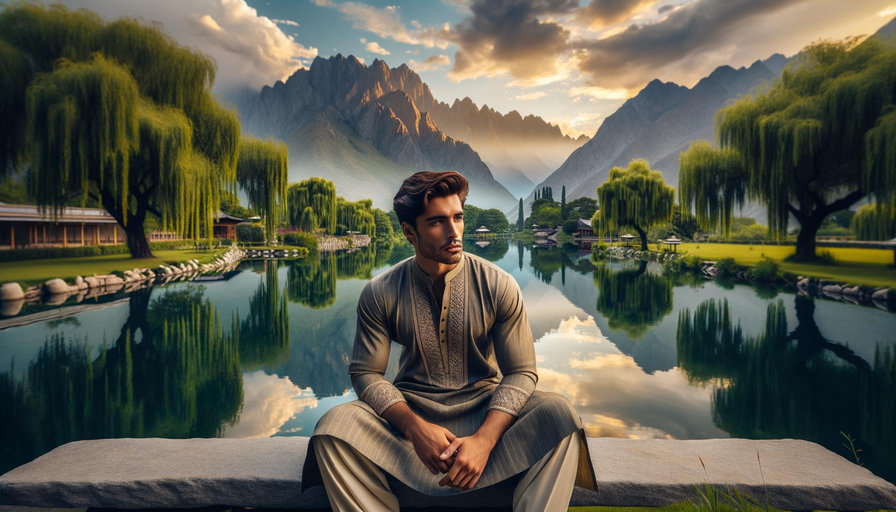

## 中東の美女が、静かなビーチで夕日の静けさを抱きしめています

中東の女性の見事な描写、彼女の魅力的な濃い目が、魅了的な場所で立っています。その場所は、夕日の穏やかなビーチです。空は赤やオレンジの色彩で飾られ、静かな波が砂浜にやさしく打ち寄せています。彼女は、柔らかい海風で揺れる鮮やかなターコイズ色の夏のドレスを着ています。彼女の濃い茶色の髪が風にやさしく揺れています。彼女は地平線を見つめており、彼女の顔に浮かぶ穏やかな微笑みは満足を示しています。この場面は、環境と個人の自然美における一時的な瞬間です。

## 開花する荒野で壮大な滝を鑑賞するヒスパニックの美人

魅力的なヒスパニック系の女性が壮大な風景の中に立っている画像を描いてください。彼女は急峻な崖から滝下へと流れ落ちる滝を眺めています。滝壷の周囲には、豊かで野生の植物と色とりどりの花々が生い茂っています。滝の両側には、急峻な崖が上方へと伸びて空とほぼ接触するほどです。空には白い雲がまばらに広がり、太陽が明るくシーン全体を照らしています。女性自身は、ダークなカーリーヘアーで、中身体型で、快適なハイキング用のギアを身につけています。彼女の目は、自然美に対する感謝から広がっています。

## 孤独の揺り: サンセット色の空の下での南アジア女性の穏やかな瞬間

南アジアの女性が深く内省的な独りぼっちに没頭している、静かな光景を想像してみましょう。彼女は大きなオークの木からぶら下がっているさびれたブランコに楽しげに座っています。場面は日没の黄金時間中、静かな田舎の風景です。日の入りの活気ある色彩が空に拡散して、長く暖かい影を投げかけています。周囲の野原は地平線を覆いつつ、淡紫色と鮮黄色の鮮やかなパレットで色づけられた野花が軽い風になびいています。花々が満開の甘い香りと鳥たちの癒しの囀りが空気を満たしています。

## 穏やかな東アジアの女性が秋の素晴らしさの中をゆっくりと歩く静かな森林

美しい東洋の女性が、息をのむような美しい静かな森をゆっくりと散歩しているイメージを作り出してください。秋の葉の鮮やかな色が森の床の緑色の苔やシダと対照しています。太陽の光が樹冠を通して繊細に漏れ、まばゆい光と影が魅力的にダンスをし、同時に平和な流れが背後で静かにささやいています。女性は快適でスタイリッシュなハイキング服を着て、穏やかな笑みを浮かべています、彼女の目は自然との深い満足感とつながりを秘めています。

## エメラルドの森の静かな淑女

東アジアの女性を目を引く視覚的描写であり、畏敬の念を抱くような風景に囲まれています。彼女は落ち着きと自信を持って立ち、その伝統的な衣装が豊かな設定と調和をなしています。周囲は非常に鮮やかな詳細で描かれており、新鮮な空気をほとんど味わうことができます。これは静謐のオアシス、頭上には澄んだ青空、背景には純粋なエメラルドグリーンの森、近くを流れる静かできらびやかな流れがあります。人間の美しさのシンプルさと自然の雄大さの調和を描いた肖像画です。

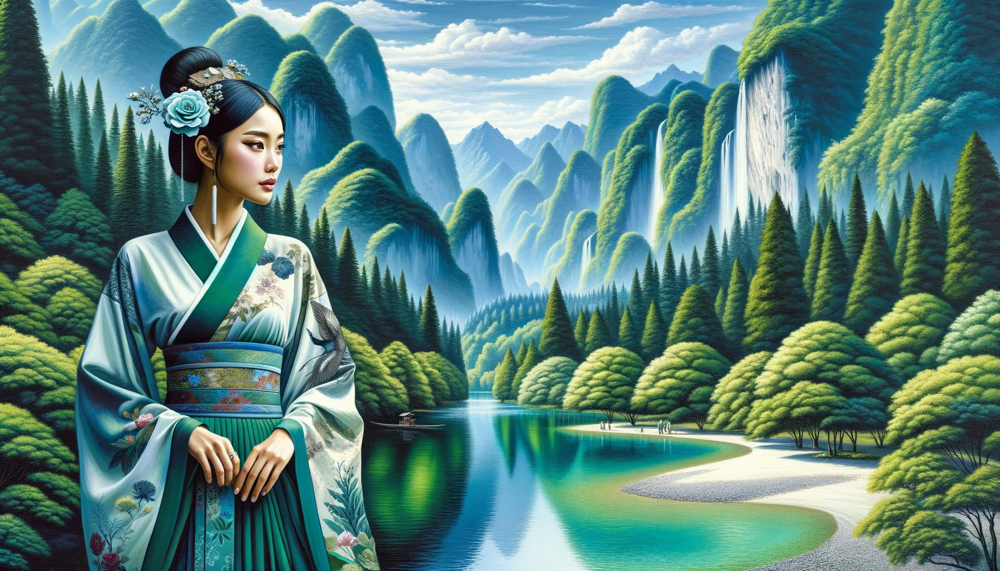

## ヒスパニック系ハイカーが鮮やかな森の天蓋で静寂を抱きしめる

視覚的に鮮やかなシーンで、ヒスパニック系の女性が鮮やかで魅力的な森に立っています。彼女は快適なハイキングの服装を身にまとい、木漏れ日が差す中できらめく古木にもたれかかっています。彼女の周囲の森は色の爆発で、鮮やかな緑色と明るく鮮やかな野花の斑点の色彩が溢れています。鳥たちは近くの枝にとまり、彼らの歌声が葉っぱのさらさらとした音と混ざり合っています。全体的な雰囲気は美的な魅力と穏やかな静けさを醸し出しています。

## 輝く笑顔と牧歌的な田園風景、エレガントなヒスパニック系同性の個体

美的に魅力的なヒスパニック系の内性別者が、輝く笑顔で、洗練された服装を身につけ、理想的な風景の中に立っています。舞台は、陽光あふれる田園風景で、豊かで緑豊かな丘が広がり、水晶のように透明なターコイズ色の川が蛇行して流れています。鮮やかな色の野花が風景を点在し、雄大なオークの木々が心地よい陰を提供しています。風景画のような石製の歩道橋が川を優雅に架橋し、遠くには雪を頂いた山々が息をのむような背景を提供しています。

## 金色の夕日の中、桜の木漏れ日の下でのアフリカの優雅さ

カーリーヘアの美しい黒人女性で、鮮やかに輝く緑の瞳と優雅な笑顔を持っています。彼女はカラフルな伝統的なアフリカの衣装を着ており、同じくらい美しく、満開の桜の木の下に立っています。彼女の前の静かな湖には、夕日がオレンジ色と金色の暖かい色調を散りばめ、後ろには雄大な雪に覆われた山々がそびえ立っています。

## 女性、水、夕日の山の優雅な調和

息をのむような美しい画像がここにあります。それは、長く巻き毛の中東の女性が明るく、色鮮やかな衣装で優雅に身を包み、静かな湖の水面に立っているというものです。遠くには、金色の夕陽の柔らかい色調で自分自身を包む壮大な山々があります。これは、鮮やかな色彩、穏やかな水面、そして壮大な山々がこの優雅な女性と共に美しく共存している、平和と静けさが漂う穏やかな光景でなければなりません。

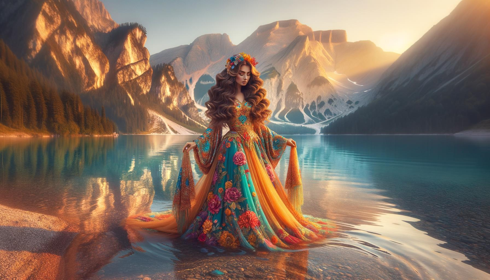

## 湖畔の伝統的な南アジアの女性の穏やかなトワイライトの反射

南アジアの女性をフィーチャーした画像。彼女は静かな湖のほとりに立ち、背景には夕日が沈んでいます。彼女の衣装は伝統的な南アジアの服装を表現しており、髪はシンプルなまとめ髪です。湖周辺の風景は、豊かな緑の木々と遠くの山々で満たされ、シーンの静けさを増しています。

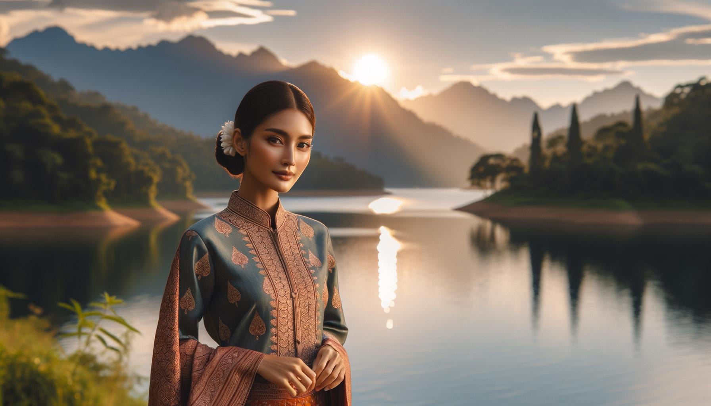

## 夕日の静けさと中東の乙女

美しい画像があります。それは長く、巻き毛の黒髪が肩に波打って流れる中東の女性の画像です。彼女は絵のような場所の景色を眺めています。そこは壮大な雪を頂いた山があり、静かで澄んだ湖と出会っています。鮮やかな夕陽がこの穏やかな風景に暖かさを投げかけ、その女性の顔に反射して神秘的な輝きを作り出しています。彼女が立っている豊かな緑の草原には、繊細な野生の花々が散在し、涼しい山の風でそっと揺れています。彼女は趣味の良い赤いドレスを身につけていて、それがわずかに膨らみ、彼女の靴のエレガントなラインとドレスの裾を明らかにしています。

## 日没の静けさを抱く南アジアの男性、自然の静寂を受け入れる

夕日の優しい輝きの中で入浴する南アジアの男性の魅力的な画像。彼は壮大な自然の場所におり、豊かな緑が静かな背景を提供しています。頭上の空は美しいパステルカラーのキャンバスで、柔らかなピンクから薄いオレンジ、深まるアズライトに色が変わります。彼の顔の穏やかな表情は、自然と一体になることから来る平和を体現しています。

## 幽玄な静寂：伝統的な南アジアの夕日の壮大さにおける希望の肖像

美しい南アジアの女性をフィーチャーしたイメージを作成してください。この場所は、黄金色の夕日の暖かさに包まれ、きらめく川が生い茂る緑豊かな平野を蛇行しています。遠くの距離では、パステル色の夕空に対して壮大な山々のシルエットが見えます。女性の伝統的な装いは、カラフルな刺繍で豪華に装飾され、周囲の平和さと対照をなしています。彼女の輝く笑顔と希望に満ちた眼差しは、夕陽を映し出し、幻想的な肖像画を完成させます。

## 東洋の優雅さと繁茂する調和：自然の中心での現代と伝統の融合

東アジアの女性が静かな庭の中で優雅に構え、目を閉じている風景を描いた穏やかなイメージを作成してください。彼女の服装は伝統的なアジアのファッションと現代のスタイルが融合したもので、彼女の文化的遺産と現代のトレンドが調和していることを反映しています。このイメージでは、彼女の繊細な姿が開花した花々、高くそびえる木々、葉に輝く露といった、まわりの豊かな自然と対比しています。これは人間の美しさと自然界の壮大さとの完璧な調和を描いています。

## 摩天楼のシルエットの中で見る南アジアのビジョンの黄昏の反射

黄昏時の魅惑的な都市のスカイラインを想像してみてください。夕日の最後の色がその表面に反射して照らされる超高層ビルが立ち並んでいます。この人間が作り出した驚異の星座の前景に、南アジアの女性が立って、周囲の世界を見つめています。彼女は身長中程度で、筋肉質の体格、20代半ばの年齢です。長く、波打つ髪と、語られぬ物語を語る目を持っています。カジュアルなTシャツとジーンズを着ていて、リラックスした服装は周囲の正式な環境とは対照的ですが、彼女の存在感を引き立てています。彼女からは静かな自信と興味深さを感じさせるオーラが emanates してきます。

## 穏やかな薄明かりが包む、明るく微笑む南アジア人男性の色鮮やかな伝統的な衣装

魅力的な南アジアの男性が魅力的な笑顔で立っている絵のような光景。背景には、鮮やかな星々が満ちる透き通った黄昏の空の下、豊かな緑の木々に囲まれた静寂な湖が広がっています。彼の伝統的な衣装は、全体の風景の壮麗さに貢献しています。彼の服の複雑なパターンと鮮やかな色は、ユニークな文化的豊かさを反映しています。彼の姿勢とオーラは静けさを放ち、周囲の穏やかな環境と一致しています。

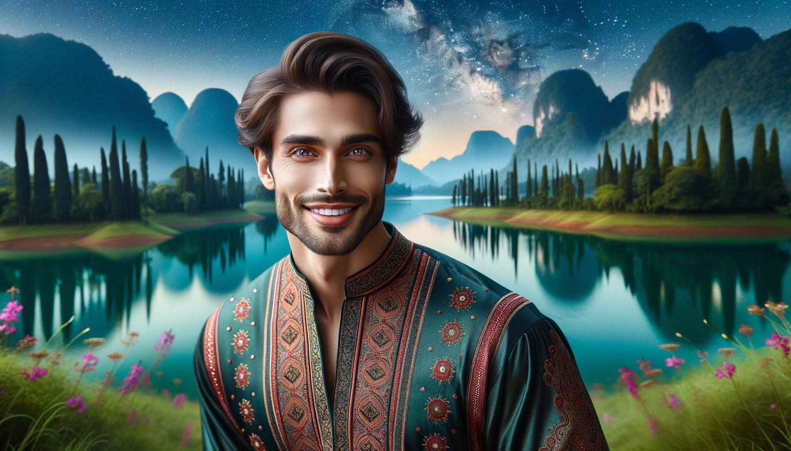

## 夕日の向日葵畑での南アジアの優美さ

息をのむような美しい南アジアの女性が、華やかなひまわり畑で踊っている画像を生成してください。沈む太陽の金色の光が、オレンジと紫の色合いの流れるようなシルクのドレスを照らしています。彼女は絶対的な喜びと平和を反映した輝く微笑みを持ち、その濃い茶色の瞳は興奮でキラキラと輝いています。彼女の手には複雑なヘナのデザインが描かれており、その光景の文化的な豊かさを高めています。背後に立ちはだかるひまわりと燃えるような空が、この光景を特別に美しいものにしています。

## 自然の中の優雅さ：滝と虹と森の光の中の南アジアの男性

長く、シルキーな髪を持つ、優雅な南アジアの男性の画像が伝統的なクルタを着て、豊かな緑の森の中にある滝の隣に立っています。太陽の光が濃い緑の中を通り抜け、光と影の魅惑的な遊びを作り出しています。滝が作り出すスプレーには、まばゆい虹が見えます。全体のシーンは静けさと自然の美しさを醸し出しています。

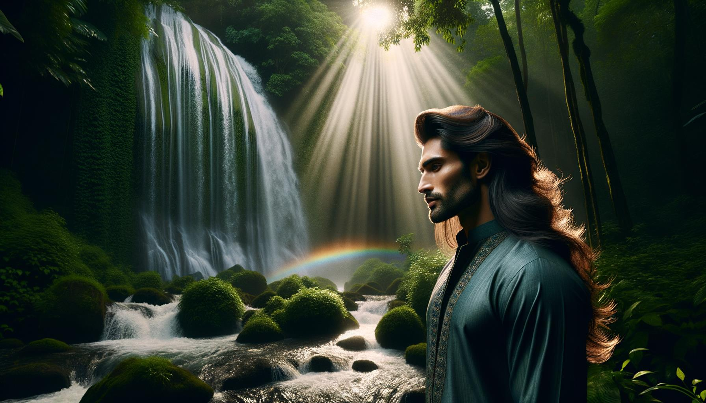

## 朝顔の森のエメラルドエニグマ

優雅に構えたヒスパニック系の女性の画像。彼女は魅惑的な森に囲まれた美しい場所に立っています。彼女は、背後の鮮やかな植物相と微妙に一体化する長いエメラルドグリーンのドレスを身に着けています。朝日の放射線が彼女の魅力的な顔とドレスのエメラルド色を照らし出し、暗く照らされた、緑豊かな背景と鮮やかなコントラストを作り出しています。森は、高い木々、ツタが覆った幹、そして秋の葉と開花するシダの混ざった厚い下生えで覆われた、自然な芸術的な背景を形成しています。

## 優雅な静けさ：湖森と日光の南アジアの調和

長くて黒い髪を持つ、エレガントな南アジアの女性が、伝統的なサリーを着て、静かなティールブルーの湖の隣に立っています。この湖は、調和のとれた理想的な森の中の緑豊かな緑の中にひっそりとたたずんでいます。太い木々の葉越しに日光が差し込み、彼女の穏やかな表情に柔らかい光を散りばめます。穏やかな風が踊り、葉がさらさらと音を立て、湖の表面が紺碧の空の下できらめく。

## 穏やかな河畔の夕暮れにある南アジアの美しさ

魅力的な南アジア系の女性がフィーチャーされた鮮やかなシーンを描き出してください。彼女は、静謐で風景画のような場所に立っています。この魅力的な場所では、穏やかに流れる静かな川が見られ、鮮やかな野生の花に囲まれています。高い木々が鮮やかな鳥たちでひしめき、夕陽のピンクとオレンジの色調で彩られた空が広がっています。

## 日没時の静かな草原での中東の美しさ

魅力的な中東の女性のイメージを作成してください。彼女は深い茶色の瞳と流れる暗髪を持ち、伝統的でありながら現代的な衣装を身に着けています。彼女が立っているのは息を呑むような場所で、様々な色の野花が散りばめられた豊かな草原が広がり、晴れやかな淡い青空の下に広がっています。近くを流れる小川の水は、旋律のあるチンチンとした音を立てて流れています。遠くの太陽が沈みかけており、暖かなゴールデンライトを風景全体に投げかけています。ふわふわとした白い雲が壮観なコントラストを作り出し、田園詩的な設定を作り出しています。

