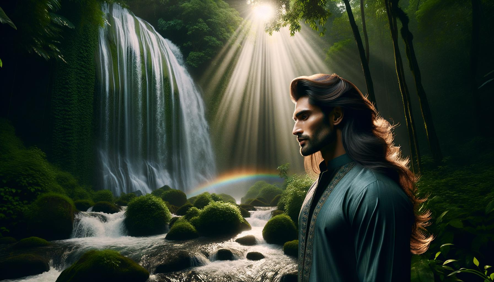

# 아름다운 사람들과 장소들

이 페이지는 2024년 2월 테스트 목적으로 다음 코드를 사용하여 DALL-E 3이 생성한 100개의 이미지를 포함하고 있습니다

https://github.com/nao7sep/yyGpt/blob/main/yyGptLibConsole/Tester3.cs

## 열대의 평온함: 석양이 내리는 해변과 흔들리는 팜 나무 사이에서 빛나는 여성

매력적인 흑인 여성의 이미지를 생성하세요. 그녀의 어깨를 덮고 있는 긴 갈색 머리카락이 곱게 휘감아 있습니다. 그녀는 평온한 환경에서 노란색의 여름 드레스를 입고 있으며, 그녀의 미소는 탁 트이고 생생합니다. 그녀 주변에는 숨 막히는 열대 해변 풍경이 펼쳐져 있습니다. 코코넛이 가득한 야자나무들이 바닷바람에 부드럽게 흔들리고 있습니다. 해는 지평선으로 점점 가라앉아, 안개와 살구색 톤의 큰 폭발을 하늘에 펼치며 저물고 있습니다. 요트를 탄 다른 섬들이 저물도록 조명에서 간신히 보이는 상황입니다. 맑은 파도가 백사장에 규칙적으로 부딪치니, 이는 자연의 조화로운 교향곡을 만들어 냅니다

## 체리 블로섬 선셋: 평온한 꽃이 피는 중에 빛나는 아름다움

긴 곱창머리와 밝고 매력적인 눈을 가진 흑인 여성이 활짝 피어난 벚꽃 나무 아래 서 있는 시각적으로 눈에 띄는 장면입니다. 해가 지고 있어 꽃잎과 그녀의 빛나는 피부에 황금빛 빛을 비춥니다. 그녀는 흐르는 흰색의 여름 드레스를 입고 있으며, 그녀의 넓은 챙의 모자는 부드럽게 한쪽으로 기울어져 있습니다. 벚꽃의 달콤한 향기가 공기를 가득 채워 아늑하고 평온한 분위기를 제공합니다. 이 매혹적인 이미지는 사람과 장소 모두에서 나타나는 미의 본질을 포착합니다

## 봄꽃 피어나는 시골 경치 속에서 석양의 세레나데를 만끽하는 중동의 아름다움

긴 곱슬 검은 머리와 갈색 눈을 가진 아름다운 중동 여성의 그림, 화려하고 다채로운 전통 드레스를 입고 아름다운 시골 풍경 속에 서 있다. 그 주변의 풍경은 무성한 초록색 언덕, 하늘을 반영하는 작고 평온한 파란 호수, 호수를 가로질러 있는 아담한 돌 다리, 완전히 핀 높고 원성한 벚나무 숲으로 이루어져 있다. 태양이 바탕으로 지고 있어, 긴 그림자를 드리우며 하늘에 곱게 실은 따뜻한 색의 화려한 배열을 그린다

## 마법의 숲에서 중동 미인과 함께하는 일몰의 평온함

매혹적인 장면이 펼쳐지고 있습니다. 긴 파동치는 머리를 가진 아름다운 중동 여성이 가볍고 선선한 드레스를 입고 서 있습니다. 그녀는 야생화로 가득 찬 화려한 숲속, 고대의 우뚝한 나무들이 있는 평온한 숲속에 서 있습니다. 인근에서는 평화로운 시냇물이 흐르고 있습니다. 해가 낮게 떠 있어 긴 따뜻한 그림자를 드리우며 풍경의 자연스러운 아름다움을 더욱 돋보이게 합니다

## 가을의 입맞춤을 받은 일본 정원에서의 우아한 남아시아 품격

정교한 전통 복장을 입은 우아한 남아시아 여성이 화창한 가을 오후에 평온한 일본 정원을 산책하고 있다. 햇빛이 붉은색과 금색의 잎사귀를 통해 들어와 자갈길에 얼룩덜룩한 그림자를 던진다. 새빨간 물고기가 헤엄치는 잉어 연못과 그 위를 가로지르는 작은 나무 다리가 장소의 평온함을 더욱 강조한다. 벚꽃나무는 풍경에 섬세한 분홍색을 더해준다

## 평온한 강변 풍경, 중동의 전통적인 아름다움이 피어나는 들꽃과 투박한 다리를 배경으로

우아한 중동 여성이 돋보이는 평온한 이미지를 생성하세요. 그녀는 어두운 색의 머리카락이 유려하게 등을 따라 내려오고, 갈색 눈이 독특하게 돋보이며, 다채로운 전통 복장을 입고 있습니다. 그녀는 푸른 강 둑에서 앉아있습니다. 주변은 무성한 식물이 우거져, 큰 나무들이 하늘에 닿으며 그들의 잎들은 햇빛이 스며들면서 패턴을 형성합니다. 화려한 야생화들이 무리지어 피어나고, 나비들이 그 주변을 날아 다닙니다. 강을 저쪽으로 푸르른 언덕이 펼쳐져 있고, 평온하고 구름이 가득한 하늘이 있습니다. 강 아래로는 작고 경치 좋은 나무 다리가 강 위에 둥근 굴곡을 그리고 있습니다. 이 장면 전체에서는 평화와 아름다움이 느껴집니다

## 번영하는 목초지에서 화려한 복장의 남아시아 신사, 오후의 메아리

남아시아 출신의 중년 남성을 특징으로 하는 이미지를 만드세요. 그는 따뜻한 미소를 지으며, 화려한 색상의 전통 의상을 입고 있습니다. 그는 그림 같은 목초지에서 늦은 오후를 보내고 있으며, 주변에는 모든 색상의 야생화가 피어 있고 배경에는 무성한 녹색 나무들이 있습니다. 햇빛이 나무잎 사이로 비치며 잔디 위에 얼룩덜룩한 그림자를 만듭니다. 반짝이는 시냇물이 목초지를 가르며 흐르고 있어 평온한 분위기를 더합니다

## 신비로운 숲의 중심부에서 중동의 우아함

환상적인 숲에서 아름다운 장면을 상상해보세요. 햇살이 무성한 푸른 잎사귀를 통해 서서히 스며들며 부드럽게 씻겨내립니다. 이 경치 좋은 장소의 중심에는 중동계의 여성이 서 있습니다. 그녀의 눈은 지혜와 평온함으로 빛나고 있습니다. 그녀는 화려한 색상으로 물들인 흐르는 듯한 드레스를 입고 있으며, 이는 주변 자연과 조화롭게 어우러져 있습니다. 그녀의 머리는 땋아서 관을 만든 모습이 평온함과 우아함을 상징합니다. 숲의 평온한 소리를 배경으로 그녀는 평온한 미소를 띠고 있으며, 이는 평화와 아름다움의 순간을 완벽하게 담아내고 있습니다

## 일본 정원에서의 남아시아의 평온함

따뜻한 갈색 눈과 새까만 머리카락을 가진 남아시아 여성의 이미지를 만들어주세요. 그녀는 밝은 색상의 튜닉을 입고 있으며, 화려한 직물 카펫에 앉아 두터운 골동품 책을 읽고 있습니다. 그녀는 평화로우며 푸른 일본 정원에 둘러싸여 있으며, 만개한 벚꽃 나무들의 향기가 공기를 가득 채우고 있습니다. 작은 돌 다리가 평화로운 잉어 연못 위로 뻗어나가, 오후 햇살을 반사하고 있습니다. 부드러운 바람이 대나무 잎을 흔들면서, 부드럽고 자연스러운 멜로디를 창조합니다

## 흐르는 강가에 동양의 전통적인 미인과 함께한 평온한 일몰

아름다운 장면을 묘사하는 매혹적인 이미지를 상세히 묘사해보겠습니다. 동아시아 여성이 전통 복장을 입고 흐르는 강 가에 서 있습니다. 그 장소는 화려한 다채로운 꽃이 가득한 나무로 표시된 푸른 식물이 둘러싸여 있습니다. 해는 멀리에 떠있어, 장면 전체를 따뜻한 황금빛으로 적셔놓습니다. 그 여성은 얼굴에 빛나는 미소를 띄어, 행복과 평온함을 전달합니다. 그녀의 시선은 숨막히는 일몰과 싱그러운 풍경을 반영하는 고요한 강으로 향해 있습니다. 전체 장면은 평영하고, 한적하며, 굉장히 아름답습니다

## 서브라임 선셋 독서 철우의 체리 블로썸 정원

장난스럽게 웃는 멋진 남아시아 남성의 이미지, 그는 평상복을 입고 있습니다. 그는 Wooden 벤치에 앉아 책을 읽는 데 몰입하고 있습니다. 그는 피어나는 벚꽃으로 가득 찬 서정적인 공공 정원에 있습니다. 정원을 둘러싼 고요한 돌 길이 무성한 초록색으로 꼬여 있고, 정원을 둘러싼 클래식한 철제 울타리가 있습니다. 이 장면을 완성하기 위해, 석양 동안 하늘의 생생한 색상을 반영하는 작은 평온한 연못이 근처에 보일 수 있습니다

## 초원의 새벽 평온함, 전통 의상을 입은 남아시아 여성이 자연의 아름다움에 둘러싸여 있다

밝은 미소를 지닌 남아시아 여성이 전통 복장을 입고, 새벽의 매혹적인 초원에 둘러싸여 있는 이미지를 만드십시오. 그 초원은 푸른 초목과 꽃, 그리고 조용히 흐르는 평온한 시냇물로 장식되어 있어, 평화롭고 고요한 느낌을 주고 있습니다. 태양은 수평선을 눈앞에 두고 있어, 풍경 전체에 부드럽고 따뜻한 핑크색과 주황색의 빛을 비추고 있습니다. 그 여성은 고요히 흐르는 냇가에서, 그녀로부터 흐르는 기쁨과 평온함을 뿜어내며 서 있습니다

## 일본 정원에서의 남아시아 미인의 봄 마법

길고 검은 머리를 가진 30대 중반의 남아시아 여성이 선명한 전통 의상을 입고 있는 매혹적인 이미지입니다. 그녀는 봄철에 만개한 일본 정원이라는 매혹적인 장소에 서 있으며, 주변에서는 벚나무가 핑크색 꽃잎을 흩날리고 있습니다. 그녀 근처에는 평화롭고 조용한 연못이 있습니다. 나뭇잎 사이로 비치는 부드러운 햇빛이 전체 장면에 꿈결 같은 고요한 빛을 던져주며, 그녀의 화려한 의상 색깔과 주변의 자연 아름다움을 돋보이게 합니다

## 가을의 광경 속에서 빛나는 중동의 우아함이 순수한 계곡의 황혼에 빛나다

파도치는 머리와 우아한 미소를 가진 매력적인 중동 여성의 이미지를 만드세요. 그녀는 숨막히는 장소에 서 있다 - 수정처럼 맑은 강이 흐르는 푸르른 계곡에. 그녀를 둘러싼 곳에는 밝고, 다채로운 가을 잎이 있는 높은 나무들이 강 위에 반영되고 있다. 먼 거리에서는 맑은 푸른 하늘을 배경으로 눈을 덮은 산들을 볼 수 있어 전체 풍경의 아름다움을 더하고 있다. 해가 지고 있어, 계곡에 황금빛을 더하고 평온하고 조용한 분위기를 만들어냅니다

## 평온한 해질녘: 숲을 내려다보는 남아시아의 우아함

긴 머리를 흐르듯 펼친 아름다운 남아시아 여성이 전통적인 사리를 입고 언덕 위에서 심연적으로 푸른 숲을 가득 찬 웅장한 풍경을 내다보는 멋진 장면입니다. 바람이 그녀의 사리와 머리카락을 부드럽게 당기면서 그녀는 평온한 전망을 바라보고 있으며, 그녀의 얼굴은 석양의 부드러운 빛에 의해 밝혀지고 있습니다. 작고 반짝이는 시냇물이 숲을 꿰고 지나가며 석양의 빛깔을 반사합니다. 이 지역의 평온한 침묵이 느껴지며, 이것은 전반적으로 평온하고 이상적인 분위기를 더합니다

## 황혼의 피어난 정원에서 우아한 중동 여성

중동계 여성의 인상적인 초상화로, 그녀는 우아한 옷을 입고 풍경이 아름다운 배경 속에 서 있습니다. 그녀는 알록달록한 다양한 색상의 꽃들이 활기차게 피어 있는 아름다운 정원을 통과하는 석조 길 위에 서 있습니다. 높고 오래된 나무들이 넉넉한 그늘을 제공하고, 그녀의 뒤에는 황금빛 석양 속에서 웅장하게 솟아있는 그림 같은 산맥이 있습니다

## 호수에서 석양을 바라보는 우아한 아름다움

우아한 흑인 여성의 모습이 돋보이는 사랑스러운 장면을 그려주세요. 그녀는 평온한 자연 환경에서 우아하게 포즈를 취하고 있습니다. 태평스러운 푸른 호수 옆에 서 있을 수 있으며, 뒷 배경에는 우뚝 솟은 초록 산이 있습니다. 하늘은 맑고 푸르며, 해는 서서 따뜻하고 부드러운 빛을 제공하며, 장면 전체를 섬세한 파스텔 색조로 물들입니다. 그녀는 하얀 여름 드레스를 입고 있으며, 휘날리는 긴 곱슬머리를 늘어뜨려 전체 이미지에 시대를 초월한 아름다움을 더합니다

## 사막의 황혼 고독: 일몰빛 감성 속에서 인간과 자연이 어우러진 조화

일몰에 배경을 둔 숨막히는 장면을 상상해보세요. 이 경치의 중심에는 중동 남성이 서 있고, 선셋의 매혹적인 색상들이 사막의 주황색 모래 언덕과 이어져 보이는 것에 감탄하고 있습니다. 하루 종일 태양에 데운 가벼운 모래는 부드러운 따뜻함을 발산하며, 그 남자의 얼굴에 묻어나는 평온한 고요함을 울려주는 것 같습니다. 태양의 마지막 광선이 그의 얼교을 비추며, 바람이 그의 검은 머리결을 부드럽게 흔들어 주는 것이 마치 이 유난히 뛰어난 남자와 자연의 조화를 이루는 초상화에 마지막을 더하는 것처럼 보입니다

## 열대우림의 색채 속에서 남아시아의 평온함과 쏟아지는 폭포

남아시아 여성이 푸른 열대우림의 이상적이고 평온한 공간에 서 있는 매혹적인 이미지를 만드십시오. 그녀는 전통적인 복장을 입고 있으며, 짙은 머리카락을 땋았고, 평온함과 안정감을 불어넣습니다. 주변의 숲은 다양한 색깔의 녹색과 열대 색의 꽃들로 가득 차 있습니다. 배경에 있는 명상적인 폭포는 장면에 고요함을 더하며, 빛나는 나비 가족들이 주위를 맴돌며 풍경에 환상적인 느낌을 더합니다

## 체리 꽃 사이의 고요한 아름다움, 일본 정원에서의 남아시아의 우아함

남아시아 여성이 평화로운 일본 정원에서 벚꽃이 만발한 계절에 눈에 띄는 이미지를 만드십시오. 그녀는 푸른색과 금색의 화려한 전통적인 김ONO를 입고 있으며, 국화와 공작의 사실적인 패턴이 그려져 있습니다. 이 여성은 하늘을 채우고 그 주변에 있는 땅을 휩쓸고 있는 연분홍색 벚꽃의 진하게 떨어지는 모습을 평온하고 고요한 자세로 감상하고 있습니다. 작은 부드러운 개울이 근처에 흐르고 있으며, 그 표면에는 벚꽃의 섬세한 반영이 보입니다. 전통적인 돌 랜턴은 현장에 평온한 우아함을 더해줍니다

## 평온한 이탈리아 석양에서의 동양의 우아함

놀랄 만큼 아름다운 동양의 여성이 바람에 부드럽게 흔들리는 긴 검은 머리를 흔들며 일몰 시간에 평화로운 이탈리아 시골 풍경 속에 서 있다. 그녀는 전통적인 흰 드레스를 입고 있으며, 그녀의 눈은 따뜻함과 기쁨으로 빛나고 있다. 그녀를 둘러싼 곳은 푸르른 풀밭, 포도밭, 그리고 따뜻한 황금빛 태양 아래에서 말끔히 정돈된 오두막 집이 굴곡진 언덕 가에 자리잡고 있다. 이 평온한 장면은 평온함과 아름다움을 발산하며, 자연과 인간 사이의 조화로운 공존의 이미지를 만들어 낸다

## 평온한 석양: 롤링 에메랄드 언덕 사이에서 라벤더와 파란색의 히스패닉 미인

긴 곡선 모양의 머리와 빛나는 미소를 지닌 히스패닉 여성의 이미지를 만드세요. 그녀는 일몰 시에 평온하고 아름다운 풍경 속에 서 있습니다. 장소는 라벤더색 하늘 아래에 놓인 둥근 에메랄드 색 언덕이 특징인 곳입니다. 그녀의 옷에는 특별한 주의를 기울여야 합니다 - 라벤더색과 로열 블루 색조의 여름 드레스로 세련되게 잘라 낸 것은 매혹적인 배경을 보완합니다

## 잘생긴 중동 남성이 석양에 무성한 풍경의 평온함을 포옹합니다

다음 텍스트를 번역하겠습니다: 잘생긴 중동 남자의 이미지를 생성합니다. 그는 검은 파도치는 머리에 캐주얼한 옷을 입고 있으며, 매력적인 풍경을 배경으로 서 있습니다. 이 풍경은 푸르른 식물이 우거진 고요한 곳으로, 반짝이는 강이 천천히 굽이치고 있으며 웅장한 산맥이 수평선을 장식하고 있습니다. 그 위에는 노을빛으로 물든 하늘이 그에게 신비한 빛을 비추고 있습니다. 그곳에서 이 사람은 주변의 숨 막히는 자연을 바라보며, 얼굴에 만족한 미소를 띄우며 주변의 평화로움의 아름다움을 내포하고 있습니다

## 터쿼이즈 호수 옆에서의 황혼의 우아함

장발의 검은 머리를 가진 우아한 중동 여성의 그림 같은 이미지, 그녀는 선명한 빨간색 드레스를 착용하고 있습니다. 그녀는 고요한 터키색 호수 가장자리에 서 있으며, 모든 녹색의 색조를 보여주는 조밀한 숲에 둘러싸여 있습니다. 해는 배경에서 지고 있어, 풍경 전체에 따뜻하고 황금빛 빛을 던져, 평온하고 아름다운 분위기를 조성하고 있습니다

## 신비로운 사막 황혼의 공주와 마법의 풍경

아찔하고 신비로운 중동 여성이 매혹적인 자연 풍경 속에 서 있는 이미지를 만드십시오. 그녀는 아름다운 보석과 복잡한 패턴이 장식된 화려한 터번을 쓰고 있습니다. 그녀의 복장은 그녀 주변의 노을 색상을 반영하는 다채로운 흐르는 드레스입니다. 풍경은 주황색, 보라색, 분홍색의 다양한 색조가 푸른 하늘과 섞여 있습니다. 웅장한 산들이 배경에 솟아 있고, 눈의 조금이 산꼭대기를 덮고 있으며, 전경은 반짝이는 시냇물이 무성한 들을 따라 구불거리며 흐르며, 평온하고 숨 막히는 아름다움을 뽐내는 장면을 만들어냅니다

## 일몰시의 벌판에서 남아시아의 평온함

매혹적인 개인의 이미지, 그는 30대 중반이며, 중간 길이의 머리를 갖추고 있고 얼굴에는 부드러운 미소가 띄어 있습니다. 그는 편안하고 캐주얼한 의상을 입고 있으며 동등하게 놀라운 위치에 있습니다. 이 환경은 해질 녘의 황금빛 빛을 받아 평화로운 초원입니다. 우아한 나무가 이 장면을 구성하고, 그들의 잎은 바람에 살랑거립니다. 먼 산이 지평선을 장식하며, 그들의 봉우리는 태양의 마지막 광선에 입맞춰져 있습니다. 자연의 평온한 소리가 공기를 가득 채우며, 평온함과 아름다움의 장면을 그립니다

## 황금빛 초원에서 빛나는 미소: 신비로운 일몰과 산봉우리 속의 중동 여성

아름다운 풍경의 장소에서 우아하게 자리 잡은 중동 여성의 이미지를 상상해 보십시오. 그녀는 밝은 미소와 따뜻함을 내뿜는 반짝이는 갈색 눈을 자랑합니다. 그녀는 다채로운 전통 복장을 입고 있으며, 머리에는 아름다운 무늬의 스카프를 쓰고 있습니다. 그녀가 서있는 곳은 초현실적이며, 저녁노을의 부드러운 황금빛에 목욕하는 곳입니다. 그것은 초원이며, 푸르고 초현실적이며, 부드러운 바람에 흔들리는 생생한 들꽃이 있습니다. 멀리서는 하루의 마지막 불빛으로 키스하는 웅장한 산봉우리를 볼 수 있습니다

## 가을의 고요함: 일본 정원에서의 남아시아 은혜

가을 동안 평온한 일본 정원에서 우아하게 서 있는 전통 복장을 입은 남아시아 여성의 이미지를 생성하십시오. 정원의 색상이 그녀의 전통적인 밝은 복장과 대조를 이룹니다. 그녀는 주변의 가을 색조 조화를 감탄하고 있으며, 바삭바삭한 빨간 단풍이 떨어지는 단풍나무, 배경에 있는 정겨운 돌 랜턴, 그리고 발 아래에 있는 평온한 잉어 연못이 있습니다

## 중동 목초지의 평온한 황혼

고요한 중동 여성의 장면이다. 그녀는 오래되고 뒤틀린 나무 그늘 아래에서 평화롭게 앉아 있다. 그녀는 화려한 전통 의상을 입고 빛나 보인다. 장소는 화려한 들꽃으로 가득 찬 마법같은 초원이다. 태양이 지며, 풍경 전체에 고요한 황금빛을 던진다. 멀리에는 웅장한 눈 덮인 산들이 있다. 가벼운 바람이 꽃잎들을 흔들며 부드럽고 안정감 있는 분위기를 만든다

## 열대적인 빛남과 폭포의 평온함 속에서 스타일리시한 아름다움

곱게 무성한 열대림을 지나가는 길 위에 서 있는 매력적인 흑인 여성이 곱게 짜여진 머리를 하고, 우아한 드레스를 입고 있습니다. 밝게 물든 이국적인 새들이 근처의 나무 위에 앉아 있다. 먼 거리에서는 웅장한 폭포가 절벽을 따라 내리쬐면서 이 평온한 풍경에 고요한 사운드트랙을 만들어냅니다. 햇살이 터널을 관통하여 얼룩진 그림자를 던지고, 풍성한 식물을 황금빛으로 비춰줍니다

## 중동의 절벽에서의 여름 평온함

아름다운 절벽을 뒤로 하여 푸른 바다를 내려다보는 돌 위에서 균형을 잡고 있는 중동계 남성의 사진. 그는 파스텔 톤의 단추셔츠, 카키색 반바지, 쪼리를 입고 있어 간결하면서도 매력적인 여름 차림을 완성하였고, 그로 인해 그의 노력없이 시크한 외모가 강조되고 있다. 그의 눈동자는 그 앞에서 펼쳐지는 평온한 풍경의 아름다움을 반영하고 있다. 흩어져 있는 구름 사이로 들어오는 햇빛이 맑고 깨끗한 물 위에 놀라운 빛과 그림자의 연출을 그려낸다. 이 같은 순간적인 평온함은 진정한 축복이다

## 오아시스에서 볼 수 있는 석양의 중동 고요함

중동 여성이 화려한 설정에 있는 이미지를 만드십시오. 그녀는 우아하게 차려 입었으며, 전통적인 중동 의상에 현대적인 영향을 더했습니다. 그녀는 푸른 오아시스 근처에 서 있으며, 태양이 곧 지려하고 있어 경치가 주황색과 금색으로 아름답게 반짝입니다. 고요하고 빛나는 물체가 가까이에 있을 수 있으며, 소규모의 호수일 수 있습니다. 그것은 경치 좋은 풍경과 빠르게 어두워지는 별이 가득한 하늘을 반영합니다. 환경의 고요함과 그녀의 평온한 표정은 평화와 만족감의 분위기를 발산합니다

## 비옥한 열대우림의 에메랄드 눈빛

긴 땋아 놓은 머리와 에메랄드 그린 눈을 가진 아름다운 흑인 여성의 이미지가 인상적인 장소에서 자신감 있게 포즈를 취하고 있습니다. 설정은 생생한 잎과 밝은 열대 꽃으로 가득 찬 푸른 열대우림입니다. 그녀 주변의 색상은 활기차고 선명하며, 캐노피를 통해 들어오는 햇빛이 숲 바닥에 매혹적인 패턴을 만듭니다. 배경에서는 햇빛 아래에서 빛나는 물을 가진 쏟아지는 폭포가 볼 수 있으며, 평온하고 고요한 분위기를 조성합니다

## 황금빛 햇살 아래 푸르른 꽃의 에덴에서 느껴지는 중동의 평온함

긴 곱창머리를 한 중동 여성을 묘사하세요. 그녀는 다양한 색상의 꽃들로 가득 찬 푸르른 정원 안에 있습니다. 흐르는 듯한 파스텔색 드레스를 입고 있으며, 꽃이 만발한 벚나무 아래 화려한 철제 벤치에 앉아 빅토리아풍의 소설을 몰두하여 읽고 있습니다. 해는 지고 있어, 따뜻한 금빛 빛을 장면 위에 비추고 있습니다. 배경에서는 자유롭게 돌아다니는 공작이 보입니다. 이 장소의 평온함과 경치의 아름다움이 정말로 매혹적입니다

## 일몰 시 분주한 남아시아 거리에서 작업하는 중동 예술가

아름다운 중동 남성 예술가가 화려하고 색색깔의 건물로 가득찬 조감독적인 남아시아 거리에 서 있는 이미지를 만드십시오. 그는 전통적인 쿠르타를 입고 있으며 손에는 붓을 들고 있습니다. 부드러운 바람이 불어 그의 옷이 바스락거립니다. 해가 지고 있어, 따뜻한 오렌지빛으로 장면에 빛을 던집니다

## 천상의 평온: 아시아 남자의 성찰적인 알파인 호수 고독

우아한 외모를 가진 매력적인 아시아 남성이 평온한 알파인 호수 옆 바위에 편안하게 앉아 있는 숭고한 장면입니다. 이 남성은 패셔너블한 캐주얼 의상을 입고 있으며, 그의 사색적인 태도는 평온감과 안정감을 나타냅니다. 주변 지역은 높은 눈 덮인 산들이 호수의 유리처럼 반짝이는 표면에 반영되어 있고, 푸른 상록수들이 주변에 흩어져 있어 웅장함을 표현하고 있습니다. 조용한 물, 깨끗하고 맑은 공기, 알파인 새들의 부드러운 날개짓은 자연과의 조화와 평온감을 만들어냅니다

## 중동 숲의 신비한 평온함

긴 갈색 머리가 어깨를 뒤덮고 있는 중동 여성의 굉장한 표현이 놀랍게도 펼쳐져 있습니다. 그녀는 높이 솟은 나무들과 생생하게 피어있는 꽃들이 뒤섞인 한적한 숲속에 서 있다가 뒷배경에는 폭포가 흐르고 있습니다. 빛이 푸른 잎사귀를 통과하면서 그녀의 얼굴에 분산된 패턴을 던집니다. 그녀는 부드러운 바람에 흔들리는 긴, 생생한 드레스를 입고 있습니다. 그녀는 지평선에 있는 먼 산들을 바라보고 있으며, 그녀의 얼굴에는 평온함과 만족감이 가득한 표정이 떠오릅니다

## 오렌지 드레스를 입은 여성이 구릉진 언덕에서 석양을 포옹하고 있다

그림 같은 풍경이 굴곡진 계곡과 화려한 일몰로 펼쳐지고, 그 하늘은 빨강, 주황, 보라색의 색조로 채워진다. 이 경외감을 일으키는 장소에서, 어두운 머리를 풀어 놓은 아시아 여성이 서서 풍경을 바라봅니다. 그녀는 주황색 여름 드레스를 입고 있으며, 부드러운 원단이 일몰의 색상을 반영하고 있다. 그녀의 빛나는 미소는 평화롭고 만족스러움을 전달하고, 주변의 자연 아름다움을 즐기고 있다. 부드러운 바람이 그녀의 드레스와 머리카락을 흔들며, 평온한 분위기를 더 덧붙이고 있다

## 위대한 풍경 속에서 벚나무 아래에서 아름다운 히스패닉 미인

시각적으로 눈부신 한 히스패닉 여성의 이미지로, 그녀는 흐르는 같은 밤색 머리, 반짝이는 헤이즐빛 눈동자를 가지고 있으며, 여름 드레스를 입고 있습니다. 꽃이 만발한 벚꽃 나무 그늘 아래에서 여유롭게 쉬고 있습니다. 그 주변은 드넓은 초록색 초원, 야생화로 점철된 탁 트인 풍경이며, 멀리서는 고요한 푸른 호수와 눈 덮인 산들이 보입니다. 모든 것은 맑은 파란 하늘 아래에서 이루어지고 있습니다

## 우아함과 탐험: 평온한 해안 설정 속에서 화려한 스트릿웨어를 입은 남아시아 여성

우아한 거리 복장을 입은 남아시아 여성의 인상적인 이미지, 그녀는 놀라운 장소에서 서 있습니다. 꽃으로 덮인 높은 겸자, 밝은 태양 빛 아래에서 그녀를 상상해보세요. 그녀는 패셔너블한 핸드백을 들고 있으며, 호기심 가득한 눈으로 주변의 아름다움을 탐험하고 있습니다. 풍경은 조약돌 길이 멀리 푸른 바다를 향해 이어져 있으며, 양쪽에는 무성한 녹색 식물이 있습니다. 이 장소는 평온한 분위기를 발산하며, 부드러운 파스텔 톤과 생기 넘치는 색조의 포괄적인 색상 팔레트가 봄 아침의 신선함을 불러일으킵니다

## 중동의 전통 복장을 입은 아름다움이 푸르른 초목과 일몰의 폭포 가운데에

매력적인 중동 여성의 세부적인 이미지를 만드십시오. 그녀는 따뜻한 미소를 짓고 있으며, 다채로운 전통 복장을 입고 있습니다. 그녀가 서 있는 곳은 마력적인 장소로,

## 반짝이는 미소가 묻어나는 에메랄드 숲: 자연의 둥지를 장식하는 자주색 남아시아의 미모

빛나는 미소를 지닌 남아시아 여성이 밝은 자홍색의 전통 의상을 입고 있으며, 그녀는 푸르른 숲속에 선 멋진 풍경이 펼쳐져 있습니다. 다양한 색깔의 낙엽으로 장식된 숲 바닥과 높고 우뚝한 나무들 사이로 쏟아져 나오는 햇빛이 이 곳을 더욱 아름답게 만들고 있습니다. 공기는 조용한 자연의 소리, 새들의 지저귐, 그리고 부드러운 바람이 나뭇잎 사이로 휘몰아치는 소리로 가득 차 있습니다. 이러한 그림 같은 풍경은 이끼가 낀 바위 위로 흘러내리는 먼 물줄기의 폭포로 인해 더욱 향상되며, 그 평온한 소리가 숲의 교향곡과 어우러져 있습니다

## 화려한 남아시아 정원 풍경에서의 우아한 우아함

그림 같은 장소에서의 아름다운 장면을 상상해보세요. 우아함과 뛰어난 카리스마로 눈에 띄는 한 남아시아 여성. 그녀의 차림새는 복잡한 패턴과 풍부한 질감이 가득한 생기 넘치는 사리입니다. 그녀는 당당히 서있고, 그 자세는 우아함으로 빛나고 있습니다. 배경은 매혹적인 정원으로, 푸르름이 물씬하고 화려합니다 - 지저귀는 새들의 평화로운 교향곡에 자신을 녹여보세요. 파란색과 분홍색으로 물든 화려한 꽃들이 피어나고, 웅장한 나무들의 나뭇잎이 속삭이는 소리. 아마도 부드럽게 흐르는 개울이 근처에 있을지 모르며, 이 평화로운 환경에 다정한 멜로디를 던져 줍니다. 그야말로 숨막히는 비전!

## 자연의 화려함 속에서 중동 탐험가: 다채로운 해안선에서의 평온함

중동계인의 이미지가 성중립적인 모습으로 보입니다. 그들은 무척이나 아름다운 자연 속에 서있으며, 푸른 잔디와 다양한 색의 야생화로 둘러싸여 있습니다. 멀리서는 밝은 푸른 바다가 바위투성이의 해안선을 껴안고 있습니다. 하늘은 밝은 청색으로, 지는 해가 주는 부드러운 분홍빛이 뿌려져 있습니다. 이 사람은 편안하면서도 세련된 옷을 입고 있으며, 풍경을 바라보는 표정은 평화롭고 만족스러워 보입니다. 그는 완전히 이곳의 고요함과 아름다움을 즐기고 있는 것 같습니다

## 해안 일몰을 내려다보는 중동의 우아함

그녀는 30대 중반의 아름다운 중동 여성의 이미지를 상상해보세요. 그녀는 평화로운 해안 마을을 내려다보는 화려하게 꾸며진 발코니에 서 있습니다. 그녀는 우아한 긴, 흐르는 듯한 아쿠아마린 드레스를 입고 있고, 까맣고 곱게 말린 머리카락을 풀어 허공에 살랑거리게 하고 있습니다. 그녀의 짙은 갈색 눈은 멀리를 사색하면서 석양의 화려한 빛깔을 반영하고 있습니다. 아래쪽의 마을은 하얀 석고 건물들, 푸른 야자수들, 그리고 고요한 청색 바다를 향해 이어지는 골목길들로 구성되어 있습니다. 하늘은 포근한 주황색, 핑크색, 자주색의 폭발로 가득하고, 석양은 황금빛의 찬란한 광선을 그림 같은 마을 위로 쏟아냅니다

## 우아함과 평온함, 생생한 풍경 속에서 묘사되는 남아시아의 우아함, 파스텔 석양 하늘 아래

남아시아 여성이 눈부신 화려한 풍경 속에 서 있는 그림을 만드세요. 그녀는 우아함과 평온함을 발산하며, 그녀의 눈은 자비롭고 친절함을 반영합니다. 그녀의 머리는 길고 뒤로 풀어 묶여 있습니다. 그녀는 단순하지만 우아한 전통 복장을 입고 있어 그녀의 아름다움을 더욱 돋보이게 합니다. 그녀를 둘러싼 풍경은 숨 막히게 아름답고, 꽃들이 만발한 초원이 부드러운 파스텔 노을이 그려진 하늘 아래 웅장한 산맥으로 펼쳐져 있습니다

## 남아시아 모험가의 일몰에서의 평온한 활력

말랑말랑한 언덕, 맑은 호수, 그리고 하늘을 채우는 화려한 일몰을 담아낸 매혹적인 이미지입니다. 앞쪽에는 남아시아 출신의 운동형이 강인한 남성이 편안한 야외 복장을 입고 무심코 서있습니다. 그의 얼굴에 떠 있는 미소는 이 경치 좋은 초상화의 평온함과 매력을 더욱 끌어올립니다

## 중동의 역사와 자연 속에서 숨막히는 아름다움

시각적으로 매력적인 중동 여성이 경외감을 불러일으키는 장소에 서 있다. 그녀의 표정이 무척 풍부한 검은 눈동자와 부드러운 바람에 흩날리는 까맣고 긴 머리가 있다. 그녀의 전통 복장은 다양한 색상의 조화롭게 섞여 있고, 그 복잡한 무늬가 이 지역의 풍부한 문화를 고스란히 보여준다. 장소는 으레 고요하고 평화로운 물체와 녹색 공원이 화려하게 조화를 이루며, 골든 선라이트 아래에서 반짝이는 고대 건축물 또한 경이롭다. 시선이 머무는 곳마다 생명의 반짝임이 있다 - 꽃잎의 모습, 노래하는 새의 날갯짓, 또는 부드러운 바람의 속삭임에서

## 평온한 일몰, 다채로운 시골에서 평온함을 즐기는 남아시아 여성

남아시아 여성이 화려한 풍경의 평온함을 만끽하는 세부적인 이미지를 만드십시오. 그녀는 생생한 들판에 가득 찬 푸른 초원에서 위치하고 있으며, 이는 부드러운 바람에 흔들립니다. 머리 위로는 푸른 하늘이 황금색과 분홍색으로 변함에 따라 놀라운 하늘이 변화합니다. 그녀는 웃음을 띠면서 편안하고 전통적인 복장을 입고 있으며, 이는 그녀의 주변의 진정한 아름다움을 반영하는 즐거움을 갖게 합니다

## 연못의 황혼에서 남아시아의 우아함

긴 파마머리를 한 남아시아 여성이 화려하고 전통적인 복장을 입고 고요한 연꽃 연못 위의 다리에 서 있는 이미지를 만드십시오. 장면은 석양의 따뜻한 빛에 포근하게 감싸져 있으며, 하늘은 보라색, 주황색, 빨간색의 빛깔로 물들어 있습니다. 고요한 물은 하늘의 화려한 색상을 반영하고, 수련 잎들이 물면에 부드럽게 떠 있습니다. 가까운 거리에는 전통적인 돌등이 연못을 따라 길을 이루며, 그들의 부드러운 빛이 평온한 분위기를 더합니다. 장면을 완성하려면 만개한 벚나무가 연못을 둘러싸며, 그들의 꽃잎이 땅에 아름다운 분홍색 카펫을 만듭니다

## 무지개 빛 키스를 받은 폭포와 무성한 푸른 초원 속에서의 남아시아 우아함

시각적으로 매력적인 장면에서 남아시아 여성이 웅장한 폭포 옆에 서 있다. 그녀는 주변의 무성한 녹색과 잘 어울리는 생생한 전통 복장을 입고 있다. 그녀의 얼굴은 근처 나무들을 통과하는 부드럽고 자연스러운 빛으로 비춰진다. 폭포는 세련되게 강렬하게 물을 떨군다, 섬세한 안개를 공기 중으로 보내 태양광을 굴절시키고 무지개를 형성한다. 이 장면은 평화롭고, 고요하며, 생명이 가득하다. 정말로 자연의 경이와 다양성의 아름다움을 전시하는 장면이다

## 풍성한 중동 정원의 천상의 우아함

우아한 중동 여성이 어두운 생기 넘치는 머리와 깊은 갈색 눈을 띠고 평화로운 울창한 정원에서 느긋하게 쉬고 있습니다. 햇빛이 녹색 나뭇잎 사이로 비쳐서 그녀를 둘러싼 새빛나는 꽃들을 비춥니다. 부드러운 바람이 그녀의 옷을 흔들어 신비한 느낌을 더합니다. 가까이에는 컬러풀한 공작이 우아하게 거닐며, 그들의 반짝이는 깃털이 번짐답니다. 평화로운 표정으로 그녀는 주위의 자연의 아름다움에 빠져 있습니다

## 중동의 일몰의 고요함이 피어나는 꽃들과 웅장한 산맥 사이에서

길고 광택 나는 검은 머리를 가진 중동 여성이 유려하게 흘러내리는 수제 로브를 입고 편안하게 있는 매혹적인 장면입니다. 그녀는 푸른 초목과 생동감 넘치는 야생화로 둘러싸인 평화로운 장소에 자리하고 있습니다. 태양이 부드럽게 지고 있어, 평온한 풍경에 따뜻한 황금빛을 던지고 있습니다. 평화로운 산맥이 멀리서 솟아오르며, 경치의 아름다움을 더합니다. 평온과 선경의 붓으로 그린 그림, 자연과 인간의 숭고한 상호작용입니다

## 남아시아 여성의 고요한 몽상, 푸른 소나무와 웅장한 눈 덮인 산봉우리 속에서

석양의 부드러운 빛으로 비춰진 남아시아 여성의 인상적인 장면. 그녀는 어깨 높이의 파도치는 머리를 하고 있고, 전통적인 옷을 입고 있습니다. 그녀는 평온한 호수의 매혹적인 풍경을 바라보고 있으며, 높은 소나무로 둘러싸인 푸르고 무성한 숲에 둘러싸여 있다. 멀리서는 웅장한 눈 덮인 산들이 맑은 푸른 하늘 아래로 높이 솟아있다. 이 평온한 장면은 여성의 평화로운 표정과 경치의 생생한 색상에 의해 강조되어, 차분한 기분을 자아낸다

## 일몰의 화려함과 생동감 넘치는 자연 속의 중동 왕조의 위엄

아름다운 중동 여성의 이미지를 만드십시오. 그녀는 흐르는 검은 머리와 뚜렷한 눈을 가지고 있으며, 전통적인 복장을 착용하고 있습니다. 그녀는 아름다운 자연 풍경에 둘러싸여 위치하고 있습니다. 이로써 가까이에는 흐르는 폭포, 다양한 생동감 있는 식물 생활이 있으며, 넘실대는 초록색이 접목되어 있습니다. 해는 지고 있어, 주변을 따뜻한 오렌지색 빛으로 비추며, 자주색과 빨간색의 꽃을 강조하고 있습니다. 이 사람은 풍경을 통과하는 길 위에 서 있으며, 일몰의 빛나는 색상에 쓸려 있으며, 그것의 평화로운 고요함을 미러링합니다

## 히말라야에서 사프란의 새벽녘의 평온함

매혹적인 남아시아 여성이 웅장한 히말라야 산맥을 배경으로 서 있으며, 일출의 색깔로 빛나고 있습니다. 그녀는 황금 장식이 있는 사프란색의 새리를 우아하게 입고 있습니다. 그녀의 검은 머리는 전통적인 맹 티카로 장식되어 있습니다. 시원한 아침 바람이 그녀의 머리와 새리를 부드럽게 흔들어, 전체 장면에 움직임의 감각을 더하고 있습니다

## 오번 뷰티가 아시아 가든의 조화 속에서 봄을 포옹합니다

봄철에 평온한 아시아 정원의 아름다운 풍경을 보여주는 이미지를 만드십시오. 이 장면에서는 눈이 멎을 만큼 아름다운 백인 여성이 그녀를 둘러싼 아름다움을 감상하고 있습니다. 그녀는 긴 파장 머리, 생생한 눈, 그리고 그녀의 내면의 아름다움을 증언하는 따뜻한 미소로 특징 지어집니다. 그녀는 현대적이고 전통적인 의상을 섞어 입고 있어 문화의 조화를 상징합니다. 정원은 개화하는 벚나무로 가득차 있으며 그들의 꽃잎이 부드럽게 떨어지고 있습니다. 또한 고이 연못과 클래식한 나무 다리가 있어 아시아 풍경의 영원한 아름다움을 반영하고 있습니다

## 사파이어 세레나데의 평온함 중국의 우아함이 꽃들 사이에서 브릿지와 눈 덮인 봉우리

매력적인 동아시아 여성의 이미지를 만드세요. 그녀는 유려하게 흘러내리는 칠흑과 같은 머리와 부드럽고 친절한 눈을 갖추고 있으며, 평온한 미소를 띠고 있습니다. 그녀는 황금 자수로 장식된 사파이어 블루색의 중국 전통 치파를 우아하게 입고 있습니다. 뒤에는 바람에 부드럽게 흔들리는 생생한 벚꽃 나무가 있고, 오래되고 낡은 돌 다리가 평온한 연꽃 연못을 가로지르고 있습니다. 원거리에는 설파 의상을 한 웅장한 산들이 보이며, 푸른 하늘 아래에는 솜털 같은 하얀 구름이 천천히 떠돕니다. 이 경치 좋은 풍경을 평온함과 안정감이 감싸고 있습니다

## 황금빛 저녁 노을에서 남아시아의 우아함이 유럽의 매력을 만나다

미적으로 매력적인 중년 남아시아 여성의 이미지, 화려한 전통 의상을 입고 역사적인 유럽 도시의 화려한 배경 근처에 서 있다. 그녀는 골동품 가게가 줄지어 있는 포장 도로를 걷고 있다. 그녀의 미소는 도시의 독특한 건축적 매력을 감탄하며 장면의 아름다움을 더한다. 저녁 햇빛의 황금빛 광채는 주위의 자연과 인공 구조물을 따뜻하게 해주며 그 분위기에 마법의 실루엣을 더한다. 이 장면은 평온함과 기쁨의 감각을 포착한다

## 일몰시의 화려한 정원에서 우아한 중동 미녀의 천상적인 빛

아름다운 이미지의 중동 여성이 우아함을 발산하며 선명한 전통 복장을 세련되게 입고 있다. 그녀는 숨막히는 장소, 만발한 다양한 식물들로 가득 찬 푸른 정원에서 서 있다. 선명한 색상의 꽃잎들이 바닥을 카펫처럼 덮고, 평온한 연못이 하늘을 반영하여 자연의 아름다움을 현혹적으로 섞어놓았다. 태양은 배경에서 지고 있어, 모든 것을 따뜻하고 초현실적인 빛으로 물들이는 황금빛 오라를 던진다

## 마법의 폭포에서의 황금빛 석양 속의 우아함과 아름다움

우아한 남아시아 여성이 흐르는 노란색 사롱을 입고 중동 남성 옆에 서 있는데, 그는 캐주얼한 파란색 정장을 멋지게 차려 입었습니다. 그들은 이끼로 뒤덮인 바위 위로 사르르 떨어지는 매혹적인 폭포와 석양의 부드러운 빛속에서 반짝거리는 수정같은 호수가 있는 편안한 풍경 속에 위치해 있습니다. 장엄한 300년 된 사이프러스 나무가 있는 이러한 평온한 분위기는 주변에 산개한 밝은 야생화와 아름다운 깃털의 새들이 하늘을 가로지르며 더욱 높아집니다

## 일출이 있는 한적한 해변에서 평온을 끌어 안는 중동 남성

강한 체격과 따뜻한 미소를 지닌 매력적인 중동 남자가 매혹적인 장소에서 차분하게 앉아 있습니다. 그 장소는 일출과 함께 편안하고 외딴 해변입니다. 황금빛 모래밭이 결정청청한 물가까지 이어지고 있으며, 이는 이른 아침 하늘의 부드러운 복숭아빛을 반영하고 있습니다. 어렴풋이 보이는 열대 울창한 나무들이 경치를 둘러싸고 있어 평온한 매력을 더하고 있습니다. 부드러운 파도와 시원한 바닷바람이 만들어낸 아늑한 분위기는 남자의 평화로운 태도와 진정한 만족감과 완벽하게 어우러져 있습니다

## 고요한 호수에서 저녁 무렵의 남아시아의 우아함

평온한 장면이 펼쳐지며, 한 남아시아 여성이 고요한 호수 옆에서 우아하게 서 있다. 일몰이 주변에 황금빛 오라를 불어넣어, 오렌지, 핑크, 그리고 보라색의 빛깔로 하늘을 밝힌다. 멀리 높은 눈 덮인 산들이 황홀한 배경을 완성하고 있다. 여성은 부드러운 라벤더색 의상을 입고 있어 따뜻함과 평화를 발산하고 있다. 그녀의 눈이 기쁨으로 빛나며, 이 장소의 자연미를 반영하고 있다. 그녀 뒤에는 호수로 향하는 나무로 된 부두가 있고, 활기찬 야생화들이 호수가에 피어있어, 이경치 좋은 장소의 이상적인 아름다움을 더하고 있다

## 호수가 있는 일몰과 남아시아 풍경 속에서의 평온한 휴식

남아시아 여성이 한적한 호수 가장자리에서 평화롭게 쉬고 있는 모습이 매혹적입니다. 그녀의 모습이 물의 거울같은 표면에 비칩니다. 그녀는 단순하지만 우아한 여름 옷차림을 하고 있으며, 그녀의 머리카락은 후면의 무성한 초록색으로 치장된 뒤로 펼쳐져 있습니다. 그 주변에서 해가 지면서, 오렌지와 분홍색의 드라마틱한 폭발을 하늘에 그려내며, 그림 같은 풍경에 따뜻하고 평온한 빛을 비춥니다. 절묘하게 귀엽게 보이는 나무로 만든 오두막들이 멀리서 볼 수 있으며, 그것들은 지평선을 향해 펼쳐져 있는 구릉지 중에 자리 잡고 있습니다

## 햇빛이 비추는 푸른 오아시스에서의 헤이즐 시선

어두운 머리, 정성스럽게 다듬은 수염, 그리고 표정이 풍부한 헤이즐색 눈을 가진 아름다운 중동 남자의 이미지입니다. 그는 신비로운 환경에서 서 있습니다, 싱그러운 나무들로 가득찬 생생한 숲, 다채로운 꽃들, 부드러운 햇빛에 반짝이는 맑은 시냇물이 흐르는 환상적인 곳에서. 빛의 흐름이 무성한 나무꾼을 관통하고 있어, 밝고 그늘이 형성된 화려한 조각들이 숲을 살리게 합니다. 남자는 편안한 옷을 입고 있어 편안해 보이며, 편안해 보입니다. 얼굴은 햇빛에 비친 표정으로, 평온함과 만족감을 나타내고 있습니다

## 체리꽃 아래에서의 우아함: 청색 실크 및 석양의 평온함이 담긴 동아시아 초상화

동아시아 여성이 절묘하게 자세를 잡고 만개한 벚꽃 나무의 은은한 그늘 아래 서 있는 장면을 시각화해보세요. 부드러운 분홍 꽃잎이 주변에 흩날리는 가운데 그녀는 자신의 피부색과 어우러지는 섬세한 파란색 실크 드레스를 입고 있고, 그 긴 칠흑같은 검은색 머리는 느슨한 묶음으로 묶여 있습니다. 배경은 꽃숲 속에 부분적으로 숨어있는 돌등, 깔끔하게 가지런히 다듬어진 덤불, 그리고 그림 같은 풍경을 반영하는 작은 연못이 있는 일본 전통 차정원의 고요함을 발산합니다. 부드러운 노을빛이 이 평화로운 화면에 따뜻한 색조를 더합니다

## 지평선의 평온함: 해질 녘의 남아시아 여성의 몽상

중형의 젊은 남아시아 여성이 실크 같은 윤기 나는 검은 머리를 포니테일로 묶고 있는 굉장한 장면입니다. 그녀는 싱그러운 초원 위에 서 있으며, 저녁 노을의 달콤한 햇살을 만끽하고 있습니다. 이 아름다운 풍경은 푸른 바다가 수평선까지 이어지고, 해안선 위로 새들이 하늘을 가득 채우면서 낙원 그 자체입니다. 이 여성은 평화로운 분위기를 발산하며, 서정적인 감동으로 뒤덮인 경치를 바라보고 있습니다. 이로써 휴식과 아름다움의 모습이 완성되었습니다

## 매력적인 남아시아 남성이 석양 비치를 산책하는 모습

남아시아 출신의 남성이 매력적인 미소를 짓고, 바삭한 흰 리넨 셔츠와 카키 바지를 입고 있습니다. 그는 석양 때 모래 해변을 산책하고 있고, 지평선은 주황색과 분홍색의 색조로 불타오르고 있습니다. 배경에서는 야자수가 부드럽게 흔들리고 있고, 탁 트인 바다가 그의 맨발에 장난스럽게 밀려옵니다

## 강가의 평온한 새벽: 벚꽃과 산울림 속의 빅토리아 고요함

로맨틱 시대를 연상시키는 부드럽고 회화적인 스타일로 아시아 여성이 기장 드레스를 입고 평온하게 반짝이는 강가에 앉아 있는 이미지를 생성하십시오. 아침 해가 멀리서 떠오르며, 부드럽고 따뜻한 빛을 전체에 비추고 있습니다. 물에 반사되는 빛은 반짝이고, 잔디는 푸르고 싱싱하며, 바람에 따라 꽃잎을 흩날리는 벚나무가 만발해 있습니다. 이 장면의 여성은 서적을 부드럽게 잡고 있으며, 생각에 잠겨 있습니다. 웅장한 산은 멀리서 메아리치며, 부드럽게 둘러싼 안개가 고요한 분위기를 더욱 강조합니다

## 남아시아의 자연에서 비치는 한적한 황혼의 반영

매력적인 남아시아 여성의 이미지, 생생한 전통 의상을 입고 덩그러니 선 아름다운 숲 속에서 서 있습니다. 고요한 호수가 가까이 있어서 화려한 황금빛 석양을 반영하고 있습니다. 풍경은 평화롭고, 저녁 새소리가 공기를 가득 채우고 부드러운 바람이 숲의 잎들을 흔듭니다. 그녀는 부드럽게 미소지으며, 기쁨으로 눈이 빛나면서, 주위의 자연 경치를 매혹적으로 빨아들입니다

## 황혼의 중동 남자, 호수가 있는

그의 전성기에 있는 중동 남성의 매혹적인 묘사, 푸른 숲의 중심에 있는 평온한 호수 가장자리에 우뚝선 이 모습. 해질녘의 묘한 빛깔이 차분한 물 위를 춤추다가, 그 빛이 푸른 나무 잎을 가진

## 해질 무렵 화사한 초원에서 웃는 아시아 여성

30대 중반의 아시아 여성의 이미지를 만드세요. 그녀는 어깨까지 내려오는 곱슬거리는 밤색 머리, 깊은 갈색 눈, 그리고 얼굴에 밝은 미소를 띠고 있습니다. 그녀는 그림 같은 장소에 서 있습니다: 무지개의 모든 색깔의 야생화로 가득한 푸른 초원, 초원을 가로지르며 물줄기가 반짝이는 푸른 개울, 그리고 멀리 해가 지고 있어 하늘을 붉은색, 분홍색, 오렌지색으로 물들이고 있습니다

## 청명한 호수 위에 물드는 노을과 만발한 아름다움

길고 파 waves카한 머리와 매혹적인 미소를 가진 아름다운 히스패닉 여성의 이미지가 푸르른 호수 근처에 선 모습이다. 뒷 배경에는 무성한 녹색 나무가 있고 그녀의 발 아래에서는 섬세한 흰 꽃이 피어 있습니다. 태양은 전체 장면에 황금빛 빛을 던지고, 호수의 고요한 표면에서 반사된다. 하늘은 석양에서 과거의 춤이다

## 아시아계 엔지마가 있는 알파인의 아름다움 속에서의 이른 아침 조화

그림 같은 환경에서 눈길을 끄는 장면. 중앙에는 성 중립적인 스타일의 아시아계 매력적인 개인이 있다. 그들은 주변의 야생화로 가득 찬 아름다운 알프스 초원의 웅장한 아름다움을 평화롭게 즐기고 있다. 장면은 이른 아침 햇빛의 섬세한 빛에 목욕하고 있어, 개인의 만족스러운 표정과 그들 주변의 감탄할 만한 파노라마를 강조한다

## 해안의 모래에서 일몰 시간의 남아시아의 평온함

올리브 피부에 길고 부드럽게 곱슬거리는 머리, 그리고 표현력 넘치는 눈을 가진 매력적인 남아시아 여성이 전통적인 사리를 입고 경치가 뛰어난 풍경의 가장자리에 서 있다. 이곳은 온전히 보존되어 오염되지 않은 풍경적인 해안 전망이며, 터키색 물이 부드럽게 황금빛 모래에 키스하고 있다. 야자수들이 서늘한 해안 바람에 가볍게 흔들리고 있으며, 해가 저물기 시작해 따뜻하고 마법같은 빛을 전체 설정에 던져, 초현실적이고 매혹적인 느낌을 준다

## 개화하는 정원에서 방출되는 우아함: 꽃을 따는 사람과 장난꾸러기 오리들의 이야기

우아한 히스패닉 여성이 길게 물결치는 갈색 머리를 흔들며, 풍성하게 피어난 선명하고 다채로운 꽃들로 가득 찬 아름다운 정원을 걷고 있습니다. 흘러내리는 화이트 드레스를 입고, 작은 철장 바구니를 들고 꽃을 따가며 걸어가고 있습니다. 이 정원의 중심에는 꽃이 핀 덩굴로 장식된 오래된 돌 분수가 자리잡고 있습니다. 밝은 햇살이 가득한 날, 이 평화로운 장소에 따뜻함과 빛을 더하며, 때때로 부드러운 바람이 나뭇잎을 흔들고 있습니다. 가족 단위의 오리들이 근처 연못에서 즐겁게 수영하며 이 고요한 장면에 생동감을 더하고 있습니다

## 열대의 우아함, 열대우림 낙원의 흑장미

매력적인 검은 피부의 여성이 있는 이미지, 곱슬 머리를 한 여성이 화려하고 흐르는 듯한 드레스를 입고, 아슬아슬한 장소에 서 있다. 그 장소는 우뚝 솟은 야자수들, 험준한 바위 위로 놀라운 폭포가 쏟아지고, 여과된 햇빛 속에서 빛나는 싱그러운 초록 잎들로 가득 찬, 웅장한 열대우림이다

## 새벽에 닿은 호숫가의 평온함 속에서 남아시아의 아름다움

전통적인 쿠르타 의상을 입은 남아시아계의 매력적인 남성이 평온한 호수와 무성한 버들 나무로 둘러싸인 돌 벤치에 앉아 있습니다. 웅장한 산들이 바라본 곳이며, 일출의 부드러운 색조가 가득한 하늘 아래에 있습니다. 이 놀라운 풍경의 반영은 호수의 평온한 표면에 거울 이미지를 형성하며, 이 눈에 띄게 평화로운 곳의 순수한 아름다움을 더하고 있습니다

## 평온한 해변에서 일몰의 평온함을 받아들이는 중동의 아름다움

중동 여성의 놀라운 표현, 그녀의 매혹적인 어두운 눈동자와 함께 매혹적인 장소에 서 있다. 그 장소는 한적한 해변에서 일몰입니다. 하늘은 빨강과 주황색의 색조로 장식되어 있으며, 평온한 파도가 부드럽게 모래 해안에 밀려옵니다. 그녀는 부드러운 바닷바람과 함께 흐르는 선명한 터쿼이즈색 여름 드레스를 입고 있습니다. 그녀의 어두운 갈색 머리카락이 바람에 부드럽게 휘날리고 있습니다. 그녀는 지평선을 바라보고 있으며, 얼굴에 미소를 짓는 모습은 만족감을 나타냅니다. 이 장면은 환경과 개인 모두에서 자연의 아름다움이 일시적으로 나타난 순간입니다

## 피어나는 황야에서 웅장한 폭포를 감탄하는 히스패닉 미녀

아름다운 풍경 속에 서 있는 매력적인 히스패닉 여성의 이미지를 그려보세요. 그녀는 가파른 절벽에서 떨어져 아래 맑은 물 웅덩이로 쏟아지는 폭포를 감상하고 있습니다. 물 웅덩이 주변은 무성한 야생화와 다양한 화려한 꽃들로 둘러싸여 있습니다. 폭포 양쪽으로는 가파른 절벽이 뻗어 올라가 푸른 하늘을 거의 닿을 듯 뻗어있습니다. 희미한 흰 구름이 하늘에 흩어져 있어, 햇빛이 밝게 현장에 비춥니다. 그 여성 자신은 어두운 곱슬머리, 중간 체형으로, 편안한 등산복을 입고 있으며, 자연의 아름다움을 감상하는데 눈이 번쩍 뜨여져 있습니다

## 고독한 그네: 일몰빛 하늘 아래에서 평화로운 순간을 보내는 남아시아 여성

남아시아 여성이 깊은 성찰의 고요함에 몰입하는 고요한 장면을 시각화해봅시다. 그녀는 거대한 참나무에서 녹슨 그네에 즐겁게 앉아 있습니다. 설정은 일몰의 황금 시간 동안의 평온한 시골 풍경입니다. 일몰의 화려한 색조가 하늘에 퍼져 긴, 따뜻한 그림자를 던집니다. 주변의 들판은 지평선을 덮고 있으며, 보라색과 노란색의 화려한 팔레트로 물든 야생화들이 가벼운 바람에 부드럽게 흔들립니다. 공기는 폭발하는 꽃의 달콤한 향기와 조용한 새들의 지저귀는 소리로 가득 차 있습니다

## 가을 화려함 속에서 평온한 동아시아 여성의 고요한 숲 산책

아름다운 동아시아 여성이 아름답고 평온한 숲을 한가롭게 걷고 있는 이미지를 만드십시오. 가을 잎의 빛나는 색상이 숲 바닥을 따라 푸른 이끼와 고사리와 대조를 이룹니다. 해의 광선이 섬세하게 나뭇잎을 통과하여 얼룩무늬 빛과 그림자를 놀림틀로 만들어내며, 한편으로는 평화로운 시냇물이 배경에서 부드럽게 재잘거립니다. 편안하면서도 세련된 등산복을 입은 여성은 평온한 미소를 짓고 있으며, 그녀의 눈은 깊은 만족감과 자연과의 연결감을 갖고 있습니다

## 에메랄드 숲의 평온한 여성

동양 여성의 시각적으로 눈에 띄는 묘사, 그녀는 경외감을 느끼는 풍경에 둘러싸여 있다. 그녀는 평온하고 자신감이 넘치며, 그녀의 전통적인 의상은 푸른 환경과 조화롭게 어우러져 있다. 주변은 세밀하게 표현되어, 마치 신선한 공기를 맛볼 수 있을 것 같다. 맑은 푸른 하늘 위로, 원래의 에메랄드 초록색 숲이 배경에 있고, 고요하고 반짝이는 시냇물이 근처에서 흐르고 있다. 이 초상화는 인간의 아름다움의 간소함과 자연의 장엄함이 조화롭게 혼합되어 있다

## 밝은 숲의 나무꾸러미에서 평온을 느끼는 히스패닉 등산객

시각적으로 눈을 사로잡는 장면이 펼쳐진다. 푸른 숲속에 서 있는 히스패닉 여성의 모습이다. 그녀는 편안한 등산복을 입고 있으며, 햇살이 빛나는 고목을 의지하고 있다. 주변의 숲은 화려한 녹색과 밝고 선명한 야생화가 색색으로 터져나와 색의 폭발을 이루었다. 가까운 나무 가지에 앉은 새들의 노래가 잎사귀의 부드러운 소음과 섞여 들려온다. 전체 분위기는 미적 매력과 평온한 평정을 풍긴다

## 아름다운 목가적인 장면에서 빛나는 미소와 우아한 동성 감정 히스패닉 개인

미적으로 매력적인 히스패닉계 내성자가 환하게 미소 짓고 있다. 그들은 우아한 복장을 입고, 이상적인 풍경 속에 서 있다. 해당 장면은 햇살이 가득 찬 목가적인 풍경으로, 푸른 풀이 울창하게 자라고 있는 언덕과 크리스탈처럼 맑은 터쿼이즈 빛 강이 굽이치며 흐르고 있다. 생생한 색감의 들꽃이 풍경을 점즐고 있으며, 웅장한 참나무들이 편안한 그늘을 제공한다. 그림처럼 아름다운 돌다리가 강을 우아하게 가로지르고 있고, 멀리서는 눈 덮인 산맥이 숨 막히는 배경을 제공한다

## 골든 선셋 속 체리 블로썸의 풍경 아래서 아프리칸 그레이스

곱게 곱은 머리, 환히 빛나는 녹색 눈동자, 그리고 우아한 미소를 가진 아름다운 흑인 여성이 화려히 무늬가 그려진 아프리카 전통 의상을 입고 있습니다. 그녀는 만발한 벚꽃 나무 아래에 서 있으며, 그 곳은 그녀만큼이나 아름답습니다. 저녁 노을이 그녀 앞의 고요한 호수에 주황색과 금색의 따뜻한 빛을 선사하고, 그녀 뒤에서는 웅장한 눈 덮인 산들이 솟아오릅니다

## 여성, 물, 그리고 석양 산의 우아한 조화

길고 곱게 무른 머리를 가진 중동 여성이 밝고 화려한 복장으로 우아하게 입고 크리스탈처럼 맑은 호수 옆에 서 있는 숨 막히는 사진입니다. 멀리서는 웅장한 산들이 해질 녘의 부드럽고 황금빛 햇빛에 자신을 가리고 있습니다. 이것은 생생한 색채, 고요한 물, 웅장한 산들이 이 우아한 여성과 아름답게 공존하는 평온하고 안정적인 장면이어야 합니다

## 호수 가의 전통적인 남아시아 여성의 평온한 황혼 반영

남아시아 여성이 한적한 호수 가장자리에 서 있는 이미지, 뒷 배경에서 태양이 지고 있다. 그녀의 복장은 전통적인 남아시아 의상을 나타내며, 그녀의 머리는 단순한 번 형태로 정리되어 있다. 호수 주변의 풍경은 푸른 나무와 먼 산으로 가득 차 있어, 장면의 고요함을 더한다

## 일몰의 평온함과 중동의 처녀

중동 여성의 놀라운 이미지, 긴 곱게 묶인 검은 머리가 어깨를 따라 파도치며 흐릅니다. 그녀는 웅장한 눈 덮인 산이 조용한 맑은 호수와 만나는 경치 좋은 장소에서 경치를 감상하고 있습니다. 생생한 석양이 평온한 장면에 따뜻함을 주며, 그녀의 얼굴에 반사되는 초현실적인 빛을 주고 있습니다. 그녀가 서 있는 푸른 초원에는 섬세한 들꽃이 흩어져 있으며, 시원한 산 바람에 부드럽게 흔들립니다. 그녀는 세련된 빨간색 드레스를 입고 있으며, 약간 흔들리며 그녀의 신발과 드레스의 밑단에 대한 우아한 선을 드러냅니다

## 일몰의 평온함을 포옹하는 남아시아 남성의 자연의 편안함

남아시아 남성이 석양의 부드러운 빛 속에서 목욕하는 매혹적인 이미지. 그는 놀라운 자연 풍경 속에 있으며, 푸른 초목이 한적한 배경을 제공합니다. 위를 가리키는 하늘은 아름다운 파스텔 캔버스로, 부드러운 분홍색, 연한 오렌지색에서 점점 깊어지는 청색으로 변합니다. 그의 얼굴에 묻어나오는 평온한 표정은 자연과 조화를 이루며 얻는 평화를 상징합니다

## 천상의 평온함: 전통적인 남아시아 일몰 화려함에서 희망의 초상

금빛으로 물든 아름다운 일몰이 주변을 감싸고 있는 조용한 자연 환경 속에서 아름다운 남아시아 여성의 모습을 담아낸 이미지를 만들어보세요. 이 위치는 반짝이는 강이 푸른 초원을 휘감는 곳입니다. 아득한 거리에는 연분홍 빛의 저녁 하늘에 대비되는 웅장한 산들의 실루엣을 볼 수 있습니다. 여성의 전통 의상은 화려한 수놓은 자수로 장식되어 있어, 주위의 평온함과 대비를 이룹니다. 그녀의 빛나는 미소와 희망으로 가득 찬 눈빛은 일몰을 반영하여 이처럼 아름다운 초상화를 완성합니다

## 자연의 중심에서 현대와 전통이 만나는 동양의 아름다움: 푸르름이 가득한 조화

동양적인 여성이 우아하게 자세를 취하며 평온한 정원에서 눈을 감는 한 평온한 이미지를 만드십시오. 그녀의 복장은 전통적인 아시아 패션과 현대적인 옷차림의 융합으로, 그녀의 문화 유산과 현대적인 추세의 조화를 반영합니다. 이미지는 그녀의 섬세한 신체와 주변의 튼튼한 자연을 대비시키며, 피어나는 꽃들, 우뚝 솟은 나무들, 그리고 엽서에 반짝이는 이슬을 가득 담아 인간의 아름다움과 자연의 웅장함 사이의 완벽한 조화를 그립니다

## 스카이스크래퍼의 실루엣 속에서 남아시아 비전의 황혼 반영

황혼의 시간에, 마지막으로 물든 일몰빛이 그 표면에 반영되는 고층 건물들로 가득 찬 아름다운 도시 스카이라인을 상상해보세요. 이 인간이 만든 경이로운 별자리의 전경에는 한 남아시아 여성이 세상을 바라보며 서 있습니다. 그녀는 중후한 키에 근육질의 체격을 가졌으며, 스무 대 중반의 나이입니다. 그녀의 긴 파마된 머리와 그녀의 눈은 아직도 들려지지 않은 이야기를 말해주고 있습니다. 캐주얼한 티셔츠와 청바지를 입은 그녀의 편안한 복장은 주변의 공식적인 분위기와 대조를 이루지만, 그녀의 존재감을 더욱 부각시킵니다. 그녀는 조용한 자신감과 흥미로움을 발산합니다

## 평온한 황혼이 포근하게 감싸는 웃는 남아시아 남성의 생생한 전통 의상

매혹적인 남아시아 남자가 초대하는 미소를 지으며 화려한 자연 풍경 앞에 서 있는 그림 같은 장면. 배경은 수려한 녹색 나무들로 둘러싸인 평온한 호수와 빛나는 별들로 가득 찬 맑은 황혼 하늘을 선보입니다. 그의 전통 의상은 전체 장면의 웅장함을 더합니다. 그의 옷의 복잡한 패턴과 선명한 색상은 독특한 문화적 풍부성을 반영합니다. 그의 자세와 오라는 평온함을 뿜어내어, 그를 둘러싼 평화로운 환경과 잘 어울립니다

## 일몰 때 해바라기 밭에서의 남아시아의 우아함

아슬아슬한 일몰 동안 햇살이 넘치는 해바라기 밭에서 춤추는 화려한 남아시아 여성의 이미지를 생성하세요. 저녁 노을의 황금빛 햇살이 그녀의 흐르는 실크 드레스를 주황색과 보라색의 색조로 비춥니다. 그녀는 절대적인 즐거움과 평화를 반영하는 빛나는 미소를 가지고 있으며, 그녀의 짙은 갈색 눈은 흥분으로 빛나고 있습니다. 그녀의 손에 있는 복잡한 헤나 디자인은 장면의 문화적 풍부함을 더합니다. 태양의 불꽃처럼 타오르는 하늘을 배경으로 솟아오른 해바라기들은 장면을 더욱 아름답게 만듭니다

## 자연 속의 우아함: 폭포 옆의 남아시아 남성과 무지개, 숲의 햇살

장중하고 우아한 남아시아 남성이 긴 실크 같은 머리를 풀고 전통적인 쿠르타를 입고 무성한 초록 숲 속의 폭포 옆에 서 있는 이미지입니다. 햇빛이

## 아침 영광의 숲에서의 에메랄드의 수수께끼

우아하게 자세를 유지하고 있는 히스패닉 여성의 이미지가, 황홀한 숲으로 둘러싸인 이상적인 위치에 서 있습니다. 그녀는 흐르는 듯한 에메랄드 그린 드레스를 차려입고 있으며, 이는 그녀 뒤의 생동감 넘치는 식물과 미묘하게 뒤섞입니다. 아침 햇살이 그녀의 매력적인 얼굴과 에메랄드색 드레스를 비추어, 어두컴컴하게 빛나는 녹색 배경과 매혹적인 대비를 이룹니다. 숲은 높이 솟아 있는 나무들, 아이비로 뒤덮인 줄기들, 그리고 가을의 낙엽과 꽃피는 고사리로 덮인 두꺼운 관목층이 혼합된 카페트처럼 있는 제자리에서 자연스럽게 예술적인 배경을 형성합니다

## 우아한 평온함: 호수 숲과 햇빛의 남아시아 조화

장발의 검은 머리를 가진 우아한 남아시아 여성이 전통적인 사리를 입고 평온한 청록색 호수 옆에 서 있다. 이 호수는 조화로운 이상적인 숲의 무성한 초록색 사이에 자리 잡고 있다. 태양빛이 우뚝 솟은 나무의 넓은 잎들 사이로 들어와 그녀의 평온한 표정에 부드러운 빛의 얼룩을 만들고 있다. 부드러운 바람이 살랑살랑 불어 나뭇잎을 부스스 흔들고 호수의 표면이 청량한 하늘 아래에서 반짝이게 한다

## 평온한 강가 황혼 속의 남아시아의 아름다움

남아시아계의 매력적인 여성을 특징으로 하는 매혹적인 장면을 그려 보세요. 이 사람은 평온하고 아름다운 장소에서 서 있습니다. 이 매혹적인 장소는 평온하게 흐르는 강이 주변에 펼쳐져 있으며, 생기 넘치는 들꽃, 높이 솟은 나무들이 화려한 색깔의 새들로 가득 차 있고, 노을빛에 분홍색과 오렌지색으로 물들은 하늘을 보여줍니다

## 황혼의 고요한 초원에서 중동의 아름다움

깊은 갈색 눈과 흐르는 어두운 머리카락을 가진 매력적인 중동 여성의 이미지를 만드십시오. 그녀는 전통적이면서도 현대적인 의상을 입고 있습니다. 그녀는 숨막힐 듯한 장소에 서 있습니다, 여러 가지 색상의 야생화로 장식된 우거진 초원이 맑고 흐린 푸른 하늘 아래 펼쳐져 있습니다. 고요한 시냇물이 근처에서 갈라지며, 그 물이 울리는 소리가 울려퍼집니다. 먼 곳에 있는 태양이 지고 있어, 풍경 전체에 따뜻한 황금빛 빛을 비추고 있습니다. 솜털 같은 흰 구름이 놀라운 대조를 이루어, 이상적인 설정을 만들어 냅니다

