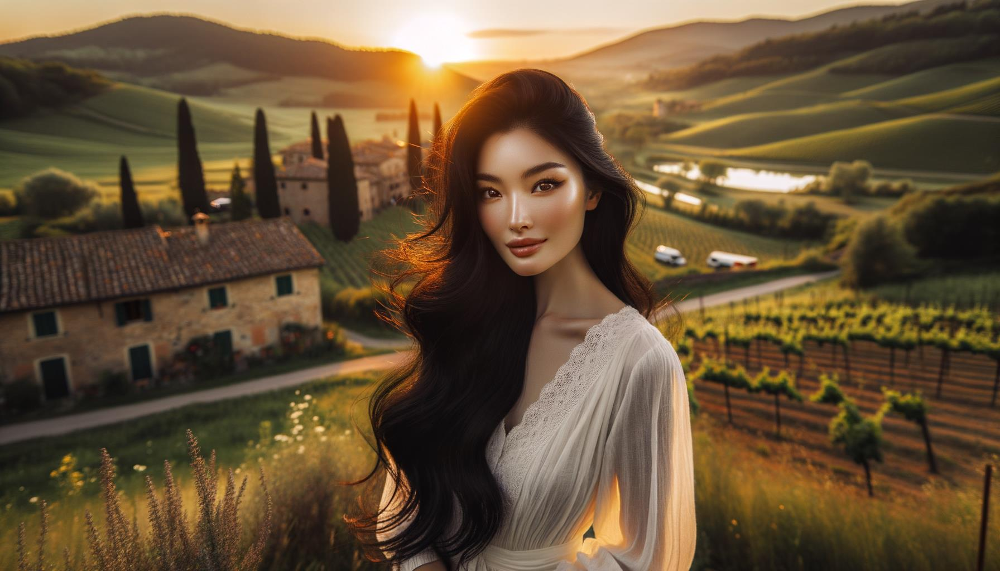

# Beautiful People and Places

This page contains 100 images generated by DALL-E 3 using the following code in February 2024 for testing purposes.

https://github.com/nao7sep/yyGptLib/blob/main/yyGptLibConsole/Tester3.cs

## Tropical Serenity: A Vibrant Lady Amidst Sunset Beach and Swaying Palms

Generate an image of an attractive Black woman, with coils of long brown hair falling over her shoulders, in a serene environment. She's wearing a yellow sundress, her smile broad and vibrant. Around her, the scenery unfolding is a breathtaking tropical beach. Palm trees laden with coconuts sway gently in the sea breeze. The sun is sinking into the horizon, spreading an explosion of blush and apricot hues across the sky. Distant islands and cruising sailboats are just visible in the waning light. Crystal-clear waves crash rhythmically against the pristine white sand, creating a harmonious symphony of nature.

## Cherry Blossom Sunset: A Radiant Beauty Amidst Blooming Serenity

A visually striking scene featuring a black woman with long, curly hair and bright, engaging eyes standing underneath the flourishing branches of a cherry blossom tree. The sun is setting, casting a golden glow on the petals of the flowers and the woman's radiant skin. She is wearing a flowing white summer dress, and her wide-brimmed hat is gently tipped to one side. The sweet scent of the cherry blossoms fills the air, providing a serene and tranquil atmosphere. This captivating image captures the essence of beauty in both the person and location.

## Middle Eastern Beauty Amidst a Sunset Serenade in Blossoming Rural Splendor

An illustration of a beautiful Middle-Eastern woman with long, curly black hair and brown eyes, wearing a vibrant, colorful traditional dress, standing in a breathtaking rural scene. The landscape around her features lush, green hills, a small, serene blue lake reflecting the sky, a quaint stone bridge crossing over the lake, and a grove of tall, mature cherry blossom trees in full bloom. The sun is setting in the background, casting long shadows and painting a vibrant array of dense warm colors across the sky.

## Sunset Serenity with a Middle Eastern Beauty in the Enchanted Forest

A captivating scene featuring an attractive Middle-Eastern woman with long, wavy hair, dressed in a light, breezy dress. She stands amid a lush, tranquil forest with a vibrant carpet of wildflowers, ancient, towering trees, and a calming stream flowing nearby. The sun hangs low in the sky, casting long, warm shadows and enhancing the natural beauty of the setting.

## Elegant South Asian Elegance in an Autumn Kissed Japanese Garden

An elegant South-Asian woman in elaborate traditional attire, strolling through a serene Japanese Garden during a radiant autumn afternoon. The sunlight filters through the red and gold foliage, casting dappled shadows on a cobblestone path. The tranquility of the place is further accentuated by a koi pond with vibrant orange fish, and a small wooden bridge crossing it. Cherry blossom trees add a touch of delicate pink to the scenery.

## Serene Riverbank Scene with Traditional Middle Eastern Beauty Amidst Blooming Wildflowers and Rustic Bridge

Generate a serene image of an elegant Middle-Eastern woman with hazel eyes and dark hair gracefully winding down her back, adorned in a colorfully embroidered traditional attire. She is seated near the bank of a tranquil azure river. Lush vegetation thrives in the surrounding, with tall trees touching the sky and their leaves forming patterns with sunlight filtering through. Gorgeous wildflowers bloom in clusters, as butterflies flutter near them. Beyond the river, the landscape stretches into rolling green hills beneath a serene, cloud-filled sky. A small picturesque wooden bridge arches over the river downstream. The whole scene emits peace and beauty.

## South Asian Gentleman in Vibrant Attire Amidst Blooming Meadow Afternoon Echoes

Create an image featuring a middle-aged man of South Asian descent, with a warm smile, wearing traditional clothing in vibrant colors. He is situated in a picturesque meadow during the late afternoon, with wildflowers of every hue blooming around him and lush green trees in the background. Sunrays filter through the leaves of the trees, casting dappled shadows on the grass. A sparkling stream winds its way through the meadow, adding to the serene ambiance.

## Middle Eastern Elegance in the Heart of an Ethereal Forest

Imagine a stunning scene in an ethereal forest, showered with a gentle play of sunlight seeping its way through the lush green leaves. In the heart of this picturesque setting stands a woman of Middle-Eastern descent, her eyes sparkling with wisdom and tranquility. She's dressed in a flowing dress dyed with vibrant colors, blending harmoniously with the surrounding nature. Her hair arranged in a braided crown, evokes a sense of serenity and elegance. With the calming hum of the forest around her, she has a serene smile, perfectly capturing a moment of peace and beauty.

## South Asian Serenity in a Japanese Garden

Create an image of a South Asian woman with warm brown eyes and jet-black hair, dressed in a brightly colored tunic. She is sitting on a vibrant woven rug, reading a thick antique book. She's surrounded by a serene, lush Japanese garden, the fragrance of blooming cherry blossom trees filling the air. A small stone bridge extends over a peaceful koi pond, reflecting the afternoon sunlight. A gentle breeze rustles the bamboo leaves, creating a soft, natural melody.

## Serene Sunset with a Traditional East Asian Beauty by the Flowing River

A captivating image depicting a beautiful scene. In detail, visualize an East Asian woman elegantly dressed in traditional clothing standing beside a flowing river. The location is surrounded by lush greenery marked by trees with vibrant, multicolored flowers. The sun sets in the distance, drenching the scene in a warm, golden glow. The woman has a radiant smile on her face, showcasing bliss and serenity. Her gaze is directed toward the quiet river, reflecting the breathtaking sunset and the verdant landscape. The entire scene is calm, tranquil, and stunningly beautiful.

## Sublime Sunset Readers Retreat in Cherry Blossom Garden

An image of a handsome South Asian man with a gentle smile, dressed casually. He is sitting on a wooden bench, engrossed in reading a book. He is in a serene public garden filled with blooming cherry blossoms, quaint stone paths winding through lush greenery, and a classic wrought-iron fence surrounding the garden. To complete the scene, a small tranquil pond reflecting the vivid colours of the sky during a sunset can be seen nearby.

## Dawn Serenity in the Meadow A South Asian Woman in Traditional Attire Surrounded by Nature's Beauty

Create an image depicting a South Asian woman with a radiant smile, wearing traditional clothing, surrounded by an enchanting meadow at dawn. The meadow is decorated with lush greenery, flowers, and a tranquil stream flowing quietly nearby, engendering a sense of peace and serenity. The sun is at the cusp of the horizon, casting soft, warm hues of pink and orange across the scenic landscape. The woman is standing near the stream with a sense of joy and tranquility emanating from her.

## Spring Enchantment of a South Asian Siren in a Japanese Garden

A captivating image portraying a South Asian woman in her mid-thirties with long, dark hair, dressed in vibrant traditional clothing. She is standing in a mesmerizing location, a Japanese garden in full bloom during springtime, with cherry blossom trees shedding their pink petals around her, and a peaceful, calm pond near her. The soft sunlight breaking through the foliage casts a dreamy, serene light on the whole scene, bringing out the vibrant colours of her attire and the natural beauty surrounding her.

## Middle Eastern Grace Amidst Autumnal Spectacle in a Pristine Valley Twilight

Create an image of an attractive Middle-Eastern lady with wavy hair and a graceful smile. She is standing in a breath-taking location - a lush green valley with a crystal clear river flowing through. Surrounding her are tall trees with bright, colorful autumn leaves, casting their reflection on the river. In the distance, one can see snow-capped mountains against the backdrop of a clear blue sky, adding to the overall beauty of the scenery. The sun is setting, adding a golden hue to the valley and creating a serene and tranquil atmosphere.

## Serene Sundown: South Asian Elegance Overlooking Forest Vista

A stunning scene featuring a beautiful South Asian woman with long, flowing black hair, wearing a traditional sari standing on a cliff overlooking the breathtaking landscape of a lush deep green forest in the distance. The wind is softly tugging at the vibrant colors of her sari and her hair as she looks out into the serene vista, her face lit up by the soft glow of the setting sun. A small, sparkling stream twists its way through the forest, reflecting the brilliant hues of the sundown. The tranquil silence of the area is palpable, adding to the overall feeling of the serene and idyllic setting

## Elegant Middle Eastern Woman Amidst a Blooming Garden at Dusk

A striking portray of a woman with Middle-Eastern descent, dressed in elegant clothing, standing amidst a scenic backdrop. She stands on a cobblestoned path that winds through a beautiful garden teeming with vibrant, blooming flowers of various colors. There are towering, ancient trees providing ample shade, and behind her, a picturesque mountain range stands majestically in the distance, bathed in the golden light of sunset.

## Graceful Beauty by the Lake at Sunset

Illustrate a lovely scene featuring an elegant female figure of Black descent, posing gracefully outdoors in a serene nature setting. She could be standing by a calm blue lake with a backdrop of towering green mountains under a clear, blue sky. The sun is setting providing a warm and gentle light, painting the scene in delicate pastel hues. She is dressed in a white summer dress, her hair in long flowing curls, adding a note of timeless beauty to the entire image.

## Desert Dusk Solitude: Harmony of Man and Nature in the Sunset Hues

Imagine a breathtaking scene set at sunset. In the heart of this spectacle stands a Middle-Eastern male figure, appreciating the mesmerizing colors of the setting sun that seamlessly blend with the orange hues of the desert dunes. Feather-light sands, warmed by the sun all through the day, radiate a gentle warmth that seems to echo the calm serenity on the man's face as he observes nature's captivating canvas. As the last rays of the sun illuminate his face, the wind gently plays with his dark hair, adding the final touch to this remarkable portrait of a man and nature in harmony.

## South Asian Serenity Amidst Rainforest Hues and Cascading Waterfall

Create a captivating image of a South Asian woman standing in a surreal tranquil clearing in a lush rainforest. She is dressed in traditional attire, her dark hair is braided, and she exudes a sense of calm and peacefulness. The surrounding forest is bursting with vibrant, tropical foliage of varying shades of green and sprinkled with exotic flowers of manifold colors. A mesmerizing waterfall cascading in the background adds serenity to the scene and a family of luminescent butterflies fluttering around adds a touch of fantasy to the landscape.

## Serene Beauty Amid Cherry Blossoms A South Asian Elegance in Japanese Garden

Create a striking image of a South Asian woman standing in a peaceful Japanese garden during cherry blossom season. She is wearing a traditional kimono in vibrant colors of blue and gold, with realistic patterns of chrysanthemums and peacocks. The woman is caught in a calm, serene pose, admiring the dense flurry of pale pink cherry blossoms that fill the sky and sweep the ground around her. A small gentle stream flows nearby, with the delicate reflection of cherry blossoms on its surface. Traditional stone lanterns add a touch of tranquil elegance to the scene.

## Eastern Elegance in Tranquil Italian Sunset

A strikingly beautiful Eastern Asian woman, with long black hair gently flowing in the breeze, standing amidst a tranquil Italian countryside landscape during sunset. She is adorned in a traditional white dress, her eyes shimmering with warmth and joy. Surrounding her are sprawling greenery, vineyards, and rustic houses nestled against rolling hills, bathed in the warm golden glow of the setting sun. This serene scene exudes calm and beauty, creating an image of harmonious coexistence between nature and humanity.

## Serene Sunset: A Hispanic Beauty in Lavender and Blue Amid Rolling Emerald Hills

Craft an image of a Hispanic woman with long, curvaceous hair and a gleaming smile. She's standing in a serene, breathtaking landscape during sunset. The locale is characterized by rolling emerald hills under a lavender sky. Exceptional attention should be paid to her clothing - an elegantly cut breezy summer dress in hues of lavender and royal blue that complements the alluring backdrop.

## Handsome Middle Eastern Man Embraces the Serenity of a Lush Landscape at Sunset

Generate an image of a handsome Middle-Eastern man, with dark wavy hair, dressed in casual clothing, standing amidst a captivating landscape. This landscape is a serene spot with lush vegetation, a gleaming river slowly meandering through, and a majestic mountain range graces the horizon. The sky above him is painted with hues of a setting sun, casting an ethereal light on the scene. There, this individual is observing the breathtaking nature around him, a content smile lighting up his face, embodying the beauty of the surrounding peace.

## Elegance at Dusk Beside the Turquoise Lake

A picturesque image of an elegant Middle-Eastern woman with long black hair, wearing a vibrant red dress. She's standing by the edge of a serene turquoise lake, surrounded by a dense forest showcasing all hues of green. The sun is setting in the background, casting a warm, golden light across the landscape, creating a serene and beautiful atmosphere.

## Ethereal Desert Dusk Princess in Enchanted Landscape

Create an image of a stunning and ethereal Middle-Eastern woman standing amidst an enchanting natural landscape. She's adorned with a vibrant turban detailed with beautiful gems and intricate patterns. Her attire is a colorful, flowing gown reflecting the hues of the setting sun around her. The landscape presents various hues of oranges, purples, and pinks mingled with the cerulean sky. Majestic mountains rise in the background, capped with a sprinkle of snow and the foreground is dotted with a shimmering stream meandering its way through lush fields, creating a scene that exudes tranquility and breathtaking exquisiteness.

## South Asian Serenity in A Meadow at Sunset

An image of a stunning individual, South Asian male in his mid-30s, with medium-length hair, and a gentle smile on his face. He is dressed in comfortable, casual attire and is situated in an equally stunning location. This environment is a peaceful meadow bathed in the golden light of the setting sun. Tall, graceful trees frame the scene, their leaves rustling gently in the breeze. Distant mountains adorn the horizon, their peaks kissed by the last rays of the sun. The serene sounds of nature fill the air, painting a scene of tranquility and beauty.

## Radiant Smile in a Golden Meadow: A Middle Eastern Woman Amidst Ethereal Sunset and Mountain Peaks

Envision the image of a gracefully poised Middle-Eastern woman in a breathtaking scenic place. She boasts a radiant smile and sparkling brown eyes that exude warmth. She is dressed in colorful traditional attire, her head adorned with a beautiful patterned scarf. The place where she stands is ethereal, bathed in the soft golden hue of the setting sun. It's a meadow, lush and ethereal, with vibrant wildflowers swaying in the gentle breeze. In the distance, you can spot majestic mountain peaks kissed by the last flickers of the day's light.

## Autumn Serenity: A South Asian Grace in a Japanese Garden

Generate an image of a South Asian woman in traditional attire standing gracefully in a serene Japanese garden during autumn. The colors of the garden contrast with her traditional bright attire. She's seen admiring the blend of autumn hues around her, with maple trees shedding crisp red leaves, a quaint stone lantern in the backdrop, and a calming koi pond at her feet.

## Tranquil Twilight in a Middle Eastern Meadow

A tranquil scene of a Middle-Eastern woman, sitting peacefully under the shade of an old, gnarled tree. She appears radiant in her colorful traditional outfit. The location is an enchanted-looking meadow, filled with vibrant wildflowers. The sun sets, casting a serene, golden hue across the landscape. In the distance are majestic, snow-capped mountains. A light breeze stirs the petals of the flowers, creating a gentle, calming ambiance.

## Elegant Beauty Amidst Tropical Radiance and Waterfall Serenity

An attractive Black woman with curly hair, wearing an elegant dress, stands on a path that winds through a lush tropical forest. Brightly colored exotic birds are perched on the nearby trees. In the distance, a majestic waterfall cascades down a cliff, producing a serene soundtrack for this tranquil setting. The sun's rays penetrate the canopy, casting dappled shadows and illuminating the abundant vegetation with a golden glow.

## Summer Serenity on a Middle Eastern Cliffside

A picture of a Middle-Eastern man teetering on the rocks by a stunning cliffside overlooking the azure sea. He is dressed in simple yet appealing summer attire - a pastel button-up shirt, khaki shorts, and flip-flops - enhancing his effortlessly chic looks. His eyes reflect the beauty of the serene scene that unfolds in front of him. The sun peeking through the scattered clouds paints a mesmerizing play of lights and shadows on the crisp, clean waters. Fleeting moments of tranquility like this are true blessings.

## Middle Eastern Elegance at Sunset by the Oasis

Create an image depicting a Middle-Eastern female in a stunning setting. She is elegantly dressed, encapsulating traditional Middle-Eastern attire with modern influences. She is standing near a luscious, green oasis, the sun is about to set and casts an ethereal orange and gold hue over the landscape. A calm, sparkling body of water is nearby, possibly a small lake, reflecting the picturesque scenery and the rapidly darkening, star-filled sky. The tranquility of the environment and her serene expression emanate an aura of peace and contentment.

## Emerald Gaze in the Heart of the Rainforest

An image of a beautiful Black woman with long braiden hair and emerald green eyes, posing confidently in an impressive location. The setting is a lush tropical rainforest, filled with vibrant foliage and bright exotic flowers. The colors around her are vibrant and vivid, with sunshine filtering in through the canopy, casting mesmerizing patterns on the forest floor. A cascading waterfall can be seen in the background, its water gleaming under the sunlight, creating a serene, tranquil atmosphere.

## Middle Eastern Serenity in a Lush Floral Eden under Golden Sunlight

Illustrate a Middle-Eastern woman with long, curly hair, in a lush green garden filled with a variety of multicolored flowers. She is wearing a flowing pastel dress, and she's seated on an ornate wrought-iron bench under a blossoming cherry tree, engrossed in reading a Victorian-styled novel. The sun is setting, casting warm golden light over the scene. Peacocks can be seen in the background, roaming freely. The tranquility and scenic beauty of the place are truly captivating.

## Middle Eastern Artist in a Colorful South Asian Street at Sunset

Create an image of a handsome Middle-Eastern male artist standing in a picturesque South Asian street filled with vibrant colorful buildings. He's wearing a traditional kurta, holding a paintbrush in his hand. A gentle breeze is blowing causing his clothing to rustle. The sun is setting, casting a warm orange glow on the scene.

## Ethereal Tranquility: The Asian Man's Contemplative Alpine Lake Solitude

An ethereal scene featuring an attractive Asian man with elegant features, comfortably seated on a rock by a serene alpine lake. The man is dressed in fashionable casual clothing, and his contemplative demeanor indicates a sense of peace and tranquility. The surrounding area is magnificent, with towering snow-capped mountains reflecting on the glasslike surface of the lake, and lush evergreens scattered around. The serene water, the crisp, clean air, and the gentle flutter of alpine birds create a sense of tranquility and harmony with nature.

## Mystic Serenity in the Middle Eastern Forest

A stunning depiction of a Middle-Eastern woman, with her long brunette hair cascading over her shoulders, is standing in a breathtaking setting. She's amidst a serene forest interspersed with towering trees and vibrant, blooming flowers with a cascading waterfall in the background. The light filters through the green foliage casting a diffused pattern on her face. She is wearing a long, vibrant dress that sways with the soft breeze. She is looking at the faraway mountains on the horizon, a look of peace and contentment on her face.

## Woman in Orange Dress Embracing Sunset in Rolling Dales

A picturesque landscape unfolds with rolling dales and a spectacular sunset saturating the sky with hues of red, orange, and purple. In this awe-inspiring place, an Asian woman, with dark hair styled in a loose bun, stands to survey the scene. She is dressed in an orange summer dress, the soft fabric echoing the colours of the sunset. Her radiant smile projects a sense of peace and contentment, as she enjoys the natural beauty of her surroundings. A gentle breeze plays with her dress and hair, adding to the serene ambiance.

## Hispanic Beauty Under Cherry Blossom Tree Amidst Majestic Landscapes

A visually stunning image of a Hispanic woman, with flowing chestnut hair, sparkling hazel eyes and wearing a summer dress resting leisurely under the shade of a flowering cherry blossom tree. Surrounding her is a breathtaking landscape of a lush green meadow dotted with wildflowers, a tranquil azure lake in the distance and snow-capped mountains under a clear blue sky.

## Elegance and Exploration A South Asian Woman in Vibrant Streetwear Amidst a Serene Coastal Setting

A striking image of a South Asian woman, dressed in elegant streetwear, standing amidst a stunning locale. Imagine her amid towering, flower-covered trellises, under a bright sunlit sky. She's holding a fashionable handbag, eyes filled with curiosity, exploring the beauty around her. The scenery features a cobblestone path leading towards an expansive blue ocean in the distance, with lush greenery on either side. The place exudes a serene atmosphere, complemented by a comprehensive color palette of soft pastels and vibrant hues evoking the freshness of a spring morning.

## Middle Eastern Beauty in Traditional Attire Amidst Verdant Greenery and Sunset Waterfall

Create a detailed image of an attractive Middle-Eastern woman with a warm smile, dressed in colorful traditional attire, standing in an enchanting setting. The environment consists of lush greenery, a cascading waterfall in the background, and flowers in a myriad of colors. A peaceful stream runs beside her, and there's a serene, vibrant sunset on the horizon, casting lovely pastel hues across the sky.

## Radiant Smile in a Emerald Forest: South Asian Beauty in Magenta Adorning Natures Canopy

A beautiful scene featuring a South Asian woman with a radiant smile, wearing a bright magenta traditional attire, standing in a lusciously green and beautiful forest. The forest floor is adorned with fallen leaves of varying colors, and filtered sunlight is spilling through the tall, towering trees. The air is filled with the tranquil sounds of nature, birds chirping, and a gentle breeze rustling through the leaves. This picturesque setting is further enhanced by a distant waterfall cascading over mossy rocks, its soothing sound melding with the symphony of the forest.

## Elegant Grace in a Resplendent South Asian Garden Scene

A stunning scene in a picturesque location. Imagine a South Asian woman, distinguished by her gracefulness and notable charisma. Her attire is a vibrant sari full of intricate patterns and rich textures. She stands tall, her posture radiant with elegance. The setting is an alluring garden, lush and resplendent - immerse yourself in the tranquil symphony of chirping birds, blooming flowers with vivid colors of blues and pinks and the rustling leaves of mighty trees. Perhaps there's a gently babbling brook nearby, casting lilting melodies in this serene environment. A vision truly breathtaking!

## Middle Eastern Explorer in Nature's Splendor: Tranquility on the Colorful Coastline

An image of a person of middle-eastern descent with a gender-neutral appearance. They are standing in a naturally stunning location, surrounded by lush greenery and colorful wildflowers. In the distance, a bright blue ocean hugs the rocky coastline. The sky is a brilliant shade of azure, splashed with hues of soft pink from the setting sun. The person is wearing comfortable, stylish clothes, and is looking out at the scenery with a look of peace and contentment, fully enjoying the serenity and beauty of the place.

## Middle Eastern Elegance Overlooking a Coastal Sunset Town

Imagine an image of a beautiful Middle-Eastern woman in her mid-30s, standing on an exquisitely decorated balcony overlooking a peaceful coastal town at sunset. She is wearing an elegant long, flowy aquamarine dress, her raven curly hair loosened, swaying gently in the breeze. Her dark brown eyes gaze contemplatively into the distance, reflecting the brilliant hues of the sunset. The town below is made up of white plastered buildings, lush green palm trees, with winding cobblestone streets leading to the tranquil azure sea beyond. The sky is a riot of warm orange, pink and purple, the setting sun spraying its radiant golden rays over the picturesque town

## Grace and Serenity A South Asian Elegance Amid Vibrant Landscape Under Pastel Sunset Skies

Create an image of a South Asian woman standing in a striking, vibrant landscape. She exudes grace and serenity, with her eyes reflecting compassion and kindness. Her hair is long and loosely tied at the back. She wears a simple yet elegant traditional dress enhancing her beauty. The landscape around her is breathtaking, filled with a flowery meadow that stretches towards a majestic mountain range under a soft pastel sunset sky.

## Tranquil Vibrance of a South Asian Adventurer at Sunset

A captivating image showcasing a beautiful natural landscape with rolling hills, crystal clear lake, and a vibrant sunset coloring the sky. In the foreground, a South Asian man of athletic build stands casually, dressed in comfortable outdoor attire. The smile etched on his face only elevates the overall tranquility and charm of the scenic portrait.

## Breathtaking Beauty Amidst History and Nature in the Middle East

A visually captivating Middle-Eastern woman standing in an awe-inspiring location. She has expressive dark eyes and long, raven-black hair swept off in the gentle breeze. Her traditional attire is a rich blend of colors, featuring intricate patterns that are testament to the region's rich culture. The locale is equally magnificent, with towering, ancient architecture that hints at a complex history, beautifully offset by verdant parks and tranquil water bodies shimmering under the golden sunlight. Everywhere the eye wanders, there's the sparkle of life — in the petal of a flower, the flutter of a songbird, or the quiet hush of the wind.

## Serene Sunset A South Asian Woman Relishing Tranquility in a Colorful Countryside

Create a detailed image showcasing a South Asian woman savouring the tranquility of a spectacular setting. She's positioned in a lush, sprawling countryside, filled with vibrant fields of wildflowers that ripple in the gentle breeze. Overhead, a stunning sky transforms from blue to shades of gold and pink as the sun sets on the horizon. She wears a comfortable, traditional attire, with a smile of serenity on her face combined with a hint of joy, reflecting the true beauty of her surroundings.

## South Asian Elegance at Lotus Pond Twilight

Create an image of a South Asian woman with long, wavy hair, dressed in colourful, traditional attire, standing on a bridge over a serene lotus pond. The scene is enveloped in the warm glow of sunset, painting the sky in hues of purple, orange, and red. The calm water reflects the vibrant colours of the sky and lily pads float gently on the water surface. In the near distance, traditional stone lanterns line the path along the pond, their soft light contributing to the tranquil atmosphere. To complete the scene, cherry blossom trees in full bloom border the pond, their petals creating a delightful pink carpet on the ground.

## South Asian Elegance Amid Rainbow Kissed Waterfall and Verdant Greens

A visually appealing scene with a South Asian woman standing near a majestic waterfall. She is wearing a vibrant traditional attire, the hues of which complement the surrounding lush greenery. Her face is illuminated by the soft, natural light filtered through the nearby trees. The waterfall cascades down with a graceful intensity, sending a delicate mist into the air that refracts the sunlight and forms a rainbow. The scene is peaceful, serene, and abundant with life, truly showcasing the wonder of nature and the beauty in diversity.

## Ethereal Elegance in a Lush Middle Eastern Garden

An elegant Middle Eastern woman, with dark, flowing hair and deep brown eyes, is lounging in a serene, lush garden. The sunlight streams through the green foliage, illuminating the vivid flowers that surround her. A gentle breeze ruffles her clothes, adding an ethereal touch. Nearby, colorful peacocks strut regally, their iridescent feathers glistening. With a peaceful expression, she is lost in the beauty of the nature around her.

## Middle Eastern Sunset Serenity Amidst Floral Harmony and Majestic Mountains

An enchanting scene of a Middle-Eastern woman with long, shiny black hair, comfortably dressed in a flowing, handmade robe. She is situated in a peaceful location surrounded by lush, greenery, and vibrant wildflowers. The sun is gently setting in the background, casting a warm golden glow over the serene landscape. A serene mountain range rises in the distance, adding to the scenic beauty. An image painted with the brush of tranquility and serenity, a sublime interplay of nature and humanity.

## Serene Reverie of a South Asian Lady Amidst Lush Green Pines and Majestic Snowy Peaks

A striking scene featuring a South Asian woman, with shoulder-length wavy hair, illuminated by the soft light of the setting sun. She is wearing traditional clothes, gazing out at the mesmerizing view of a serene lake, surrounded by a lush, green forest of tall pine trees. In the distance, majestic snow-capped mountains stand tall under the clear, blue sky. This tranquil scene evokes a sense of calm, accentuated by the woman's peaceful expression and the vibrant colors of the landscape

## Middle Eastern Majesty Amid Sunset Splendor and Vibrant Nature

Create an image showcasing a beautiful Middle-Eastern woman, with flowing dark hair and striking eyes, wearing traditional attire. She is positioned in a scenic setting surrounded by gorgeous natural beauty. This includes a gushing waterfall nearby, lush greenery with various vibrant plant life. The sun is setting, casting a warm orange glow to the scene, accenting the fuchsia and red flora. The person stands on a path winding through the landscape, awash in the radiant colors of a sunset, mirroring its peaceful tranquility.

## Sunrise Serenity in Saffron Over the Himalayas

An attractive South Asian woman standing against the backdrop of majestic Himalayan mountain range, radiant in the colors of sunrise. She is elegantly dressed in a saffron colored saree with golden embellishments. Her dark hair is adorned with a traditional maang tikka. A cool morning breeze gently sways her hair and saree, adding a sense of motion to the entire scene.

## Auburn Beauty Embraces Spring in an Asian Garden Harmony

Create an image showcasing a beautiful scene of a tranquil Asian garden during spring. In the scene, we find a visually stunning Caucasian woman appreciating the beauty that surrounds her. She is characterized by her long, wavy auburn hair, vibrant eyes, and a warm smile that testifies to her inner beauty. She is elegantly clothed in a blend of modern and traditional attire, symbolizing a harmonious blend of cultures. The garden teems with blooming cherry blossom trees, their petals gently falling, a koi pond, and a classic wooden bridge, reflecting the timeless beauty of Asian landscapes.

## Serenity in Sapphire Serenade Chinese Elegance Amidst Blossoms Bridge and Snowy Peaks

Create an image of a charming East Asian female, with flowing jet-black hair and soft, kind eyes, sporting a serene smile. She is elegantly dressed in a sapphire blue traditional Chinese cheongsam, adorned with golden embroidery. Behind her is a vibrant, flowering cherry blossom tree blowing gently in the wind, situated near an old, rustic stone bridge that crosses a calm lily pond. Majestic mountains capped with frosty snow peaks can be seen in the distance under a cerulean sky with fluffy white clouds drifting slowly. An air of serenity and tranquility enwraps this picturesque setting.

## South Asian Elegance Meets European Charm in Golden Evening Glow

An aesthetically pleasing image of a middle-aged South Asian woman, dressed in a vibrant traditional outfit, near a gorgeous backdrop of a historical European city. She is walking down a cobblestone street lined with quaint shops. Her smile adds to the beauty of the scene as she admires the unique architectural charm of the city. The evening sun's golden glow adds a hint of magic to the atmosphere, casting long shadows and warming up the natural and man-made structures around. The scene captures a sense of tranquility and joy.

## Ethereal Glow of a Graceful Middle Eastern Belle in a Vibrant Garden at Sunset

A stunning image of a Middle-Eastern woman exuding grace, elegantly dressed in vibrant, traditional attire. She stands in a breathtaking location, a lush garden bursting with diverse flora in full bloom. Petals of vibrant colors carpet the ground, and a serene pond reflects the sky, creating a mesmerizing blend of natural beauty. The sun is setting in the background, casting a golden aura that paints everything with a warm, ethereal glow.

## Elegance and Grace in the Golden Sunset by the Enchanted Waterfall

An elegant South Asian woman in a flowing yellow sarong stands beside a Middle-Eastern man, smartly dressed in a casual blue suit. They are situated in a soothing landscape featuring an enchanting waterfall cascading over moss-covered rocks and a crystalline lake shimmering in the soft glow of the setting sun. The calm ambiance is further heightened by the presence of majestic 300-year-old Cypress trees, while vibrant wildflowers dot the surroundings, and birds of exquisite plumage dart across the sky.

## Middle Eastern Man Embracing Tranquility at Sunrise Secluded Beach

An attractive, Middle-Eastern man with a strong build and a warm smile is sitting calmly in an enchanting location. The place is a tranquil, secluded beach at sunrise. Golden sand extends to the crystal-clear water which reflects the soft, peach hues of the early morning sky. Faint silhouettes of lush tropical trees surround the setting, adding a serene charm. The cozy ambience created by the gentle waves and the cooling sea breeze pair perfectly with the man's peaceful demeanor and genuine contentment.

## South Asian Grace at Dusk by the Tranquil Lake

A serene scene unfolds with a South Asian woman standing gracefully by a tranquil lake. The setting sun breathes a golden aura into the surroundings, lighting up the sky with hues of orange, pink and purple. In the distance, high snow-capped mountains complete the mesmerizing backdrop. The woman is dressed in a soft lavender ensemble, radiating warmth and peace. Her eyes sparkle with joy, reflecting the natural beauty of the location. There's a wooden jetty behind her, leading into the calm waters of the lake, and vibrant wildflowers bloom by the lakeside, adding to the idyllic beauty of this picturesque setting.

## Serene Repose Amidst Lakeside Sunset and South Asian Scenery

A captivating scene of a South Asian woman peacefully resting on the edge of a tranquil lake, her reflection mirroring on the glassy surface of the water. She's dressed in a simple yet elegant summer outfit, with her hair splayed out behind her against the backdrop of lush greenery. Around her, the setting sun paints dramatic bursts of orange and pink into the sky, casting a warm, serene light on the picturesque landscape. Exquisitely quaint wooden cottages can be seen in the distance, nestled among the rolling hills that reach out towards the horizon.

## Hazel Gaze in the Sunlit Verdant Oasis

An image of a beautiful Middle-Eastern man, with dark hair, a groomed beard, and expressive hazel eyes. He's standing in an ethereal environment, a lush, vivid forest flourishing with verdant trees, colorful flowers, and a crystal-clear stream glittering in the soft sunlight. Streams of light are piercing through the dense canopy, casting dynamic patches of bright and shade, making the forest come alive. The man is dressed in casual, comfortable clothing, looking relaxed and serene, his face illuminated by the sunbeams, expressing a sense of peace and contentment.

## Grace Under Cherry Blossoms An East Asian Portrait in Blue Silk and Sunset Serenity

Visualize an East Asian woman, poised gracefully as she stands under the subtle shade of cherry blossom trees in full bloom. The soft pink petals showering around her, she wears a delicate blue silk dress that complements her complexion, while her long, raven-black hair is tied back in a loose bun. The backdrop exudes the serenity of a traditional Japanese tea garden, with a stone lantern partially hidden amidst the flora, neatly trimmed bushes, and a small pond mirroring the picturesque scenery. The gentle hues of the sunset paint this tranquil canvas with warm tones.

## Serenity on the Horizon: A South Asian Woman's Reverie at Sunset

A stunning scene featuring a young South Asian woman of medium build with her silky glossy black hair pulled up in a ponytail. She stands atop a verdant hill, basking in the soothing rays of the setting sun. This beautiful landscape is nothing short of a paradise, with the azure sea stretching to the horizon, and sea birds dotting the sky above the coastal line. The woman, radiating a peaceful aura, gazes at the breathtaking view with a sense of serenity, completing this picture of tranquility and beauty.

## Charming South Asian Man on a Sunset Beach Stroll

Generate an image of a South Asian male with a charming smile, wearing a crisp white linen shirt and khaki pants. He is strolling on a sandy beach during sunset, the horizon ablaze with hues of orange and pink. Palm trees sway gently in the background, and the turquoise sea playfully laps at his bare feet.

## Tranquil Dawn by the River: A Victorian Elegance amongst Cherry Blossoms and Mountain Echoes

Generate an image in a soothing, painterly style reminiscent of the Romantic era featuring an Asian woman in a fitted Victorian dress, sitting by a tranquil glistening river. A morning sun is rising in the distance, casting soft, warm light over the scene. The reflections in the water are sparkling, the grass is lush and green, and there are blooming cherry trees scattering petals with the breeze. The woman in the scene is gently holding a book, lost in thought. A majestic mountain echoes in the far distance, shrouded in soft mist, enhancing the serene ambiance.

## Serene Twilight Reflections of a South Asian Beauty in Nature

An image of an attractive South Asian woman, dressed in a vibrant traditional dress, standing in a lush, picturesque forest. There's a placid lake nearby reflecting the stunning golden sunset. The scene is serene with the evening birdsong filling the air and a soft breeze rustling the forest leaves. She is smiling softly, her eyes lit with joy, as she mesmerizingly takes in the natural beauty that surrounds her.

## Middle Eastern Man at Twilight Serenity amidst Lush Forest by Lakeside

A captivating depiction of a Middle-Eastern man in his prime, standing on the edge of a serene lake at the heart of a lush forest. The twilight hues of the setting sun dance on the calm water, extending towards the dense trees with their emerald leaves, creating an enchanting harmony of colors. The man's traditional attire stands out against this backdrop, the details of his outfit meticulously crafted. His tranquil expression reflects his profound connection with the natural surroundings, contributing to a scene that is the epitome of peaceful beauty.

## Cheerful Asian Woman in a Vibrant Meadow at Sundown

Create an image of an Asian woman in her mid 30s, with wavy chestnut brown hair down to her shoulders, deep brown eyes and a cheerful smile on her face. She's standing in a picturesque location: a lush green meadow teeming with wildflowers in all colours of the rainbow, a sparkling blue brook meanders its way through the meadow and the sun is setting in the distance, painting the sky with hues of red, pink, and orange.

## Sunset Glow on the Azure Lake with Blossoming Beauty

An image of a beautiful Hispanic woman with long, wavy hair and a mesmerizing smile standing near an azure blue lake with luscious green trees in the background and delicate white flowers blooming at her feet. The sun casts a golden glow throughout the scene, reflecting off of the quiet surface of the lake, and the sky is a dance of pastels at sunset.

## Early Morning Harmony Amidst Alpine Beauty with Asian Descent Enigma

A visually appealing scene in a picturesque environment. In the center, there's an attractive individual of Asian descent with gender-neutral styling. They are peacefully enjoying the sublime beauty of the surrounding alpine meadow abundant with vibrant wildflowers. The scene is bathed in the delicate light of the early morning sun highlighting the individual's content expression and the breathtaking panorama around them.

## South Asian Serenity at Sunset on Coastal Sands

An enchanting South Asian woman with olive skin, long, gently curling hair, and expressive eyes, dressed in a traditional saree, is standing on the edge of a breathtaking landscape. It's an unspoilt, scenic, coastal vista with turquoise blue waters gently kissing golden sands. Palm trees sway slightly in the cooling coastal breeze, and the sun is starting to set, casting a warm and magical light across the entire setting, making it feel surreal and captivating.

## Elegance Radiating in the Blossoming Garden: A Tale of the Flower Picker and the Playful Ducks

An elegant Hispanic woman with long wavy brown hair is walking in a beautiful lush garden filled with vibrant, colorful flowers in full bloom. Dressed in a flowing white dress, she's holding a small wicker basket, picking flowers along the way. An old stone fountain, adorned with flowering vines, takes the center stage in this garden. It's a bright sunny day, adding warmth and light to this peaceful setting, with a soft breeze occasionally rustling the leaves. A family of ducks is playfully swimming in a nearby pond, adding a vibrant life to this serene scene.

## Tropical Elegance A Black Beauty in a Rainforest Paradise

An image of an attractive Black woman with curly hair, wearing a vibrant, flowing dress, standing in a breathtaking location. The location is a lush tropical rainforest with towering palm trees, a stunning waterfall cascading over rugged rocks, and vibrant green leaves glistening in the filtered sunlight.

## South Asian Grace Amidst Dawn Touched Lakeside Serenity

An attractive male of South Asian descent wearing a traditional kurta outfit, is seated on a stone bench in front of a serene lake surrounded by lush green willow trees. Majestic mountains loom in the distance under a sky filled with the soft hues of a sunrise. The reflection of the stunning scene forms a mirror image on the tranquil surface of the lake, adding to the sheer beauty of this strikingly peaceful place.

## Middle Eastern Beauty Embracing Sunset Serenity on a Tranquil Beach

A stunning depiction of a Middle-Eastern woman, with her captivating dark eyes, standing in a captivating location. The location is a serene beach at sunset. The sky is adorned with hues of red and orange while the tranquil waves softly crash on the sandy shore. She is wearing a vibrant turquoise summer dress that flows with the soft sea breeze. Her dark brown hair gently tousles in the wind. She is looking towards the horizon, a soft smile on her face suggests contentment. This scene is a transient moment of natural beauty both in the environment and the individual.

## Hispanic Beauty Admiring Majestic Waterfall in Blooming Wilderness

Depict an image of an attractive Hispanic female standing in a stunning landscape. She is admiring a waterfall that cascades down a steep cliff into a clear pool of water below. Surrounding the pool are lush, wild plant life and a variety of vibrant flowers. On either side of the waterfall, steep cliffs stretch upwards until they nearly touch the blue sky. Wispy white clouds are scattered across the sky, letting the sun shine brightly onto the scene. The woman herself has dark curly hair, a medium build, and is dressed in comfortable hiking gear, her eyes wide in appreciation for the natural beauty surrounding her.

## Solitude Swing: A South Asian Woman's Peaceful Moment Under the Sunset Hued Sky

Let's visualize a serene scene featuring a South Asian woman, deeply immersed in her introspective solitude. She is seated joyfully on a rusting swing hanging from a massive oak tree. The setting is a tranquil countryside landscape during the golden hours of sunset. The vibrant hues of the sunset are diffused in the sky, casting long, warm shadows. The surrounding fields blanket the horizon while wildflowers, colored in a vibrant palette of purples and yellows, sway gently in the light breeze. The air is filled with the sweet scent of the blossoming flowers and the soothing chirping of birds.

## Tranquil Forest Stroll of a Serene East Asian Woman Amidst Autumn Splendor

Create an image of a beautiful East Asian woman taking a leisurely stroll through a stunningly scenic, tranquil forest. The radiant colours of the autumnal leaves contrast with the green moss and fern along the forest floor. The sun's rays delicately filter through the foliage, casting dappled light and shadows in a captivating dance, while a peaceful stream babbles gently in the background. The woman, dressed in a comfortable, stylish hiking attire, is wearing a serene smile, her eyes hold a sense of deep contentment and connection with nature.

## Serene Lady of the Emerald Forest

A visually striking depiction of an East Asian woman, surrounded by an awe-inspiring landscape. She stands serene and confident, her traditional attire blending harmoniously with the lush setting. The surroundings are painted with such vivid detail, one can almost taste the fresh air. It's an oasis of serenity, with the clear blue sky overhead, a pristine emerald green forest in the backdrop, and a calm, glistening stream coursing nearby. The portrait is a harmonious blend of the simplicity of human beauty and the majesty of nature.

## Hispanic Hiker Embracing Serenity in a Vibrant Forest Canopy

A visually stunning scene featuring a Hispanic woman standing in a lush, captivating forest. She is dressed in comfortable hiking attire, leaning against a towering, ancient tree with leaves that shimmer in the dappled sunlight. The forest around her is an explosion of color, with hues of vibrant green and speckles of bright, vivid wildflowers. Birds are perched on branches nearby, their songs mingling with the soft rustle of leaves. The overall atmosphere emanates an aesthetic charm and a serene tranquillity.

## Radiant Smile in Idyllic Pastoral Scene with Elegant Intra-gender Hispanic Individual

An aesthetically pleasing intra-gender person of Hispanic descent with a radiant smile, elegantly attired, standing in an idyllic landscape. The setting is a sun-drenched pastoral scene, with lush, verdant rolling hills and a crystal-clear turquoise river winding its way through. Vividly coloured wildflowers dot the landscape, and majestic oak trees provide comforting shade. A picturesque stone footbridge arches gracefully over the river, and in the distance, a snow-capped mountain range provides a breathtaking backdrop.

## African Grace under the Cherry Blossom Canopy amidst a Golden Sunset

A beautiful Black woman with curly hair, vibrantly glowing green eyes and a graceful smile, is dressed in a colorful traditional African attire. She is standing in an equally beautiful place, under a cherry blossom tree in full bloom. The setting sun dapples warm hues of orange and gold across the tranquil lake before her, and behind her rise majestic snow-capped mountains.

## Elegant Harmony of Woman, Water and Sunset Mountains

A breathtaking image where a Middle Eastern woman with long, curly hair elegantly dressed in bright, colorful attire is poised by the crystalline waters of a serene lake.  In the distance, majestic mountains veil themselves in the soft, golden hues of the setting sun. This should be a tranquil scene exuding peace and tranquility, with vibrant colors, serene water, and majestic mountains beautifully co-existing with this elegant woman.

## Serene Twilight Reflections of a Traditional South Asian Woman by the Lake

An image showcasing a South-Asian woman, standing near the edge of a serene lake with the sun setting in the background. Her attire represents traditional South Asian clothing and her hair is styled in a simple bun. The landscape around the lake is filled with lush green trees and distant mountains, adding to the tranquility of the scene.

## Sunset Serenity and the Middle Eastern Maiden

A stunning image of a Middle-Eastern woman, with long, curled black hair cascading down her shoulders in wavy tendrils. She's admiring the view at a picturesque location, where majestic, snow-capped mountains meet a tranquil, clear lake. The vibrant setting sun casts warmth over the serene scene, bringing an ethereal glow that reflects on her face. Delicate wildflowers, scattered across the lush green meadow she stands on, sway gently in the cool mountain breeze. She wears a tasteful red dress which billows slightly, revealing the elegant lines of her footwear and the hem of her dress.

## Sunset Serenity South Asian Male Embracing Nature's Tranquility

A captivating image of a South Asian male bathing in the gentle glow of the sunset. He's at a stunning natural location, with lush greenery providing a tranquil backdrop. The sky overhead is a beautiful pastel canvas, with colors changing from soft pink, light orange, to deepening azure. The serene look on his face embodies the peace that comes from being in sync with nature.

## Ethereal Serenity A Portrait of Hope in Traditional South Asian Sunset Splendor

Create an image showcasing an attractive South Asian woman in a serene natural location. This location, enveloped in the warmth of a golden sunset, has a glittering river snaking through lush green plains. Far in the distance, one can see the silhouette of majestic mountains against the pastel-colored evening sky. The woman's traditional attire, richly decorated with colorful embroidery, contrasts with the peacefulness of the surroundings. Her radiant smile and eyes full of hope, mirroring the sunset, complete the ethereal portrait.

## East Asian Grace in Lush Harmony: A Modern Traditional Fusion in the Heart of Nature

Create a serene image featuring an East Asian woman, gracefully poised as she closes her eyes amidst the tranquil setting of a lush garden. Her attire is a fusion of traditional Asian fashion and modern threads, reflecting a harmonious blend of her cultural heritage and contemporary trends. The image juxtaposes her delicate figure with the robust nature around her, filled with blooming flowers, towering trees, and glistening dew on leaves, depicting a perfect harmony between human beauty and the magnificence of the natural world.

## Twilight Reflections of a South Asian Vision Amidst Skyscraper Silhouettes

Imagine a mesmerizing city skyline at twilight, with skyscrapers illuminated by the last hues of sunset reflecting on their surface. In the foreground of this constellation of man-made marvels, a South Asian woman stands, watching the world around her. She is medium-height, with a muscular physique, in her mid-twenties. She has long, wavy hair, and her eyes speak of stories untold. Dressed in a casual t-shirt and jeans, her relaxed attire contrasts with the formal setting around her but elevates her presence. She emanates an aura of quiet confidence and intrigue.

## Serene Twilight Embrace of a Smiling South Asian Man in Vibrant Traditional Attire

A picturesque scene featuring a captivating South Asian man with an inviting smile, standing in front of a stunning natural landscape. The background showcases a serene lake surrounded by lush green trees under a clear twilight sky that's filled with radiant stars. His traditional attire contributes to the overall majesty of the scene. The intricate patterns and vibrant colors of his clothes reflect the unique cultural richness. His posture and aura radiate tranquility, matching the calm environment around him.

## South Asian Grace in a Sunflower Field at Sunset

Generate an image of a stunning South Asian woman dancing in a vibrant field of sunflowers during a breathtaking sunset. The golden rays of the setting sun illuminate the woman's flowing silk dress in hues of orange and purple. She possesses a radiant smile reflecting absolute joy and peace, her dark brown eyes twinkling with excitement. Her intricate henna designs on her hands enhance the cultural richness of the scene. The backdrop of the towering sunflowers against the flaming sky makes the scene exceptionally beautiful.

## Elegance Amidst Nature A South Asian Man by the Waterfall Rainbow and Forest Rays

An image of an elegant South Asian man with long, silky hair wearing a traditional kurta, standing next to a cascading waterfall in a lush green forest. Rays of sunlight are filtering through the dense foliage, creating a mesmerizing play of light and shadow. A radiant rainbow is visible in the spray created by the waterfall. The whole scene exudes tranquility and natural beauty.

## Emerald Enigma in the Morning Glory Forest

An image of a gracefully poised Hispanic woman, standing in an idyllic location surrounded by an enchanting forest. She is adorned in a flowing emerald-green gown that subtly merges with the vibrant flora behind her. The radiating rays of the morning sun illuminate her charming face and the emerald hue of her dress, creating a captivating contrast against the dimly lit, verdant background. The forest forms a naturally artistic backdrop with towering trees, ivy-covered trunks, and a thick undergrowth that is carpeted by a mix of autumn leaves and blooming ferns.

## Elegant Serenity A South Asian Harmony of Lake Forest and Sunlight

An elegant South Asian woman with long, dark hair, dressed in a traditional saree, standing next to a serene, teal blue lake nestled amidst the lush greenery of a harmonious, idealistic forest. Sunlight peeping through the broad leaves of towering trees, casting dapples of soft light against her peaceful expression as a gentle breeze dances gently, causing the leaves to rustle and the surface of the lake to shimmer beneath the azure sky.

## South Asian Beauty in Serene Riverside Twilight

Illustrate a captivating scene featuring an attractive individual of South-Asian descent, with gender being female. This person is standing amidst a serene and picturesque location. This captivating location showcases a tranquil river flowing gently, surrounded by vibrant wildflowers, towering trees aflutter with colourful birds, and a sky painted in hues of pink and orange from a setting sun.

## Middle Eastern Beauty in Serene Meadow at Sunset

Create an image of an attractive Middle-Eastern woman with deep brown eyes and flowing dark hair, wearing a traditional yet modern ensemble. She is standing in a breathtaking spot, an expanse of lush meadows under a clear pale blue sky, sprinkled with wildflowers of various colors. A stream meanders nearby, its waters flowing with a melodious tinkling sound. The sun far in the distance is setting, casting a warm golden light across the landscape. Fluffy white clouds build a stunning contrast, creating an idyllic setting

