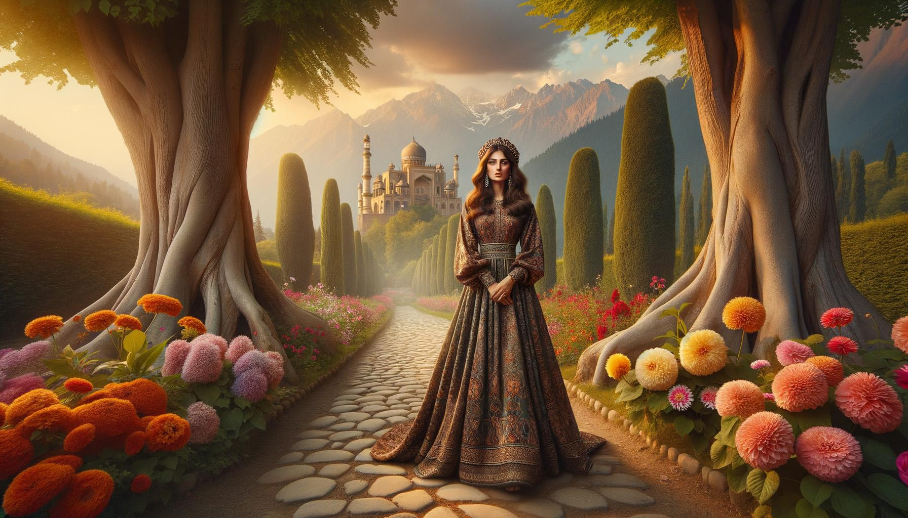
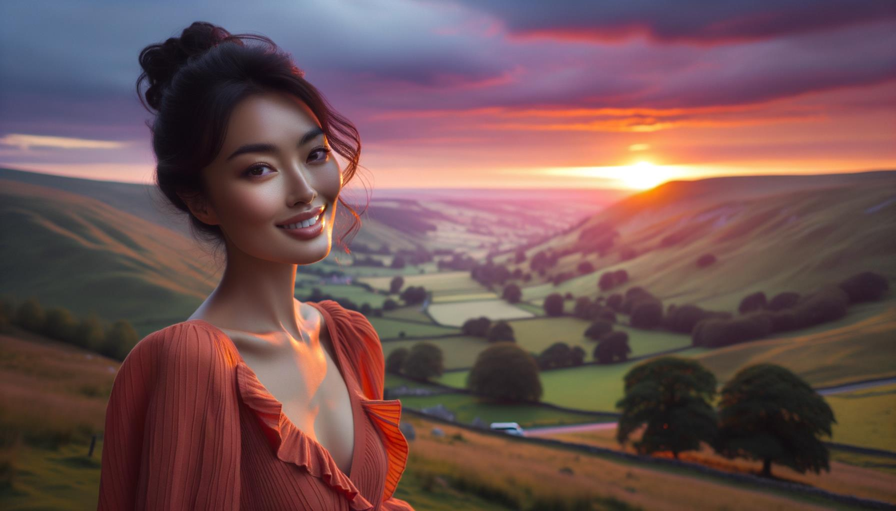

# Mooie Mensen en Plaatsen

Deze pagina bevat 100 afbeeldingen gegenereerd door DALL-E 3 met behulp van de volgende code in februari 2024 voor testdoeleinden

https://github.com/nao7sep/yyGpt/blob/main/yyGptLibConsole/Tester3.cs

## Tropische Sereniteit: Een Levendige Dame Tussen Zonsondergang Strand en Wuivende Palmen

Genereer een afbeelding van een aantrekkelijke zwarte vrouw, met lange bruine krullen die over haar schouders vallen, in een serene omgeving. Ze draagt een gele zomerjurk, haar glimlach breed en levendig. Rondom haar ontvouwt zich een adembenemend tropisch strand. Palmbomen beladen met kokosnoten wiegen zachtjes in de zeewind. De zon zakt in de horizon en verspreidt een explosie van roze en abrikoostinten over de lucht. Verre eilanden en kruisende zeilboten zijn nog net zichtbaar in het afnemende licht. Kristalheldere golven crashen ritmisch tegen het ongerepte witte zand, waardoor een harmonieuze symfonie van de natuur ontstaat

## Kersenbloesem Zonsondergang: Een Stralende Schoonheid Temidden van Bloeiende Sereniteit

Een visueel opvallende scène met een zwarte vrouw met lang, krullend haar en heldere, boeiende ogen die onder de bloeiende takken van een kersenbloesemboom staat. De zon gaat onder, en werpt een gouden gloed op de bloemblaadjes en de stralende huid van de vrouw. Ze draagt een luchtige witte zomerjurk, en haar breedgerande hoed is lichtjes naar één kant gekanteld. De zoete geur van de kersenbloesems vult de lucht, wat zorgt voor een serene en rustige atmosfeer. Dit meeslepende beeld vangt de essentie van schoonheid, zowel van de persoon als van de locatie

## Midden-Oosterse Schoonheid Te Midden van een Zonsondergang Serenade in Bloeiende Landelijke Pracht

Een illustratie van een mooie Midden-Oosterse vrouw met lang, krullend zwart haar en bruine ogen, gekleed in een levendige, kleurrijke traditionele jurk, staand in een adembenemend landelijk tafereel. Het landschap rond haar bevat weelderige, groene heuvels, een klein, sereen blauw meer dat de lucht weerspiegelt, een schilderachtige stenen brug die over het meer gaat, en een bosje hoge, volwassen kersenbloesembomen in volle bloei. De zon gaat onder op de achtergrond, werpt lange schaduwen en schildert een levendige reeks van dichte warme kleuren over de hemel

## Zonsondergang Sereniteit met een Midden-Oosterse Schoonheid in het Betoverde Bos

Een boeiend tafereel met een aantrekkelijke vrouw uit het Midden-Oosten met lang, golvend haar, gekleed in een lichte, luchtige jurk. Ze staat midden in een weelderig, rustig bos met een levendig tapijt van wilde bloemen, oude, torenhoge bomen en een rustgevende beek die vlakbij stroomt. De zon hangt laag aan de hemel, werpt lange, warme schaduwen en versterkt de natuurlijke schoonheid van de omgeving

## Elegante Zuid-Aziatische Elegantie in een door de Herfst gekuste Japanse Tuin

Een elegante Zuid-Aziatische vrouw in uitgebreide traditionele kleding, wandelend door een serene Japanse tuin tijdens een stralende herfstmiddag. Het zonlicht filtert door het rode en gouden gebladerte, en werpt gevlekte schaduwen op een kasseien pad. De rust van de plek wordt verder geaccentueerd door een koi-vijver met levendige oranje vissen, en een kleine houten brug die eroverheen gaat. Kersenbloesembomen voegen een vleugje delicaat roze toe aan het landschap

## Serene Rivieroever Scène met Traditionele Midden-Oosterse Schoonheid Temidden van Bloeiende Wilde Bloemen en Rustieke Brug

Genereer een sereen beeld van een elegante Midden-Oosterse vrouw met hazelaarogen en donker haar dat sierlijk langs haar rug golft, getooid in een kleurrijk geborduurde traditionele klederdracht. Ze zit in de buurt van de oever van een rustige azuurblauwe rivier. Weelderige vegetatie tiert welig in de omgeving, met hoge bomen die de lucht raken en hun bladeren patronen vormen met zonlicht dat erdoorheen filtert. Prachtige wilde bloemen bloeien in clusters, terwijl vlinders er dichtbij fladderen. Voorbij de rivier strekt het landschap zich uit tot glooiende groene heuvels onder een serene, met wolken gevulde hemel. Een klein schilderachtig houten bruggetje buigt over de rivier stroomafwaarts. De hele scène straalt rust en schoonheid uit

## Zuid-Aziatische heer in levendige kleding te midden van bloeiende weide, middagecho's

Creëer een afbeelding met een man van middelbare leeftijd van Zuid-Aziatische afkomst, met een warme glimlach, gekleed in traditionele kleding in levendige kleuren. Hij bevindt zich in een schilderachtige weide tijdens de late namiddag, met wilde bloemen van elke tint die om hem heen bloeien en weelderige groene bomen op de achtergrond. Zonnestralen filteren door de bladeren van de bomen, waardoor gevlekte schaduwen op het gras vallen. Een sprankelende beek slingert zich een weg door de weide, wat bijdraagt aan de serene ambiance

## Midden-Oosterse Elegantie in het Hart van een Etheïsch Bos

Stel je een prachtig tafereel voor in een etherisch bos, overgoten met een zacht spel van zonlicht dat zijn weg baant door de weelderige groene bladeren. In het hart van deze pittoreske omgeving staat een vrouw van Midden-Oosterse afkomst, haar ogen glinsteren met wijsheid en rust. Ze is gekleed in een vloeiende jurk geverfd met levendige kleuren, harmonieus samensmeltend met de omringende natuur. Haar haar, gearrangeerd in een gevlochten kroon, roept een gevoel van sereniteit en elegantie op. Met het kalmerende gezoem van het bos om haar heen, heeft ze een serene glimlach, perfect een moment van vrede en schoonheid vastleggend

## Zuid-Aziatische Sereniteit in een Japanse Tuin

Maak een afbeelding van een Zuid-Aziatische vrouw met warme bruine ogen en gitzwart haar, gekleed in een felgekleurde tuniek. Ze zit op een levendig geweven kleed, lezend in een dik antiek boek. Ze is omgeven door een serene, weelderige Japanse tuin, met de geur van bloeiende kersenbloesembomen in de lucht. Een klein stenen bruggetje strekt zich uit over een vredige koi-vijver, die het middagzonlicht reflecteert. Een zachte bries ruist door de bamboebladeren en creëert een zachte, natuurlijke melodie

## Sereen Zonsondergang met een Traditionele Oost-Aziatische Schoonheid bij de Stromende Rivier

Een boeiende afbeelding die een prachtig tafereel toont. Visualiseer in detail een Oost-Aziatische vrouw, elegant gekleed in traditionele kleding, die naast een stromende rivier staat. De locatie is omgeven door weelderig groen, gemarkeerd door bomen met levendige, veelkleurige bloemen. De zon gaat in de verte onder en doordrenkt het tafereel met een warme, gouden gloed. De vrouw heeft een stralende glimlach op haar gezicht, wat geluk en sereniteit uitstraalt. Haar blik is gericht op de rustige rivier, die de adembenemende zonsondergang en het weelderige landschap weerspiegelt. Het hele tafereel is rustig, vredig en verbazingwekkend mooi

## Sublieme Zonsondergang Lezersretraite in Kersenbloesemtuin

Een afbeelding van een knappe Zuid-Aziatische man met een zachte glimlach, casual gekleed. Hij zit op een houten bankje, verdiept in het lezen van een boek. Hij bevindt zich in een serene openbare tuin vol bloeiende kersenbloesems, schilderachtige stenen paden die door het weelderige groen slingeren en een klassiek smeedijzeren hek rondom de tuin. Om het tafereel af te maken, is er in de buurt een kleine, rustige vijver te zien die de levendige kleuren van de hemel tijdens een zonsondergang weerspiegelt

## Dageraad Sereniteit in de Weide Een Zuid-Aziatische Vrouw in Traditionele Kledij Omringd door de Schoonheid van de Natuur

Maak een afbeelding van een Zuid-Aziatische vrouw met een stralende glimlach, gekleed in traditionele kleding, omgeven door een betoverende weide bij dageraad. De weide is versierd met weelderig groen, bloemen en een rustig stromende beek in de buurt, die een gevoel van vrede en sereniteit opwekt. De zon bevindt zich aan de rand van de horizon, zachte, warme tinten roze en oranje over het schilderachtige landschap werpend. De vrouw staat dichtbij de beek met een gevoel van vreugde en rust die van haar uitstraalt

## Lente Betovering van een Zuid-Aziatische Sirene in een Japanse Tuin

Een boeiende afbeelding die een Zuid-Aziatische vrouw in haar midden dertig met lang, donker haar afbeeldt, gekleed in levendige traditionele kleding. Ze staat op een betoverende locatie, een Japanse tuin in volle bloei tijdens de lente, met kersenbloesembomen die hun roze bloemblaadjes rond haar verliezen, en een vredige, kalme vijver bij haar in de buurt. Het zachte zonlicht dat door het bladerdak breekt, werpt een dromerig, sereen licht op het hele tafereel, waardoor de levendige kleuren van haar kleding en de natuurlijke schoonheid om haar heen naar voren komen

## Midden-Oosterse Gratie Temidden van Herfstig Schouwspel in een Ongerept Dal Schemering

Maak een afbeelding van een aantrekkelijke Midden-Oosterse dame met golvend haar en een sierlijke glimlach. Ze staat op een adembenemende locatie - een weelderige groene vallei met een kristalheldere rivier die erdoorheen stroomt. Om haar heen staan hoge bomen met heldere, kleurrijke herfstbladeren, die hun reflectie op de rivier werpen. In de verte zie je besneeuwde bergen tegen de achtergrond van een helderblauwe hemel, wat bijdraagt aan de algehele schoonheid van het landschap. De zon gaat onder en geeft een gouden tint aan de vallei, waardoor er een serene en rustige sfeer ontstaat

## Sereen Zonsondergang: Zuid-Aziatische Elegantie met Uitzicht op Bospanorama

Een verbluffend tafereel met een mooie Zuid-Aziatische vrouw met lang, golvend zwart haar, gekleed in een traditionele sari, staande op een klif met uitzicht op het adembenemende landschap van een weelderig diepgroen bos in de verte. De wind trekt zachtjes aan de levendige kleuren van haar sari en haar haar terwijl ze uitkijkt over het serene uitzicht, haar gezicht verlicht door de zachte gloed van de ondergaande zon. Een kleine, sprankelende beek kronkelt zich een weg door het bos, reflecterend de briljante tinten van de zonsondergang. De rustige stilte van het gebied is voelbaar en draagt bij aan het algehele gevoel van de serene en idyllische omgeving

## Elegante Midden-Oosterse vrouw te midden van een bloeiende tuin bij schemering

Een opvallende afbeelding van een vrouw met een Midden-Oosterse afkomst, gekleed in elegante kleding, staande te midden van een schilderachtige achtergrond. Ze staat op een met kasseien bestraat pad dat door een prachtige tuin slingert, vol met levendige, bloeiende bloemen van verschillende kleuren. Er staan torenhoge, oude bomen die voldoende schaduw bieden, en achter haar staat een schilderachtige bergketen majestueus in de verte, baadt in het gouden licht van de zonsondergang

## Sierlijke Schoonheid bij het Meer bij Zonsondergang

Illustreer een mooie scène met een elegante vrouwelijke figuur van Afrikaanse afkomst, sierlijk poserend in een rustige natuurlijke omgeving. Ze kan bij een kalm blauw meer staan met op de achtergrond torenhoge groene bergen onder een heldere, blauwe hemel. De zon gaat onder en zorgt voor een warm en zacht licht, waardoor het tafereel in delicate pasteltinten wordt geschilderd. Ze is gekleed in een witte zomerjurk, haar haar in lange, golvende krullen, wat de hele afbeelding een tijdloze schoonheid geeft

## Woestijn Dusk Eenzaamheid: Harmonie van Mens en Natuur in de Kleuren van de Zonsondergang

Stel je een adembenemend tafereel voor bij zonsondergang. In het hart van dit spektakel staat een Midden-Oosterse man, die de betoverende kleuren van de ondergaande zon bewondert die naadloos samengaan met de oranje tinten van de woestijnduinen. Vederlicht zand, verwarmd door de zon gedurende de dag, straalt een zachte warmte uit die lijkt te echoën in de kalme sereniteit op het gezicht van de man terwijl hij de fascinerende canvas van de natuur observeert. Terwijl de laatste stralen van de zon zijn gezicht verlichten, speelt de wind zachtjes met zijn donkere haar, en voegt de laatste touch toe aan dit opmerkelijke portret van een man en natuur in harmonie

## Zuid-Aziatische Sereniteit te Midden van Regenwoudtinten en een Stromende Waterval

Creëer een boeiend beeld van een Zuid-Aziatische vrouw die staat in een surreële rustige open plek in een weelderig regenwoud. Ze is gekleed in traditionele kledij, haar donkere haar is gevlochten en ze straalt een gevoel van kalmte en vredigheid uit. Het omringende bos barst van de levendige, tropische bladeren in verschillende tinten groen en is bezaaid met exotische bloemen van talloze kleuren. Een betoverende waterval die op de achtergrond naar beneden stroomt, voegt sereniteit toe aan het tafereel en een gezin van lichtgevende vlinders die rondfladderen voegt een vleugje fantasie toe aan het landschap

## Serene Schoonheid Tussen de Kersenbloesems Een Zuid-Aziatische Elegantie in Japanse Tuin

Creëer een opvallend beeld van een Zuid-Aziatische vrouw die in een vredige Japanse tuin staat tijdens het kersenbloesemseizoen. Ze draagt een traditionele kimono in levendige kleuren van blauw en goud, met realistische patronen van chrysanten en pauwen. De vrouw is gevangen in een rustige, serene houding, bewonderend de dichte vlaag van lichtroze kersenbloesems die de lucht vullen en de grond om haar heen vegen. Een kleine zachte stroom stroomt in de buurt, met de delicate reflectie van kersenbloesems op het oppervlak. Traditionele stenen lantaarns geven een vleugje rustige elegantie aan de scène

## Oosterse Elegantie in Rustige Italiaanse Zonsondergang

Een opvallend mooie Oost-Aziatische vrouw, met lang zwart haar dat zachtjes in de bries wappert, staat midden in een vredig Italiaans landschap tijdens de zonsondergang. Ze is uitgedost in een traditionele witte jurk, haar ogen glinsteren van warmte en vreugde. Om haar heen ligt een uitgestrekte groene vegetatie, wijngaarden en rustieke huizen genesteld tegen glooiende heuvels, badend in de warme gouden gloed van de ondergaande zon. Deze serene scène straalt kalmte en schoonheid uit en creëert een beeld van harmonieus samenleven tussen natuur en mensheid

## Serene Zonsondergang: Een Hispanische Schoonheid in Lavendel en Blauw Tussen Glooiende Smaragdgroene Heuvels

Maak een afbeelding van een Spaanse vrouw met lang, weelderig haar en een stralende glimlach. Ze staat in een serene, adembenemende omgeving tijdens zonsondergang. De omgeving wordt gekenmerkt door glooiende smaragdgroene heuvels onder een lavendelblauwe hemel. Er moet bijzonder veel aandacht worden besteed aan haar kleding - een elegant gesneden zomerjurk in tinten van lavendel en koningsblauw die het betoverende decor complimenteert

## Knappe Midden-Oosterse man omarmt de sereniteit van een weelderig landschap bij zonsondergang

Genereer een afbeelding van een knappe Midden-Oosterse man, met donker golvend haar, gekleed in casual kleding, staand te midden van een boeiend landschap. Dit landschap is een serene plek met weelderige vegetatie, een glinsterende rivier die langzaam meandert en een majestueus berggebied siert de horizon. De lucht boven hem is geschilderd met tinten van een ondergaande zon, die een etherisch licht op de scène werpt. Daar staat hij, kijkend naar de adembenemende natuur om zich heen, een tevreden glimlach die zijn gezicht verlicht, belichaamt de schoonheid van de omringende vrede

## Elegantie bij Schemering naast het Turkoois Meer

Een pittoresk beeld van een elegante Midden-Oosterse vrouw met lang zwart haar, gekleed in een felrode jurk. Ze staat aan de rand van een sereen turquoise meer, omringd door een dicht bos dat alle tinten groen vertoont. De zon gaat onder op de achtergrond, en werpt een warm, gouden licht over het landschap, wat een serene en mooie sfeer creëert

## Ethereal Woestijn Dusk Prinses in Betoverd Landschap

Maak een afbeelding van een verbluffende en etherische Midden-Oosterse vrouw die te midden van een betoverend natuurlijk landschap staat. Ze is versierd met een levendige tulband gedetailleerd met prachtige edelstenen en ingewikkelde patronen. Haar kleding is een kleurrijke, vloeiende jurk die de tinten van de ondergaande zon om haar heen weerspiegelt. Het landschap presenteert verschillende tinten oranjes, paarsen en roze vermengd met de cyaanblauwe hemel. Majestueuze bergen rijzen op de achtergrond, bekroond met een vleugje sneeuw en de voorgrond is bezaaid met een schitterende beek die zich een weg baant door weelderige velden, waardoor er een scene ontstaat die rust en adembenemende schoonheid uitstraalt

## Zuid-Aziatische Sereniteit in Een Weide bij Zonsondergang

Een afbeelding van een prachtige persoon, een Zuid-Aziatische man in zijn midden 30, met half lang haar en een zachte glimlach op zijn gezicht. Hij is gekleed in comfortabele, casual kleding en bevindt zich op een al even prachtige locatie. Deze omgeving is een vredige weide, badend in het gouden licht van de ondergaande zon. Hoge, sierlijke bomen omlijsten het tafereel, hun bladeren ritselen zachtjes in de bries. Verre bergen versieren de horizon, hun toppen gekust door de laatste stralen van de zon. De serene geluiden van de natuur vullen de lucht, en schilderen een tafereel van rust en schoonheid

## Stralende Glimlach in een Gouden Weide: Een Midden-Oosterse Vrouw te Midden van Ethische Zonsondergang en Bergtoppen

Stel je het beeld voor van een sierlijk gepositioneerde Midden-Oosterse vrouw op een adembenemende schilderachtige plek. Ze heeft een stralende glimlach en sprankelende bruine ogen die warmte uitstralen. Ze is gekleed in kleurrijke traditionele kledij, haar hoofd versierd met een prachtige gebloemde sjaal. De plek waar ze staat is etherisch, gehuld in de zachte gouden tint van de ondergaande zon. Het is een weide, weelderig en etherisch, met levendige wilde bloemen die zachtjes wiegen in de zachte bries. In de verte kun je majestueuze bergtoppen zien die gekust worden door de laatste flitsen van het daglicht

## Herfst Sereniteit: Een Zuid-Aziatische Gratie in een Japanse Tuin

Genereer een afbeelding van een Zuid-Aziatische vrouw in traditionele kleding die sierlijk staat in een serene Japanse tuin tijdens de herfst. De kleuren van de tuin contrasteren met haar traditionele felle kleding. Ze wordt gezien terwijl ze de mix van herfsttinten om haar heen bewondert, met esdoorns die knapperige rode bladeren loslaten, een schilderachtige stenen lantaarn op de achtergrond, en een rustgevende koi-vijver aan haar voeten

## Rustige Schemering in een Midden-Oosten Weide

Een rustgevend tafereel van een Midden-Oosterse vrouw, vreedzaam zittend onder de schaduw van een oude, verweerde boom. Ze ziet er stralend uit in haar kleurrijke traditionele outfit. De locatie is een betoverend ogende weide, gevuld met levendige wilde bloemen. De zon gaat onder, waardoor een serene, gouden gloed over het landschap wordt geworpen. In de verte zijn majestueuze, met sneeuw bedekte bergen. Een lichte bries roert de bloemblaadjes, waardoor een zachte, rustgevende sfeer ontstaat

## Elegante Schoonheid Te Midden Van Tropische Glans en Waterval Sereniteit

Een aantrekkelijke zwarte vrouw met krullend haar, gekleed in een elegante jurk, staat op een pad dat door een weelderig tropisch bos slingert. Felgekleurde exotische vogels zitten in de nabijgelegen bomen. In de verte stort een majestueuze waterval zich van een klif, wat een serene soundtrack levert voor deze rustige omgeving. De zonnestralen dringen door het bladerdak, werpen gevlekte schaduwen en verlichten de overvloedige vegetatie met een gouden gloed

## Zomerse Sereniteit op een Midden-Oosterse Klif

Een foto van een Midden-Oosterse man die balanceert op de rotsen bij een prachtige klif met uitzicht op de azuurblauwe zee. Hij is gekleed in eenvoudige maar aantrekkelijke zomerkleding - een pastelkleurig overhemd met knopen, kaki shorts en slippers - wat zijn moeiteloos chique uiterlijk versterkt. Zijn ogen weerspiegelen de schoonheid van het serene tafereel dat zich voor hem ontvouwt. De zon die door de verspreide wolken piept, schildert een betoverend spel van licht en schaduw op het heldere, schone water. Vluchtige momenten van rust zoals deze zijn ware zegeningen

## Midden-Oosterse Elegantie bij Zonsondergang bij de Oase

Creëer een afbeelding die een Midden-Oosterse vrouw in een prachtige omgeving afbeeldt. Ze is elegant gekleed, waarbij ze traditionele Midden-Oosterse kleding combineert met moderne invloeden. Ze staat bij een weelderige, groene oase, de zon staat op het punt onder te gaan en werpt een etherische oranje en gouden gloed over het landschap. Een rustig, sprankelend waterlichaam is nabij, mogelijk een klein meer, dat het pittoreske landschap en de snel donker wordende, sterren gevulde lucht weerspiegelt. De rust van de omgeving en haar serene uitdrukking stralen een aura van vrede en tevredenheid uit

## Smaragdgroene Blik in het Hart van het Regenwoud

Een afbeelding van een mooie zwarte vrouw met lang gevlochten haar en smaragdgroene ogen, vol vertrouwen poserend op een indrukwekkende locatie. De omgeving is een weelderig tropisch regenwoud, gevuld met levendig gebladerte en felgekleurde exotische bloemen. De kleuren om haar heen zijn levendig en levend, met zonlicht dat door het bladerdak filtert, betoverende patronen op de bosvloer werpend. Op de achtergrond is een kaskadende waterval te zien, het water glinstert onder het zonlicht, creëert een serene, rustige atmosfeer

## Midden-Oosterse Sereniteit in een Weelderig Bloemenparadijs onder Gouden Zonlicht

Illustreer een Midden-Oosterse vrouw met lang, krullend haar, in een weelderige groene tuin gevuld met een verscheidenheid aan veelkleurige bloemen. Ze draagt een vloeiende pastelkleurige jurk, en ze zit op een sierlijke smeedijzeren bank onder een bloeiende kersenboom, volledig opgaand in het lezen van een Victoriaans-achtige roman. De zon gaat onder, en werpt een warm gouden licht over de scène. Pauwen zijn te zien op de achtergrond, vrij rondlopend. De rust en schilderachtige schoonheid van de plek zijn echt betoverend

## Midden-Oosterse kunstenaar in een kleurrijke Zuid-Aziatische straat bij zonsondergang

Creëer een afbeelding van een knappe Midden-Oosterse mannelijke kunstenaar die op een pittoreske Zuid-Aziatische straat staat vol met levendige kleurrijke gebouwen. Hij draagt een traditionele kurta en houdt een verfkwast in zijn hand. Een zachte bries waait en doet zijn kleding ruisen. De zon gaat onder en werpt een warme oranje gloed op de scène

## Ethereal Tranquility: De Aziatische Man's Beschouwende Alpenmeer Eenzaamheid

Een etherisch tafereel met een aantrekkelijke Aziatische man met elegante gelaatstrekken, comfortabel zittend op een rots bij een serene alpenmeer. De man is gekleed in modieuze casual kleding, en zijn contemplatieve houding geeft een gevoel van vrede en rust. Het omliggende gebied is magnifiek, met torenhoge met sneeuw bedekte bergen die zich weerspiegelen op het glasachtige oppervlak van het meer, en weelderige groenblijvende bomen verspreid rondom. Het serene water, de frisse, schone lucht, en het zachte gefladder van alpenvogels creëren een gevoel van rust en harmonie met de natuur

## Mystieke Sereniteit in het Midden-Oosterse Bos

Een verbluffende afbeelding van een Midden-Oosterse vrouw, met haar lange bruine haar dat over haar schouders valt, staat in een adembenemende omgeving. Ze bevindt zich temidden van een serene bos omgeven door torenhoge bomen en levendige, bloeiende bloemen met een waterval op de achtergrond. Het licht filtert door het groene bladerdak en werpt een diffuus patroon op haar gezicht. Ze draagt een lange, levendige jurk die deint in de zachte bries. Ze kijkt naar de verre bergen aan de horizon, een blik van vrede en tevredenheid op haar gezicht

## Vrouw in oranje jurk omarmt de zonsondergang in glooiende dalen

Een schilderachtig landschap ontvouwt zich met glooiende dalen en een spectaculaire zonsondergang die de hemel verzadigt met tinten rood, oranje en paars. Op deze ontzagwekkende plek staat een Aziatische vrouw met donker haar in een losse knot, om het tafereel te overzien. Ze is gekleed in een oranje zomerjurk, de zachte stof weerspiegelt de kleuren van de zonsondergang. Haar stralende glimlach straalt een gevoel van vrede en tevredenheid uit, terwijl ze geniet van de natuurlijke schoonheid van haar omgeving. Een zachte bries speelt met haar jurk en haar, wat bijdraagt aan de serene sfeer

## Spaanse Schoonheid Onder de Kersenbloesemboom Temidden van Majestueuze Landschappen

Een visueel verbluffend beeld van een Spaanse vrouw, met golvend kastanjekleurig haar, sprankelende hazelaarskleurige ogen en gekleed in een zomerjurk, rustend onder de schaduw van een bloeiende kersenbloesemboom. Om haar heen is een adembenemend landschap van een weelderige groene weide bezaaid met wilde bloemen, een rustig azuurblauw meer in de verte en besneeuwde bergen onder een helderblauwe hemel

## Elegantie en Verkenning Een Zuid-Aziatische Vrouw in Levendige Streetwear Temidden van een Serene Kustomgeving

Een opvallend beeld van een Zuid-Aziatische vrouw, gekleed in elegante straatkleding, staande te midden van een prachtige locatie. Stel je haar voor te midden van torenhoge, met bloemen bedekte trellises, onder een heldere zonovergoten hemel. Ze houdt een modieuze handtas vast, haar ogen gevuld met nieuwsgierigheid, terwijl ze de schoonheid om haar heen verkent. Het landschap heeft een kasseienpad dat naar een uitgestrekte blauwe oceaan in de verte leidt, met weelderig groen aan beide zijden. De plek straalt een serene sfeer uit, aangevuld met een uitgebreid kleurenpalet van zachte pasteltinten en levendige kleuren die de frisheid van een lenteochtend oproepen

## Midden-Oosterse Schoonheid in Traditionele Kledij te Midden van Weelderig Groen en een Zonsondergang Waterfall

Creëer een gedetailleerd beeld van een aantrekkelijke Midden-Oosterse vrouw met een warme glimlach, gekleed in kleurrijke traditionele kledij, staande in een betoverende omgeving. De omgeving bestaat uit weelderig groen, een kletterende waterval op de achtergrond en bloemen in een veelheid van kleuren. Een vredige beek loopt naast haar en er is een serene, levendige zonsondergang aan de horizon, die mooie pasteltinten over de hemel werpt

## Stralende Glimlach in een Smaragdgroen Bos: Zuid-Aziatische Schoonheid in Magenta Tooit de Natuurlijke Luifel

Een prachtig tafereel met een Zuid-Aziatische vrouw met een stralende glimlach, gekleed in helder magenta traditionele kledij, staand in een weelderig groen en mooi bos. De bosbodem is versierd met gevallen bladeren van verschillende kleuren, en gefilterd zonlicht valt door de hoge, torenhoge bomen. De lucht is gevuld met de rustige geluiden van de natuur, fluitende vogels en een zacht ruisende bries door de bladeren. Deze pittoreske setting wordt verder versterkt door een verre waterval die over mosachtige rotsen naar beneden klatert, een geluid dat samensmelt met de symfonie van het bos

## Elegante Gratie in een Schitterend Zuid-Aziatisch Tuin Tafereel

Een verbluffend tafereel op een pittoreske locatie. Stel je een Zuid-Aziatische vrouw voor, die zich onderscheidt door haar gratie en opmerkelijke uitstraling. Haar kleding is een levendige sari vol met ingewikkelde patronen en rijke texturen. Ze staat rechtop, haar houding straalt van elegantie. De setting is een verleidelijke tuin, weelderig en schitterend - dompel jezelf onder in de rustige symfonie van tjilpende vogels, bloeiende bloemen met levendige kleuren van blauw en roze en het ruisen van de bladeren van machtige bomen. Wellicht is er een zacht kabbelende beek in de buurt, die melodieuze klanken giet in deze serene omgeving. Een werkelijk adembenemend visioen!

## Midden-Oosterse Ontdekkingsreiziger in de Pracht van de Natuur: Rust aan de Kleurrijke Kustlijn

Een afbeelding van een persoon van Midden-Oosterse afkomst met een genderneutraal uiterlijk. Ze staan op een natuurlijk prachtige locatie, omringd door weelderig groen en kleurrijke wilde bloemen. In de verte omhelst een helderblauwe oceaan de rotsachtige kustlijn. De lucht is een schitterende tint azuur, besprenkeld met tinten zachtroze van de ondergaande zon. De persoon draagt comfortabele, stijlvolle kleding en kijkt met een blik van vrede en tevredenheid uit over het landschap, volop genietend van de sereniteit en schoonheid van de plek

## Midden-Oosterse Elegantie Overziet een Kuststad bij Zonsondergang

Stel je een beeld voor van een mooie Midden-Oosterse vrouw in haar midden jaren dertig, staande op een prachtig versierd balkon met uitzicht op een vredige kuststad bij zonsondergang. Ze draagt een elegante lange, vloeiende aquamarijnblauwe jurk, haar ravenzwarte krullende haar los, zacht wiegend in de bries. Haar donkerbruine ogen kijken peinzend in de verte, de schitterende tinten van de zonsondergang reflecterend. De stad beneden bestaat uit wit gepleisterde gebouwen, weelderige groene palmbomen, met kronkelige geplaveide straten die leiden naar de rustige azuurblauwe zee daarbuiten. De lucht is een spektakel van warm oranje, roze en paars, de ondergaande zon spuit zijn stralende gouden stralen over de pittoreske stad

## Gratie en Sereniteit Een Zuid-Aziatische Elegantie Temidden van Levendige Landschappen Onder Pastelkleurige Zonsondergangshemels

Creëer een afbeelding van een Zuid-Aziatische vrouw die staat in een opvallend, levendig landschap. Ze straalt gratie en sereniteit uit, met haar ogen die compassie en vriendelijkheid weerspiegelen. Haar haar is lang en losjes vastgebonden aan de achterkant. Ze draagt een eenvoudige maar elegante traditionele jurk die haar schoonheid versterkt. Het landschap om haar heen is adembenemend, gevuld met een bloemenweide die zich uitstrekt naar een majestueus bergketen onder een zachte pastelkleurige zonsondergangshemel

## Rustige Levendigheid van een Zuid-Aziatische Avonturier bij Zonsondergang

Een boeiend beeld dat een prachtig natuurlijk landschap toont met glooiende heuvels, een kristalhelder meer en een levendige zonsondergang die de lucht kleurt. Op de voorgrond staat een Zuid-Aziatische man met een atletische bouw casual gekleed in comfortabele buitenkleding. De glimlach op zijn gezicht verhoogt alleen maar de algehele rust en charme van het schilderachtige portret

## Adembenemende schoonheid te midden van geschiedenis en natuur in het Midden-Oosten

Een visueel betoverende vrouw uit het Midden-Oosten staat op een ontzagwekkende locatie. Ze heeft expressieve donkere ogen en lang, ravenzwart haar dat wordt weggeblazen door de zachte bries. Haar traditionele kleding is een rijke mix van kleuren, kenmerkend door ingewikkelde patronen die getuigen van de rijke cultuur van de regio. De locatie is even indrukwekkend, met torenhoge, oude architectuur die wijst op een complexe geschiedenis, prachtig afgewisseld door weelderige parken en rustige waterlichamen die glinsteren onder het gouden zonlicht. Overal waar het oog dwaalt, is er de sprankeling van het leven - in de bloemblaadjes van een bloem, het gefladder van een zangvogel of het stille gefluister van de wind

## Sereen Zonsondergang Een Zuid-Aziatische Vrouw Geniet van Rust in een Kleurrijk Platteland

Creëer een gedetailleerde afbeelding die een Zuid-Aziatische vrouw toont die geniet van de rust van een spectaculaire omgeving. Ze bevindt zich in een weelderig, uitgestrekt platteland, gevuld met levendige velden vol wilde bloemen die golven in de zachte bries. Boven haar een prachtige lucht die verandert van blauw naar tinten goud en roze terwijl de zon aan de horizon ondergaat. Ze draagt comfortabele, traditionele kleding, met een serene glimlach op haar gezicht gecombineerd met een vleugje vreugde, als weerspiegeling van de ware schoonheid van haar omgeving

## Zuid-Aziatische Elegantie bij Lotusvijver Schemering

Maak een afbeelding van een Zuid-Aziatische vrouw met lang, golvend haar, gekleed in kleurrijke, traditionele kledij, staande op een brug over een serene lotusvijver. De scène is gehuld in de warme gloed van de zonsondergang, die de lucht schildert in tinten van paars, oranje en rood. Het kalme water weerspiegelt de levendige kleuren van de lucht en waterlelies drijven zachtjes op het wateroppervlak. In de nabije verte, langs het pad van de vijver, staan traditionele stenen lantaarns, hun zachte licht draagt bij aan de rustige sfeer. Om de scène te vervolledigen, grenzen kersenbomen in volle bloei aan de vijver, hun bloemblaadjes creëren een heerlijk roze tapijt op de grond

## Zuid-Aziatische Elegantie Te Midden van Regenboog Gekuste Waterval en Weelderig Groen

Een visueel aantrekkelijke scène met een Zuid-Aziatische vrouw die in de buurt van een majestueuze waterval staat. Ze draagt een levendig traditioneel kostuum, waarvan de kleuren de omringende weelderige groene natuur complimenteren. Haar gezicht wordt verlicht door het zachte, natuurlijke licht dat door de nabijgelegen bomen wordt gefilterd. De waterval stort met een sierlijke intensiteit neer, een delicate mist de lucht in sturend die het zonlicht breekt en een regenboog vormt. De scène is vredig, sereen en rijk aan leven, en toont werkelijk de wonderen van de natuur en de schoonheid in diversiteit

## Ethereale Elegantie in een Weelderige Midden-Oosterse Tuin

Een elegante, Midden-Oosterse vrouw, met donker, golvend haar en diepbruine ogen, ligt languit in een serene, weelderige tuin. Het zonlicht stroomt door het groene gebladerte, en belicht de levendige bloemen om haar heen. Een zachte bries ruist door haar kleding, waardoor deze een etherische uitstraling krijgt. In de buurt paraderen kleurrijke pauwen opkoninklijke wijze, hun iriserende veren glinsteren. Met een vredige uitdrukking op haar gezicht is ze verloren in de schoonheid van de natuur om haar heen

## Midden-Oosterse Zonsondergang Sereniteit te Midden van Bloemenharmonie en Majestueuze Bergen

Een betoverende scène van een Midden-Oosterse vrouw met lang, glanzend zwart haar, comfortabel gekleed in een vloeiend, handgemaakt gewaad. Ze bevindt zich op een vredige locatie omringd door weelderig groen en levendige wilde bloemen. De zon gaat zachtjes onder op de achtergrond, en werpt een warme gouden gloed over het serene landschap. Een rustige bergketen rijst op in de verte, wat bijdraagt aan de schilderachtige schoonheid. Een beeld geschilderd met de penseel van rust en sereniteit, een subliem samenspel van natuur en mensheid

## Sereen Mijmeren van een Zuid-Aziatische Dame te Midden van Weelderige Groene Dennen en Majestueuze Besneeuwde Pieken

Een opvallend tafereel met een Zuid-Aziatische vrouw, met schouderlang golvend haar, verlicht door het zachte licht van de ondergaande zon. Ze draagt traditionele kleding, en kijkt uit over het betoverende uitzicht van een serene meer, omringd door een weelderig, groen bos van hoge dennenbomen. In de verte staan majestueuze, met sneeuw bedekte bergen hoog onder de heldere, blauwe lucht. Dit rustige tafereel roept een gevoel van kalmte op, geaccentueerd door de vredige uitdrukking van de vrouw en de levendige kleuren van het landschap

## Midden-Oosterse Majesteit Temidden van Zonsondergang Pracht en Levendige Natuur

Maak een afbeelding waarop een prachtige Midden-Oosterse vrouw te zien is, met golvend donker haar en opvallende ogen, gekleed in traditionele kledij. Ze bevindt zich in een schilderachtige omgeving omgeven door prachtige natuurlijke schoonheid. Dit omvat een bruisende waterval in de buurt, weelderig groen met verschillende levendige planten. De zon gaat onder, wat een warme oranje gloed over het tafereel werpt, waardoor de fuchsia en rode flora worden geaccentueerd. De persoon staat op een pad dat door het landschap slingert, badend in de stralende kleuren van een zonsondergang, die haar vredige rust weerspiegelt

## Zonsopgang Sereniteit in Saffraan Boven de Himalaya

Een aantrekkelijke Zuid-Aziatische vrouw staat tegen de achtergrond van het majestueuze Himalaya-gebergte, stralend in de kleuren van de zonsopgang. Ze is elegant gekleed in een saffraankleurige saree met gouden versieringen. Haar donkere haar is versierd met een traditionele maang tikka. Een koele ochtendbries wuift zachtjes haar haar en saree, wat een gevoel van beweging geeft aan de hele scène

## Auburn Schoonheid Omarmt Lente in een Aziatische Tuin Harmonie

Maak een afbeelding die een prachtig tafereel van een rustige Aziatische tuin tijdens de lente toont. In de scène vinden we een visueel verbluffende Kaukasische vrouw die de schoonheid die haar omringt waardeert. Ze wordt gekenmerkt door haar lange, golvende kastanjebruine haar, levendige ogen en een warme glimlach die getuigt van haar innerlijke schoonheid. Ze is elegant gekleed in een mix van moderne en traditionele kleding, wat een harmonieuze mix van culturen symboliseert. De tuin staat vol met bloeiende kersenbloesembomen, hun bloemblaadjes vallen zachtjes, een koi-vijver en een klassieke houten brug, wat de tijdloze schoonheid van Aziatische landschappen weerspiegelt

## Sereniteit in Saffier Serenade Chinese Elegantie Te Midden van Bloesems Brug en Besneeuwde Pieken

Maak een afbeelding van een charmante Oost-Aziatische vrouw, met golvend gitzwart haar en zachte, vriendelijke ogen, met een serene glimlach. Ze is elegant gekleed in een saffierblauwe traditionele Chinese cheongsam, versierd met gouden borduursel. Achter haar staat een levendige, bloeiende kersenbloesemboom die zachtjes in de wind waait, gelegen nabij een oude, rustieke stenen brug die een kalm lelievijver kruist. Majestueuze bergen met besneeuwde toppen zijn in de verte te zien onder een cyaanblauwe lucht met langzaam drijvende witte wolken. Een sfeer van sereniteit en rust omhult deze pittoreske setting

## Zuid-Aziatische Elegantie Ontmoet Europese Charme in Gouden Avondgloed

Een esthetisch aangename afbeelding van een middelbare Zuid-Aziatische vrouw, gekleed in een levendige traditionele outfit, nabij een prachtige achtergrond van een historische Europese stad. Ze loopt over een straat met kinderkopjes die is omzoomd met schilderachtige winkeltjes. Haar glimlach draagt bij aan de schoonheid van de scène terwijl ze de unieke architectonische charme van de stad bewondert. De gouden gloed van de avondzon voegt een vleugje magie toe aan de sfeer, werpt lange schaduwen en verwarmt de natuurlijke en door de mens gemaakte structuren eromheen. De scène vangt een gevoel van rust en vreugde

## Ethereal Glow van een Gracieuse Midden-Oosterse Schoonheid in een Levendige Tuin bij Zonsondergang

Een verbluffend beeld van een Midden-Oosterse vrouw die gratie uitstraalt, elegant gekleed in levendige, traditionele kleding. Ze staat op een adembenemende locatie, een weelderige tuin vol uiteenlopende flora in volle bloei. Bloemblaadjes van levendige kleuren bedekken de grond, en een serene vijver weerspiegelt de hemel, wat een betoverende mix van natuurlijke schoonheid creëert. De zon gaat onder op de achtergrond, en werpt een gouden aura die alles bedekt met een warme, etherische gloed

## Elegantie en Gratie in de Gouden Zonsondergang bij de Betoverde Waterval

Een elegante Zuid-Aziatische vrouw in een zwierige gele sarong staat naast een Midden-Oosterse man, slim gekleed in een casual blauw pak. Ze bevinden zich in een rustgevend landschap met een betoverende waterval die over met mos bedekte rotsen stroomt en een kristallijn meer dat schittert in de zachte gloed van de ondergaande zon. De kalme ambiance wordt verder verhoogd door de aanwezigheid van majestueuze 300 jaar oude cipressen, terwijl levendige wilde bloemen de omgeving stippen, en vogels met prachtige verenkleed schieten over de hemel

## Midden-Oosterse man omarmt rust bij zonsopgang op afgelegen strand

Een aantrekkelijke, Midden-Oosterse man met een stevig lichaam en een warme glimlach zit rustig op een betoverende locatie. De plaats is een rustig, afgelegen strand bij zonsopgang. Gouden zand strekt zich uit tot het kristalheldere water dat de zachte, perzikkleurige tinten van de vroege ochtendlucht weerspiegelt. Zachte silhouetten van weelderige tropische bomen omringen de omgeving, waardoor een serene charme wordt toegevoegd. De gezellige sfeer die gecreëerd wordt door de zachte golven en de verkoelende zeebries passen perfect bij de vredige houding en oprechte tevredenheid van de man

## Zuid-Aziatische Gratie bij Schemering aan het Rustige Meer

Een serene scène ontvouwt zich met een Zuid-Aziatische vrouw die sierlijk bij een rustig meer staat. De ondergaande zon ademt een gouden aura in de omgeving, en verlicht de lucht met tinten oranje, roze en paars. In de verte maken hoge, besneeuwde bergen het betoverende decor compleet. De vrouw is gekleed in een zacht lavendelensemble, dat warmte en vrede uitstraalt. Haar ogen fonkelen van vreugde, en reflecteren de natuurlijke schoonheid van de locatie. Achter haar ligt een houten steiger, die leidt naar de kalme wateren van het meer, en levendige wilde bloemen bloeien aan de rand van het meer, wat bijdraagt aan de idyllische schoonheid van deze schilderachtige omgeving

## Sereen Rusten te Midden van Zonsondergang aan het Meer en Zuid-Aziatisch Landschap

Een boeiend tafereel van een Zuid-Aziatische vrouw die vredig rust aan de rand van een rustig meer, haar reflectie spiegelt op het glanzende oppervlak van het water. Ze is gekleed in een eenvoudige, maar elegante zomeroutfit, met haar haren uitspreidend achter haar tegen de achtergrond van weelderig groen. Om haar heen schildert de ondergaande zon dramatische uitbarstingen van oranje en roze in de lucht, en werpt een warm, sereen licht op het schilderachtige landschap. Exquisiete, schilderachtige houten huisjes zijn in de verte te zien, genesteld tussen de glooiende heuvels die zich uitstrekken naar de horizon

## Hazel Blik in de Zonovergoten Groene Oase

Een afbeelding van een mooie Midden-Oosterse man, met donker haar, een verzorgde baard en expressieve hazelnootkleurige ogen. Hij staat in een etherische omgeving, een weelderig, levendig bos dat floreert met groene bomen, kleurrijke bloemen en een kristalheldere beek die glinstert in het zachte zonlicht. Stralen van licht doorboren het dichte bladerdak, waardoor dynamische vlekken van licht en schaduw worden geworpen die het bos tot leven brengen. De man is gekleed in casual, comfortabele kleding, ziet er ontspannen en sereen uit, zijn gezicht verlicht door de zonnestralen, een gevoel van vrede en tevredenheid uitdrukkend

## Genade Onder Kersenbloesems Een Oost-Aziatisch Portret in Blauwe Zijde en Zonsondergang Sereniteit

Visualiseer een Oost-Aziatische vrouw, sierlijk geposeerd terwijl ze onder de subtiele schaduw van volop bloeiende kersenbloesembomen staat. De zachte roze bloemblaadjes dwarrelen om haar heen, ze draagt een teer blauwe zijden jurk die haar teint aanvult, terwijl haar lange, ravenzwarte haar losjes is opgestoken in een knot. De achtergrond ademt de sereniteit van een traditionele Japanse theetuin, met een stenen lantaarn die gedeeltelijk verborgen ligt te midden van de flora, netjes getrimde struiken en een kleine vijver die het pittoreske landschap weerspiegelt. De zachte tinten van de zonsondergang kleuren dit serene doek met warme tonen

## Sereniteit aan de Horizon: Een Zuid-Aziatische Vrouw's Mijmering bij Zonsondergang

Een verbluffend tafereel met een jonge Zuid-Aziatische vrouw van gemiddelde bouw met haar zijdezachte glanzende zwarte haar opgestoken in een paardenstaart. Ze staat bovenop een groene heuvel, badend in de rustgevende stralen van de ondergaande zon. Dit prachtige landschap is niets minder dan een paradijs, met de azuurblauwe zee die zich uitstrekt tot aan de horizon, en zeevogels die de lucht boven de kustlijn stippen. De vrouw, die een vredige aura uitstraalt, kijkt met een gevoel van sereniteit naar het adembenemende uitzicht en maakt zo dit plaatje van rust en schoonheid compleet

## Charmante Zuid-Aziatische Man tijdens een Strandwandeling bij Zonsondergang

Genereer een afbeelding van een Zuid-Aziatische man met een charmante glimlach, gekleed in een knisperend wit linnen overhemd en kaki broek. Hij wandelt op een zandstrand tijdens zonsondergang, de horizon is in vuur en vlam met tinten oranje en roze. Palmbomen wiegen zachtjes op de achtergrond, en de turquoise zee speelt speels aan zijn blote voeten

## Rustige Dageraad aan de Rivier: Een Victoriaanse Elegantie te midden van Kersenbloesems en Berg Echo's

Genereer een afbeelding in een rustgevende, schilderachtige stijl die doet denken aan het Romantisch tijdperk met een Aziatische vrouw in een nauwsluitende Victoriaanse jurk, zittend bij een rustige glinsterende rivier. Een ochtendzon komt op in de verte, zacht, warm licht over het tafereel gietend. De reflecties in het water sprankelen, het gras is weelderig en groen, en er bloeien kersenbomen die bloemblaadjes verspreiden met de bries. De vrouw in het tafereel houdt zachtjes een boek vast, verdiept in gedachten. Een majestueuze berg weerklinkt in de verre afstand, gehuld in zachte mist, wat de serene sfeer versterkt

## Sereen schemer reflecties van een Zuid-Aziatische schoonheid in de natuur

Een afbeelding van een aantrekkelijke Zuid-Aziatische vrouw, gekleed in een levendige traditionele jurk, staande in een weelderig, pittoresk bos. Er is een vredig meer in de buurt dat de prachtige gouden zonsondergang weerspiegelt. De scène is sereen met het avondvogelgezang dat de lucht vult en een zachte bries die de bosbladeren doet ritselen. Ze lacht zachtjes, haar ogen stralen van vreugde, terwijl ze betoverend geniet van de natuurlijke schoonheid die haar omringt

## Midden-Oosterse Man bij Schemering Sereniteit te Midden van Weelderig Bos aan het Meerzijde

Een fascinerende afbeelding van een man in zijn hoogtijdagen uit het Midden-Oosten, staande aan de rand van een rustig meer in het hart van een weelderig bos. De schemerige tinten van de ondergaande zon dansen op het kalme water, zich uitstrekkend naar de dichte bomen met hun smaragdgroene bladeren, waardoor een betoverende harmonie van kleuren ontstaat. De traditionele kleding van de man springt eruit tegen deze achtergrond, de details van zijn outfit nauwgezet vervaardigd. Zijn rustige uitdrukking reflecteert zijn diepe verbinding met de natuurlijke omgeving, bijdragend aan een scène die het toppunt is van vreedzame schoonheid

## Vrolijke Aziatische vrouw in een levendige weide bij zonsondergang

Maak een afbeelding van een Aziatische vrouw van in de dertig, met golvend kastanjebruin haar tot op haar schouders, diepe bruine ogen en een vrolijke lach op haar gezicht. Ze staat op een pittoreske locatie: een weelderige groene weide vol met wilde bloemen in alle kleuren van de regenboog, een sprankelend blauw beekje slingert zich een weg door de weide en de zon gaat in de verte onder, de hemel kleurend met tinten rood, roze en oranje

## Zonsondergangsgloed op het Azuurblauwe Meer met Bloeiende Schoonheid

Een afbeelding van een mooie Spaanse vrouw met lang, golvend haar en een betoverende glimlach, staand bij een azuurblauw meer met weelderige groene bomen op de achtergrond en delicate witte bloemen die aan haar voeten bloeien. De zon werpt een gouden gloed over het hele tafereel, reflecterend op het rustige oppervlak van het meer, en de lucht is een dans van pasteltinten bij zonsondergang

## Vroege ochtendharmonie te midden van alpiene schoonheid met Aziatische afkomst Enigma

Een visueel aantrekkelijk tafereel in een pittoreske omgeving. In het midden bevindt zich een aantrekkelijk individu van Aziatische afkomst met genderneutrale styling. Ze genieten vredig van de sublieme schoonheid van de omringende alpenweide die overvloedig is met levendige wilde bloemen. Het tafereel wordt overspoeld in het delicate licht van de vroege ochtendzon, die de tevreden uitdrukking van het individu en het adembenemende panorama om hen heen benadrukt

## Zuid-Aziatische Sereniteit bij Zonsondergang op Kustzanden

Een betoverende Zuid-Aziatische vrouw met olijfkleurige huid, lang, zacht krullend haar en expressieve ogen, gekleed in een traditionele saree, staat aan de rand van een adembenemend landschap. Het is een ongerept, schilderachtig kustgezicht met turquoise blauwe wateren die de gouden zandkorrels zachtjes kussen. Palmbomen wiegen zachtjes in de verkoelende kustbries, en de zon begint onder te gaan, waardoor er een warm en magisch licht over de hele omgeving wordt gegoten, waardoor het surrealistisch en fascinerend aanvoelt

## Elegantie Straalt in de Bloeiende Tuin: Een Verhaal van de Bloemenplukker en de Spelende Eenden

Een elegante Spaanse vrouw met lang golvend bruin haar wandelt in een prachtige weelderige tuin vol levendige, kleurrijke bloemen in volle bloei. Gekleed in een wijd witte jurk, houdt ze een kleine rieten mand vast en plukt onderweg bloemen. Een oude stenen fontein, versierd met bloeiende klimplanten, neemt de centrale plaats in deze tuin in. Het is een heldere zonnige dag die warmte en licht toevoegt aan deze vredige omgeving, met af en toe een zachte bries die de bladeren laat ritselen. Een gezin van eenden zwemt speels in een nabijgelegen vijver, wat extra levendigheid toevoegt aan dit serene tafereel

## Tropische Elegantie Een Zwarte Schoonheid in een Regenwoud Paradijs

Een afbeelding van een aantrekkelijke zwarte vrouw met krullend haar, die een levendige, vloeiende jurk draagt, staand op een adembenemende locatie. De locatie is een weelderig tropisch regenwoud met torenhoge palmbomen, een verbluffende waterval die over ruige rotsen stroomt, en levendig groene bladeren die glinsteren in het gefilterde zonlicht

## Zuid-Aziatische Gratie Temidden van Dageraad Geraakte Merenrust

Een aantrekkelijke man van Zuid-Aziatische afkomst in een traditionele kurta-outfit zit op een stenen bank voor een serene meer omringd door weelderige groene treurwilgen. Majestueuze bergen doemen op in de verte onder een hemel gevuld met de zachte tinten van een zonsopgang. De reflectie van het prachtige tafereel vormt een spiegelbeeld op het rustige oppervlak van het meer, wat bijdraagt aan de pure schoonheid van deze opvallend vredige plaats

## Midden-Oosterse schoonheid omarmt zonsondergang sereniteit op een rustig strand

Een verbluffende afbeelding van een Midden-Oosterse vrouw, met haar betoverende donkere ogen, staande op een betoverende locatie. De locatie is een serene strand bij zonsondergang. De lucht is versierd met tinten rood en oranje terwijl de kalme golven zachtjes op de zanderige kust breken. Ze draagt een levendige turquoise zomerjurk die meevloeit met de zachte zeewind. Haar donkerbruine haar wappert zachtjes in de wind. Ze kijkt naar de horizon, een zachte glimlach op haar gezicht suggereert tevredenheid. Dit tafereel is een voorbijgaand moment van natuurlijke schoonheid, zowel in de omgeving als in het individu

## Hispanic Beauty Bewondert Majestueuze Waterval in Bloeiende Wildernis

Beeld een aantrekkelijke Latijns-Amerikaanse vrouw af die in een prachtig landschap staat. Ze bewondert een waterval die van een steile klif naar beneden stroomt in een heldere waterpoel eronder. Rondom de poel zijn weelderige, wilde planten en een verscheidenheid aan levendige bloemen. Aan weerszijden van de waterval strekken steile kliffen zich uit tot ze bijna de blauwe lucht raken. Donsige witte wolken zijn verspreid over de lucht, waardoor de zon fel op de scène schijnt. De vrouw zelf heeft donker krullend haar, een gemiddelde bouw en is gekleed in comfortabele wandelkleding, haar ogen wijd open in waardering voor de natuurlijke schoonheid om haar heen

## Eenzaamheidsschommel: Een vredig moment van een Zuid-Aziatische vrouw onder de zonsondergang gekleurde hemel

Laten we een serene scène visualiseren met een Zuid-Aziatische vrouw, diep ondergedompeld in haar introspectieve eenzaamheid. Ze zit vreugdevol op een verroestende schommel, hangend aan een grote eik. De omgeving is een rustig plattelandslandschap tijdens de gouden uren van de zonsondergang. De levendige tinten van de zonsondergang worden verspreid in de lucht, lange, warme schaduwen werpend. De omliggende velden dekken de horizon af terwijl wilde bloemen, gekleurd in een levendig palet van paars en geel, zachtjes wiegen in de lichte bries. De lucht is gevuld met de zoete geur van de bloeiende bloemen en het rustgevende tjilpen van vogels

## Rustige Boswandeling van een Serene Oost-Aziatische Vrouw te Midden van Herfstpracht

Creëer een afbeelding van een mooie Oost-Aziatische vrouw die een ontspannen wandeling maakt door een verbluffend mooi, rustig bos. De stralende kleuren van de herfstbladeren contrasteren met het groene mos en varen op de bosbodem. De zonnestralen filteren delicaat door het bladerdak, en werpen een gevlekt licht en schaduwen in een boeiende dans, terwijl een vredige beek zachtjes op de achtergrond kabbelt. De vrouw, gekleed in comfortabele, stijlvolle wandelkleding, draagt een serene glimlach, haar ogen geven een diep gevoel van tevredenheid en verbinding met de natuur weer

## Sereen Dame van het Smaragdgroene Bos

Een visueel opvallende afbeelding van een Oost-Aziatische vrouw, omringd door een indrukwekkend landschap. Ze staat sereen en zelfverzekerd, haar traditionele kleding gaat harmonieus op in de weelderige omgeving. De omgeving is met zoveel levendige details geschilderd, dat men bijna de frisse lucht kan proeven. Het is een oase van sereniteit, met de helderblauwe lucht erboven, een ongerept smaragdgroen bos op de achtergrond, en een rustige, glinsterende beek die in de buurt stroomt. Het portret is een harmonieuze mix van de eenvoud van menselijke schoonheid en de majesteit van de natuur

## Hispanic Wandelaar Omarmt Sereniteit in een Levendig Boskruin

Een visueel verbluffende scène met een Hispanic vrouw die in een weelderig, boeiend bos staat. Ze is gekleed in comfortabele wandelkleding en leunt tegen een torenhoge, oude boom met bladeren die schitteren in het gefilterde zonlicht. Het bos rondom haar is een explosie van kleur, met tinten van levendig groen en stipjes van heldere, levendige wilde bloemen. Vogels zijn neergestreken op nabijgelegen takken, hun gezang vermengd met het zachte ruisen van bladeren. De algehele sfeer straalt een esthetische charme en een serene rust uit

## Stralende glimlach in idyllisch pastorale scène met elegante intra-geslacht Hispanic individu

Een esthetisch aantrekkelijk persoon van binnen hetzelfde geslacht met een Spaanse afkomst en een stralende glimlach, elegant gekleed, staand in een idyllisch landschap. De setting is een door de zon overgoten pastorale scène, met weelderige, groene glooiende heuvels en een kristalheldere turquoise rivier die er doorheen kronkelt. Levendig gekleurde wilde bloemen stippen het landschap aan, en majestueuze eikenbomen zorgen voor geruststellende schaduw. Een pittoreske stenen voetbrug buigt sierlijk over de rivier, en in de verte zorgt een met sneeuw bedekt bergketen voor een adembenemende achtergrond

## Afrikaanse Gratie onder het Kersenbloesem Baldakijn te midden van een Gouden Zonsondergang

Een prachtige zwarte vrouw met krullend haar, levendig stralende groene ogen en een sierlijke glimlach, is gekleed in kleurrijke traditionele Afrikaanse kledij. Ze staat op een evenzo mooie plaats, onder een kersenbloesemboom in volle bloei. De ondergaande zon besprenkelt warme tinten oranje en goud over het rustige meer voor haar, en achter haar rijzen majestueuze besneeuwde bergen op

## Elegante Harmonie van Vrouw, Water en Zonsondergang Bergen

Een adembenemend beeld waar een Midden-Oosterse vrouw met lang, krullend haar elegant gekleed in heldere, kleurrijke kleding, poseert bij de kristalheldere wateren van een serene meer. In de verte hullen majestueuze bergen zich in de zachte, gouden tinten van de ondergaande zon. Dit zou een rustige scène moeten zijn die vrede en rust uitstraalt, met levendige kleuren, rustig water en majestueuze bergen die prachtig samengaan met deze elegante vrouw

## Sereen schemer reflecties van een traditionele Zuid-Aziatische vrouw bij het meer

Een afbeelding die een Zuid-Aziatische vrouw toont, staand nabij de rand van een sereen meer met de ondergaande zon op de achtergrond. Haar kleding vertegenwoordigt traditionele Zuid-Aziatische kleding en haar haar is gestyled in een eenvoudige knot. Het landschap rond het meer is gevuld met weelderig groene bomen en verre bergen, wat bijdraagt aan de rust van het tafereel

## Zonsondergang Sereniteit en de Midden-Oosterse Maagd

Een verbluffend beeld van een Midden-Oosterse vrouw, met lang, gekruld zwart haar dat in golvende lokken over haar schouders valt. Ze bewondert het uitzicht op een schilderachtige locatie, waar majestueuze, met sneeuw bedekte bergen uitkomen op een rustig, helder meer. De levendige ondergaande zon werpt warmte over het serene tafereel, wat een etherische gloed brengt die op haar gezicht reflecteert. Delicate wilde bloemen, verspreid over de weelderige groene weide waar ze op staat, wiegen zachtjes in de koele bergbries. Ze draagt een smaakvolle rode jurk die lichtjes opbolt, waardoor de elegante lijnen van haar schoeisel en de zoom van haar jurk zichtbaar worden

## Zonsondergang Sereniteit Zuid-Aziatische Man Omarmt De Rust van de Natuur

Een boeiende afbeelding van een Zuid-Aziatische man die baadt in het zachte schijnsel van de zonsondergang. Hij bevindt zich op een prachtige natuurlijke locatie, met weelderig groen dat een rustgevende achtergrond biedt. De lucht daarboven is een prachtig pastelkleurig doek, met kleuren die veranderen van zachtroze, lichtoranje tot diep azuurblauw. De serene blik op zijn gezicht belichaamt de rust die voortkomt uit het in harmonie zijn met de natuur

## Ethereal Sereniteit Een Portret van Hoop in Traditionele Zuid-Aziatische Zonsondergang Pracht

Creëer een afbeelding die een aantrekkelijke Zuid-Aziatische vrouw toont op een serene natuurlijke locatie. Deze locatie, gehuld in de warmte van een gouden zonsondergang, heeft een glinsterende rivier die zich een weg baant door de weelderige groene vlaktes. Ver in de verte kan men de silhouet van majestueuze bergen zien tegen de pastelkleurige avondhemel. De traditionele kledij van de vrouw, rijkelijk versierd met kleurrijk borduurwerk, contrasteert met de rust van de omgeving. Haar stralende glimlach en ogen vol hoop, die de zonsondergang weerspiegelen, maken het etherische portret compleet

## Oost-Aziatische Gratie in Weelderige Harmonie: Een Moderne Traditionele Fusie in het Hart van de Natuur

Creëer een sereen beeld met een Oost-Aziatische vrouw, sierlijk gepositioneerd terwijl ze haar ogen sluit te midden van de rustige omgeving van een weelderige tuin. Haar kleding is een fusie van traditionele Aziatische mode en moderne draden, die een harmonieuze mix weerspiegelen van haar culturele erfgoed en hedendaagse trends. Het beeld contrasteert haar delicate figuur met de robuuste natuur om haar heen, gevuld met bloeiende bloemen, torenhoge bomen en glinsterende dauw op bladeren, en toont een perfecte harmonie tussen menselijke schoonheid en de pracht van de natuurlijke wereld

## Schemerreflecties van een Zuid-Aziatische Visie te Midden van Wolkenkrabber Silhouetten

Stel je een betoverende stadsgezicht voor bij schemering, met wolkenkrabbers verlicht door de laatste tinten van de zonsondergang die op hun oppervlak reflecteren. Op de voorgrond van deze constellatie van door de mens gemaakte wonderen staat een Zuid-Aziatische vrouw, naar de wereld om haar heen kijkend. Ze is van gemiddelde lengte, heeft een gespierd postuur en is midden twintig. Ze heeft lang, golvend haar, en haar ogen spreken van onvertelde verhalen. Gekleed in een casual t-shirt en jeans contrasteert haar ontspannen outfit met de formele omgeving om haar heen, maar verhoogt haar aanwezigheid. Ze straalt een aura uit van stille zelfverzekerdheid en intrige

## Sereen schemeromhelzing van een glimlachende Zuid-Aziatische man in levendige traditionele kleding

Een schilderachtig tafereel met een fascinerende Zuid-Aziatische man met een uitnodigende glimlach, staande voor een verbluffend natuurlijk landschap. De achtergrond toont een serene meer omringd door weelderige groene bomen onder een heldere schemelucht die gevuld is met stralende sterren. Zijn traditionele kledij draagt bij aan de algehele majesteit van de scène. De ingewikkelde patronen en levendige kleuren van zijn kleding weerspiegelen de unieke culturele rijkdom. Zijn houding en aura stralen rust uit, passend bij de kalme omgeving om hem heen

## Zuid-Aziatische gratie in een zonnebloemveld bij zonsondergang

Genereer een afbeelding van een prachtige Zuid-Aziatische vrouw die danst in een levendig veld vol zonnebloemen tijdens een adembenemende zonsondergang. De gouden stralen van de ondergaande zon verlichten de vrouw haar vloeiende zijden jurk in tinten oranje en paars. Ze heeft een stralende glimlach die absolute vreugde en vrede weerspiegelt, haar donkerbruine ogen twinkelen van opwinding. Haar ingewikkelde henna-ontwerpen op haar handen versterken de culturele rijkdom van de scène. De achtergrond van de torenhoge zonnebloemen tegen de vlammenhemel maakt de scène uitzonderlijk mooi

## Elegantie Te Midden van de Natuur Een Zuid-Aziatische Man bij de Waterval Regenboog en Bosstralen

Een afbeelding van een elegante Zuid-Aziatische man met lang, zijdeachtig haar die een traditionele kurta draagt, naast een kletterende waterval in een weelderig groen bos. Zonnestralen filteren door het dichte gebladerte, wat zorgt voor een betoverend spel van licht en schaduw. Een stralende regenboog is zichtbaar in de nevel die door de waterval wordt gecreëerd. De hele scène straalt rust en natuurlijke schoonheid uit

## Emerald Enigma in het Morning Glory Bos

Een afbeelding van een sierlijk gepositioneerde Hispanic vrouw, staande op een idyllische locatie omringd door een betoverend bos. Ze is getooid in een vloeiende smaragdgroene jurk die subtiel versmelt met de levendige flora achter haar. De stralende stralen van de ochtendzon verlichten haar charmante gezicht en de smaragdgroene tint van haar jurk, wat een boeiend contrast creëert tegen de zwak verlichte, groene achtergrond. Het bos vormt een natuurlijk artistieke achtergrond met hoge bomen, met klimop bedekte stammen en een dichte ondergroei die bedekt is met een mix van herfstbladeren en bloeiende varens

## Elegante Rust Een Zuid-Aziatische Harmonie van Bosmeer en Zonlicht

Een elegante Zuid-Aziatische vrouw met lang, donker haar, gekleed in een traditionele saree, staat naast een serene, tealblauwe meer verscholen tussen het weelderige groen van een harmonieus, idealistisch bos. Het zonlicht gluurt door de brede bladeren van torenhoge bomen, werpt vlekjes van zacht licht op haar vredige uitdrukking terwijl een zachte bries zachtjes danst, waardoor de bladeren ritselen en het oppervlak van het meer onder de azuren hemel glinstert

## Zuid-Aziatische Schoonheid in Serene Riverside Schemering

Illustreer een boeiende scène met een aantrekkelijke persoon van Zuid-Aziatische afkomst, van het vrouwelijke geslacht. Deze persoon staat te midden van een serene en pittoreske locatie. Deze betoverende locatie toont een rustige rivier die zachtjes stroomt, omringd door levendige wilde bloemen, torenhoge bomen gevuld met kleurrijke vogels, en een hemel geschilderd in tinten van roze en oranje door een ondergaande zon

## Midden-Oosterse Schoonheid in Serene Weide bij Zonsondergang

Creëer een afbeelding van een aantrekkelijke Midden-Oosterse vrouw met diepbruine ogen en golvend donker haar, gekleed in een traditioneel maar modern ensemble. Ze staat op een adembenemende plek, een uitgestrektheid van weelderige weiden onder een heldere bleekblauwe hemel, bestrooid met wilde bloemen van verschillende kleuren. Een beekje kronkelt in de buurt, het water stroomt met een melodieus tingelend geluid. De zon ver in de verte gaat onder, en werpt een warm gouden licht over het landschap. Pluizige witte wolken vormen een verbluffend contrast en creëren een idyllische setting

