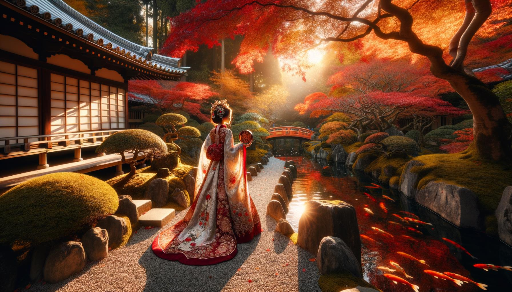
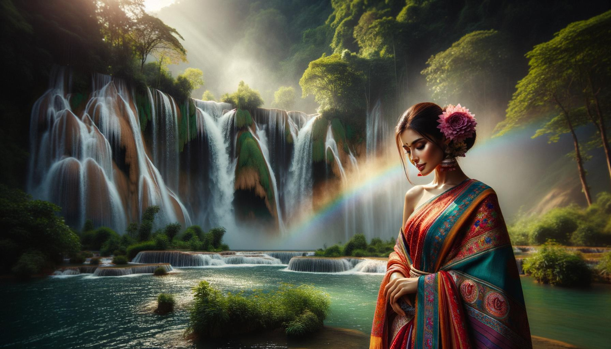
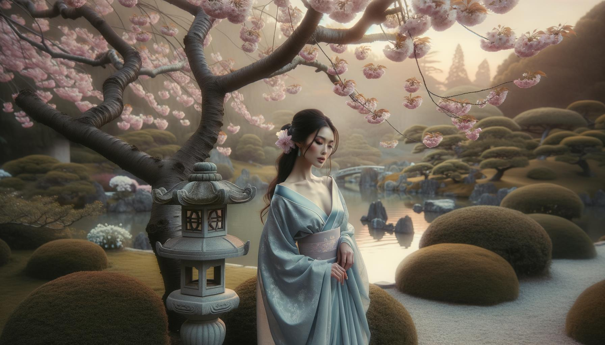
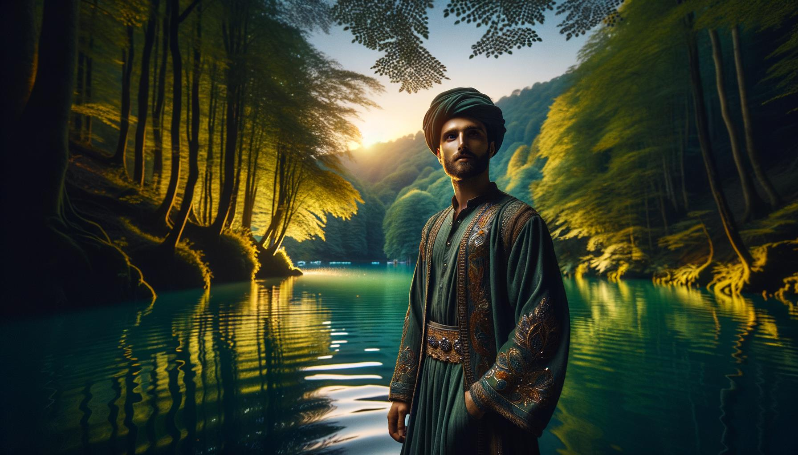
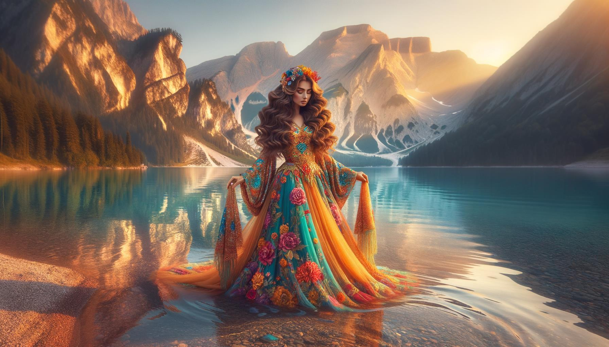
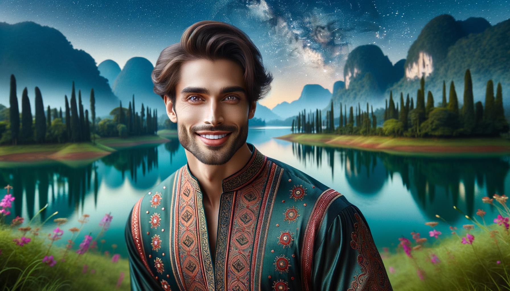

# Pessoas e Lugares Bonitos

Esta página contém 100 imagens geradas pelo DALL-E 3 usando o seguinte código em fevereiro de 2024 para fins de teste

https://github.com/nao7sep/yyGpt/blob/main/yyGptLibConsole/Tester3.cs

## Serenidade Tropical: Uma Senhora Vibrante Entre a Praia do Pôr do Sol e Palmeiras Oscilantes

Gere uma imagem de uma atraente mulher negra, com longos caracóis de cabelo castanho caindo sobre os ombros, em um ambiente sereno. Ela está vestindo um vestido de verão amarelo, seu sorriso é amplo e vibrante. Ao redor dela, a paisagem que se desenrola é uma deslumbrante praia tropical. Palmeiras carregadas de cocos oscilam suavemente na brisa do mar. O sol está se pondo no horizonte, espalhando uma explosão de tons de rosa e damasco pelo céu. Ilhas distantes e veleiros em cruzamento são apenas visíveis na luz que desvanece. Ondas de água cristalina batem ritmicamente contra a areia branca e prístina, criando uma harmoniosa sinfonia da natureza

## Pôr do Sol de Flor de Cerejeira: Uma Beleza Radiante em Meio à Serenidade Florescente

Uma cena visualmente impressionante, apresentando uma mulher negra de cabelos longos e encaracolados e olhos brilhantes e cativantes, de pé sob os galhos florescentes de uma cerejeira. O sol está se pondo, projetando um brilho dourado nas pétalas das flores e na pele radiante da mulher. Ela veste um vestido branco de verão esvoaçante, e seu chapéu de abas largas está gentilmente inclinado para um lado. O doce perfume das flores de cerejeira enche o ar, proporcionando uma atmosfera serena e tranquila. Esta imagem cativante capta a essência da beleza tanto na pessoa quanto no local

## Beleza do Oriente Médio em meio a uma Serenata ao Pôr do Sol em Esplendor Rural Florescente

Uma ilustração de uma bela mulher do Oriente Médio com cabelos longos, cacheados e pretos e olhos castanhos, vestindo um vestido tradicional vibrante e colorido, em pé em uma cena rural de tirar o fôlego. A paisagem ao seu redor apresenta colinas verdes e exuberantes, um pequeno lago azul sereno refletindo o céu, uma pitoresca ponte de pedra cruzando o lago e um bosque de altas cerejeiras em plena floração. O sol está se pondo ao fundo, lançando longas sombras e pintando uma vibrante gama de cores quentes e densas pelo céu

## Serenidade ao Pôr do Sol com uma Beleza do Oriente Médio na Floresta Encantada

Uma cena cativante apresentando uma atrativa mulher do Oriente Médio com cabelos longos e ondulados, vestida com um vestido leve e arejado. Ela está em meio a uma floresta exuberante e tranquila, com um vibrante tapete de flores selvagens, árvores antigas e imponentes, e um riacho calmante que flui nas proximidades. O sol pende baixo no céu, lançando longas e quentes sombras e realçando a beleza natural do cenário

## Elegância Elegante do Sul da Ásia em um Jardim Japonês Beijado pelo Outono

Uma elegante mulher sul-asiática em trajes tradicionais elaborados, passeia por um sereno Jardim Japonês durante uma radiante tarde de outono. A luz do sol filtra através da folhagem vermelha e dourada, projetando sombras salpicadas em um caminho de paralelepípedos. A tranquilidade do lugar é ainda mais acentuada por um lago de carpas com peixes de cor laranja vibrante, e uma pequena ponte de madeira que o atravessa. As árvores de cerejeira adicionam um toque delicado de rosa à paisagem

## Cena Serena da Margem do Rio com Beleza Tradicional do Oriente Médio Entre Flores Silvestres em Flor e Ponte Rústica

Crie uma imagem serena de uma elegante mulher do Oriente Médio com olhos avelã e cabelos escuros que caem graciosamente pelas costas, adornada com trajes tradicionais ricamente bordados. Ela está sentada perto da margem de um tranquilo rio azul. A vegetação exuberante prospera ao redor, com árvores altas tocando o céu e suas folhas formando padrões com a luz do sol filtrando-se através delas. Maravilhosas flores selvagens florescem em cachos, enquanto borboletas voejam perto delas. Além do rio, a paisagem se estende em colinas verdes sob um sereno céu repleto de nuvens. Uma pequena ponte de madeira pitoresca se curva sobre o rio mais a jusante. Toda a cena emite paz e beleza

## Cavalheiro do Sul da Ásia em Traje Vibrante em meio a Prado Florido Ecoa a Tarde

Crie uma imagem apresentando um homem de meia-idade de ascendência sul-asiática, com um sorriso caloroso, vestindo roupas tradicionais em cores vibrantes. Ele está situado em um prado pitoresco durante o final da tarde, com flores silvestres de todas as tonalidades florescendo ao seu redor e árvores verdes exuberantes ao fundo. Raios de sol filtram-se pelas folhas das árvores, lançando sombras salpicadas na grama. Um riacho cintilante serpenteia seu caminho através do prado, acrescentando à atmosfera serena

## Elegância do Oriente Médio no Coração de uma Floresta Etérea

Imagine uma cena deslumbrante em uma floresta etérea, regada com um suave jogo de luz do sol que se infiltra por entre as folhas verdes e luxuriantes. No coração deste cenário pitoresco, está uma mulher de ascendência do Oriente Médio, seus olhos brilhando com sabedoria e tranquilidade. Ela está vestida com um vestido esvoaçante tingido com cores vibrantes, que se misturam harmoniosamente com a natureza ao redor. Seu cabelo, arranjado em uma coroa trançada, evoca um sentimento de serenidade e elegância. Com o zumbido calmante da floresta ao seu redor, ela tem um sorriso sereno, capturando perfeitamente um momento de paz e beleza

## Serenidade do Sul da Ásia em um Jardim Japonês

Crie uma imagem de uma mulher do sul da Ásia com olhos castanhos-escuros e cabelo preto-azeviche, vestida com uma túnica colorida. Ela está sentada num tapete vibrante e tecido, lendo um grosso livro antigo. Está cercada por um sereno e farto jardim japonês, o aroma de cerejeiras em flor enchendo o ar. Uma pequena ponte de pedra se estende sobre um sereno lago de carpas, refletindo a luz do sol da tarde. Uma brisa suave agita as folhas de bambu, criando uma melodia suave e natural

## Pôr do Sol Sereno com uma Beleza Tradicional do Leste Asiático à Beira do Rio Corrente

Uma imagem cativante que retrata uma bela cena. Em detalhes, visualize uma mulher do leste asiático elegantemente vestida com roupas tradicionais, de pé ao lado de um rio corrente. O local está rodeado por uma vegetação exuberante, marcada por árvores com flores vibrantes e multicoloridas. O sol se põe ao longe, banhando a cena com um brilho dourado e quente. A mulher tem um sorriso radiante no rosto, demonstrando felicidade e serenidade. Seu olhar está direcionado para o rio tranquilo, que reflete o pôr do sol de tirar o fôlego e a paisagem verdejante. A cena inteira é calma, tranquila e incrivelmente bela

## Retiro Sublime para Leitores ao Pôr do Sol no Jardim de Cerejeiras em Flor

Uma imagem de um belo homem sul-asiático com um sorriso gentil, vestido casualmente. Ele está sentado em um banco de madeira, absorto na leitura de um livro. Ele está em um sereno jardim público cheio de cerejeiras em flor, pitorescos caminhos de pedra serpenteando através da vegetação luxuriante, e uma clássica cerca de ferro forjado cercando o jardim. Para completar a cena, um pequeno lago tranquilo refletindo as cores vivas do céu durante um pôr do sol pode ser visto nas proximidades

## Serenidade ao Amanhecer no Prado Uma Mulher do Sul da Ásia em Traje Tradicional Cercada pela Beleza da Natureza

Crie uma imagem retratando uma mulher do sul da Ásia com um sorriso radiante, vestindo roupas tradicionais, cercada por um prado encantador ao amanhecer. O prado está decorado com vegetação exuberante, flores e um tranquilo riacho que flui silenciosamente nas proximidades, engendrando uma sensação de paz e serenidade. O sol está no limiar do horizonte, lançando tons suaves e quentes de rosa e laranja em toda a paisagem cênica. A mulher está de pé perto do riacho com uma sensação de alegria e tranquilidade emanando dela

## Encanto da Primavera de uma Sereia do Sul Asiático em um Jardim Japonês

Uma imagem cativante retratando uma mulher do sul da Ásia em seus meados dos trinta anos, com cabelos longos e escuros, vestida com roupas tradicionais vibrantes. Ela está em uma localização fascinante, um jardim japonês em plena floração durante a primavera, com árvores de cerejeira derramando suas pétalas rosa ao seu redor, e um lago tranquilo e calmo perto dela. A suave luz do sol que penetra na folhagem lança uma luz sonhadora e serena sobre toda a cena, ressaltando as cores vibrantes de sua roupa e a beleza natural ao seu redor

## Graça do Oriente Médio em Meio ao Espetáculo Outonal em um Crepúsculo de Vale Imaculado

Crie uma imagem de uma atraente senhora do Oriente Médio com cabelos ondulados e um sorriso gracioso. Ela está em um local de tirar o fôlego - um exuberante vale verde com um rio de água cristalina que o atravessa. Ao seu redor estão altas árvores com folhas de outono brilhantes e coloridas, refletindo-se no rio. Ao longe, pode-se ver montanhas cobertas de neve contra o cenário de um céu azul claro, contribuindo para a beleza geral da paisagem. O sol está se pondo, adicionando um tom dourado ao vale e criando uma atmosfera serena e tranquila

## Pôr do Sol Sereno: Elegância do Sul da Ásia com Vista para a Floresta

Uma cena deslumbrante apresentando uma bela mulher do sul da Ásia com longos e fluídos cabelos negros, vestindo um sari tradicional e em pé em um penhasco com vista para a paisagem de tirar o fôlego de uma floresta verde profunda. O vento está puxando suavemente as cores vibrantes de seu sari e seus cabelos, enquanto ela olha para a vista serena, seu rosto iluminado pelo brilho suave do sol poente. Um pequeno córrego cintilante se contorce através da floresta, refletindo as brilhantes tonalidades do anoitecer. O silêncio tranquilo da área é palpável, contribuindo para a sensação geral do cenário sereno e idílico

## Mulher elegante do Oriente Médio em meio a um jardim florido ao anoitecer

Um retrato impressionante de uma mulher de ascendência do Oriente Médio, vestida com roupas elegantes, em pé em meio a um cenário cênico. Ela está em um caminho de paralelepípedos que serpenteia por um belo jardim repleto de flores vibrantes e coloridas em plena floração. Há árvores antigas e altas proporcionando sombra abundante, e atrás dela, uma pitoresca cadeia de montanhas se ergue majestosa à distância, banhada pela luz dourada do pôr do sol

## Beleza Graciosa à Beira do Lago ao Pôr do Sol

Ilustre uma cena encantadora apresentando uma elegante figura feminina de descendência negra, posando graciosamente ao ar livre em um ambiente tranquilo. Ela poderia estar de pé ao lado de um lago azul e calmo, com um cenário de montanhas verdes altas sob um céu azul e claro. O sol está se pondo, fornecendo uma luz quente e suave, pintando a cena com delicados tons pastel. Ela está vestida com um vestido branco de verão, seu cabelo em longos cachos fluindo, acrescentando uma nota de beleza atemporal à imagem toda

## Solidão do Crepúsculo no Deserto: Harmonia entre o Homem e a Natureza nos Tons do Pôr do Sol

Imagine uma cena de tirar o fôlego ao pôr do sol. No coração deste espetáculo está uma figura masculina do Oriente Médio, apreciando as cores hipnotizantes do sol poente que se misturam perfeitamente com os tons laranja das dunas do deserto. Areias leves como penas, aquecidas pelo sol durante todo o dia, irradiam um calor suave que parece ecoar a serenidade calma no rosto do homem enquanto ele observa a tela cativante da natureza. À medida que os últimos raios do sol iluminam seu rosto, o vento brinca suavemente com seu cabelo escuro, adicionando o toque final a este retrato notável de um homem e a natureza em harmonia

## Serenidade Sul-Asiática Entre Tons de Floresta Tropical e Cachoeira em Cascata

Crie uma imagem cativante de uma mulher sul-asiática parada em uma clareira surreal e tranquila em uma floresta tropical exuberante. Ela está vestida com trajes tradicionais, seu cabelo escuro está trançado e ela exala uma sensação de calma e paz. A floresta ao redor está repleta de folhagem tropical vibrante em várias tonalidades de verde e salpicada com flores exóticas de cores variadas. Uma cachoeira hipnotizante que desce ao fundo adiciona serenidade à cena e uma família de borboletas luminescentes voando ao redor adiciona um toque de fantasia à paisagem

## Serenidade e Beleza Entre as Flores de Cerejeira: Uma Elegância do Sul Asiático no Jardim Japonês

Crie uma imagem marcante de uma mulher sul-asiática de pé em um tranquilo jardim japonês durante a temporada de flores de cerejeira. Ela está vestindo um quimono tradicional em cores vibrantes de azul e ouro, com padrões realistas de crisântemos e pavões. A mulher é capturada em uma pose calma e serena, admirando a densa agitação de flores de cerejeira rosa pálido que enchem o céu e varrem o chão ao seu redor. Um pequeno riacho suave flui nas proximidades, com o delicado reflexo das flores de cerejeira em sua superfície. Lanternas de pedra tradicionais adicionam um toque de elegância tranquila à cena

## Elegância Oriental em um Tranquilo Pôr do Sol Italiano

Uma mulher asiática oriental de beleza impressionante, com longos cabelos negros suavemente flutuando na brisa, de pé em meio a uma tranquila paisagem rural italiana durante o pôr do sol. Ela está vestida com um vestido branco tradicional, seus olhos cintilam com calor e alegria. Ao seu redor estão extensas áreas verdes, vinícolas e casas rústicas aninhadas contra colinas ondulantes, banhadas pelo brilho dourado quente do sol poente. Esta cena serena exala calma e beleza, criando uma imagem de coexistência harmoniosa entre a natureza e a humanidade

## Pôr do Sol Sereno: Uma Beleza Hispânica em Lavanda e Azul Entre Colinas Esmeralda Ondulantes

Crie uma imagem de uma mulher hispânica com cabelos longos e curvilíneos e um sorriso radiante. Ela está de pé em uma paisagem serena e deslumbrante durante o pôr do sol. O local é caracterizado por colinas verde-esmeralda sob um céu lavanda. Deve-se prestar atenção excepcional à sua roupa - um vestido de verão arejado e elegantemente cortado em tons de lavanda e azul real que complementa o cenário sedutor

## Belíssimo Homem do Oriente Médio Abraça a Serenidade de uma Exuberante Paisagem ao Pôr do Sol

Gere uma imagem de um belo homem do Oriente Médio, com cabelos ondulados e escuros, vestido com roupas casuais, em pé no meio de uma paisagem cativante. Esta paisagem é um local sereno com vegetação exuberante, um rio cintilante serpenteando lentamente e uma majestosa cordilheira adornando o horizonte. O céu acima dele está pintado com tons de um pôr do sol, lançando uma luz etérea na cena. Lá, este indivíduo está observando a natureza deslumbrante ao seu redor, um sorriso contente iluminando seu rosto, incorporando a beleza da paz circundante

## Elegância ao Crepúsculo ao Lado do Lago Turquesa

Uma imagem pitoresca de uma elegante mulher do Oriente Médio com longos cabelos pretos, vestindo um vibrante vestido vermelho. Ela está de pé à beira de um sereno lago turquesa, cercada por uma densa floresta que exibe todos os tons de verde. O sol está se pondo ao fundo, lançando uma luz dourada e quente sobre a paisagem, criando uma atmosfera serena e bonita

## Princesa do Crepúsculo Etéreo no Deserto em Paisagem Encantada

Crie uma imagem de uma deslumbrante e etérea mulher do Oriente Médio de pé em meio a uma paisagem natural encantadora. Ela está adornada com um turbante vibrante detalhado com belas gemas e padrões intricados. Sua vestimenta é uma túnica colorida e fluida que reflete as tonalidades do sol poente ao seu redor. A paisagem apresenta várias tonalidades de laranja, roxo e rosa misturadas com o céu azul cerúleo. Montanhas majestosas surgem ao fundo, cobertas com um toque de neve e o primeiro plano é pontuado por um riacho cintilante que serpenteia seu caminho através de campos exuberantes, criando uma cena que exala tranquilidade e deslumbrante beleza

## Serenidade do Sul da Ásia em um Prado ao Pôr do Sol

Uma imagem de um indivíduo deslumbrante, homem do sul da Ásia em seus 30 e poucos anos, com cabelo de comprimento médio e um sorriso gentil no rosto. Ele está vestido com roupas casuais e confortáveis e está situado em um local igualmente impressionante. Este ambiente é um prado pacífico banhado pela luz dourada do sol poente. Árvores altas e graciosas emolduram a cena, suas folhas balançando suavemente na brisa. Montanhas distantes adornam o horizonte, seus picos beijados pelos últimos raios do sol. Os sons serenos da natureza enchem o ar, pintando uma cena de tranquilidade e beleza

## Sorriso Radiante em um Prado Dourado: Uma Mulher do Oriente Médio em Meio ao Pôr do Sol Etéreo e Picos de Montanhas

Visualize a mulher do Oriente Médio graciosamente equilibrada em um local de cênica deslumbrante. Ela ostenta um sorriso radiante e olhos castanhos brilhantes que exalam calor. Ela está vestida com trajes tradicionais coloridos, sua cabeça adornada com um belo lenço estampado. O lugar onde ela está é etéreo, banhado na suave tonalidade dourada do pôr do sol. É um prado, exuberante e etéreo, com flores silvestres vibrantes balançando na brisa suave. À distância, você pode avistar cumes de montanhas majestosas beijados pelos últimos lampejos de luz do dia

## Serenidade de Outono: Uma Graça do Sul Asiático em um Jardim Japonês

Gere uma imagem de uma mulher sul-asiática em trajes tradicionais, posicionada graciosamente em um sereno jardim japonês durante o outono. As cores do jardim contrastam com seus trajes tradicionais e vivos. Ela é vista admirando a mistura de tons de outono ao seu redor, com árvores de bordo derramando folhas vermelhas e nítidas, uma pitoresca lanterna de pedra ao fundo, e um calmante lago de carpas aos seus pés

## Crepúsculo Tranquilo em uma Pradaria do Oriente Médio

Uma cena tranquila de uma mulher do Oriente Médio, sentada pacificamente à sombra de uma velha árvore retorcida. Ela parece radiante em seu traje tradicional colorido. A localização é um prado encantado, cheio de flores silvestres vibrantes. O sol se põe, lançando um tom dourado sereno através da paisagem. Ao longe estão as majestosas montanhas cobertas de neve. Uma leve brisa agita as pétalas das flores, criando um ambiente suave e calmante

## Elegância e Beleza Entre a Radiação Tropical e a Serenidade da Cascata

Uma atraente mulher negra com cabelos cacheados, vestindo um vestido elegante, está em um caminho que serpenteia por uma floresta tropical exuberante. Pássaros exóticos de cores brilhantes estão pousados nas árvores próximas. Ao longe, uma majestosa cachoeira despenca de um penhasco, produzindo uma trilha sonora serena para este ambiente tranquilo. Os raios do sol penetram na copa das árvores, projetando sombras marmorizadas e iluminando a vegetação abundante com um brilho dourado

## Serenidade de Verão numa Encosta do Médio Oriente

Uma imagem de um homem do Oriente Médio vacilando nas rochas à beira de um deslumbrante penhasco com vista para o mar azul. Ele está vestido com roupas de verão simples, mas atraentes - uma camisa de botões pastel, shorts cáqui e chinelos - realçando sua aparência chic e sem esforço. Seus olhos refletem a beleza da cena serena que se desenrola à sua frente. O sol espreitando através das nuvens dispersas pinta um jogo hipnotizante de luzes e sombras nas águas límpidas e cristalinas. Momentos fugazes de tranquilidade como este são verdadeiras bênçãos

## Elegância do Oriente Médio ao Pôr do Sol no Oásis

Crie uma imagem representando uma mulher do Oriente Médio em um cenário deslumbrante. Ela está elegantemente vestida, encapsulando trajes tradicionais do Oriente Médio com influências modernas. Ela está perto de um exuberante oásis verde, o sol está prestes a se pôr e lança uma tonalidade etérea de laranja e ouro sobre a paisagem. Um corpo tranquilo e cintilante de água está por perto, possivelmente um pequeno lago, refletindo a paisagem pitoresca e o escurecimento rápido do céu estrelado. A tranquilidade do ambiente e sua expressão serena emanam uma aura de paz e contentamento

## Olhar Esmeralda no Coração da Floresta Tropical

Uma imagem de uma bela mulher negra com longos cabelos trançados e olhos verdes esmeralda, posando com confiança em um local impressionante. O cenário é uma exuberante floresta tropical, repleta de folhagem vibrante e flores exóticas brilhantes. As cores ao seu redor são vibrantes e vivas, com a luz solar filtrando através da copa, projetando padrões hipnotizantes no chão da floresta. Uma cachoeira em cascata pode ser vista ao fundo, sua água cintilando sob a luz do sol, criando uma atmosfera serena e tranquila

## Serenidade do Oriente Médio em um Éden Floral Exuberante sob a Luz do Sol Dourada

Ilustre uma mulher do Oriente Médio com cabelos longos e encaracolados, em um exuberante jardim verde cheio de uma variedade de flores multicoloridas. Ela está usando um vestido pastel fluido e está sentada em um banco ornado de ferro forjado sob uma cerejeira em flor, absorta na leitura de um romance ao estilo vitoriano. O sol está se pondo, lançando uma luz dourada quente sobre a cena. Pavões podem ser vistos ao fundo, vagando livremente. A tranquilidade e a beleza cênica do lugar são verdadeiramente cativantes

## Artista do Oriente Médio em uma Rua Sul-Asiática Colorida ao Pôr do Sol

Crie uma imagem de um belo artista do Oriente Médio em pé numa pitoresca rua do sul da Ásia, repleta de edifícios coloridos e vibrantes. Ele está vestindo uma kurta tradicional e segura um pincel na mão. Uma brisa suave sopra, fazendo suas roupas se agitarem. O sol está se pondo, lançando um caloroso brilho laranja na cena

## Eterea Tranquilidade: A Solitária Contemplação do Homem Asiático em um Lago Alpino

Uma cena etérea apresentando um atraente homem asiático com traços elegantes, confortavelmente sentado numa rocha à beira de um sereno lago alpino. O homem está vestido com roupas casuais da moda, e sua postura contemplativa indica um sentimento de paz e tranquilidade. A área ao redor é magnífica, com imponentes montanhas cobertas de neve refletindo na superfície espelhada do lago, e exuberantes pinheiros espalhados ao redor. A água serena, o ar fresco e limpo, e o suave bater das asas dos pássaros alpinos criam um sentimento de tranquilidade e harmonia com a natureza

## Serenidade Mística na Floresta do Oriente Médio

Uma deslumbrante representação de uma mulher do Oriente Médio, com seus longos cabelos castanhos escorrendo pelos ombros, está de pé em um cenário de tirar o fôlego. Ela está em meio a uma floresta serena, intercalada com árvores altas e vibrantes, flores em plena floração com uma cachoeira ao fundo. A luz filtra a folhagem verde, projetando um padrão difuso em seu rosto. Ela está vestindo um longo vestido vibrante que oscila com a suave brisa. Ela está olhando para as montanhas distantes no horizonte, com um olhar de paz e contentamento no rosto

## Mulher em Vestido Laranja Abraçando o Pôr do Sol em Vales Ondulantes

Uma paisagem pitoresca se desenrola com vales ondulantes e um pôr do sol espetacular saturando o céu com tons de vermelho, laranja e roxo. Neste lugar inspirador, uma mulher asiática, com cabelos escuros presos em um coque solto, está a observar a cena. Ela está vestida com um vestido de verão laranja, o tecido suave ecoando as cores do pôr do sol. Seu sorriso radiante transmite uma sensação de paz e contentamento, enquanto ela desfruta da beleza natural de sua volta. Uma brisa suave brinca com seu vestido e cabelo, acrescentando ao ambiente sereno

## Beleza Hispânica Sob Árvore de Cerejeira em Meio a Paisagens Majestosas

Uma imagem visualmente deslumbrante de uma mulher hispânica, com cabelos castanhos esvoaçantes, olhos cor de avelã cintilantes e vestindo um vestido de verão, descansando tranquilamente à sombra de uma árvore de cerejeira em flor. Ao seu redor, uma paisagem de tirar o fôlego de um prado verde exuberante pontilhado de flores silvestres, um lago azul tranquilo à distância e montanhas cobertas de neve sob um céu azul claro

## Elegância e Exploração Uma Mulher do Sul da Ásia em Roupas de Rua Vibrantes em um Cenário Costeiro Sereno

Uma imagem impressionante de uma mulher sul-asiática, vestida com elegante vestuário de rua, de pé num local deslumbrante. Imagine-a entre treliças altas cobertas de flores, sob um céu ensolarado e brilhante. Ela está segurando uma bolsa da moda, os olhos cheios de curiosidade, explorando a beleza ao seu redor. A paisagem apresenta um caminho de paralelepípedos que conduz a um vasto oceano azul ao longe, com vegetação exuberante de ambos os lados. O lugar exala uma atmosfera serena, complementada por uma paleta de cores completa de pastéis suaves e tons vibrantes que evocam a frescura de uma manhã de primavera

## Beleza do Oriente Médio em Traje Tradicional Entre Vegetação Verdejante e Cachoeira ao Pôr do Sol

Crie uma imagem detalhada de uma atraente mulher do Oriente Médio com um sorriso caloroso, vestida com roupas tradicionais coloridas, em um cenário encantador. O ambiente consiste em vegetação exuberante, uma cascata em cascata ao fundo e flores em uma miríade de cores. Um riacho tranquilo corre ao lado dela, e há um pôr do sol sereno e vibrante no horizonte, lançando lindos tons pastéis no céu

## Sorriso Radiante em uma Floresta Esmeralda: Beleza Sul-Asiática em Magenta Adornando o Dossel da Natureza

Uma bela cena com uma mulher do sul da Ásia com um sorriso radiante, vestindo um traje tradicional magenta brilhante, em pé numa floresta verdejante e bela. O chão da floresta está decorado com folhas caídas de várias cores, e a luz do sol filtrada está derramando através das altas e imponentes árvores. O ar está repleto dos sons tranquilos da natureza, pássaros a chilrear, e uma brisa suave a farfalhar pelas folhas. Este cenário pitoresco é ainda realçado por uma cascata distante a cair sobre rochas musgosas, o seu som relaxante fundindo-se com a sinfonia da floresta

## Elegante Graça em uma Deslumbrante Cena de Jardim do Sul Asiático

Uma cena deslumbrante em um local pitoresco. Imagine uma mulher do sul da Ásia, distinguida pela sua graça e carisma notável. Sua vestimenta é um sari vibrante, cheio de padrões intricados e texturas ricas. Ela se mantém alta, sua postura radiante de elegância. O cenário é um jardim sedutor, opulento e esplêndido - imerja-se na tranquila sinfonia dos pássaros a cantar, flores desabrochando com vivas cores de azuis e rosas e as folhas farfalhando das árvores imponentes. Talvez haja um riacho murmurante nas proximidades, lançando melodias cadenciadas neste ambiente sereno. Uma visão verdadeiramente de tirar o fôlego!

## Explorador do Oriente Médio na Esplendor da Natureza: Tranquilidade na Colorida Costa

Uma imagem de uma pessoa de origem do Oriente Médio, com uma aparência de gênero neutro. Ela está de pé em um local naturalmente deslumbrante, cercada por vegetação exuberante e flores silvestres coloridas. Ao longe, um oceano azul brilhante abraça a costa rochosa. O céu é um brilhante tom de azul, salpicado com tons de rosa suave do sol poente. A pessoa está vestindo roupas confortáveis e estilosas, olhando para a paisagem com uma expressão de paz e contentamento, aproveitando totalmente a serenidade e a beleza do lugar

## Elegância do Oriente Médio com Vista para uma Cidade Costeira ao Pôr do Sol

Imagine uma imagem de uma bela mulher do Oriente Médio em seus 30 e poucos anos, em pé em uma varanda exquisitamente decorada, com vista para uma tranquila cidade costeira ao pôr do sol. Ela está vestindo um elegante vestido longo e esvoaçante na cor aquamarine, seus cabelos pretos e encaracolados soltos, balançando suavemente ao vento. Seus olhos castanhos escuros olham contemplativamente para a distância, refletindo os brilhantes tons do pôr do sol. A cidade abaixo é composta por edifícios brancos rebocados, luxuosas palmeiras verdes, com ruas de paralelepípedos sinuosas que levam ao tranquilo mar azul além. O céu é um tumulto de laranja, rosa e roxo quente, o sol poente espalhando seus radiantes raios dourados sobre a pitoresca cidade

## Graça e Serenidade Uma Elegância do Sul da Ásia em Meio a uma Paisagem Vibrante Sob Céus de Pôr do Sol Pastel

Crie uma imagem de uma mulher do sul da Ásia em pé em uma paisagem marcante e vibrante. Ela exala graça e serenidade, com os olhos refletindo compaixão e bondade. Seu cabelo é longo e amarrado solto na parte de trás. Ela veste um vestido tradicional simples, porém elegante, que realça sua beleza. A paisagem ao seu redor é de tirar o fôlego, preenchida com um prado florido que se estende em direção a uma majestosa cadeia de montanhas sob um suave céu de por do sol em tons pastéis

## Tranquila Vibração de um Aventureiro do Sul Asiático ao Pôr do Sol

Uma imagem cativante que mostra uma bela paisagem natural com colinas ondulantes, lago cristalino e um vibrante pôr do sol colorindo o céu. No primeiro plano, um homem do sul da Ásia de constituição atlética está casualmente, vestido com roupas confortáveis para atividades ao ar livre. O sorriso gravado em seu rosto apenas eleva a tranquilidade e o charme geral do retrato cênico

## Beleza de tirar o fôlego entre História e Natureza no Oriente Médio

Uma mulher do Oriente Médio visualmente cativante, de pé em um local de tirar o fôlego. Ela tem olhos escuros expressivos e cabelos longos e negros como o corvo, que são arrastados pela brisa suave. Seu traje tradicional é uma rica mistura de cores, com padrões intrincados que são um testemunho da rica cultura da região. O local é igualmente magnífico, com arquitetura antiga imponente que insinua uma história complexa, lindamente compensada por parques verdejantes e corpos d'água tranquilos cintilando sob o sol dourado. Para onde quer que o olho vague, há o brilho da vida - na pétala de uma flor, no bater de asas de um pássaro cantor, ou no silêncio suave do vento

## Pôr do Sol Sereno: Uma Mulher do Sul da Ásia Apreciando a Tranquilidade em um Campo Colorido

Crie uma imagem detalhada mostrando uma mulher do Sul da Ásia saboreando a tranquilidade de um cenário espetacular. Ela está posicionada em uma vasta e exuberante zona rural, repleta de campos vibrantes de flores silvestres que ondulam ao vento suave. Acima, um céu deslumbrante transforma-se de azul para tons de ouro e rosa conforme o sol se põe no horizonte. Ela veste um traje tradicional confortável, com um sorriso de serenidade no rosto combinado com um toque de alegria, refletindo a verdadeira beleza de seu entorno

## Elegância do Sul Asiático ao Crepúsculo do Lago de Lótus

Crie uma imagem de uma mulher sul-asiática com cabelos longos e ondulados, vestida com trajes tradicionais coloridos, em pé sobre uma ponte sobre um sereno lago de lótus. A cena é envolvida pelo caloroso brilho do pôr do sol, pintando o céu em tons de roxo, laranja e vermelho. A água calma reflete as cores vibrantes do céu e as vitórias-régias flutuam suavemente na superfície da água. À distância próxima, lanternas de pedra tradicionais alinham o caminho ao longo do lago, sua luz suave contribuindo para a atmosfera tranquila. Para completar a cena, árvores de cerejeira em plena floração contornam o lago, suas pétalas criando um delicioso tapete rosa no chão

## Elegância Sul-Asiática Entre Cachoeira Beijada por Arco-Íris e Verdes Exuberantes

Uma cena visualmente atraente com uma mulher do sul da Ásia de pé perto de uma majestosa cachoeira. Ela está vestindo um traje tradicional vibrante, cujos tons complementam a vegetação verdejante ao redor. Seu rosto é iluminado pela suave luz natural filtrada pelas árvores próximas. A cachoeira desce com uma intensidade graciosa, enviando uma névoa delicada para o ar que refrata a luz solar e forma um arco-íris. A cena é pacífica, serena e abundante em vida, mostrando verdadeiramente a maravilha da natureza e a beleza na diversidade

## Elegância Etérea em um Exuberante Jardim do Oriente Médio

Uma elegante mulher do Oriente Médio, com cabelos escuros e fluidos e olhos castanhos profundos, está relaxando em um tranquilo e exuberante jardim. A luz do sol atravessa a folhagem verde, iluminando as flores vivas que a cercam. Uma brisa suave agita suas roupas, adicionando um toque etéreo. Perto dela, pavões coloridos se pavoneiam majestosamente, suas penas iridescentes reluzentes. Com uma expressão pacífica, ela se perde na beleza da natureza ao seu redor

## Serenidade do Pôr do Sol no Oriente Médio Entre Harmonia Floral e Montanhas Majestosas

Uma cena encantadora de uma mulher do Oriente Médio com longos cabelos pretos e brilhantes, confortavelmente vestida com uma túnica fluida e feita à mão. Ela está situada em um local pacífico cercado por uma vegetação exuberante e flores silvestres vibrantes. O sol está suavemente se pondo ao fundo, lançando um brilho dourado quente sobre a paisagem serena. Uma serena cadeia de montanhas se eleva à distância, acrescentando à beleza cênica. Uma imagem pintada com o pincel da tranquilidade e serenidade, um sublime jogo de natureza e humanidade

## Serena Reverie de uma Senhora do Sul da Ásia entre Pinheiros Verdes Luxuriantes e Majestosos Picos Nevados

Uma cena impressionante apresenta uma mulher do Sul da Ásia, com cabelos ondulados de comprimento médio, iluminada pela luz suave do pôr do sol. Ela está vestindo roupas tradicionais, olhando para a vista hipnotizante de um lago sereno, cercado por uma floresta verde e exuberante de pinheiros altos. Ao longe, majestosas montanhas cobertas de neve se erguem sob o céu azul e límpido. Esta cena tranquila evoca um sentimento de calma,  acentuado pela expressão pacífica da mulher e pelas cores vibrantes da paisagem

## Majestade do Oriente Médio Entre o Esplendor do Pôr do Sol e a Natureza Vibrante

Crie uma imagem destacando uma bela mulher do Oriente Médio, com cabelos escuros e olhos impactantes, vestindo trajes tradicionais. Ela está posicionada em um cenário cênico rodeado por uma linda beleza natural. Isso inclui uma cascata jorrante nas proximidades, vegetação exuberante com diversas plantas vibrantes. O sol está se pondo, lançando um brilho laranja quente na cena, acentuando a flora fúcsia e vermelha. A pessoa está em um caminho serpenteando pela paisagem, banhado nas cores radiantes de um pôr do sol, refletindo sua tranquila tranquilidade

## Serenidade ao Nascer do Sol em Açafrão Sobre o Himalaia

Uma atraente mulher sul-asiática está de pé contra o pano de fundo da majestosa cordilheira do Himalaia, radiante nas cores do nascer do sol. Ela está elegantemente vestida com um sari de cor açafrão com enfeites dourados. Seus cabelos escuros são adornados com uma maang tikka tradicional. Uma brisa fresca da manhã balança suavemente seu cabelo e sari, adicionando um sentido de movimento à cena inteira

## A beleza de Auburn abraça a Primavera em uma Harmonia de Jardim Asiático

Crie uma imagem destacando uma bela cena de um tranquilo jardim asiático durante a primavera. Na cena, encontramos uma mulher caucasiana visualmente deslumbrante apreciando a beleza que a rodeia. Ela é caracterizada por seu longo cabelo castanho-avermelhado ondulado, olhos vibrantes e um sorriso caloroso que testemunha sua beleza interior. Ela está elegantemente vestida em uma mistura de trajes modernos e tradicionais, simbolizando uma harmoniosa mistura de culturas. O jardim está repleto de árvores de cerejeira em flor, com suas pétalas caindo suavemente, um lago com carpas e uma ponte de madeira clássica, refletindo a beleza atemporal das paisagens asiáticas

## Serenidade na Serenata de Safira Elegância Chinesa Entre Flores Ponte e Picos Nevados

Crie uma imagem de uma encantadora mulher do Leste Asiático, com cabelos pretos e longos e olhos suaves e bondosos, ostentando um sorriso sereno. Ela está elegantemente vestida com um cheongsam chinês tradicional azul safira, adornado com bordados dourados. Atrás dela há uma vibrante árvore de cerejeira em flor balançando suavemente ao vento, situada perto de uma antiga e rústica ponte de pedra que cruza um tranquilo lago de lírios. Montanhas majestosas cobertas com picos de neve podem ser vistas à distância sob um céu azul cerúleo com nuvens brancas e fofas vagarosamente à deriva. Um ar de serenidade e tranquilidade envolve este cenário pitoresco

## A Elegância do Sul Asiático Encontra o Charme Europeu no Brilho Dourado do Entardecer

Uma imagem esteticamente agradável de uma mulher sul-asiática de meia idade, vestida com uma roupa tradicional vibrante, perto de um lindo cenário de uma cidade europeia histórica. Ela está caminhando por uma rua de pedras cercada por lojas pitorescas. Seu sorriso acrescenta à beleza da cena enquanto ela admira o charme arquitetônico único da cidade. O brilho dourado do sol da tarde adiciona um toque de magia à atmosfera, lançando sombras longas e aquecendo as estruturas naturais e feitas pelo homem ao redor. A cena capta uma sensação de tranquilidade e alegria

## Brilho Etereo de uma Elegante Bela do Oriente Médio em um Jardim Vibrante ao Pôr do Sol

Uma imagem deslumbrante de uma mulher do Oriente Médio exalando graça, elegantemente vestida com trajes tradicionais vibrantes. Ela está em uma localização de tirar o fôlego, um jardim exuberante repleto de flora diversa em plena floração. Pétalas de cores vibrantes cobrem o chão, e um sereno lago reflete o céu, criando uma mistura hipnotizante de beleza natural. O sol está se pondo ao fundo, lançando uma aura dourada que pinta tudo com um brilho morno e etéreo

## Elegância e Graça no Pôr do Sol Dourado pela Cachoeira Encantada

Uma elegante mulher sul-asiática em um sarongue amarelo fluente está ao lado de um homem do Oriente Médio, vestido de maneira inteligente em um terno azul casual. Eles estão situados em uma paisagem relaxante, apresentando uma cachoeira encantadora que despenca sobre rochas cobertas de musgo e um lago cristalino cintilando no brilho suave do sol poente. A atmosfera calma é ainda mais intensificada pela presença de majestosas árvores Cypress de 300 anos, enquanto flores selvagens vibrantes pontilham os arredores e pássaros de plumagem requintada cruzam o céu

## Homem do Oriente Médio Abraçando a Tranquilidade ao Nascer do Sol em Praia Isolada

Um homem atraente do Oriente Médio, com um físico forte e um sorriso caloroso, está sentado calmamente em um local encantador. O lugar é uma praia tranquila e isolada ao amanhecer. Areia dourada se estende até a água cristalina que reflete os tons suaves de pêssego do céu matinal. Silhuetas leves de árvores tropicais exuberantes cercam o cenário, adicionando um charme sereno. O ambiente aconchegante criado pelas ondas suaves e a brisa do mar refrescante combinam perfeitamente com o comportamento pacífico do homem e a genuína satisfação

## Graça do Sul da Ásia ao Crepúsculo pelo Lago Tranquilo

Uma cena serena se desenrola com uma mulher sul-asiática de pé graciosamente à beira de um lago tranquilo. O sol poente respira uma aura dourada nos arredores, iluminando o céu com tons de laranja, rosa e roxo. Ao longe, altas montanhas cobertas de neve completam o cenário hipnotizante. A mulher está vestida em um conjunto suave de lavanda, irradiando calor e paz. Seus olhos brilham de alegria, refletindo a beleza natural do local. Há um cais de madeira atrás dela, que entra nas águas calmas do lago, e flores silvestres vibrantes florescem à beira do lago, aumentando a beleza idílica deste cenário pitoresco

## Serenidade Repousante ao Pôr do Sol à Beira do Lago e Paisagem do Sul da Ásia

Uma cena cativante de uma mulher do sul da Ásia descansando tranquilamente à beira de um lago tranquilo, sua reflexão espelhada na superfície vítrica da água. Ela está vestida com um traje de verão simples, mas elegante, com o cabelo espalhado atrás dela contra o pano de fundo de vegetação exuberante. Ao redor dela, o sol poente pinta explosões dramáticas de laranja e rosa no céu, projetando uma luz quente e serena na paisagem pitoresca. Cottages de madeira requintadamente pitorescos podem ser vistos à distância, aninhados entre as colinas ondulantes que se estendem em direção ao horizonte

## Olhar Avelã no Oásis Verdejante Banhado pelo Sol

Uma imagem de um belo homem do Oriente Médio, com cabelo escuro, barba bem aparada e olhos castanhos expressivos. Ele está em um ambiente etéreo, uma floresta exuberante e vívida, florescendo com árvores verdes, flores coloridas e um riacho de água cristalina cintilando na luz solar suave. Raios de luz atravessam a copa densa, criando dinâmicos pontos de luz e sombra, fazendo a floresta ganhar vida. O homem está vestido com roupas casuais e confortáveis, parecendo relaxado e sereno, seu rosto iluminado pelos raios de sol, expressando um sentimento de paz e satisfação

## Graça Sob Cerejeiras Um Retrato do Leste Asiático em Seda Azul e Serenidade ao Pôr do Sol

Visualize uma mulher do leste asiático, posicionada graciosamente enquanto ela está sob a sombra sutil de cerejeiras em plena floração. As pétalas rosa suaves chovem ao redor dela, ela veste um delicado vestido de seda azul que complementa sua tez, enquanto seu longo cabelo preto corvo está preso em um coque frouxo. O cenário exala a serenidade de um tradicional jardim de chá japonês, com uma lanterna de pedra parcialmente escondida em meio à flora, arbustos bem aparados e um pequeno lago refletindo a paisagem pitoresca. As tonalidades suaves do pôr do sol pintam este tranquilo quadro com tons quentes

## Serenidade no Horizonte: A Devaneio de uma Mulher do Sul da Ásia ao Pôr do Sol

Uma cena deslumbrante apresentando uma jovem sul-asiática de porte médio com seus cabelos pretos sedosos e brilhantes presos em um rabo de cavalo. Ela está de pé no topo de uma colina verdejante, banhando-se nos suaves raios do sol poente. Esta bela paisagem não é nada menos que um paraíso, com o mar azul se estendendo até o horizonte, e aves marinhas pontilhando o céu acima da linha costeira. A mulher, irradiando uma aura pacífica, observa a vista de tirar o fôlego com um sentimento de serenidade, completando esta imagem de tranquilidade e beleza

## Encantador Homem do Sul Asiático em um Passeio na Praia ao Pôr do Sol

Gere uma imagem de um homem sul-asiático com um sorriso encantador, vestindo uma camisa de linho branco nítida e calças cáqui. Ele está passeando em uma praia arenosa durante o pôr do sol, o horizonte em chamas com tons de laranja e rosa. Palmeiras balançam suavemente ao fundo, e o mar turquesa brinca alegremente em seus pés descalços

## Amanhecer Tranquilo à Beira do Rio: Uma Elegância Vitoriana entre as Flores de Cerejeira e os Ecos da Montanha

Gere uma imagem em um estilo suave e artístico, lembrando a era Romântica, apresentando uma mulher asiática em um vestido vitoriano ajustado, sentada à beira de um rio tranquilo e cintilante. Um sol da manhã está nascendo ao longe, lançando uma luz suave e quente sobre a cena. Os reflexos na água estão cintilando, a grama está exuberante e verde, e há cerejeiras em flor espalhando pétalas com a brisa. A mulher na cena está segurando suavemente um livro, perdida em pensamentos. Uma montanha majestosa ecoa ao longe, envolta em uma suave névoa, aprimorando a serena ambiência

## Reflexos Serenos do Crepúsculo de uma Beleza do Sul Asiático na Natureza

Uma imagem de uma atraente mulher sul-asiática, vestida com um vibrante traje tradicional, em pé em uma floresta exuberante e pitoresca. Há um lago plácido por perto, refletindo o impressionante pôr do sol dourado. A cena é serena, com o canto dos pássaros ao entardecer preenchendo o ar e uma brisa suave agitando as folhas da floresta. Ela está sorrindo suavemente, seus olhos acesos de alegria, enquanto ela mesmeriza com a beleza natural que a rodeia

## Homem do Oriente Médio ao Crepúsculo Serenidade em meio a Floresta Lush à beira do lago

Uma representação cativante de um homem do Oriente Médio em seu auge, de pé à beira de um lago sereno no coração de uma floresta exuberante. As tonalidades do crepúsculo do sol poente dançam na água calma, estendendo-se para as árvores densas com suas folhas esmeralda, criando uma harmonia encantadora de cores. O traje tradicional do homem se destaca contra este pano de fundo, os detalhes de sua roupa meticulosamente trabalhados. Sua expressão tranquila reflete sua profunda conexão com o ambiente natural, contribuindo para uma cena que é a epítome da beleza pacífica

## Mulher asiática alegre em um prado vibrante ao pôr do sol

Crie uma imagem de uma mulher asiática em seus 30 e poucos anos, com cabelos castanhos ondulados até os ombros, olhos castanhos profundos e um sorriso alegre no rosto. Ela está de pé em um local pitoresco: um prado verde exuberante repleto de flores silvestres de todas as cores do arco-íris, um riacho azul cintilante serpenteia pelo prado e o sol está se pondo ao longe, pintando o céu com tons de vermelho, rosa e laranja

## Brilho do Pôr do Sol no Lago Azul com Beleza em Flor

Uma imagem de uma bela mulher hispânica com cabelos longos e ondulados e um sorriso hipnotizante perto de um lago azul-azul com árvores verdejantes ao fundo e delicadas flores brancas florescendo a seus pés. O sol lança um brilho dourado por toda a cena, refletindo na superfície calma do lago, e o céu é um baile de tons pastel ao pôr do sol

## Harmonia Matinal Entre a Beleza Alpina com Enigma de Descendência Asiática

Uma cena visualmente atraente em um ambiente pitoresco. No centro, há um indivíduo atraente de ascendência asiática com estilo de gênero neutro. Estão desfrutando pacificamente da sublime beleza do prado alpino ao redor, abundante em flores silvestres vibrantes. A cena é banhada pela delicada luz do sol da manhã, destacando a expressão contente do indivíduo e o panorama de tirar o fôlego ao seu redor

## Serenidade do Sul da Ásia ao Pôr do Sol nas Areias Costeiras

Uma encantadora mulher do Sul da Ásia, com pele oliva, cabelos longos e levemente enrolados, e olhos expressivos, vestida com um tradicional saree, está de pé à beira de uma paisagem de tirar o fôlego. É uma vista costeira cênica e preservada, com águas azul-turquesa beijando suavemente as areias douradas. Palmeiras balançam levemente na brisa costeira refrescante, e o sol está começando a se pôr, lançando uma luz quente e mágica por todo o cenário, fazendo-o sentir-se surreal e cativante

## Elegância Irradiando no Jardim em Flor: Um Conto do Colhedor de Flores e os Patos Brincalhões

Uma elegante mulher hispânica com longos cabelos castanhos ondulados está caminhando em um belo jardim exuberante repleto de flores vibrantes e coloridas em plena floração. Vestida com um vestido branco fluido, ela está segurando uma pequena cesta de vime, colhendo flores ao longo do caminho. Uma antiga fonte de pedra, adornada com trepadeiras floridas, ocupa o centro do palco neste jardim. É um dia ensolarado e brilhante, adicionando calor e luz a este cenário pacífico, com uma brisa suave ocasionalmente agitando as folhas. Uma família de patos está nadando alegremente em um lago próximo, adicionando uma vida vibrante a esta cena serena

## Elegância Tropical: Uma Beleza Negra em um Paraíso de Floresta Tropical

Uma imagem de uma atraente mulher negra com cabelos cacheados, vestindo um vestido vibrante e fluido, em pé em um local de tirar o fôlego. A localização é uma exuberante floresta tropical com altas palmeiras, uma deslumbrante cachoeira caindo sobre rochas acidentadas e folhas verdes vibrantes cintilando à luz solar filtrada

## Graça do Sul da Ásia Entre a Serenidade do Lago Tocada pelo Amanhecer

Um homem atraente de ascendência sul-asiática, vestindo uma roupa tradicional de kurta, está sentado em um banco de pedra em frente a um sereno lago rodeado por exuberantes salgueiros. Majestosas montanhas se destacam à distância sob um céu repleto das suaves tonalidades de um nascer do sol. O reflexo da impressionante cena forma uma imagem espelhada na superfície tranquila do lago, adicionando à pura beleza deste lugar impressionantemente pacífico

## Beleza do Oriente Médio Abraçando a Serenidade do Pôr do Sol em uma Praia Tranquila

Uma deslumbrante representação de uma mulher do Oriente Médio, com seus cativantes olhos escuros, em uma localização encantadora. O local é uma praia serena ao pôr do sol. O céu está adornado com tons de vermelho e laranja enquanto as ondas tranquilas batem suavemente na costa arenosa. Ela está usando um vibrante vestido de verão turquesa que flui com a suave brisa do mar. Seu cabelo castanho escuro suavemente se agita ao vento. Ela está olhando para o horizonte, um sorriso suave no rosto sugere contentamento. Esta cena é um momento transiente de beleza natural tanto no ambiente quanto no indivíduo

## Beleza Hispânica Admirando Majestosa Cachoeira na Selvagem em Flor

Represente uma imagem de uma atraente mulher hispânica em uma paisagem deslumbrante. Ela está admirando uma cachoeira que desce por um penhasco íngreme em uma clara piscina de água abaixo. Ao redor da piscina estão plantas selvagens e exuberantes e uma variedade de flores vibrantes. De ambos os lados da cachoeira, penhascos íngremes estendem-se para cima até quase tocarem o céu azul. Nuvens brancas e esvoaçantes estão espalhadas pelo céu, deixando o sol brilhar intensamente sobre a cena. A mulher tem cabelos castanhos e encaracolados, uma constituição média e está vestida com roupas confortáveis para caminhadas, seus olhos estão arregalados em apreciação pela beleza natural que a rodeia

## Baloiço da Solidão: Um Momento Pacífico de uma Mulher do Sul da Ásia sob o Céu Tingido pelo Pôr do Sol

Vamos visualizar uma cena serena com uma mulher do sul da Ásia, profundamente imersa em sua introspecção solitária. Ela está sentada alegremente em um balanço enferrujado pendurado em um enorme carvalho. O cenário é uma paisagem rural tranquila durante as horas douradas do pôr do sol. As tonalidades vibrantes do pôr do sol são difundidas no céu, projetando longas sombras quentes. Os campos ao redor cobrem o horizonte, enquanto as flores silvestres, coloridas com uma paleta vibrante de roxos e amarelos, balançam suavemente na brisa. O ar está cheio do doce perfume das flores florescendo e do canto tranquilizador dos pássaros

## Passeio Tranquilo de uma Mulher do Leste Asiático Serena pela Floresta Entre o Esplendor do Outono

Crie uma imagem de uma bela mulher do leste asiático dando um passeio tranquilo por uma floresta cenicamente deslumbrante. As cores radiantes das folhas de outono contrastam com o musgo verde e a samambaia ao longo do chão da floresta. Os raios do sol filtram delicadamente através da folhagem, lançando luz e sombras salpicadas em uma dança cativante, enquanto um riacho tranquilo murmura suavemente ao fundo. A mulher, vestida com roupas confortáveis e elegantes para caminhada, está com um sorriso sereno, seus olhos revelam um sentimento de profunda satisfação e conexão com a natureza

## Serena Senhora da Floresta Esmeralda

Uma representação visualmente impressionante de uma mulher do leste asiático, cercada por uma paisagem deslumbrante. Ela permanece serena e confiante, seu traje tradicional se mistura harmoniosamente com o cenário exuberante. Os arredores são pintados com detalhes tão vívidos, que quase se pode sentir o gosto do ar fresco. É um oásis de serenidade, com o céu azul claro acima, uma floresta verde esmeralda imaculada ao fundo e um riacho calmo e cintilante nas proximidades. O retrato é uma mistura harmoniosa da simplicidade da beleza humana e da majestade da natureza

## Caminhante Hispânico Abraçando a Serenidade em uma Vibrante Copa de Floresta

Uma cena visualmente deslumbrante com uma mulher hispânica em pé em uma floresta exuberante e cativante. Ela está vestida com roupas confortáveis para caminhada, encostada em uma árvore antiga e imponente, com folhas que cintilam à luz solar filtrada. A floresta ao redor dela é uma explosão de cores, com tons de verde vibrante e manchas de flores silvestres brilhantes e vivas. Pássaros estão pousados em galhos próximos, seus cantos se misturando ao suave farfalhar das folhas. A atmosfera geral emana um charme estético e uma tranquilidade serena

## Sorriso Radiante em Cena Pastoral Idílica com Elegante Indivíduo Hispânico Intra-gênero

Uma pessoa intra-gênero de descendência hispânica com um sorriso radiante, elegantemente vestida, de pé em uma paisagem idílica. O cenário é uma cena pastoril banhada pelo sol, com colinas verdejantes e um rio de água cristalina de cor turquesa serpenteando pelo caminho. Flores silvestres de cores vivas pontilham a paisagem, e majestosas árvores de carvalho proporcionam uma sombra confortável. Uma pitoresca ponte de pedra se arqueia graciosamente sobre o rio, e à distância, uma cadeia de montanhas cobertas de neve fornece um pano de fundo de tirar o fôlego

## Graça Africana sob o Dossel de Flores de Cerejeira em meio a um Pôr do Sol Dourado

Uma bela mulher negra com cabelos encaracolados, olhos verdes vibrantes e um sorriso gracioso, está vestida com um colorido traje africano tradicional. Ela está de pé em um lugar igualmente belo, sob uma árvore de cerejeira em plena floração. O sol poente salpica tons quentes de laranja e ouro pelo tranquilo lago a sua frente, e atrás dela se erguem majestosas montanhas cobertas de neve

## Elegante Harmonia de Mulher, Água e Montanhas ao Pôr do Sol

Uma imagem de tirar o fôlego onde uma mulher do Oriente Médio com longos cabelos cacheados, elegantemente vestida com roupas brilhantes e coloridas, está posicionada pelas águas cristalinas de um lago sereno. Ao longe, majestosas montanhas se envolvem nas suaves tonalidades douradas do sol poente. Esta deveria ser uma cena tranquila exalando paz e tranquilidade, com cores vibrantes, água serena e montanhas majestosas convivendo harmoniosamente com esta elegante mulher

## Reflexões Serenas do Crepúsculo de uma Mulher Tradicional do Sul da Ásia à Beira do Lago

Uma imagem apresentando uma mulher sul-asiática, parada perto da borda de um lago sereno com o sol se pondo ao fundo. A roupa dela representa a indumentária tradicional sul-asiática e o cabelo está preso em um coque simples. A paisagem ao redor do lago está repleta de árvores verdes luxuriantes e montanhas distantes, contribuindo para a tranquilidade da cena

## Serenidade ao Pôr do Sol e a Donzela do Oriente Médio

Uma imagem deslumbrante de uma mulher do Oriente Médio, com longos cabelos pretos encaracolados a cair pelos ombros em ondas suaves. Ela está a admirar a vista num local pitoresco, onde majestosas montanhas cobertas de neve encontram um lago tranquilo e cristalino. O vibrante pôr do sol lança calor sobre a cena serena, trazendo um brilho etéreo que se reflete em seu rosto. Delicadas flores silvestres, espalhadas pelo verdejante prado em que ela se encontra, balançam suavemente na fresca brisa da montanha. Ela veste um elegante vestido vermelho que ondula ligeiramente, revelando as linhas elegantes de seu calçado e a bainha de seu vestido

## Serenidade do Pôr do Sol Homem do Sul Asiático Abraçando a Tranquilidade da Natureza

Uma imagem cativante de um homem sul-asiático tomando banho no suave brilho do pôr do sol. Ele está em um local natural deslumbrante, com vegetação exuberante fornecendo um pano de fundo tranquilo. O céu acima é um belo quadro pastel, com as cores mudando de rosa suave, laranja claro, para um azul mais profundo. A expressão serena em seu rosto incorpora a paz que vem de estar em sintonia com a natureza

## Eterna Serenidade Um Retrato de Esperança na Tradicional Deslumbrante Pôr do Sol do Sul Asiático

Crie uma imagem destacando uma atraente mulher sul-asiática em um local natural sereno. Esta localização, envolta na calidez de um pôr do sol dourado, tem um rio cintilante que serpenteia por planícies verdejantes. Ao longe, é possível ver a silhueta de montanhas majestosas contra o céu noturno de cores pastel. O traje tradicional da mulher, ricamente decorado com bordados coloridos, contrasta com a tranquilidade do entorno. Seu sorriso radiante e olhos cheios de esperança, refletindo o pôr do sol, completam o retrato etéreo

## Graça Asiática Oriental em Harmonia Exuberante: Uma Fusão Tradicional Moderna no Coração da Natureza

Crie uma imagem serena com uma mulher do leste asiático, elegantemente equilibrada enquanto fecha os olhos no cenário tranquilo de um jardim exuberante. Sua vestimenta é uma fusão da moda asiática tradicional e fibras modernas, refletindo uma mistura harmoniosa de sua herança cultural e tendências contemporâneas. A imagem contrapõe sua figura delicada com a robusta natureza ao seu redor, cheia de flores em flor, árvores altas e orvalho cintilante nas folhas, retratando uma harmonia perfeita entre a beleza humana e a magnificência do mundo natural

## Reflexões do Crepúsculo de uma Visão do Sul Asiático Entre Silhuetas de Arranha-céus

Imagine um horizonte de cidade hipnotizante ao crepúsculo, com arranha-céus iluminados pelos últimos tons do pôr do sol refletindo em sua superfície. No primeiro plano desta constelação de maravilhas feitas pelo homem, uma mulher sul-asiática está, observando o mundo ao seu redor. Ela é de altura média, com um físico musculoso, em meados dos vinte anos. Ela tem cabelos longos e ondulados, e seus olhos falam de histórias não contadas. Vestida com uma camiseta casual e jeans, seu traje relaxado contrasta com o cenário formal ao seu redor mas eleva sua presença. Ela emana uma aura de confiança tranquila e intriga

## Sereno Crepúsculo Abraço de um Sorridente Homem do Sul Asiático em Vibrante Traje Tradicional

Uma cena pitoresca apresentando um cativante homem do sul da Ásia com um sorriso convidativo, em pé diante de uma deslumbrante paisagem natural. O fundo exibe um lago sereno cercado por árvores verdes exuberantes sob um céu crepuscular límpido que está repleto de estrelas radiantes. A sua roupa tradicional contribui para a majestade geral da cena. Os padrões intrincados e as cores vibrantes de suas roupas refletem a riqueza cultural única. Sua postura e aura irradiam tranquilidade, combinando com o ambiente calmo ao seu redor

## Graça do Sul da Ásia em um Campo de Girassóis ao Pôr do Sol

Gere uma imagem de uma deslumbrante mulher sul-asiática dançando em um vibrante campo de girassóis durante um pôr do sol de tirar o fôlego. Os raios dourados do sol poente iluminam o vestido de seda que flui da mulher em tons de laranja e roxo. Ela possui um sorriso radiante que reflete alegria e paz absoluta, seus olhos castanhos escuros cintilam com excitação. Os seus intricados desenhos de henna nas mãos aumentam a riqueza cultural da cena. O pano de fundo dos girassóis imponentes contra o céu em chamas torna a cena excepcionalmente bonita

## Elegância em Meio à Natureza Um Homem do Sul da Ásia junto à Cascata Arco-íris e Raios de Floresta

Uma imagem de um elegante homem sul-asiático com cabelos longos e sedosos, vestindo uma kurta tradicional, em pé ao lado de uma cascata em uma floresta verdejante. Raios de sol filtram-se através da densa folhagem, criando um hipnotizante jogo de luz e sombra. Um radiante arco-íris é visível na névoa criada pela cascata. A cena inteira exala tranquilidade e beleza natural

## Enigma da Esmeralda na Floresta da Glória da Manhã

Uma imagem de uma mulher hispânica graciosamente equilibrada, de pé em um local idílico cercado por uma floresta encantadora. Ela está adornada com um vestido verde-esmeralda fluido que se funde discretamente com a flora vibrante atrás dela. Os raios radiantes do sol da manhã iluminam seu rosto encantador e o tom de verde esmeralda de seu vestido, criando um contraste cativante contra o fundo verdejante e fracamente iluminado. A floresta forma um cenário artisticamente natural com árvores altas, troncos cobertos de hera e uma vegetação rasteira espessa que é coberta por uma mistura de folhas de outono e samambaias florescentes

## Elegante Serenidade, Uma Harmonia do Sudeste Asiático de Floresta do Lago e Luz Solar

Uma elegante mulher sul-asiática de cabelos longos e escuros, vestida com um saree tradicional, de pé ao lado de um sereno lago azul esverdeado, encravado na exuberante vegetação de uma floresta harmoniosa e idealista. A luz do sol espreita através das largas folhas das árvores altas, projetando patchs de luz suave contra sua expressão pacífica enquanto uma brisa suave dança delicadamente, fazendo as folhas farfalhar e a superfície do lago brilhar sob o céu azul

## Beleza Sul-Asiática em Crepúsculo Sereno à Beira-Rio

Ilustre uma cena cativante apresentando uma pessoa atraente de ascendência sul-asiática, com gênero feminino. Essa pessoa está em pé em meio a um local sereno e pitoresco. Este local cativante exibe um rio tranquilo fluindo suavemente, cercado por flores silvestres vibrantes, árvores altas repletas de pássaros coloridos, e um céu pintado em tons de rosa e laranja de um sol poente

## Beleza do Oriente Médio em Prado Sereno ao Pôr do Sol

Crie uma imagem de uma atraente mulher do Oriente Médio com olhos castanhos profundos e cabelos escuros ondulados, vestindo um conjunto tradicional, mas moderno. Ela está em um local de tirar o fôlego, uma extensão de prados exuberantes sob um céu azul claro e pálido, salpicado de flores silvestres de várias cores. Um riacho serpenteia por perto, suas águas fluindo com um som tilintante melodioso. O sol ao longe está se pondo, lançando uma luz dourada quente em toda a paisagem. Nuvens brancas e fofas criam um contraste impressionante, criando um cenário idílico

